# 《命运扳机》大世界渲染技术深度解析：全局光照与阴影系统的工程实践

---

## 加入 UE5 技术交流群

如果您对虚幻引擎5的图形渲染技术感兴趣,欢迎加入我们的 **UE5 技术交流群**!

扫描上方二维码添加个人微信 **wlxklyh**,备注"UE5技术交流",我会拉您进群。

在技术交流群中,您可以:
- 与其他UE开发者交流渲染技术经验
- 获取最新的GDC技术分享和解读
- 讨论图形编程、性能优化、构建工具流、动画系统等话题
- 分享引擎架构、基建工具等项目经验和技术难题

---

**源视频信息:**
- **标题**: [UFSH2025]《命运扳机》的光与影 | 杨彬 黄兆铭 萨罗斯网络科技 引擎研发工程师
- **时长**: 47分4秒
- **来源**: https://www.bilibili.com/video/BV1do2PBXERM
- **内容**: 技术分享
- **说明**: 本文由AI基于视频内容生成,结合了字幕转录和关键帧截图

---

## 引言

在当今竞争激烈的游戏市场中,特别是二次元游戏领域,如何在保证高品质画面的同时实现多平台支持和稳定性能,是每个游戏引擎团队面临的核心挑战。《命运扳机》作为一款6km×6km的大世界日式卡通风格游戏,在全局光照(Global Illumination)和阴影渲染方面进行了深入的技术探索和工程实践。

本文将深入解析《命运扳机》项目中的渲染技术方案,重点介绍团队如何构建可伸缩的全局光照框架、实现高效的阴影压缩算法,以及在多平台环境下平衡性能与画质的工程经验。这些技术方案不仅适用于大世界游戏,对其他类型的实时渲染项目也具有重要的参考价值。

---

## 一、项目背景与技术挑战

### 1.1 项目特点

《命运扳机》项目具有以下几个显著特点:

**大世界规模**: 主地图达到6km×6km,这意味着需要处理大量的场景资源和光照数据。在这样的规模下,传统的实时全局光照方案往往难以满足性能要求。

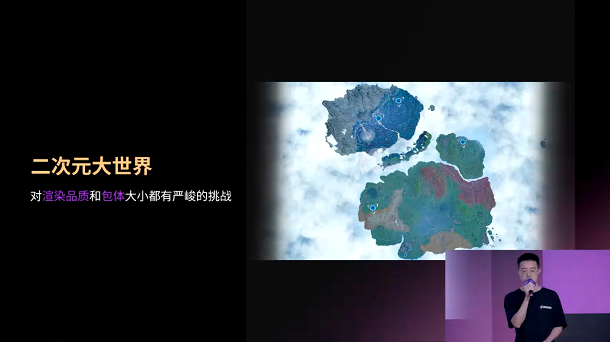

**日式卡通风格**: 二次元游戏市场竞争激烈,玩家对画面品质的要求越来越高。一方面需要提升美术资产的品质,另一方面大世界游戏本身的资源量就很大,包体大小成为了技术上的重要限制指标。

**室内外场景**: 玩家可以在室内和户外自由切换战斗。全局光照对室内氛围营造至关重要,而阴影能够极大提升户外画面的层次感。因此,在高品质场景渲染中,全局光照和阴影都是不可或缺的部分。

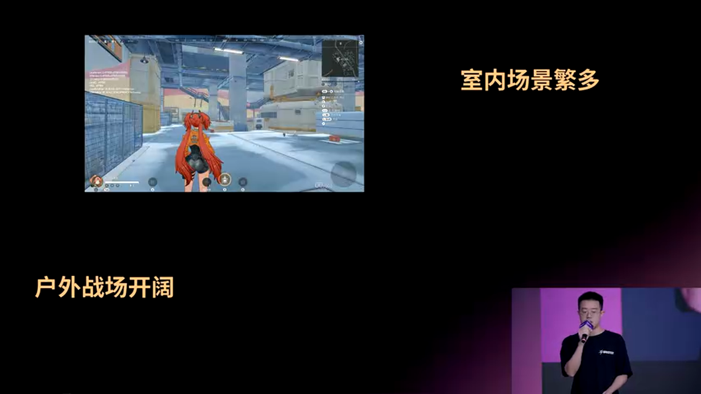

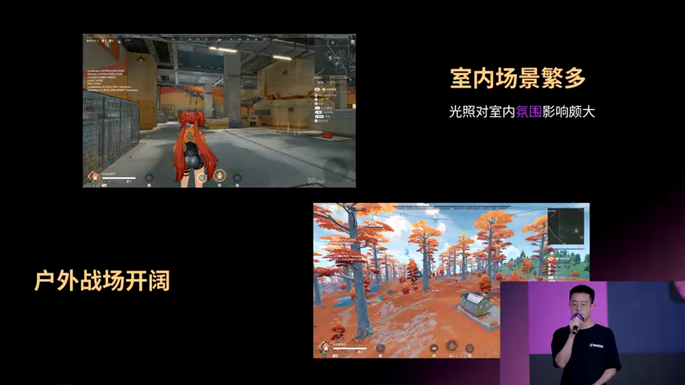

### 1.2 技术约束

**多平台支持**: 作为一款目标多端互通的游戏,渲染方案需要在不同平台设备上落地。必须保证不同平台上的画面渲染基本一致,不能因为渲染差异而影响玩家的竞技公平性。

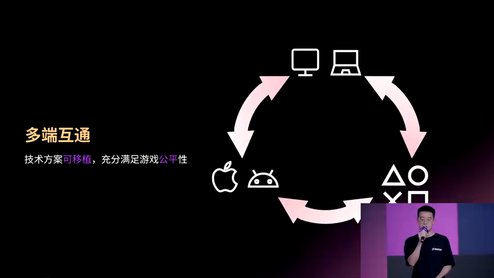

**性能要求**: 作为多人竞技游戏,游戏的流畅性与帧率的稳定性是重中之重。需要采用性能开销尽可能小的技术方案来保证游戏的高帧率运行。

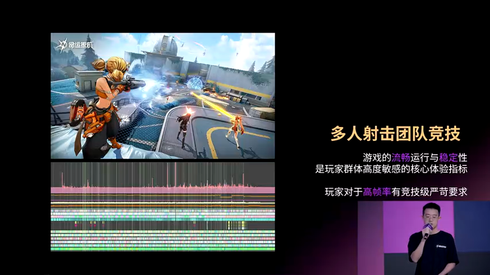

### 1.3 技术选型思路

基于上述约束,团队针对光照和阴影都设计了一套可伸缩的框架。**离线技术方案**成为了首选项——将计算更重的任务放到运行前处理,让性能相对较弱的设备也能够进行流畅的对战。

---

## 二、全局光照系统架构

### 2.1 三层画质分级方案

团队设计了一套基于三种基础技术方案的可伸缩全局光照框架:

1. **Lumen** - UE5的实时全局光照解决方案
2. **Probe GI** - 基于探针的离线烘焙方案  
3. **Lightmap** - 传统光照贴图方案

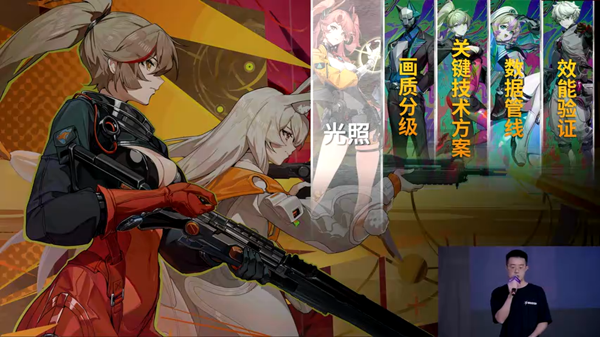

这三套方案在数据精度上有所差别。Lumen不需要多说,它是UE5自带的实时全局光照解决方案。而Probe方案是一种离线烘焙方案,它先将三维空间进行离散化,然后把光照信息预先存储起来,在运行时只需要通过采样并插值的方式就可以还原场景的GI。

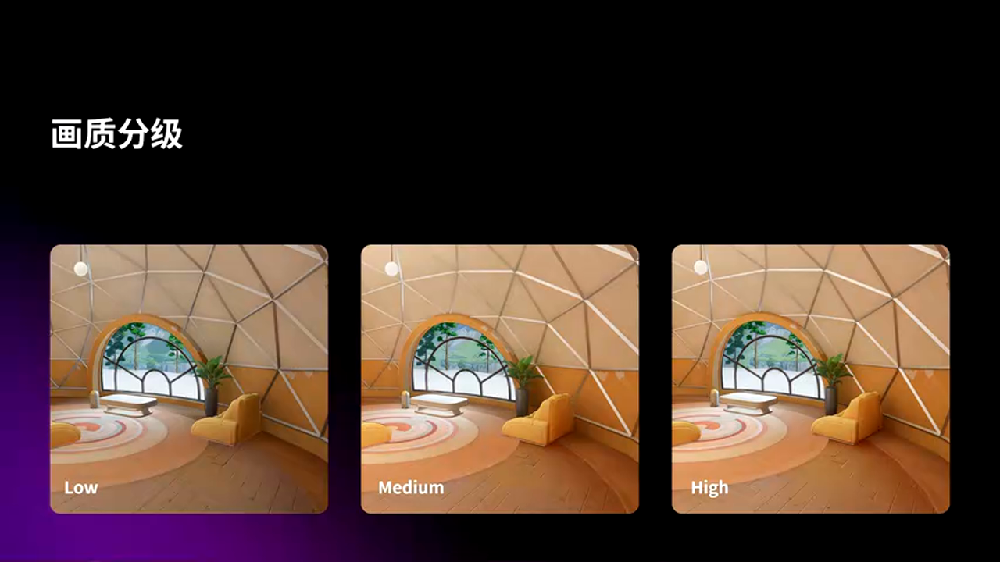

在项目中,团队存储的是光照的辐射信息,用二阶球谐系数来存储。在运行时只需要简单的线性运算就可以还原GI效果。

### 2.2 五档画质配置

根据三套基础方案,结合不同画质的性能要求,团队对其中的一些特性进行可伸缩的配置,并根据不同硬件的算力水平,在不同平台上定制了整套的画质分级表现:

**极致与超高画质**: 都使用Lumen的情况下,超高使用了分辨率更低的Screening Probe去做辐射缓存。

**高、中、低画质**: 都是Probe GI方案。高画质和中画质都是在近距离使用Mip0级别的GI数据,远距离采用Mip1级别的数据。两个画质的主要区别是GI加载距离的长短——高画质能够显示更远距离的GI效果。

在低画质中,全部使用Mip1的GI,并使用简单遮蔽信息去做防漏光。

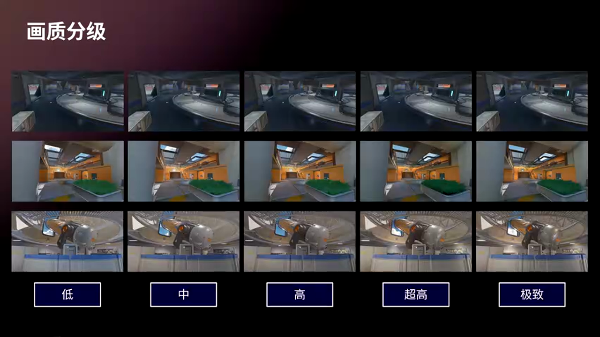

---

## 三、全局光照关键技术

### 3.1 防漏光技术

防漏光是Probe GI方案中的核心问题之一。由于Probe是离散分布的,当物体表面采样到墙后的Probe时,就会出现漏光现象。

#### 3.1.1 Probe重定位(Relocation)

为了解决这个问题,团队采用了Probe Relocation技术。其核心思想是:

1. **检测Probe是否在物体内部**: 从Probe位置向四面八方发射射线,如果射线方向与交点法线的夹角大于90度,说明Probe在Mesh外部;小于90度则说明在Mesh内部。

在复杂场景中,通过统计多条射线的结果,根据概率判断Probe是否在Mesh内部,是否需要进行Relocation。

2. **将Probe推向墙边**: 对于在外部的Probe,通过发射射线找到距离最近的Mesh面,选择距离最近的相交点作为偏移后的Probe点。这样Probe记录的辐射信息就更接近表面本身的光照信息。

#### 3.1.2 数据压缩

Relocation需要记录方向和距离两个信息,数据量较大。团队采用了数据压缩方案:

- 将方向和距离进行离散化
- 方向使用Octahedral映射压缩到2D空间
- 距离进行量化存储

通过这种压缩方式,可以将Relocation数据控制在较小的存储开销内。

#### 3.1.3 简单遮蔽信息

对于低画质,团队使用了更简化的方案——简单遮蔽信息。这是一种基于方向的遮蔽检测:

- 在烘焙时记录每个Probe在不同方向上的遮蔽情况
- 运行时根据采样方向查询遮蔽信息
- 如果该方向被遮蔽,则降低或忽略该Probe的贡献

这种方法虽然精度较低,但性能开销很小,适合低端设备使用。

### 3.2 Final Gather技术

Final Gather是提升GI质量的重要技术。其核心思想是在最终着色阶段,不仅采样Probe数据,还要考虑场景几何对光照的影响。

#### 3.2.1 基本原理

传统的Probe采样只考虑位置插值,Final Gather则在此基础上:

1. 从着色点发射多条射线
2. 在射线击中点采样Probe GI
3. 将多个采样结果加权平均

这样可以获得更准确的间接光照,特别是在几何细节丰富的区域。

#### 3.2.2 多级Mip方案

为了优化性能,团队实现了多级Mip的Final Gather:

- **Mip0**: 高精度,用于近距离
- **Mip1**: 低精度,用于远距离

通过距离LOD切换,在保证近处质量的同时降低远处开销。

#### 3.2.3 性能优化

Final Gather是一个计算密集的Pass,团队采用了多种优化手段:

**降分辨率渲染**: 使用1/2分辨率进行Final Gather计算,可以将性能提升约75%。

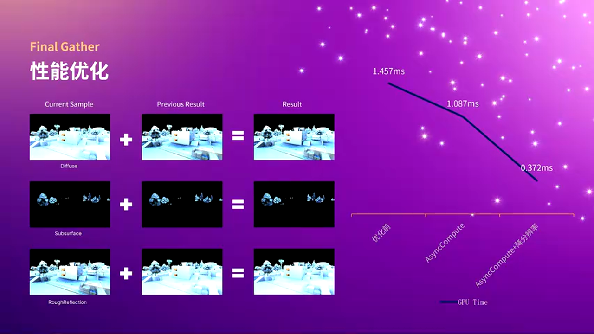

**Checkerboard上采样**: 由于输出的是低频信息,使用Checkerboard算法就可以获得不错的上采样结果。算法要点:

1. 连续4帧完成一次循环
2. 当前帧计算的像素直接使用
3. 其他像素优先复用邻近像素(深度和法线接近)
4. 否则通过重投影复用上一帧结果
5. 最差情况直接使用当前帧结果

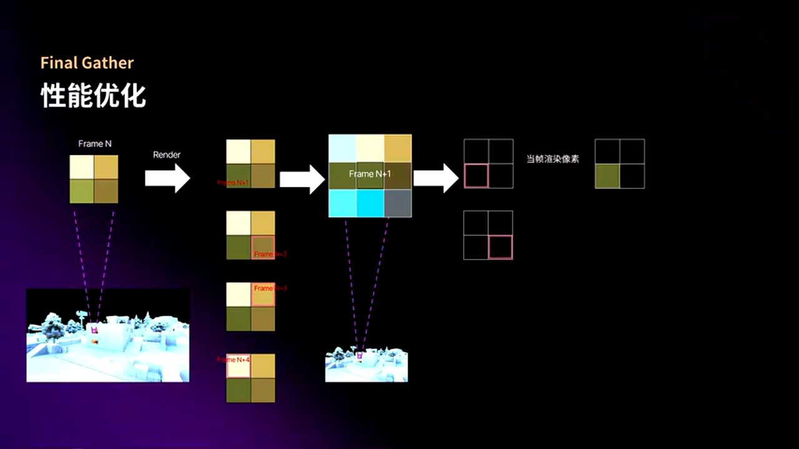

### 3.3 反射处理

对于反射性强的材质,如果直接采用天空光,室内的金属性物体会表现很差。团队的解决方案是:

**基于反射方向的Probe采样**: 根据反射方向计算函数粗糙度,去采样Probe GI的内容作为粗糙高光反射的结果。

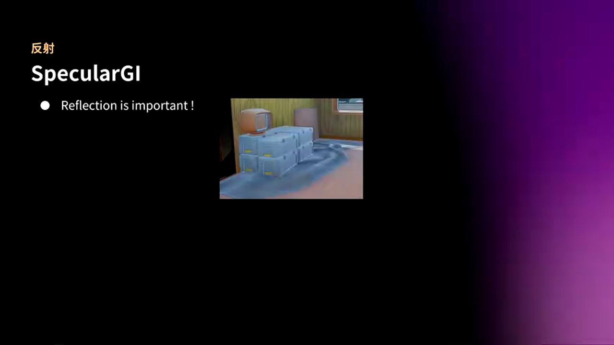

**粗糙度混合**: 越粗糙的物体采用更多的Probe GI信息,越光滑的物体更多依赖屏幕空间反射(SSR)或反射探针。

这种方法可以在保持性能的同时,为室内金属物体提供合理的反射效果。

### 3.4 体积雾与半透明

体积雾和半透明物体的GI处理也是一个挑战:

**体积雾**: 在体积雾的每个采样点,使用Probe GI提供环境光照,使雾效能够正确响应场景光照变化。

**半透明物体**: 对于半透明材质,在着色时采样Probe GI,并根据透明度混合直接光照和间接光照。

这些处理确保了整个场景光照的一致性。

---

## 四、GI数据管理与流式加载

### 4.1 数据生产流程

GI数据的生产是一个复杂的离线过程:

#### 4.1.1 Probe布置

首先需要在场景中布置Probe。团队采用了自适应布置策略:

- 在几何复杂区域增加Probe密度
- 在开阔区域降低Probe密度
- 考虑场景重要性进行权重分配

#### 4.1.2 光照烘焙

使用路径追踪算法计算每个Probe的辐射信息:

1. 从Probe位置发射大量射线
2. 追踪光线在场景中的传播
3. 累积直接光照和间接光照
4. 将结果编码为球谐系数

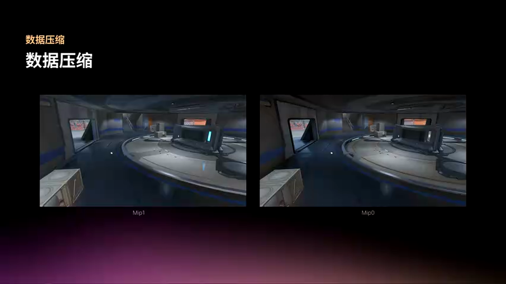

#### 4.1.3 数据压缩

原始的球谐系数数据量很大,需要进行压缩:

- 量化球谐系数
- 使用块压缩算法
- 生成多级Mip

最终将压缩后的数据打包到资源文件中。

### 4.2 运行时流式加载

在6km×6km的大世界中,不可能将所有GI数据都加载到内存。团队实现了一套高效的流式加载系统:

#### 4.2.1 Brick结构

GI数据被组织成Brick结构:

- 每个Brick是一个固定大小的3D网格(如4×4×4)
- Brick包含该区域内所有Probe的数据
- Brick可以独立加载和卸载

#### 4.2.2 GI Volume

围绕相机位置定义一个GI Volume:

- 初始加载时,加载Volume范围内的所有Brick
- 相机移动时,采用环形更新策略
- 只更新进入和离开Volume的Brick

#### 4.2.3 层次化索引

为了高效访问Brick数据,使用层次化索引结构:

- 索引记录每个Brick在资源池中的地址
- 支持多级Mip的索引
- 使用Compute Shader进行快速更新

#### 4.2.4 资源池管理

实际的GI数据存储在资源池中:

- 资源池是固定大小的显存空间
- 采用类似内存池的管理算法
- 支持Brick的动态分配和释放

#### 4.2.5 性能优化

为了避免某一帧上传数据量过大导致卡顿,采用分帧上传策略:

- 设置每帧上传数据量的上限
- 优先加载靠近相机的Brick
- 延迟加载远处的Brick

由于更新的Brick都在GI Volume边缘,这种优化是视觉无损的。

### 4.3 采样流程

在Shader中采样GI数据的流程:

1. 根据世界坐标计算Brick索引
2. 通过层次化索引查找资源池地址
3. 从资源池读取Probe数据
4. 进行三线性插值
5. 应用Relocation偏移
6. 计算最终的间接光照

整个流程在GPU上高效执行,运行时开销很小。

---

## 五、阴影系统技术方案

### 5.1 VSM算法原理

团队选择了Virtual Shadow Map(VSM)作为阴影解决方案。VSM的核心优势是:

- 支持高分辨率阴影(如16K)
- 内存占用可控
- 支持动态物体

#### 5.1.1 Page-based结构

VSM采用基于Page的虚拟纹理结构:

- Shadow Map被划分为固定大小的Page(如128×128)
- 只分配实际需要的Page
- 未使用的区域不占用内存

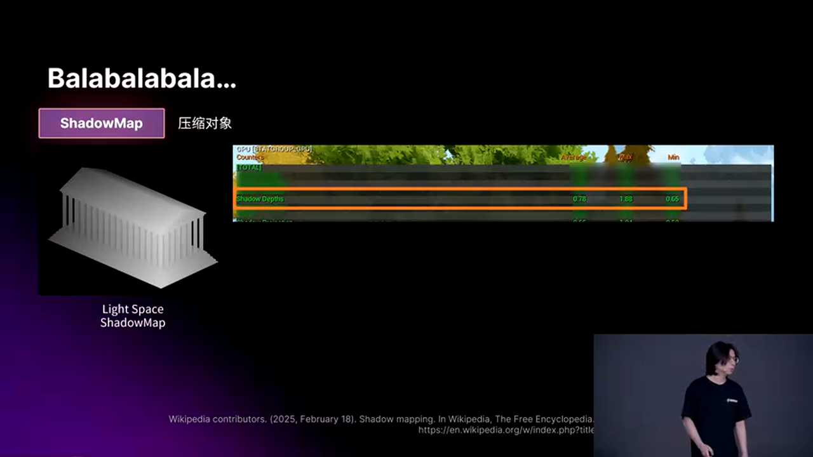

#### 5.1.2 Clipmap层级

对于方向光,使用Clipmap结构:

- 多个层级覆盖不同距离范围
- 近处使用高分辨率
- 远处使用低分辨率

这种LOD策略可以在保证近处阴影质量的同时,支持很远的阴影距离。

### 5.2 阴影数据压缩

虽然VSM已经大幅降低了内存占用,但在移动平台上仍然面临挑战。团队实现了一套阴影压缩方案,将包体中的阴影数据压缩到原来的1%以下。

#### 5.2.1 ANH压缩算法

ANH(Adaptive N-ary Hierarchical)是一种基于四叉树的深度压缩算法:

**基本思想**: 如果一个区域的深度值相同或相近,就可以用一个节点表示整个区域,而不需要存储每个像素。

**编码过程**:

1. 从完整的Shadow Map开始
2. 尝试将4个子节点合并为1个父节点
3. 如果子节点深度值相同,则合并成功
4. 递归处理,直到无法合并

**数据结构**:

- 每个节点存储深度值和子节点指针
- 叶子节点直接存储深度
- 父节点存储子节点的索引

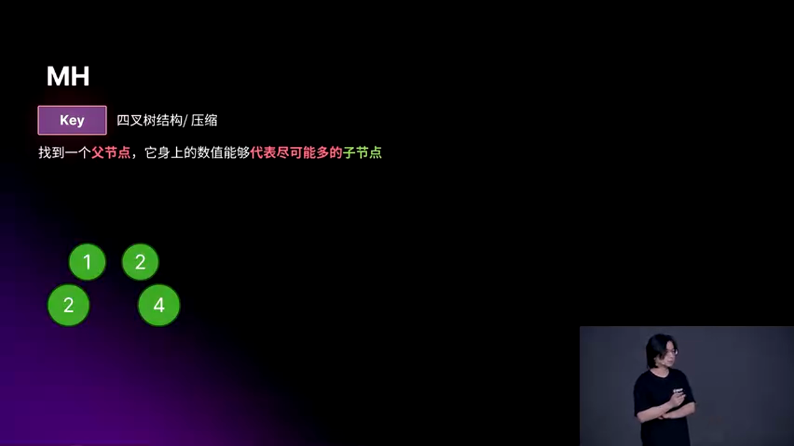

**解码过程**:

采样时根据UV坐标遍历四叉树,找到对应的叶子节点,返回深度值。

对于4K的Shadow Map,ANH可以压缩到约0.64%的大小,压缩率非常高。

#### 5.2.2 HANH算法优化

HANH(Hierarchical Adaptive N-ary Hierarchical)是ANH的升级版,在ANH基础上加入了节点合并功能:

**合并条件**:

1. 两个节点有相同的结构
2. 深度区间匹配

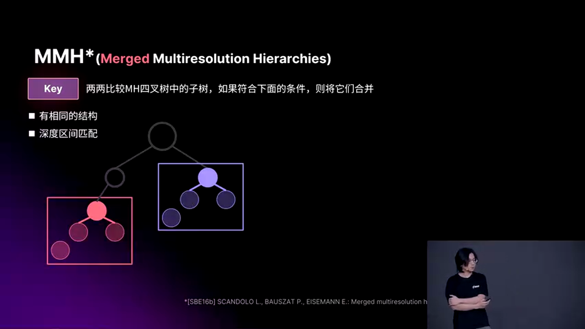

**相对深度编码**:

为了更容易满足合并条件,节点存储的不再是绝对深度,而是相对于父节点的相对深度。这样可以大幅增加可合并节点的数量,进一步提升压缩率。

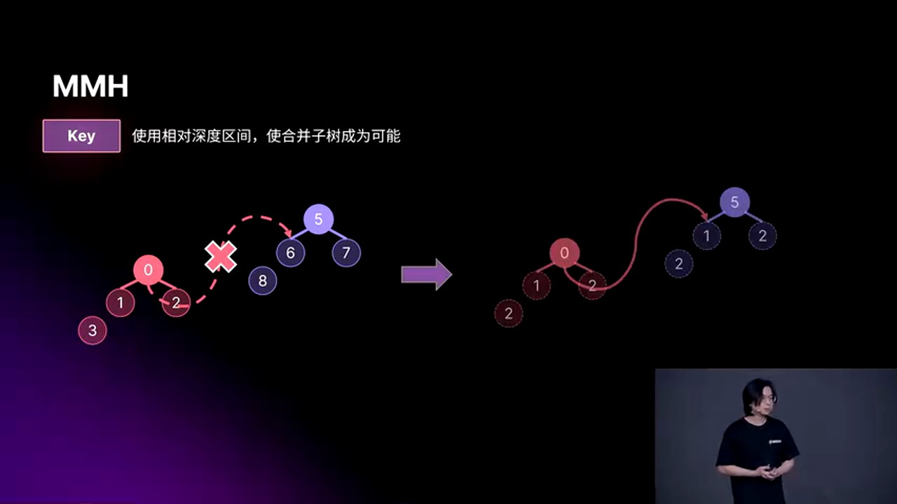

### 5.3 离线处理流程

阴影数据的离线处理流程:

1. **烘焙静态阴影**: 使用光线追踪生成高质量的静态阴影
2. **压缩**: 使用HANH算法压缩阴影数据
3. **打包**: 将压缩后的数据打包到资源文件
4. **运行时解压**: 在GPU上解压并采样

这种方案可以在保证阴影质量的同时,大幅降低包体大小。

### 5.4 运行时混合

在运行时,需要混合静态阴影和动态阴影:

- 静态物体使用烘焙的压缩阴影
- 动态物体使用实时VSM
- 通过Stencil或其他技术进行合成

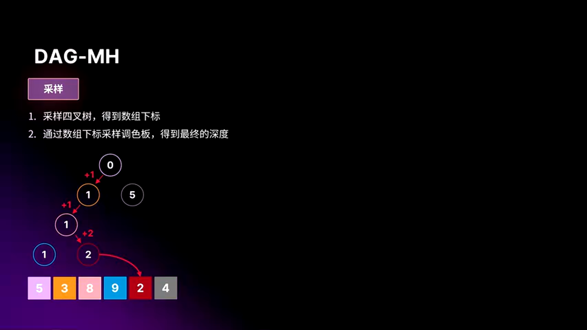

这种混合方案可以在保证性能的同时,支持动态物体的阴影。

---

## 六、性能分析与优化

### 6.1 性能数据

团队在多个平台上进行了性能测试:

**PC平台(RTX 4070)**:
- Final Gather优化前: ~3.2ms
- Final Gather优化后: ~0.8ms
- 提速约75%

**移动平台**:
- 使用Probe GI + 简单遮蔽
- GI开销: <1ms
- 阴影开销: <2ms

### 6.2 内存占用

**GI数据**:
- 原始数据: ~2GB
- 压缩后: ~200MB
- 运行时资源池: ~100MB

**阴影数据**:
- 原始Shadow Map: ~64MB
- HANH压缩后: ~400KB
- 压缩率: 0.64%

### 6.3 优化技巧总结

1. **降分辨率渲染**: 对低频信息使用低分辨率计算
2. **时序复用**: 利用历史帧数据减少当前帧计算
3. **空间LOD**: 根据距离使用不同精度的数据
4. **数据压缩**: 使用专门的压缩算法降低内存和带宽
5. **流式加载**: 只加载需要的数据,避免内存浪费
6. **GPU加速**: 使用Compute Shader进行数据处理

---

## 七、未来展望

团队在分享中也提到了一些未来的研究方向:

### 7.1 神经网络压缩

使用神经网络对GI数据进行压缩:

- 训练一个小型神经网络来预测GI
- 只存储网络权重,而不是原始数据
- 可以实现更高的压缩率

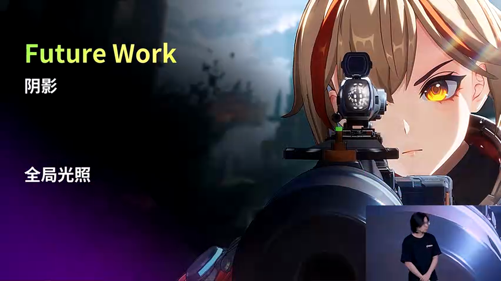

### 7.2 TOD支持

实现Time of Day(TOD)的GI方案:

- 烘焙多个时间点的GI数据
- 运行时插值混合
- 支持动态天气变化

### 7.3 动态GI

为可破坏的动态物体添加动态GI效果:

- 实时更新受影响区域的Probe
- 使用增量更新减少开销
- 结合静态GI和动态GI

---

## 八、工程经验总结

### 8.1 技术选型原则

1. **优先考虑离线方案**: 对于大世界游戏,离线烘焙可以大幅降低运行时开销
2. **可伸缩性设计**: 设计多档画质方案,适配不同性能的设备
3. **数据驱动**: 通过数据压缩和流式加载控制内存占用
4. **性能优先**: 在保证视觉效果的前提下,优先考虑性能

### 8.2 开发流程建议

1. **原型验证**: 先实现基础功能,验证技术可行性
2. **性能测试**: 在目标平台上进行充分的性能测试
3. **迭代优化**: 根据测试结果进行针对性优化
4. **工具支持**: 开发配套工具,提升美术和技术的协作效率

### 8.3 常见问题与解决方案

**问题1: 漏光**
- 解决方案: Probe Relocation + 简单遮蔽信息

**问题2: 性能不足**
- 解决方案: 降分辨率 + 时序复用 + LOD

**问题3: 内存占用过大**
- 解决方案: 数据压缩 + 流式加载 + 资源池管理

**问题4: 包体过大**
- 解决方案: HANH压缩算法

---

## 九、总结

《命运扳机》项目在全局光照和阴影渲染方面的技术实践,为大世界游戏的渲染技术提供了宝贵的经验。通过可伸缩的GI框架、高效的数据压缩算法、完善的流式加载系统,团队成功在保证画面品质的同时,实现了多平台支持和稳定的性能表现。

**核心要点回顾**:

1. **三层GI方案**: Lumen、Probe GI、Lightmap,适配不同性能需求
2. **防漏光技术**: Probe Relocation + 简单遮蔽,解决离线GI的核心问题
3. **Final Gather**: 提升GI质量,配合降分辨率和时序复用优化性能
4. **流式加载**: Brick结构 + 环形更新,支持大世界场景
5. **阴影压缩**: HANH算法,将阴影数据压缩到0.64%
6. **性能优化**: 多种优化技术组合,实现75%的性能提升

这些技术方案不仅适用于《命运扳机》这样的大世界游戏,对其他类型的实时渲染项目也具有重要的参考价值。特别是在当前多平台、高品质、高性能的游戏开发需求下,如何平衡这三者的关系,是每个引擎团队都需要深入思考的问题。

随着硬件性能的提升和算法的进步,未来的渲染技术将会更加强大。神经网络压缩、动态GI、实时路径追踪等新技术的应用,将为游戏画面带来更大的提升空间。但无论技术如何发展,工程实践的核心原则——性能、质量、可维护性的平衡——始终不会改变。

希望本文的技术分享能够为从事游戏渲染开发的同行提供一些启发和帮助。在实际项目中,需要根据具体情况灵活调整技术方案,没有一种方案是万能的,只有最适合项目需求的方案才是最好的方案。

---

**参考资源**:

- UE5 Lumen官方文档
- Virtual Shadow Maps技术文档  
- Probe-based GI相关论文
- HANH压缩算法论文

**致谢**:

感谢萨罗斯网络科技的杨彬和黄兆铭两位工程师的精彩技术分享,为游戏渲染社区贡献了宝贵的工程经验。

---

*本文由AI基于视频内容生成,如有技术细节需要进一步讨论,欢迎加入UE5技术交流群进行交流。*

