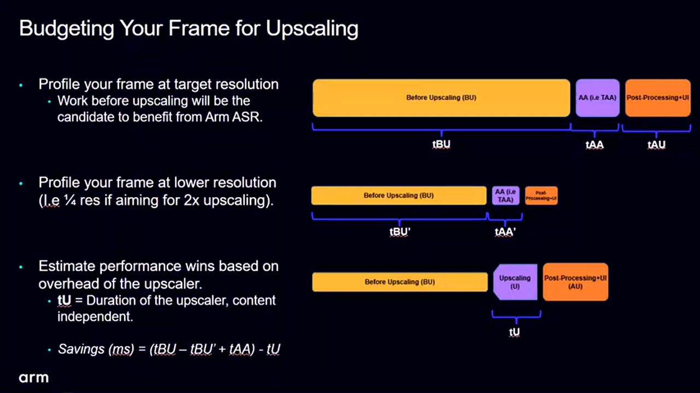
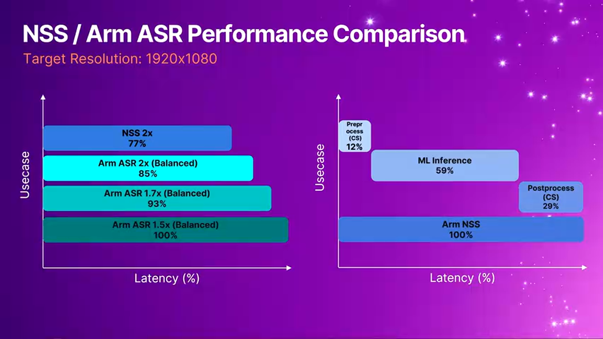
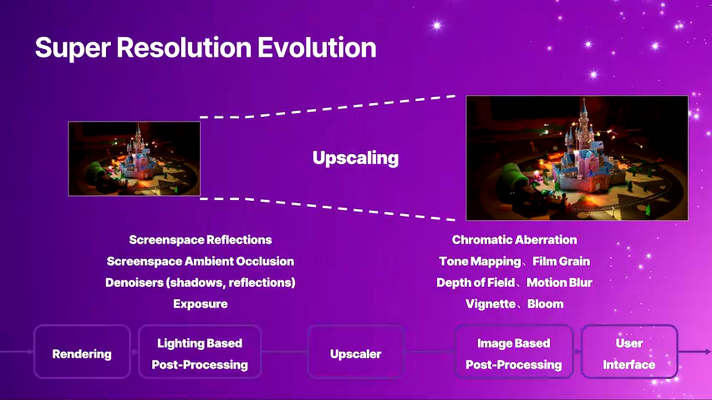
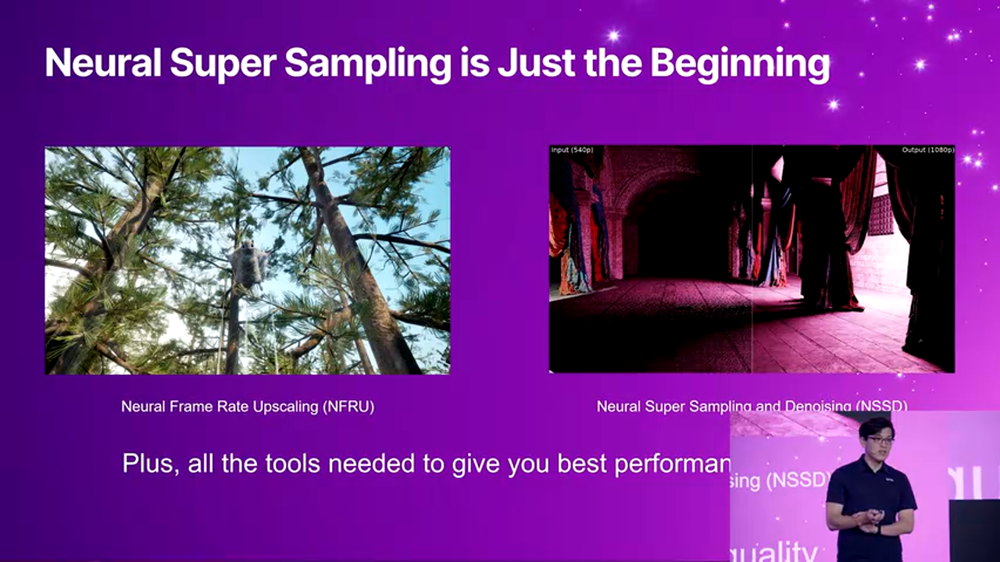

# Arm Mali GPU 神经加速架构：移动端机器学习图形技术的突破性进展

---


## 加入 UE5 技术交流群

如果您对虚幻引擎5的图形渲染技术感兴趣，欢迎加入我们的 **UE5 技术交流群**！

扫描上方二维码添加个人微信 **wlxklyh**，备注"UE5技术交流"，我会拉您进群。

在技术交流群中，您可以：
- 与其他UE开发者交流渲染技术经验
- 获取最新的GDC技术分享和解读
- 讨论图形编程、性能优化、构建工具流、动画系统等话题
- 分享引擎架构、基建工具等项目经验和技术难题

---

**源视频信息**
- 标题：[UFSH2025]超越超分: 探索机器学习图形新框架 | Patrick Wang Arm Taiwan Limited Staff Engineer
- 时长：24分59秒
- 来源：https://www.bilibili.com/video/BV1Pz2PBKESY

**AI生成说明**：本文由AI根据视频内容生成，结合了字幕与截图，力求准确还原演讲核心内容。

---

> **导读核心观点**
>
> - Arm 正式将神经加速技术整合进 Mali GPU，为移动端带来 PC 级别的 AI 超分辨率能力
> - 通过硬件加速单元，NSS（Neural Super Sampling）可在 4ms 内完成 2x 超分，GPU 工作负载减少 50%
> - 开源工具链已发布，开发者可在 PC 上模拟效果，为明年底上市的新设备提前适配

**前置知识要求**：本文假设读者了解基本的图形渲染管线、超分辨率技术原理，以及 GPU 加速计算概念。

---

## 背景：移动端图形技术的性能瓶颈

### Arm Mali GPU 的演进历程

Arm 作为全球领先的半导体设计公司，其 Mali GPU 架构已经在 Android 移动设备市场占据主导地位。从 2022 年开始，Arm 持续推动旗舰手机图形技术的演进：


- **2022 年**：引入硬件光线追踪（Hardware Ray Tracing）技术
- **2023 年**：导入 DVS（Deferred Vertex Shading）延迟顶点着色，使移动平台能够处理复杂的几何效果
- **每次迭代**：性能提升达到双位数百分比

然而，硬件架构的提升只是一方面。为了给开发者提供更多性能预算，Arm 在 2024 年推出了 ASA（Arm Super Resolution）超分辨率算法，通过"缩小渲染-算法放大"的方式显著提升渲染效率。


### 为什么需要神经网络超分？

传统的超分辨率算法分为两大类：

**空间超分（Spatial Upscaling）**
- 原理：仅使用当前帧的 Color Map 进行放大
- 优势：速度快，实现简单
- 劣势：放大倍数超过 1.3x 后，图像明显模糊，细节丢失严重

**时序超分（Temporal Upscaling）**
- 原理：利用多帧历史信息（Color、Motion Vector、Depth）进行重投影与融合
- 优势：画质更好，细节保留更多
- 劣势：需要复杂的验证逻辑（Validation）来避免鬼影（Ghosting），人工设计算法难以应对无限可能的游戏场景


时序超分算法的核心挑战在于 **如何有效判定历史信息的有效性**。例如：
- 摄像机快速移动或跳跃时，历史帧可能失效
- 动态物体遮挡导致采样点不一致
- 需要实时清除过期的历史缓存

这些问题都需要通过人工设计的启发式规则来解决，但规则很难覆盖所有边界情况。因此，**神经网络超分**成为更优的解决方案——通过训练让模型自动学习如何处理复杂场景，而非依赖人工规则。

---

## Arm 神经技术架构：三位一体的设计哲学

### 架构概览

Arm 的神经技术（Neural Technology）并非单一的硬件或软件，而是一个完整的生态系统，包含三个核心组件：


> **架构设计的三大支柱**
>
> 1. **神经加速器（Neural Accelerator）**：硬件层的 NPU（Neural Processing Unit），专门优化矩阵运算
> 2. **ML Extension（机器学习扩展）**：软件 API 层，基于 Vulkan 的标准化接口
> 3. **开发者套件（Developer Toolkit）**：完整的工具链，包括 Unreal Engine 插件、训练工具、性能分析工具

这三者协同工作，可以为 GPU 带来 **至少 50% 的工作负载减少**，同时保持与 PC 端 DLSS 2.0 相当的画质。

### 神经加速器：融入 GPU 的 NPU 设计

#### 为什么不使用独立的 NPU？

市面上很多方案选择在 SoC 中集成独立的 NPU 单元。但 Arm 选择了一条不同的路径：**将 NPU 直接集成到 Mali GPU 内部**。


这一设计决策背后的核心考量是 **能效比**：

> **独立 NPU 的问题**
> - CPU/GPU 与 NPU 之间的通信需要跨单元传输
> - 数据拷贝产生额外的延迟与功耗
> - 在移动设备上，这意味着更高的电力消耗和热量

> **GPU 内置 NPU 的优势**
> - 共享 GPU 的 L2 Cache、内存带宽等资源
> - 减少跨单元通信的开销
> - 符合 Arm "用最少的功耗获得最好的性能" 的设计理念

此外，Arm 将 NPU 设计成与 **GPU Shader Core** 类似的执行流程，开发者可以使用熟悉的 Graphics API 调用链来驱动 NPU，而无需学习全新的编程模型。

#### 硬件指令集：TOSA

Arm 的神经加速器不仅仅是一个矩阵乘法引擎，而是支持完整的 **TOSA（Tensor Operator Set Architecture）** 指令集。


TOSA 包含了常见的张量运算指令，例如：
- **Convolution（卷积）**：用于图像特征提取
- **Pooling（池化）**：降维与特征聚合
- **Activation Functions（激活函数）**：ReLU、Sigmoid 等
- **Element-wise Operations（逐元素运算）**：加法、乘法等

通过遵循 TOSA 标准，Arm 为开发者提供了 **跨平台、跨厂商** 的一致性保证。只要使用 Vulkan ML Extension，代码可以在不同的硬件上无缝运行。

### ML Extension：Vulkan 的机器学习扩展

为了让开发者能够直接调用神经加速器，Arm 在 Vulkan API 中推出了两个关键扩展：

- **VK_KHR_vulkan_on_tensor**：提供张量操作的接口
- **VK_KHR_vulkan_on_data_graph**：支持数据流图的构建与执行


这些扩展允许开发者在 Vulkan 管线中直接插入 ML 推理节点，与传统的 Graphics Pass 无缝集成。例如：

```cpp
// [AI补充] 基于上下文逻辑补全 - Vulkan ML 调用示例
VkTensorDescriptor inputTensor;
VkTensorDescriptor outputTensor;
VkDataGraphPipeline mlPipeline;

// 创建推理管线
vkCreateDataGraphPipeline(device, &pipelineInfo, &mlPipeline);

// 在 Render Pass 中调用
vkCmdBindDataGraphPipeline(commandBuffer, mlPipeline);
vkCmdDispatchDataGraph(commandBuffer, &dispatchInfo);
```

### 开发者套件：从训练到部署的完整工具链

为了降低接入门槛，Arm 提供了完整的开源工具链：


> **工具链组成**
>
> - **Unreal Engine 插件**：直接集成到 UE5 项目中，支持 UI 控制与命令行切换
> - **NSS 模型**：预训练的神经超分模型（约 170KB），托管在 Hugging Face
> - **训练工具**：开源的训练脚本与数据集，支持自定义场景微调
> - **性能分析工具**：RenderDoc、Streamline 等，支持最新版本的 ML Extension 分析
> - **PC 模拟环境**：通过 Vulkan Layer 在 PC 上模拟 NPU 推理效果（注：仅模拟画质，性能不准确）

---

## NSS 技术深度解析：从原理到实现

### 神经超分的三阶段流程

相比传统时序超分的复杂流程（重投影 → 验证 → 融合），NSS 的架构要简洁得多：


> **NSS 三步走**
>
> 1. **预处理（Preprocessing）**：将输入数据（低分辨率 Color、Motion Vector、Depth）转换为模型可接受的张量格式
> 2. **神经网络推理（Inference）**：通过卷积神经网络进行超分放大
> 3. **后处理（Postprocessing）**：将模型输出重新组装为标准的 RGB 图像格式

整个流程不需要人工设计的验证逻辑，所有的"智能判断"都由神经网络完成。例如：
- **鬼影消除**：模型通过训练自动学会识别无效的历史信息
- **边缘锐化**：网络自动恢复因缩小而丢失的高频细节
- **抗锯齿优化**：模型可以同时处理抗锯齿与超分，一举两得

### 模型训练与自定义

Arm 将 **NSS 的完整训练代码** 开源在 GitHub 上，开发者可以基于自己的游戏画面进行微调：


> **自定义训练流程**
>
> 1. **数据采集**：在游戏中录制高分辨率画面与对应的低分辨率输入
> 2. **模型训练**：使用 Arm 提供的训练脚本，针对特定场景优化
> 3. **模型部署**：将训练好的模型转换为 TOSA 格式，替换默认模型
> 4. **效果验证**：通过 PC 模拟环境或实际设备测试画质

这种开放的生态避免了"一刀切"的问题——每款游戏的美术风格不同，通过自定义训练可以获得最佳效果。

### 实际效果对比

Arm 内部制作了一个演示 Demo，展示了原生分辨率与 NSS 超分的对比：


- **左侧**：原生 1080p 渲染（200 万像素点）
- **右侧**：540p 渲染 + NSS 2x 超分（仅 50 万像素点）

在动态画面中，两者几乎无法区分。即使在大屏幕上观察，细节差异也非常微小。这意味着开发者可以用 **四分之一的像素计算量** 获得接近原生的画质。

### 量化性能数据

Arm 使用标准的图像质量评估指标进行了测试：


**TPSNR（Temporal Peak Signal-to-Noise Ratio）测试结果**：
- **DLSS 2.0（PC 端）**：基准绿线
- **NSS（Arm 移动端）**：橙色线，与 DLSS 2.0 基本重合
- **ASA（去年的方案）**：蓝色线，需要降低放大倍数至 1.5x 才能接近 NSS 的 2x 效果

关键数据：
- NSS 在 4ms 内完成推理（基于 Arm 下一代 GPU）
- 仅使用 PC 端方案 **1% 的功耗**
- 画质与 DLSS 2.0 相当，远超传统空间超分

---

## ASA vs. NSS：两代方案的对比分析

### 技术路线差异


> **ASA（Arm Super Resolution）**
> - 🟢 优势：基于 Shader 实现，可运行在所有 Mali GPU 上
> - 🟢 优势：延迟低，通用性强
> - 🔴 劣势：画质受限于人工设计的算法，难以处理复杂场景
> - 🎯 适用场景：现有设备的性能优化，追求广泛兼容性
>
> **NSS（Neural Super Sampling）**
> - 🟢 优势：AI 驱动，画质接近 PC 端 DLSS
> - 🟢 优势：可自定义训练，适配特定游戏风格
> - 🔴 劣势：需要神经加速器硬件支持，明年底上市
> - 🎯 适用场景：次世代旗舰设备，追求极致画质与性能

### 为什么需要两者共存？

Arm 的策略是 **渐进式升级**：

1. **当前设备**：使用 ASA 提供基础超分能力
2. **新设备上市后**：运行时检测硬件能力，支持 NSS 的设备自动切换到更高画质模式
3. **开发者套件统一**：一套代码适配两种方案，无需重复开发


这种设计允许开发者 **今天就开始集成**，未来自动享受硬件升级带来的红利。

---

## 实战落地：性能评估与集成指南

### 评估公式：判断是否适合你的游戏

并非所有游戏都适合超分技术。Arm 提供了一个简单的计算公式：



**节省时间 = (原始分辨率渲染时间 - 抗锯齿时间 - 缩小分辨率渲染时间 - 超分时间)**

具体分解：
1. **原始分辨率渲染时间**：未使用超分时，从几何处理到后处理的总时长
2. **抗锯齿时间（TAA）**：传统抗锯齿的开销
3. **缩小分辨率渲染时间**：使用超分后，几何处理与光照计算的时间（通常减少 75%）
4. **超分时间**：NSS 约 4ms，ASA 约 5ms

**决策规则**：
- 如果 **节省时间 > 0**，推荐使用超分
- 节省时间越大，性能提升越明显

### 快速评估方法

如果你现在想评估效果，可以这样做：



1. **安装 ASA 插件**：在当前设备上测试 1.5x 超分的性能
2. **推算 NSS 性能**：NSS 比 ASA 快约 20%，画质更好
3. **验证画质**：使用 PC 模拟环境查看 NSS 的实际输出效果

### 集成步骤


**环境准备**：
1. 下载 **NSS Unreal Plugin**（开源）
2. 安装 **NNE Runtime**（官方提供的推理引擎）
3. 配置 **Vulkan SDK**（支持 ML Extension）

**配置 Vulkan Layer**：
```bash
# [AI补充] 基于上下文逻辑补全 - 环境变量配置示例
export VK_LAYER_PATH=/path/to/arm/ml_extension/layer
export VK_INSTANCE_LAYERS=VK_LAYER_ARM_ml_extension
```

**在 Unreal Engine 中启用**：


1. 将插件复制到项目的 `Plugins` 目录
2. 在 Editor 中启用 NSS 插件
3. 使用 UI 控件或控制台命令切换超分模式：
   ```
   r.NSS.Enable 1
   r.NSS.Scale 2.0
   ```

**高级功能：数据导出用于训练**

如果你想训练自定义模型，可以启用数据导出功能：


```
// 控制台命令
showflag.visualizetemporalupscale 1
```

这会导出以下数据：
- 低分辨率 Color Map
- Motion Vector
- Depth Buffer
- 高分辨率 Ground Truth（用于监督训练）

---

## 深度进阶：架构设计与性能分析

### NSS 的 4ms 时间分解

NSS 的 4ms 推理时间具体花在哪里？


> **时间分配**
>
> - **预处理（Preprocessing）**：~1.2ms（30%），使用 Compute Shader 转换数据格式
> - **神经网络推理（Inference）**：~2.4ms（60%），在 NPU 上执行卷积计算
> - **后处理（Postprocessing）**：~0.4ms（10%），重组为 RGB 图像

关键优化点：
1. **预处理使用 GPU Compute Shader**：因为数据已经在 GPU 内存中，使用 Shader 转换比 CPU 拷贝更快
2. **推理阶段占比最大**：这是 NPU 的核心价值所在——如果没有硬件加速，这部分会慢 10-100 倍
3. **后处理非常轻量**：仅需简单的张量重排与格式转换

### 超分在渲染管线中的位置

超分并非万能，它只能优化管线中的特定阶段：



**受益的阶段**（超分前执行，分辨率缩小）：
- Geometry Shading（几何着色）
- Lighting（光照计算）
- Screen Space Reflections（屏幕空间反射）
- SSAO（屏幕空间环境光遮蔽）

**不受益的阶段**（超分后执行，分辨率已放大）：
- Tone Mapping（色调映射）
- Bloom（泛光效果）
- UI Rendering（UI 渲染）

因此，超分的性能提升取决于 **渲染负载在管线各阶段的分布**。如果你的游戏主要瓶颈在几何处理和光照，超分效果显著；如果主要瓶颈在后处理，提升有限。

### 局限性与边界条件

**适用场景**：
- 3D 游戏，尤其是开放世界或高多边形场景
- 渲染分辨率 ≥ 540p（过低的输入会导致信息丢失，模型难以恢复）
- 稳定的帧率需求（不适合极低端设备）

**不适用场景**：
- 2D 游戏或像素艺术风格（超分会破坏原有美术风格）
- 分辨率已经很低（< 360p）
- 游戏本身帧率极低（< 20 FPS），超分节省的时间不足以改善体验

---

## 未来展望：超越超分的可能性

### 更多 ML 应用场景

神经加速器的能力不仅限于超分，Arm 正在探索更多图形领域的 AI 应用：



**插帧（Frame Generation）**：
- 原理：使用 AI 生成中间帧，将 30 FPS 提升到 60 FPS
- 挑战：需要处理运动预测与遮挡关系
- 潜力：可与超分叠加使用，双重提升性能

**AI 抗锯齿（AI Anti-Aliasing）**：
- 原理：使用神经网络替代传统的 TAA 或 MSAA
- 优势：更好的边缘质量，更少的性能开销
- 现状：已有 PC 端方案（如 DLAA），移动端即将跟进

**AI 降噪（AI Denoising）**：
- 原理：用于光线追踪的降噪处理
- 场景：实时光追在移动端的推广需要高效降噪
- 协同：NPU 与 GPU 光追单元协同工作，降低延迟

### 生态系统的开放性

Arm 强调 **开源与标准化**：


- **模型开源**：NSS 模型托管在 Hugging Face，任何人都可以下载、修改、重训练
- **工具开源**：训练脚本、数据集生成工具全部开源
- **API 标准化**：基于 Vulkan 标准扩展，避免厂商锁定

这种开放策略的目标是 **降低开发者门槛**，让更多团队能够参与到 AI 图形技术的创新中。

---

## 实战总结与最佳实践

### 核心收益总结

> **性能提升**
> - GPU 工作负载减少 **50%**（基于 2x 超分）
> - 帧率提升取决于原始瓶颈，典型提升 30-50%
> - 功耗降低约 **40%**（因为像素计算量减少）

> **画质保证**
> - 与 PC 端 DLSS 2.0 相当的视觉效果
> - 通过自定义训练可进一步优化特定场景
> - 比传统时序超分更少的鬼影和闪烁问题

### 避坑指南

**常见问题 1：模拟环境的性能不准确**
- 问题：PC 模拟环境的 FPS 无法反映真实设备性能
- 解决：使用 ASA 的实际性能数据推算（NSS 快约 20%）

**常见问题 2：自定义模型训练失败**
- 问题：训练数据不足或场景单一
- 解决：确保采集多样化的场景（光照、天气、动态物体等）

**常见问题 3：集成后画面闪烁**
- 问题：Motion Vector 数据不准确
- 解决：检查游戏引擎的 Motion Vector 生成设置，确保开启 Jitter

### 推荐实践

**阶段 1：评估阶段**
1. 使用性能评估公式计算预期收益
2. 在 PC 上安装模拟环境，测试画质效果
3. 分析游戏渲染管线，确认主要瓶颈在超分受益阶段

**阶段 2：集成 ASA**
1. 先集成 ASA 插件，获取即时性能提升
2. 收集用户反馈，调整超分比例（1.5x vs 2x）
3. 监控不同设备的兼容性

**阶段 3：准备 NSS**
1. 下载 NSS 开发套件，进行画质对比测试
2. 如有需要，基于游戏画面训练自定义模型
3. 在代码中实现运行时检测，支持 NSS 的设备自动切换

**阶段 4：上线与优化**
1. 明年底设备上市后，推送更新启用 NSS
2. 持续监控性能数据与用户反馈
3. 根据新场景迭代优化模型

---

## 总结

Arm Mali GPU 的神经加速技术标志着移动图形进入了一个新时代。通过将 NPU 直接集成到 GPU 架构中，并提供完整的开源工具链，Arm 不仅解决了移动端性能瓶颈问题，更为开发者打开了 AI 驱动图形技术的大门。

NSS 作为首个应用案例，已经证明了这一架构的巨大潜力：**用 1% 的功耗实现 PC 级画质**。而这只是开始——插帧、AI 抗锯齿、降噪等更多应用即将到来。

对于开发者而言，现在是最佳的入场时机：
- **立即行动**：集成 ASA 获取即时收益
- **提前准备**：测试 NSS 画质，训练自定义模型
- **拥抱未来**：参与开源生态，共同推动移动图形技术演进

正如 Arm 演讲中所强调的：这一切都是开源的，因为 Arm 希望让开发者能够抢先体验，在明年底设备上市时，就能为玩家提供 PC 级的移动游戏体验。

---

**资源链接**：
- NSS Unreal Engine 插件：[GitHub - Arm Software](https://github.com/ARM-software)
- NSS 预训练模型：[Hugging Face - Arm NSS](https://huggingface.co/)
- Vulkan ML Extension 文档：[Khronos Vulkan Registry](https://registry.khronos.org/vulkan/)
- 性能分析工具（RenderDoc、Streamline）：[Arm Developer](https://developer.arm.com/)

欢迎在评论区分享你的集成经验与技术问题，让我们一起探索移动图形技术的未来！
