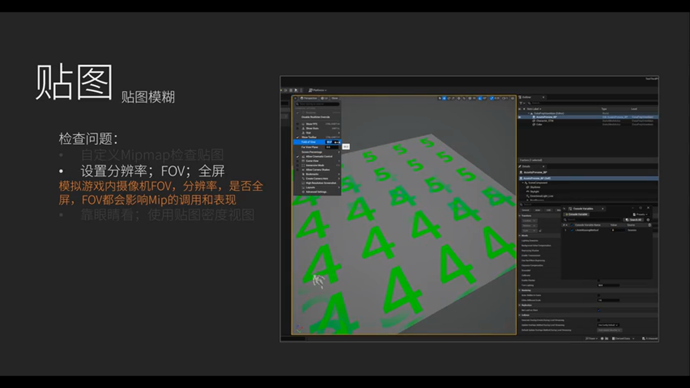

# UE5车载HMI开发实战：从架构设计到生产落地的完整路线图

---

## 加入 UE5 技术交流群
如果您对虚幻引擎5的图形渲染技术感兴趣，欢迎加入我们的 **UE5 技术交流群**！
扫描上方二维码添加个人微信 **wlxklyh**，备注"UE5技术交流"，我会拉您进群。
在技术交流群中，您可以：
- 与其他UE开发者交流渲染技术经验
- 获取最新的GDC技术分享和解读
- 讨论图形编程、性能优化、构建工具流、动画系统等话题
- 分享引擎架构、基建工具等项目经验和技术难题
---

## 源视频信息
- **标题**: [UFSH2025]UE5 HMI产品路线图 | Joe Andreson Epic Games 技术产品总监(官方字幕)
- **时长**: 30分1秒
- **视频链接**: https://www.bilibili.com/video/BV17pmzBoESW
- **说明**: 本文基于视频内容由AI辅助生成，包含技术分析和实战建议

> **核心观点提炼**
> - 下一代车载 HMI 需要在**效率**、**即开即用**、**赋能设计师**三大支柱上构建
> - 虚幻引擎通过 MultiWorld、API Gear、设计驱动开发等技术，实现了从概念验证到量产部署的完整工作流
> - 性能优化不仅是运行时的资源管理，更是开发流程的架构设计问题

## 背景与行业痛点

### 汽车行业的数字化转型挑战

过去十年，车载硬件算力以指数级增长，显示屏分辨率和尺寸不断扩大，但传统 HMI 开发模式却面临严重瓶颈：


**传统工作流的三大症结：**
- **设计与实现脱节**：设计师交付静态 Hero Screen（英雄屏），工程师手动重新实现，迭代周期长达数周
- **信号集成复杂度爆炸**：现代车辆拥有数千个 CAN/SOME-IP 信号（ADAS 车道线、3D 物体标注、地图导航、车辆设置等），手写绑定代码易出错且难以维护
- **跨平台演示成本高**：车展上展示的 Demo 代码无法复用到量产环境，需要重复开发


### 下一代HMI的核心需求

> **硬件层面**：从嵌入式 MCU 到高性能 SoC（如高通 SA8775P、NVIDIA Orin），GPU 算力提升了 100 倍以上
>
> **用户体验层面**：需要支持自动驾驶可视化、AI 语音交互、车内娱乐系统，甚至与智能手机体验竞争
>
> **开发效率层面**：如何让设计师直接参与实现，让工程师专注于创新功能而非基础设施

## 三大技术支柱：虚幻引擎的HMI解决方案

### 第一支柱：极致效率（Efficiency）

#### 1. MultiWorld架构：一个引擎实例驱动多屏显示


**技术演进路径：**
- **UE 4.25**：Android Single Instance（ASI）让虚幻引擎作为 Android 系统服务运行，而非嵌入在 APK 中
- **UE 5.x**：引入 **MultiView**，允许单个引擎实例同时渲染多个视图（如仪表盘 + 中控屏）
- **UE 5.6+**：**MultiWorld** 进一步支持为每个视图分配独立的 Level、GameInstance 和 PlayerController

**架构优势对比：**

> **方案 A：传统多引擎实例方案**
> - 🔴 劣势：每个屏幕运行独立的 UE 进程，内存和 CPU 开销呈线性叠加（如 3 块屏 = 3 倍资源消耗）
> - 🔴 劣势：进程间通信复杂，状态同步容易出现延迟或不一致
> - 🎯 适用场景：早期原型验证或屏幕内容完全独立的场景
>
> **方案 B：MultiWorld 单引擎多世界方案**
> - 🟢 优势：共享渲染管线、资源池和物理系统，内存占用减少 40%-60%
> - 🟢 优势：通过蓝图轻松创建和销毁子世界，无需修改底层架构
> - 🟢 优势：天然支持状态同步（如地图缩放、主题切换可跨屏联动）
> - 🎯 适用场景：量产级多屏座舱系统（推荐方案）

**蓝图实现示例：**

```cpp
// [AI补充] 基于演讲上下文的伪代码示例，展示 MultiWorld 创建流程
// 实际使用时请参考 Epic 官方文档

// 1. 在主 GameInstance 中创建子世界
UGameInstance* SubGameInstance = CreateSubGameInstance(WorldContext);

// 2. 为子世界分配独立 Level
SubGameInstance->LoadLevel("/Game/Instruments/ClusterLevel");

// 3. 生成渲染窗口并绑定到物理显示器
FWindowHandle SecondaryWindow = SpawnWindowForGameInstance(SubGameInstance, DisplayID);

// 4. 子世界与主世界可通过共享的 Subsystem 进行数据交互
USharedDataSubsystem::BroadcastSpeedUpdate(NewSpeed);
```


#### 2. 自动化性能测试：CI/CD 流水线中的性能守护者


**Unreal Insights 的量产价值：**
- **案例**：某 OEM 在开发后期发现帧率下降 15%，通过 Insights 定位到美术不小心将隐藏的高模 LOD0 设置为可见
- **工具链集成**：支持导出 JSON 格式的性能数据，可对接 Grafana/Kibana 进行长期趋势分析


**Automated Perf Testing（UE 5.6 Beta 功能）核心机制：**

**配置示例：**
```yaml
# AutomatedPerfTest.yaml
test_sequence: /Game/Tests/FullNavigation.uasset
metrics:
  - frame_time
  - gpu_memory
  - draw_calls
thresholds:
  max_frame_time_ms: 16.6  # 60fps
  max_gpu_memory_mb: 512
notification:
  slack_webhook: "https://hooks.slack.com/..."
```

**工作流程：**
1. Git 提交触发 Jenkins/GitHub Actions
2. 自动构建并启动 UE 编辑器无头模式
3. 运行 Level Sequence（预设的交互场景，如地图缩放、菜单切换）
4. 采集 Unreal Insights、Memory Insights、RHI Stats
5. 与上一次基线对比，回归超过 5% 则失败并通知团队

> **最佳实践**：Epic 内部 HMI 模板团队每天运行 200+ 次自动化测试，确保引擎更新不会引入性能退化

### 第二支柱：即开即用（Turnkey）

#### 1. API Gear：接口定义即代码的自动化绑定方案


**痛点场景：**
假设你的仪表盘需要显示 50+ 个车辆信号（速度、转速、档位、电池电量、胎压等），传统做法需要：
1. 在 C++ 中手写 50 个 UPROPERTY 变量
2. 编写 50 个回调函数处理 CAN 总线消息
3. 在蓝图中手动绑定每个信号到 UI Widget
4. 后端团队用 Python/Go 再写一遍相同的数据结构

**API Gear 的革命性简化：**

**步骤 1：声明式接口定义（.module 文件）**
```yaml
# InstrumentCluster.module
module: automotive.cluster
version: 1.0

interfaces:
  ICluster:
    properties:
      speed: int            # 车速（km/h）
      electricGear: EGear   # 电子档位（枚举）
      batteryLevel: float   # 电池电量（0.0-1.0）
    signals:
      onWarningTriggered:   # 警告信号事件
        params:
          - type: EWarningType
    operations:
      resetTripMeter: void  # 复位里程计
```

**步骤 2：配置代码生成模板（.solution.yaml）**
```yaml
targets:
  - name: "UE Plugin"
    template: "unreal-plugin"
    output: "/Game/Plugins/ClusterAPI"
  - name: "Python Backend"
    template: "python-pydantic"
    output: "./backend/cluster_api"
```

**步骤 3：一键生成代码**
```bash
apigear generate --solution InstrumentCluster.solution.yaml
# 耗时 < 1 秒，生成完整的 UE 插件 + Python SDK
```


**自动生成内容包括：**
- **虚幻引擎侧**：
  - 完整的 C++ 接口类（`UClusterInterface`）
  - 蓝图友好的 Getter/Setter 节点
  - 支持 WebSocket/MQTT/gRPC 的传输层适配器
- **后端侧**：
  - Python Pydantic 数据模型（类型安全）
  - 自动序列化/反序列化逻辑

**进阶功能：仿真与监控**


> **仿真模式**：无需真实车辆或后端服务，通过 API Gear Studio 可视化工具手动调节信号值，实时预览 UI 响应
>
> **监控模式**：生产环境中实时监听信号流量，用于诊断数据丢包或延迟问题

#### 2. HMI 模板：生产级组件库（计划于 UE 5.8 发布）


**模板内容清单：**
- **仪表盘组件**：包含速度表、转速表、警告灯（Telltales）、3D 仪表指针动画
- **地图导航**：基于 Cesium for Unreal 的高性能地图渲染，支持拖拽即用
- **API Gear 预定义接口**：覆盖 ADAS、车辆状态、媒体播放等常见场景


**定制化流程：**
1. 拖拽模板资源到项目中
2. 替换 3D 资产（如仪表指针模型）
3. 调整 Material 颜色以匹配品牌色调
4. 保留底层的 API Gear 绑定逻辑和性能优化配置

> **局限性分析**：模板专为 Android Automotive OS 优化，iOS CarPlay 或 QNX 平台需额外适配工作

### 第三支柱：赋能设计师（Enabling Designers）

#### 设计驱动开发：打破设计与工程的壁垒


**传统工作流 vs. UE5 工作流：**

> **传统方式（瀑布式）**
> - 🔴 设计师在 Figma/Sketch 中创建静态稿（2-4周）
> - 🔴 工程师根据设计稿用代码重新实现（4-8周）
> - 🔴 发现问题后需重新走一遍流程
> - ⏱️ 单次迭代周期：6-12 周
>
> **UE5 设计驱动方式**
> - 🟢 设计师直接在 UE 编辑器中调整 3D 资产、材质、动画
> - 🟢 提交到 Git 后自动打包部署到测试车辆
> - 🟢 工程师仅需维护数据绑定层（通过 API Gear 自动生成）
> - ⏱️ 单次迭代周期：1-3 天

**量产案例：Rivian 的品牌表达**


Rivian 通过虚幻引擎实现了独特的"户外探险"视觉风格：
- 仪表盘中的 3D 地形高度图（实时渲染，非预录视频）
- 驾驶模式切换时的动态光影过渡（从城市的冷色调到越野的暖色调）
- 设计师可直接在 UE 中调整粒子特效（如涉水时的水花）

#### 行业领先的 VFX 工具链


**技术栈：**
- **Niagara VFX**：支持百万级粒子的实时模拟，用于天气效果、充电动画
- **Geometry Scripting**：程序化生成 3D 图表（如能量流动图）
- **Mobile Deferred Renderer**：移动端延迟渲染，支持动态光照和阴影
- **TSR（Temporal Super Resolution）**：AI 驱动的抗锯齿和分辨率提升，4K 屏幕仅需 1080p 渲染

## 实战演示：仪表盘信号集成

### 本地仿真模式


Joe 在现场展示了仪表盘通过 **Level Sequence** 驱动本地仿真：
- 速度从 0 匀速增加到 120 km/h
- 档位从 P 档切换到 D 档
- 警告灯（胎压、电池）按脚本触发

**关键配置：**
在蓝图中选择 `Local Simulation` 模式，无需外部服务即可运行完整交互流程。

### 外部服务集成：JavaScript 仿真


通过 WebSocket 连接到 JavaScript 仿真服务：
```javascript
// 简化示例：API Gear 自动生成的 JS SDK
const cluster = new ClusterAPI('ws://localhost:9000');

// 模拟车辆启动序列
cluster.setSpeed(0);
cluster.setElectricGear('P');
await sleep(1000);

cluster.setElectricGear('D');
for (let speed = 0; speed <= 100; speed += 5) {
  cluster.setSpeed(speed);
  await sleep(200);
}
```



### 键盘控制的 Python 仿真

Joe 进一步展示了 Python 服务：
- **B 键**：触发仪表盘启动动画
- **S 键**：发送随机速度值
- **G 键**：循环切换档位

```python
# [AI补充] 基于演示内容的 Python 示例代码
from cluster_api import ClusterInterface  # API Gear 自动生成

cluster = ClusterInterface(transport='mqtt')

while True:
    key = input("Press key (B=boot, S=speed, G=gear): ")
    if key == 'B':
        cluster.trigger_boot_sequence()
    elif key == 'S':
        cluster.set_speed(random.randint(0, 180))
    elif key == 'G':
        cluster.cycle_gear()
```

> **实战价值**：在车展或内部演示时，无需真实车辆即可完整展示所有 HMI 功能，甚至可以通过隐藏的键盘触发"彩蛋"功能

## 性能优化深度解析

### 常见性能陷阱与避坑指南

**陷阱 1：过度复用单张截图**
> **问题**：设计师为了保持视觉一致性，在多个 UI 页面使用同一张 4K 背景图
> **后果**：纹理内存占用超出预算，导致低端 SoC 上出现 OOM
> **解决方案**：使用程序化生成的渐变背景 + 低频细节贴图，内存占用减少 80%

**陷阱 2：实时光线追踪的误用**
> **问题**：在仪表盘这种 2.5D 场景中启用 Lumen 全局光照
> **后果**：移动端 GPU 占用超过 70%，影响其他系统（如 ADAS 渲染）
> **解决方案**：使用预烘焙的 Lightmap + 少量动态点光源

**陷阱 3：蓝图中的 Tick 事件滥用**
> **问题**：在 Widget Blueprint 的 Tick 中每帧查询车速并更新文本
> **后果**：即使速度未变化，也会触发大量字符串拼接和 UI 重绘
> **解决方案**：通过 API Gear 的 Property Changed 事件驱动更新

**配置示例：**
```cpp
// 推荐：事件驱动方式
UFUNCTION()
void OnSpeedChanged(int32 NewSpeed)
{
    SpeedText->SetText(FText::AsNumber(NewSpeed));
}

// 不推荐：Tick 轮询方式
void Tick(float DeltaTime) override
{
    int32 Speed = ClusterAPI->GetSpeed();  // 每帧调用，浪费 CPU
    SpeedText->SetText(FText::AsNumber(Speed));
}
```

### 最佳实践清单

**资源管理：**
- 使用虚幻引擎的 **Async Loading** 加载非关键资源（如地图 POI 图标）
- 为不同 SoC 性能等级准备 Scalability 配置文件（Low/Medium/High）

**渲染优化：**
- 启用 **Mobile HDR** 而非桌面端的 HDR，减少带宽消耗
- UI 元素使用 **Masked Material** 而非半透明材质，避免 Overdraw

**内存优化：**
- 定期运行 **Memory Insights** 检查纹理和网格的引用计数
- 使用 **Object Pooling** 管理频繁创建/销毁的 UI Widget

## 技术路线图与未来展望

### 已发布功能（UE 5.5-5.6）
- MultiWorld 架构稳定版
- API Gear 官方支持
- Automated Perf Testing（Beta）

### 计划中功能（UE 5.8，2026 上半年）
- HMI 模板首个正式版
- 增强的 Cesium 地图性能（支持离线地图）
- 车载 AI 可视化工具（显示感知目标的 3D 边界框）

### 社区建议
> **参与方式**：Epic 在 GitHub 上开源了 API Gear 模板（https://github.com/apigear-io/template-unreal），欢迎提交自定义传输层适配器（如 CAN/LIN）

## 总结与行动建议

### 关键要点回顾

> **技术选型建议**
> - 如果你的项目目标是 2026 年后量产，**强烈推荐**采用 MultiWorld + API Gear 技术栈
> - 对于现有 UE 4.27 项目，优先升级到 5.5 以获得 Automated Perf Testing 支持
> - 设计团队规模 > 5 人的项目，设计驱动开发的 ROI 最高

### 学习资源

- **Unreal Fest Bali 演讲**：Matt Oztole 关于自动化性能测试的详细教程
- **Epic 官方文档**：搜索 "Unreal Engine for Automotive HMI"
- **API Gear 官网**：https://apigear.io（包含交互式教程）

### 立即行动

**30 天快速启动计划：**
1. **第 1 周**：下载 HMI 模板（5.8 发布后），熟悉项目结构
2. **第 2-3 周**：定义你的车辆信号接口（参考 SAE J1939 标准），用 API Gear 生成代码
3. **第 4 周**：集成 Automated Perf Testing 到 CI 流水线，建立性能基线

---

**致谢**：感谢 Epic Games 的 Joe Andreson 和 HMI 团队在 UFSH 2025 分享的宝贵经验。如果你正在开发车载 HMI 系统，欢迎在评论区分享你的技术选型和遇到的挑战。

**免责声明**：文中代码示例为辅助理解的简化版本，生产环境请参考 Epic 官方文档和最佳实践。
