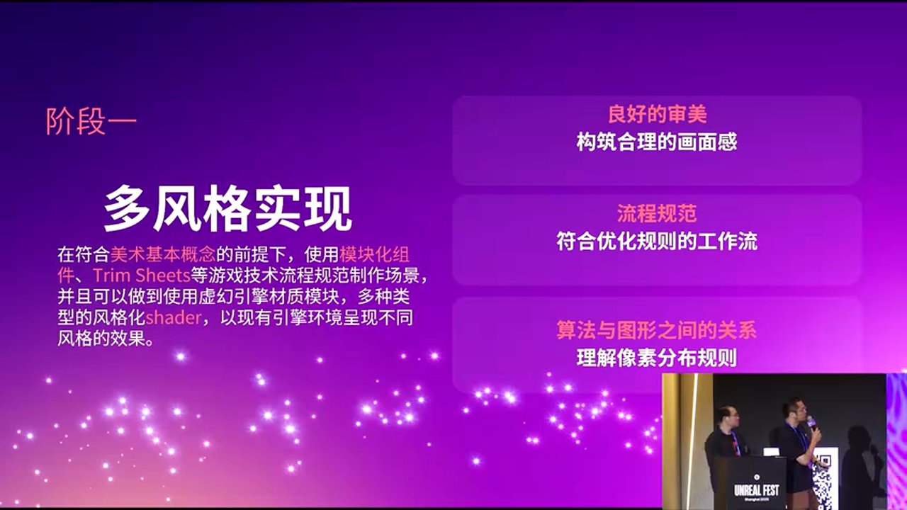
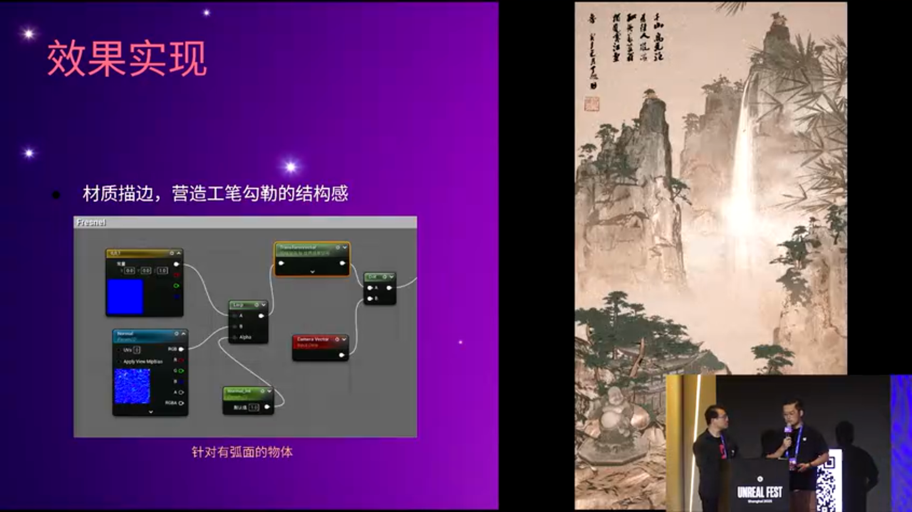
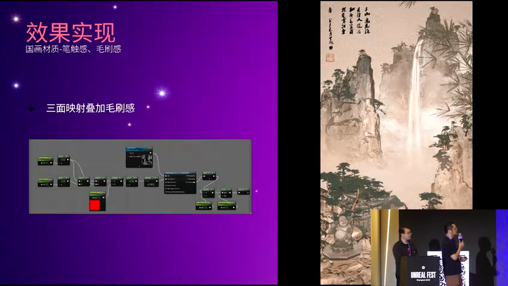
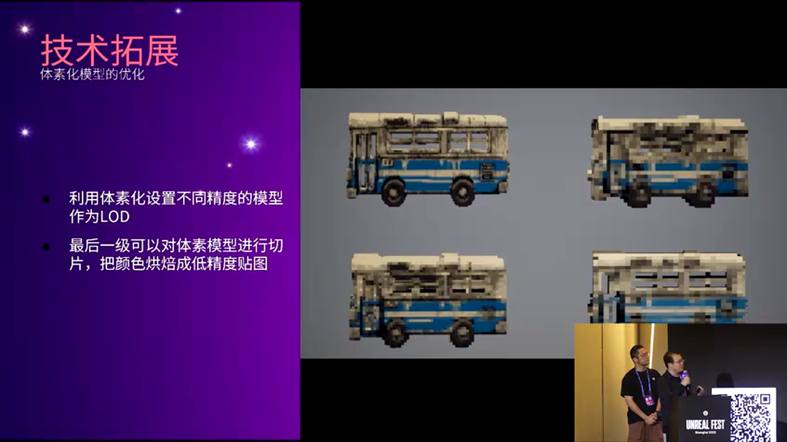
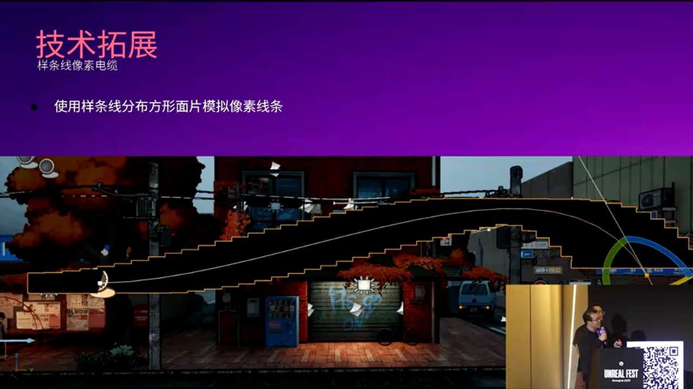
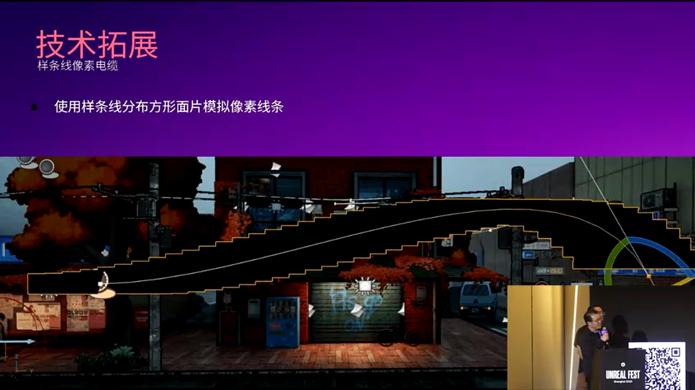
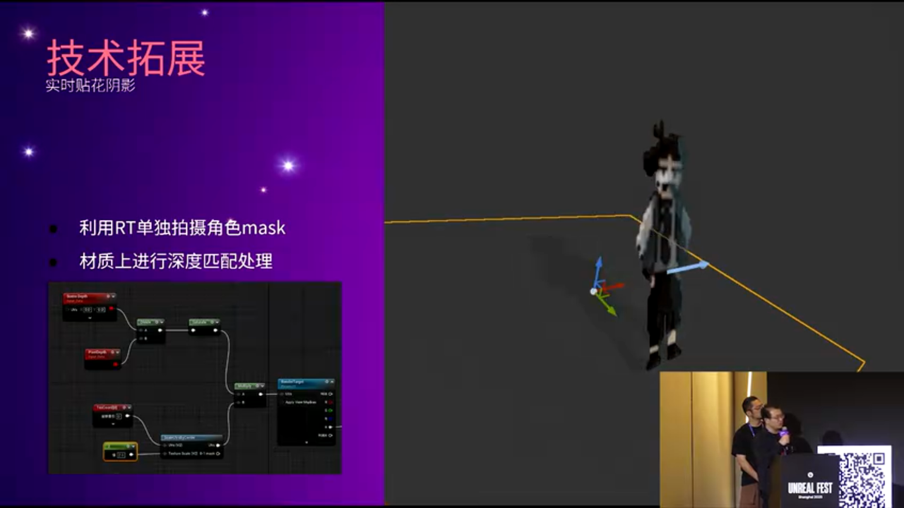
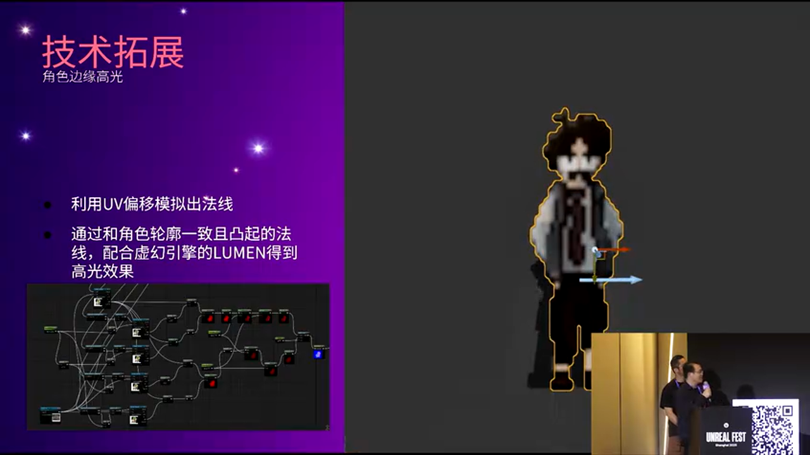
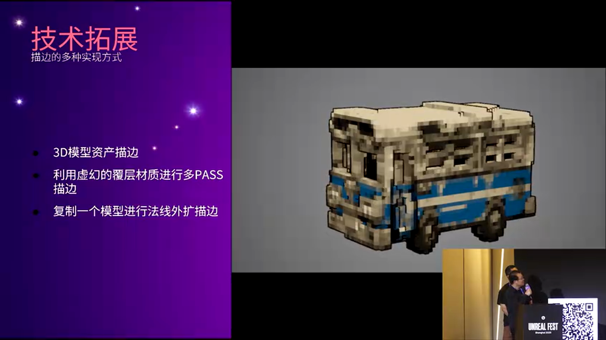

# UE5场景美术风格化实践：从传统渲染到多风格程序化生成

---


## 加入 UE5 技术交流群

如果您对虚幻引擎5的图形渲染技术感兴趣，欢迎加入我们的 **UE5 技术交流群**！

扫描上方二维码添加个人微信 **wlxklyh**，备注"UE5技术交流"，我会拉您进群。

在技术交流群中，您可以：
- 与其他UE开发者交流渲染技术经验
- 获取最新的GDC技术分享和解读
- 讨论图形编程、性能优化、构建工具流、动画系统等话题
- 分享引擎架构、基建工具等项目经验和技术难题

---

> **源视频信息**
>
> 本文基于 UFSH2025 技术分享整理，由 AI 辅助生成
>
> 视频标题：场景美术进化论: UE5实现风格自由流程探索
>
> 演讲者：秦小博、王宗怡 | 欧酱数字艺术
>
> 视频链接：https://www.bilibili.com/video/BV1itmzBWEuZ

---

## 导读

> 本文将深入探讨虚幻引擎5（UE5）在场景美术领域的多风格化实现方案，涵盖从国风水墨到 HD2D 像素风格的完整技术路径。我们将从材质系统、程序化生成、后处理技术三个维度，解析如何让个人或小团队突破传统工作流限制，实现风格自由。
>
> 核心观点：
> - 场景美术的第一步是多风格实现，充分挖掘 UE5 的材质编辑器、蓝图和 PCG 能力
> - 程序化生成是个人/小团队实现大规模场景的关键路径
> - 体素化、描边、分层控制等技术可以实现高度风格化的视觉效果
>
> **前置知识要求**：熟悉 UE5 基础操作、材质编辑器基本概念、蓝图可视化编程

---

## 一、背景与痛点：场景美术为何需要进化

### 1.1 传统场景美术的局限性


传统的场景美术工作流程往往面临以下挑战：

- **技能壁垒高**：建模、场景构建、光照氛围、动画特效、PCG 等技能分散在不同专业领域
- **协作成本大**：大型项目需要多个部门配合，沟通成本高
- **风格固化**：一旦确定美术风格，后期调整代价巨大

然而，**虚幻引擎5 为个人和小团队提供了强大的技术平台**，使得从建模到场景构建、从光照到特效的全流程个人化操作成为可能。这不仅是技术工具的升级，更是创作范式的革新。

### 1.2 场景美术进化的三个阶段



**阶段一：多风格实现**

场景美术的第一步是掌握多风格实现能力。如果仅将虚幻引擎当作一个"写实渲染器"，并没有充分挖掘其潜力。UE5 包含强大的**材质编辑器**、**蓝图可视化编程**、**PCG（程序化内容生成）**、**Sequencer 动画序列编辑器**等工具。

多风格实现的核心在于：
- 正常的基础审美
- 规范的游戏制作流程
- 深入理解材质系统与光照的关系


上图展示了团队实现的多种风格案例：
- **国风水墨**：强调色彩渐变和氛围感
- **美式卡通**：类似《无主之地》的描边风格
- **日式动漫**：赛璐璐着色与高饱和度
- **HD2D**：像素化与 3D 结合的独特美学
- **超写实**：基于 3D 扫描的真实场景复刻

**阶段二：程序化生成**


程序化是场景美术的终极目标。通过以下技术路径，可以在最短时间内生成尽可能多的内容：

1. **UE5 PCG 系统**：生成自然场景（如小岛、森林）
2. **WFC 2D 算法**：基于 Wave Function Collapse 算法生成地牢等室内场景
3. **Houdini + UE5**：使用随机模组方式生成复杂城市（如香港九龙城）
4. **WFC 3D 算法**：生成大规模城市布局
5. **官方模板改造**：基于 UE5 官方城市生成模板的定制化工作流

**阶段三：风格融合与迭代**

最终目标是建立一套可复用、可扩展的美术流程，支持快速切换不同风格，甚至在同一场景中混合多种风格。

---

## 二、核心技术解析（一）：国风水墨风格实现

### 2.1 国风水墨的核心视觉特征


国风水墨风格的关键在于：
- **晕染感**：颜色自然过渡，模拟水墨在宣纸上的渗透效果
- **笔触感**：保留笔刷质感，避免过于平滑
- **层次分离**：通过景深控制画面的前中后景关系
- **透视控制**：适度夸张透视，营造空间感

### 2.2 技术实现路径

#### （1）宣纸纹理叠加


使用宣纸纹理叠加在后处理材质上，实现整体的纸质效果。纹理制作方式：
- **Substance Designer**：程序化生成纹理，可调节纤维密度、颜色变化
- **Photoshop**：直接使用扫描的宣纸纹理
- **现成素材**：从素材库获取高质量纹理

#### （2）景深与层次控制


使用**景深（Depth of Field）**控制画面层次。目前实现为单一景深控制，后续计划升级为多层级景深，实现更精细的前中后景分离。

#### （3）描边系统



描边分为两类：
- **硬边结构描边**：使用**自定义深度（Custom Depth）**提取建筑物等硬表面的边缘
- **软边结构描边**：使用类似 **Fresnel** 的效果，基于法线和视角夹角计算边缘高光

#### （4）多方向色彩渐变


水墨风格的颜色变化需要从多个维度控制：

**光照方向渐变**：
使用经典的**点乘（Dot Product）**操作：
- 计算光源方向向量与物体法线向量的点乘
- 点乘结果映射到颜色渐变（暖色到冷色）

> 点乘（Dot Product）是美术人员必须理解的第一个数学节点。它将两个向量的夹角关系转换为 -1 到 1 的标量值，这个值可以直接用于颜色插值、遮罩生成等场景。

**纵向高度渐变**：
```
Gradient = AbsoluteWorldPosition.Z - BaseHeight
```
通过**绝对世界位置（Absolute World Position）**的 Z 轴分量，实现从底部到顶部的颜色过渡。

**水平方向渐变**：
```
Gradient = AbsoluteWorldPosition.XY / ObjectBounds.XY
```
结合**物体包围盒（Object Bounds）**计算物体的左右、前后方向的颜色变化。

**笔触纹理叠加**：



使用现成的笔刷纹理图叠加，或通过 **Substance Designer** 生成程序化笔触纹理。

**三面映射（Tri-Planar Mapping）**：

由于模型本身无法精确控制 UV，使用**三面映射**可以将纹理均匀投射到模型表面：
```
TriPlanarBlend = abs(WorldNormal.x), abs(WorldNormal.y), abs(WorldNormal.z)
FinalColor = TextureX * BlendX + TextureY * BlendY + TextureZ * BlendZ
```

这种方法避免了 UV 拉伸问题，尤其适用于复杂几何体。

---

## 三、核心技术解析（二）：HD2D 像素风格实现

### 3.1 HD2D 的定义与挑战


**HD2D（High Definition 2D）** 是一种将 3D 模型渲染为像素化风格的技术，广泛应用于独立游戏（如《歧路旅人》）。

核心理念：
- **3D 模型 + 像素化渲染**：保留 3D 的光影和透视，但呈现像素艺术的视觉风格
- **马赛克化 ≠ 像素化**：单纯将颜色贴图降低分辨率会导致细节丢失，不符合美术追求

### 3.2 体素化模型生成

#### （1）Houdini 体素化流程


使用 **Houdini** 的体素化（Voxelization）功能：
- 将原始模型转换为 3D 像素（体素）
- 通过调整**体素精度（Voxel Size）**控制模型细节
- 采样顶点颜色，将平均颜色分配到每个面


体素化的优势：
- 自动生成立方体堆叠效果（类似《我的世界》）
- 颜色存储在顶点色中，无需贴图

体素化的劣势：
- 高精度模型的面数会非常高（可能达到数十万面）
- 需要 LOD 优化策略

#### （2）LOD 与性能优化



针对高面数问题，采用以下优化方案：

**多级 LOD 体素化**：
- LOD0：高精度体素（小体素尺寸）
- LOD1：中等精度
- LOD2：低精度（大体素尺寸）

**切片烘焙贴图**：
- 将体素化模型的颜色烘焙到一张低精度贴图
- 贴图贴到一个平面上（Plane）
- 大幅降低面数，适用于远景物体


**内部面剔除**：
体素化模型内部有大量不可见的立方体，可以通过算法剔除：
- 检测每个体素是否被周围体素完全包围
- 删除内部体素，只保留外壳
- 颜色信息烘焙到原始模型的顶点色

最终结果：**所有体素化模型只需一个材质球**，材质直接读取 **Vertex Color（顶点色）**。

### 3.3 室内立方体贴图（Interior Cubemap）


为了丰富 HD2D 场景的美术细节，使用**室内立方体贴图（Interior Cubemap）**技术：

**原理**：
- 在玻璃等透明材质后面，使用立方体贴图模拟室内场景
- 当相机移动时,立方体贴图根据视角变化动态偏移，模拟视差效果

**实现**：
- 玻璃表面和内部贴图在同一个材质上
- 使用 UE5 的 **Interior Cubemap** 节点
- 配置立方体贴图的位置、缩放和视差强度

### 3.4 像素化电线的程序化生成



传统电线模型在像素化风格中会显得不协调。解决方案：

**样条线生成网格体**：
- 使用 **Spline（样条线）** 定义电线路径
- 沿样条线生成一系列平面（Plane）
- 每个平面始终朝向上方（不旋转），形成"像素堆叠"的视觉效果



代码逻辑（蓝图伪代码）：
```
For each point on spline:
    SpawnPlane at point position
    PlaneRotation = (0, 0, 0)  // 固定朝上
    PlaneColor = Sample from wire texture
```

这种方法使电线看起来像一个个像素方块堆叠而成，完美融入 HD2D 风格。

### 3.5 角色阴影的独立处理



由于场景中大量材质使用了**自发光（Emissive）**，传统阴影效果会被削弱或失真。解决方案：

**Scene Capture 2D + Depth**：
- 使用 **Scene Capture 2D** 组件（类似 Unity 的 Render Texture）
- 单独渲染角色的深度信息
- 将深度贴图应用到一个平面上，作为投影阴影



**角色边缘高光（类似描边）**：
使用法线偏移技术：
```
OffsetNormal = WorldNormal * OffsetDistance
DepthMask = SceneDepth - (SceneDepth + OffsetNormal)
Highlight = DepthMask > Threshold ? HighlightColor : 0
```

这种方法类似**膨胀描边（Dilation Outline）**，通过深度差异生成边缘遮罩，再填充高光颜色。

---

## 四、描边技术的多种实现方案

### 4.1 描边技术对比


HD2D 项目中需要根据不同场景选择合适的描边方案：

#### 方案一：贴图烘焙描边

> **适用场景**：静态物体，低精度模型
>
> **优势**：
> - 性能消耗极低（无需额外渲染）
> - 描边宽度和颜色可预先调整
>
> **劣势**：
> - 无法动态调整
> - 不适用于动画角色
>
> **实现方式**：
> 在 Substance Painter 或 Photoshop 中直接在颜色贴图上绘制描边，或使用边缘检测滤镜自动生成。

**配合后处理描边**：
可以同时使用贴图描边 + 后处理描边，形成双层描边效果（内层暗色 + 外层高光）。

#### 方案二：多Pass材质描边（Overlay Material）



> **适用场景**：3D 资产模型，需要动态调整描边的场景
>
> **优势**：
> - 可以独立控制描边颜色、宽度
> - 适用于静态网格体
>
> **劣势**：
> - 不适用于骨骼网格体（Skeletal Mesh）
> - 需要复制模型或使用 Custom Stencil Layer
>
> **实现方式**：
> 将模型放在 **Overlay Material** 层：
> ```
> Material Settings:
>   - Shading Model: Unlit
>   - Blend Mode: Translucent
>   - Use Custom Depth: True
> ```
> 通过法线偏移扩大模型：
> ```
> VertexOffset = WorldNormal * OutlineWidth
> ```

或者直接复制一个模型，稍微放大，使用单色材质。

#### 方案三：深度描边（Depth-based Outline）


> **适用场景**：需要全局描边，不区分物体
>
> **优势**：
> - 后处理方式，性能开销可控
> - 适用于所有类型的网格体
>
> **劣势**：
> - 无法单独控制某个物体的描边
> - 深度突变处会出现描边

**实现方式**（后处理材质）：
```hlsl
// 采样场景深度
float Depth = SceneTexture(SceneDepth)

// 深度偏移采样（上下左右四个方向）
float DepthUp = SceneTexture(SceneDepth, UV + float2(0, Offset))
float DepthDown = SceneTexture(SceneDepth, UV - float2(0, Offset))
float DepthLeft = SceneTexture(SceneDepth, UV + float2(Offset, 0))
float DepthRight = SceneTexture(SceneDepth, UV - float2(Offset, 0))

// 计算深度差异
float DepthDiff = abs(Depth - DepthUp) + abs(Depth - DepthDown)
                + abs(Depth - DepthLeft) + abs(Depth - DepthRight)

// 生成描边遮罩
float OutlineMask = DepthDiff > Threshold ? 1 : 0
FinalColor = lerp(SceneColor, OutlineColor, OutlineMask)
```

#### 方案四：自定义模板描边（Custom Stencil Outline）


> **适用场景**：需要精确控制哪些物体有描边，哪些没有
>
> **优势**：
> - 可以单独标记物体（通过 Custom Stencil Value）
> - 支持动态开关
> - 描边质量高
>
> **劣势**：
> - 需要额外配置每个物体的 Custom Stencil
>
> **实现方式**：

1. 在需要描边的物体上启用 **Custom Depth Stencil**：
   ```
   Rendering -> Custom Depth-Stencil Pass: Enabled
   Custom Depth Stencil Value: 1
   ```

2. 后处理材质中读取 Custom Stencil：
   ```hlsl
   float Stencil = SceneTexture(CustomStencil)
   if (Stencil == 1) {
       // 应用偏移采样，生成描边
       float2 OffsetUV = UV + WorldNormal.xy * OutlineWidth
       float StencilOffset = SceneTexture(CustomStencil, OffsetUV)
       float OutlineMask = (Stencil - StencilOffset)
       FinalColor = lerp(SceneColor, OutlineColor, OutlineMask)
   }
   ```

### 4.2 体素化模型的描边挑战


体素化模型的描边比普通模型更复杂，因为：
- **面数极高**：描边计算量大
- **法线方向不连续**：立方体边缘会产生不自然的描边断裂

**解决方案：自适应描边算法**


使用**屏幕空间像素大小自适应**的描边宽度：
```hlsl
// 计算物体在屏幕空间的大小
float ScreenSize = DDX(WorldPosition) + DDY(WorldPosition)

// 根据屏幕大小调整描边宽度
float AdaptiveOutlineWidth = OutlineWidth / ScreenSize

// 应用描边
VertexOffset = WorldNormal * AdaptiveOutlineWidth
```

这种方法确保：
- 近景物体描边细腻
- 远景物体描边稳定，不会因为透视变形而闪烁

**适用场景**：
- **正交相机（Orthographic）游戏**：如俯视角 ARPG、策略游戏
- **透视相机但 FOV 固定**的游戏：描边宽度可以预设

对于视角频繁变化的游戏（如第一人称射击），这种方法可能不是必需的。

---

## 五、程序化生成的实战案例

### 5.1 PCG 生成小岛场景


使用 **UE5 PCG（Procedural Content Generation）** 系统生成自然场景：

**工作流程**：
1. 创建地形（Landscape）作为基础
2. 使用 **PCG Volume** 定义生成区域
3. 配置 PCG Graph：
   - **Surface Sampler**：在地形表面采样点
   - **Density Filter**：根据高度、坡度过滤点
   - **Static Mesh Spawner**：在采样点生成树木、石头等资产

**关键参数**：
- **Point Density（点密度）**：控制资产数量
- **Slope Filter（坡度过滤）**：避免在陡峭地形生成物体
- **Biome Mask（生物群系遮罩）**：使用纹理控制不同区域的植被类型

### 5.2 WFC 2D 算法生成地牢


**Wave Function Collapse（波函数坍缩）** 是一种基于约束的程序化生成算法，广泛用于地牢、迷宫生成。

**算法原理**：
1. 定义**模块（Tile）**：墙壁、地板、门、走廊等
2. 定义**邻接规则**：哪些模块可以相邻
3. 初始化网格，所有格子处于"叠加态"（可以是任何模块）
4. 随机选择一个格子，根据邻接规则"坍缩"为某个确定模块
5. 传播约束，更新相邻格子的可能性
6. 重复步骤 4-5，直到所有格子坍缩

**UE5 实现**：
- 使用蓝图或 C++ 实现 WFC 算法
- 或使用插件（如 **PCG WFC Plugin**）

### 5.3 Houdini + UE5 生成香港九龙城


使用 **Houdini** 的随机模组功能生成密集城市：

**流程**：
1. 在 Houdini 中创建建筑模块库（楼层、阳台、空调外挂等）
2. 使用 **Copy to Points** 或 **Assembly** 节点随机组装
3. 添加变形、噪波，避免重复感
4. 通过 **Houdini Engine for Unreal** 导入 UE5
5. 在 UE5 中调整材质、光照

**优势**：
- Houdini 的程序化能力远超 UE5 原生工具
- 可以生成百万级规模的城市
- 支持实时参数调整

---

## 六、实战总结与避坑指南

### 6.1 多风格实现的关键要点

> **要点一：材质系统是核心**
>
> 掌握 UE5 的材质编辑器，特别是以下节点：
> - **Dot Product（点乘）**：用于光照计算、渐变生成
> - **Fresnel（菲涅尔）**：边缘高光、软描边
> - **Custom Depth / Stencil**：物体标记、后处理遮罩
> - **Tri-Planar Mapping**：避免 UV 拉伸

> **要点二：后处理是风格化的放大器**
>
> 后处理材质可以快速实现全局效果：
> - 宣纸纹理叠加（国风）
> - 描边（卡通渲染）
> - 色阶分离（赛璐璐着色）
> - 像素化（HD2D）

> **要点三：程序化思维**
>
> 不要手工放置每一个物体，而是通过规则生成：
> - 使用 PCG 生成植被、道具
> - 使用蓝图批量修改材质参数
> - 使用 Houdini 生成建筑模块

### 6.2 常见问题与解决方案

**问题 1：体素化模型面数过高，导致卡顿**

**解决方案**：
- 使用多级 LOD
- 将远景物体烘焙为贴图 + 平面
- 剔除内部不可见面

**问题 2：描边在某些角度闪烁或断裂**

**解决方案**：
- 使用自适应描边宽度（基于屏幕空间大小）
- 结合多种描边方式（贴图 + 后处理）
- 调整深度偏移的采样距离

**问题 3：国风水墨效果不够"晕染"**

**解决方案**：
- 使用多层颜色渐变（光照 + 高度 + 水平）
- 增加纹理的对比度和噪波
- 使用后处理的模糊效果模拟水墨扩散

**问题 4：PCG 生成的场景重复感强**

**解决方案**：
- 增加资产库的多样性（至少 20+ 模型变体）
- 添加随机旋转、缩放、颜色变化
- 使用噪波纹理控制密度分布

**问题 5：Houdini 导入 UE5 后材质丢失**

**解决方案**：
- 在 Houdini 中使用 **Material Attribute** 标记材质
- 在 UE5 中通过 Houdini Engine 插件的材质映射功能
- 或使用 UE5 的 **Data Table** 批量替换材质

### 6.3 性能优化建议

**渲染优化**：
- 合并静态网格体（Static Mesh Merging）
- 使用 **Nanite** 技术处理高面数模型（需 UE 5.1+）
- 开启 **Lumen** 的软件光线追踪模式，降低硬件要求

**材质优化**：
- 减少材质指令数（Material Complexity 视图检查）
- 避免在 Pixel Shader 中使用复杂的数学运算
- 使用 **Material Functions** 复用逻辑

**程序化生成优化**：
- PCG 生成使用异步加载（Async Loading）
- 分批生成，避免单帧卡顿
- 使用 **Level Streaming** 动态加载场景块

---

## 七、结语与展望

### 7.1 个人/小团队的机会


虚幻引擎5 为独立开发者和小团队提供了前所未有的机会：
- **技术民主化**：无需大型团队，一个人也可以完成 3A 级别的视觉效果
- **工作流整合**：从建模、材质、动画到程序化生成，全流程在 UE5 内完成
- **快速迭代**：材质和蓝图的可视化编程大幅降低试错成本

### 7.2 未来探索方向

演讲中提到的两种风格（国风水墨、HD2D）只是起点，还有更多风格值得探索：
- **日式动漫赛璐璐着色**：使用 Ramp Texture 实现色阶分离
- **美式卡通描边**：类似《无主之地》的手绘风格
- **Lowpoly 风格**：简化几何体 + 平面着色

此外，**AI 工具**（如 Stable Diffusion、Midjourney）也可以融入工作流：
- 生成概念图指导美术方向
- 生成贴图纹理，再通过 PixelMatch 等工具转换为像素风格
- 使用 AI 辅助生成宣纸纹理、笔触图案

### 7.3 推荐学习路径

如果你想系统学习 UE5 场景美术，建议按以下路径：

**阶段一：基础掌握**（1-2 个月）
- 熟悉 UE5 界面和基本操作
- 学习材质编辑器核心节点
- 理解 PBR 材质流程

**阶段二：风格实践**（2-3 个月）
- 复刻一个简单的卡通场景（如《塞尔达传说：旷野之息》风格）
- 实现基础描边和色阶分离
- 学习后处理材质

**阶段三：程序化探索**（3-6 个月）
- 学习 PCG 系统
- 了解 Houdini 基础操作
- 实现一个小型程序化生成场景（如森林、小镇）

**阶段四：综合项目**（持续）
- 选择一个你喜欢的艺术风格，打造完整的 Demo
- 优化性能，打包发布
- 分享经验，持续迭代

---

## 参考资源

**官方文档**：
- [UE5 材质编辑器文档](https://docs.unrealengine.com/5.0/zh-CN/unreal-engine-materials/)
- [UE5 PCG 快速入门](https://docs.unrealengine.com/5.1/zh-CN/procedural-content-generation-quick-start/)
- [Houdini Engine for Unreal](https://www.sidefx.com/products/houdini-engine/)

**推荐教程**：
- 欧酱数字艺术官方课程（场景美术、Houdini 全流程）
- GDC 技术分享：Stylized Rendering in Unreal
- YouTube: The Art of Stylized Rendering

**工具与插件**：
- **PixelMatch**：贴图像素化转换工具
- **PCG WFC Plugin**：UE5 的 WFC 算法插件
- **Quixel Megascans**：高质量 3D 扫描资产库

---

**致谢**

感谢欧酱数字艺术团队（秦小博、王宗怡）在 UFSH2025 上的精彩分享。本文基于演讲内容整理，加入了技术细节和实践建议，希望能帮助更多开发者探索 UE5 场景美术的无限可能。

> 生成工具：Claude Sonnet 4.5 + 自动化文章生成流程
>
> 整理时间：2026-01-11

---

**扫描二维码，加入 UE5 技术交流群，与更多开发者交流经验！**
