# 开放世界二次元游戏的光追实战：从技术选型到性能极致优化

---


## 加入 UE5 技术交流群

如果您对虚幻引擎5的图形渲染技术感兴趣,欢迎加入我们的 **UE5 技术交流群**！

扫描上方二维码添加个人微信 **wlxklyh**，备注"UE5技术交流"，我会拉您进群。

在技术交流群中，您可以：
- 与其他UE开发者交流渲染技术经验
- 获取最新的GDC技术分享和解读
- 讨论图形编程、性能优化、构建工具流、动画系统等话题
- 分享引擎架构、基建工具等项目经验和技术难题

---

> **源视频信息**
>
> 标题：[UFSH2025]《鸣潮》中的光线追踪: 用光线构建动漫风格开放世界 | 王鑫 库洛游戏《鸣潮》图形渲染组长
>
> 视频链接：https://www.bilibili.com/video/BV1hSW4zTEgQ
>
> 本文由 AI 基于视频内容生成，结合了原始字幕和关键截图，旨在为读者提供更易阅读的技术解析。

---

> **导读**
>
> 本文深度剖析了库洛游戏如何在 UE4.26 基础上为开放世界二次元手游《鸣潮》实现光线追踪技术。文章涵盖从技术选型（ReSTIR vs Lumen）、风格化渲染适配、到 CPU/GPU 双端性能优化的完整工程实践。核心成果：在 RTX 4060 2K 设备上达到 60 FPS，同时保持二次元美术风格的完整性。
>
> **前置知识要求**：熟悉实时渲染管线、光栅化与光追的基本原理、UE4/5 渲染架构。

---

## 一、项目背景与技术挑战

《鸣潮》是一款主打高自由度动作战斗和开放世界探索的游戏，其技术特征决定了光追实现的独特挑战：


**项目约束条件**：
- **引擎版本锁定**：必须在 UE4.26 上实现（线上运营项目，无法升级引擎）
- **世界规模**：32km × 32km 超大开放世界
- **动态光照**：完整的 TOD（Time of Day）系统
- **高速移动**：ACT 游戏特性要求快速响应
- **风格化渲染**：二次元美术风格，需要特殊的光照处理逻辑
- **稳定性优先**：线上运营项目，稳定性是第一要务

**技术目标**：
- 在动态场景和动态光源条件下实现三个核心特性：
  - **光追反射（RT Reflection）**
  - **光追全局光照（RT Global Illumination）**
  - **光追阴影（RT Shadow）**
- 性能目标：RTX 4060 2K 设备达到 60 FPS

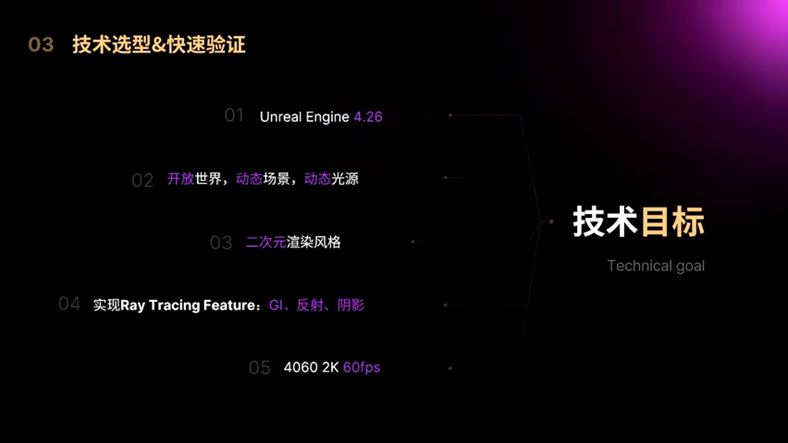

---

## 二、渲染管线基础：光栅化 vs 光追 vs 混合

### 2.1 两种渲染范式的本质差异

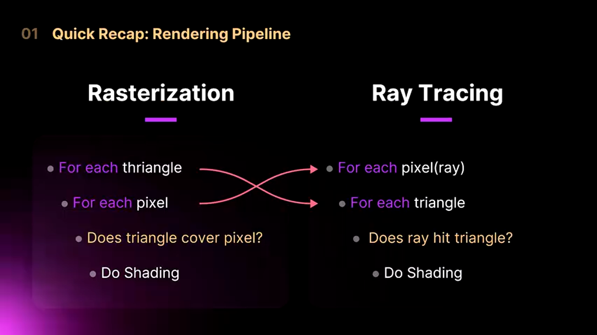

**光栅化渲染管线**：
- 遍历场景中的所有三角形
- 将三角形投影到屏幕空间
- 查询每个三角形覆盖了哪些像素
- 对覆盖的像素进行着色

**光追渲染管线**：
- 从屏幕像素出发发射光线
- 通过加速结构（BVH）遍历场景
- 查询光线命中了哪个三角形
- 根据命中信息对像素着色


两者的最终目的都是对像素进行着色，呈现游戏画面到屏幕上。光追管线的核心是从 Ray Generation Shader 发射光线，经过加速结构遍历，每次命中都会进行 Intersection 和 Any Hit Shader 的计算。如果接受这次命中，就进入 Closest Hit Shader；如果一直没有命中，则进入 Miss Shader。

### 2.2 混合渲染管线（Hybrid Rendering Pipeline）

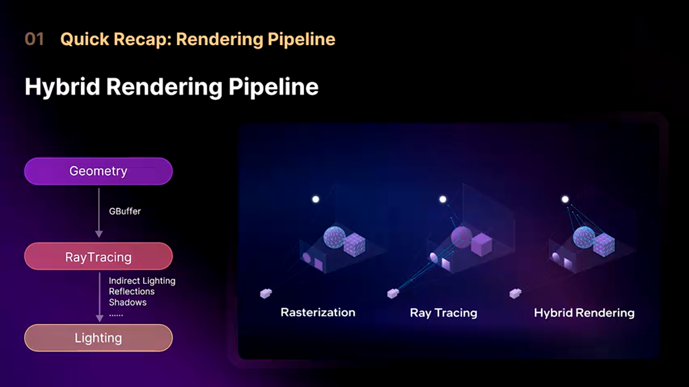

当今市面上大多数游戏采用的是 **混合渲染管线（Hybrid Rendering Pipeline）**：

1. **Geometry Pass（Base Pass）**：生成 GBuffer 和深度信息
2. **光追计算**：在物体表面发射光线，进行光线追踪计算
3. **获取间接信息**：得到间接光、反射、阴影等信息
4. **Lighting Pass**：结合光追结果进行最终光照计算

这种混合方式既能利用光栅化的高效性，又能获得光追带来的高质量间接光照效果。

---

## 三、光追效果实现：三大核心特性

### 3.1 光追反射（RT Reflection）


光追反射可以显著提升水面等反射表面的质量：
- 反射效果更加清晰、准确
- **屏幕外物体也能被反射**（这是传统 SSR 无法做到的）
- 能够正确反射复杂的场景几何


### 3.2 光追全局光照（RT Global Illumination）

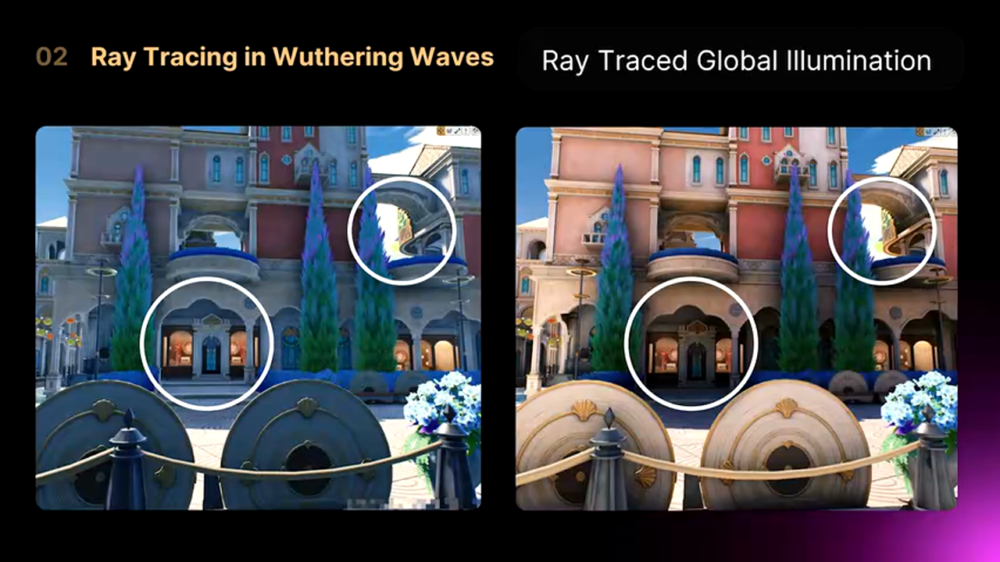

光追 GI 为场景补充了丰富的间接光信息：
- 增强场景的间接光照和遮蔽效果
- 让整个画面更有立体感
- 使场景具有环境一致的真实感

关键价值在于让场景的光照更加统一和谐，避免了传统烘焙光照的静态限制。

### 3.3 光追阴影（RT Shadow）

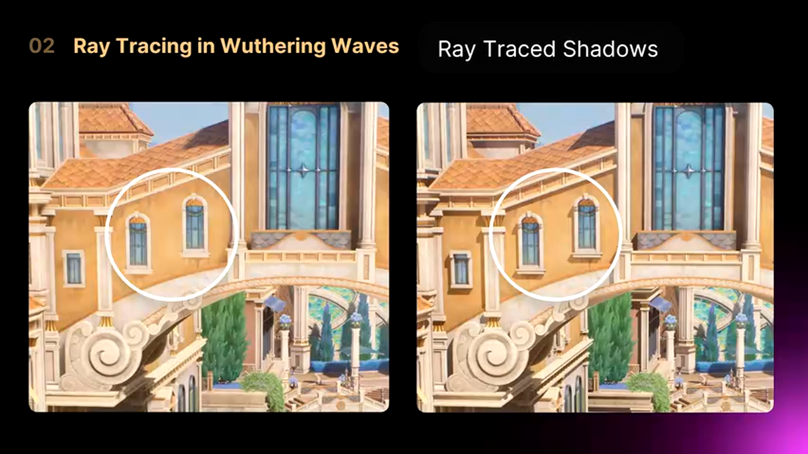

《鸣潮》的建筑采用了非常精细化的结构设计，但传统 CSM（Cascaded Shadow Map）的精度不足以覆盖这些细节。通过光追阴影，可以将这些精细结构的阴影完整展现出来。

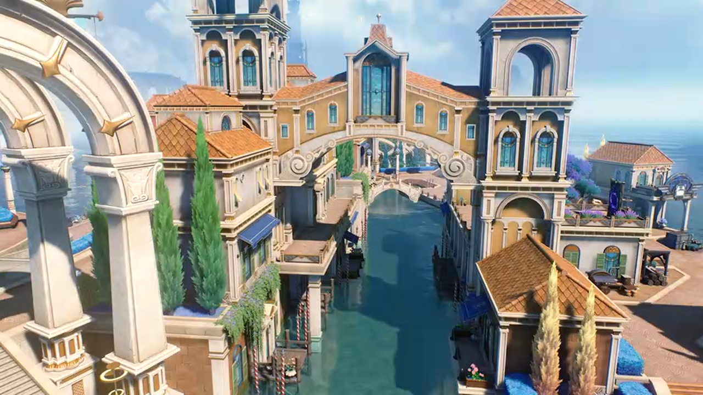

对比效果非常明显：关闭光追时，建筑细节的阴影完全丢失；开启光追后，所有细节都能正确投影。（wlxklyh:这里是用了求交来做的光追阴影？跟lumen没关系应该）

---

## 四、技术选型与快速验证

面对《鸣潮》的特殊需求，团队尝试了两种主流方案并进行了快速验证。

### 4.1 方案一：基于 ReSTIR 的路径追踪

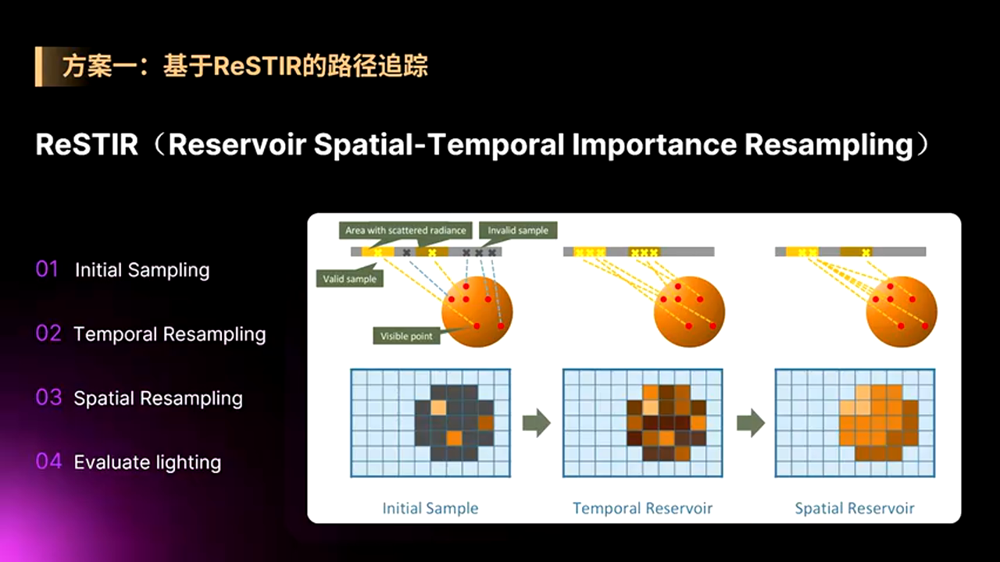

**ReSTIR（Reservoir-based Spatiotemporal Importance Resampling）** 是一种基于蓄水池算法的重要性采样技术，在时域和空域上都进行重要性采样。

**工作流程**：


1. 根据 GBuffer 和深度从物体表面发射光线，获取初始采样
2. 在时域和空域上进行重采样
3. 计算最终光照

**配套方案**：

为了实现完整的多次反弹效果，团队集成了两个 NVIDIA 库：

- **SHARC（Spatial Hash Radiance Cache）**：基于世界空间哈希的辐射度缓存系统，支持两次反弹

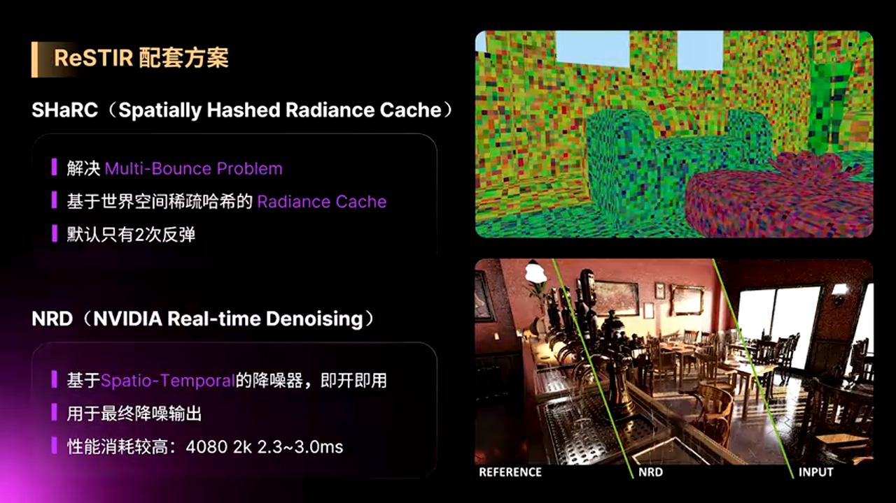

- **NRD（NVIDIA Real-time Denoiser）**：可开箱即用的降噪器，但性能开销较高（官方数据显示在 RTX 4080 2K 下需要 2-3ms）

**方案评估**：


> **方案优势**
> - ✅ 实现简单，有多个开箱即用的库
> - ✅ 光照结果准确
> - ✅ 如果光照稳定，闪烁较少
>
> **方案劣势**
> - ❌ Per-pixel 追踪导致远处/边缘/运动像素存在高频噪点
> - ❌ ReSTIR 算法天生带宽压力大（多次蓄水池读写）
> - ❌ 降噪器开销高
> - ❌ 综合性能较差
>
> **适用场景**：
> - 画质优先的离线渲染或高端设备
> - 场景相对静态、移动较少的应用

### 4.2 方案二：基于硬件光追的 Lumen


**Lumen** 是 UE5 中基于 Probe 的成熟 GI 方案，团队将其移植到了 UE4.26。

**核心思路**：

Lumen 使用 **Surface Cache（表面缓存）**机制：
- 将场景表面划分为多个 Cards
- 每个 Card 存储该表面的辐射度信息
- 在需要时从 Surface Cache 中采样，而不是每帧都追踪光线


这种空间换时间的策略大幅降低了光线追踪的开销。

**方案评估**：


> **方案优势**
> - ✅ 性能显著优于 ReSTIR
> - ✅ 画面稳定，闪烁少
> - ✅ 更适合开放世界动态场景
> - ✅ UE5 已验证的成熟方案
>
> **方案劣势**
> - ❌ 间接光精度相对较低
> - ❌ 部分场景可能出现漏光现象
>
> **适用场景**：
> - 开放世界游戏
> - 需要实时动态光照的项目
> - 性能受限的平台

### 4.3 最终选择：Lumen 混合方案

综合考虑项目需求，团队最终选择了基于 Lumen 的方案：
- **光追反射**：使用传统光追实现（wlxklyh:确实是跟lumen无关）
- **光追 GI**：使用 Lumen
- **光追阴影**：使用传统光追

这种混合策略在性能和画质之间取得了最佳平衡。

---

## 五、引擎集成：解决实际工程问题

将光追技术集成到 UE4.26 的《鸣潮》引擎中，团队遇到了诸多工程挑战。

### 5.1 灯光数量限制问题


**问题描述**：

UE4 原版限制参与光追计算的灯光为全局 256 盏。原因是在选择灯光进行采样时，需要遍历全场景的灯光重建 CDF（累积分布函数），灯光数量多起来时性能爆炸。

**解决方案**：

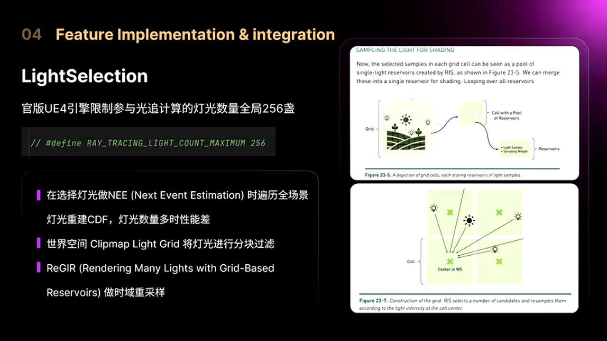

1. **世界空间分格子**：在世界空间划分网格（wlxklyh:UE5 也有light grid）
2. **Cluster Culling**：使用聚类剔除，将灯光提前过滤
3. **ReGIR 重要性采样**：参考 ReGIR（Real-time Global Illumination with Radiance Caching and Reservoir Resampling）论文，为每个格子进行适度的重采样

这样每一帧每个格子只有一盏灯光参与计算，大幅降低了开销。（wlxklyh:重点~！）

**性能对比**：


- 场景中放置 600 盏灯光
- UE4 原版方案：约 10ms
- 开启 ReGIR 后：消耗明显降低

### 5.2 卡通渲染适配：角色自阴影

**问题描述**：

二次元卡通渲染不希望角色有自阴影效果，会让角色外观变得过于写实，破坏卡通风格。

**传统解决方案**：

在光栅化管线中，我们分离了场景阴影和角色阴影：
- 场景走 CSM
- 角色走 Per-Object Shadow Map

角色采样时只采样 CSM，从而避免自阴影。

**光追适配方案**：

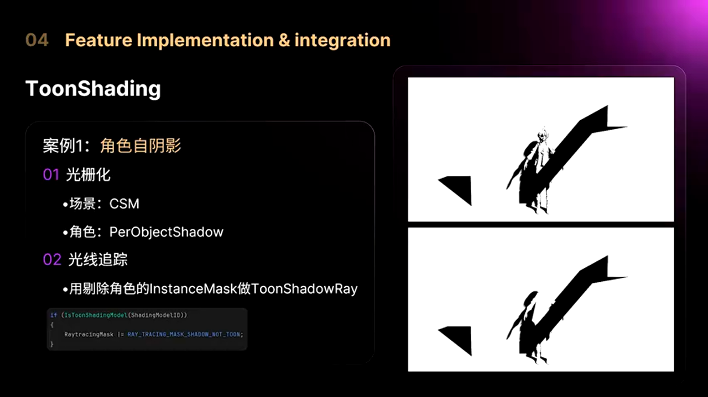

增加了一个 **Instance Mask**：
- Mask 包含所有投射阴影的场景物体
- 但不包括角色

在做阴影追踪时，如果 Shading Point 是角色，就使用这个 Instance Mask 进行追踪，从而避免角色对自己投射阴影。

```cpp
// [AI补充] 基于视频逻辑的伪代码示例
struct RayTracingShadowParams {
    uint InstanceMask;  // 实例掩码
};

// 角色阴影追踪
if (IsCharacter(ShadingPoint)) {
    // 使用特殊的 Instance Mask，排除角色自身
    Params.InstanceMask = SCENE_ONLY_MASK;
} else {
    // 普通场景物体使用全局 Mask
    Params.InstanceMask = DEFAULT_MASK;
}

TraceRay(/* ... */, Params.InstanceMask, /* ... */);
```

（wlxklyh:如下所示，补充说明 就是dxr的一个功能 求交可以屏蔽一些三角面）
### 技术细节

- Instance Mask 是硬件光追（DXR/Vulkan RT）的标准功能，可在 `TraceRay` 时传入
- 每个实例在构建加速结构（TLAS）时可设置一个掩码值
- 追踪时传入的 Mask 与实例的掩码进行按位与（AND），只有结果非零的实例才会参与相交测试


### 5.3 卡通渲染适配：角色 GI


**设计目标**：

让角色的渲染与场景氛围更加贴合，角色需要接受场景反射的间接光，提升通透感。

**风格化处理**：（wlxklyh:这个还挺有意思的）

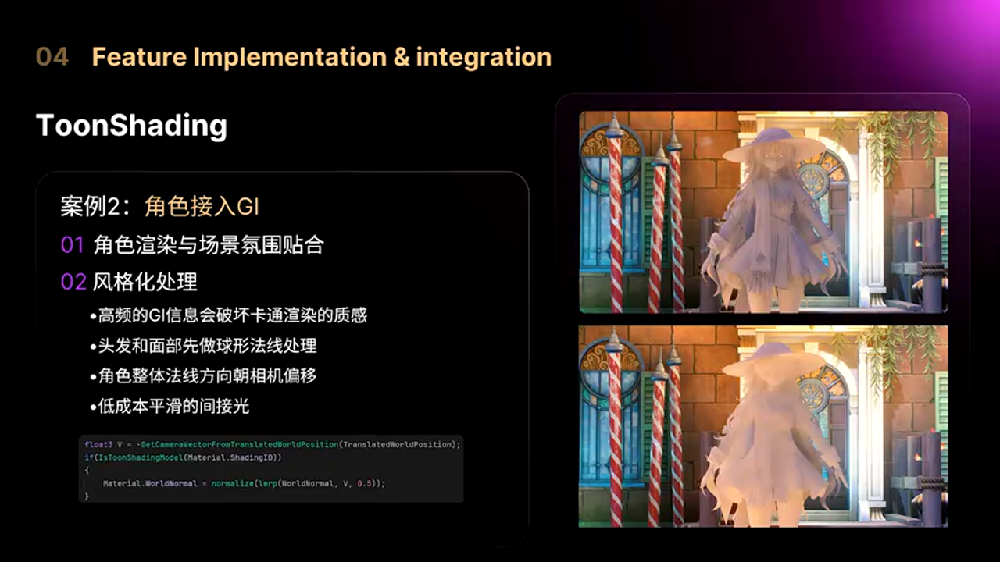

1. **法线修改**：
   - 对头发和面部做球形法线
   - 将角色整体法线往相机方向偏移
   - 实现较低频率、平滑的间接光效果

2. **颜色处理**：


因为卡通渲染在阴影区域不是全黑的，为了避免光照爆掉：
- 将间接光转为 HSV 颜色空间
- 限制饱和度（Saturation）和明度（Value）
- 叠加 AO 增加层次感

3. **皮肤特殊处理**：针对皮肤材质做了额外的颜色调整

```cpp
// [AI补充] GI 颜色处理逻辑
float3 ProcessGIForToon(float3 GIColor, float AO) {
    // 转换到 HSV 空间
    float3 HSV = RGBtoHSV(GIColor);

    // 限制饱和度和明度，防止过曝
    HSV.y = clamp(HSV.y, 0.0, MAX_SATURATION);  // 饱和度限制
    HSV.z = clamp(HSV.z, 0.0, MAX_VALUE);       // 明度限制

    float3 ClampedGI = HSVtoRGB(HSV);

    // 应用 AO 增加层次感
    return ClampedGI * AO;
}
```

### 5.4 卡通渲染适配：角色反射

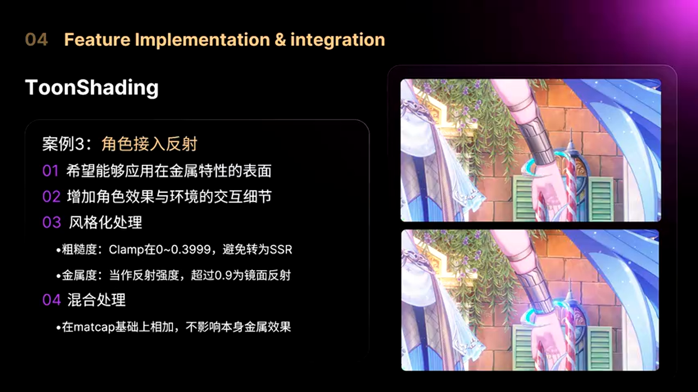

**设计目标**：

让反射应用在角色的金属表面（如武器、饰品），增加角色与环境的交互细节。

**风格化处理**：

1. **粗糙度 Clamp**：将粗糙度进行限制，避免过于写实的反射
2. **金属度作为反射强度**：不使用物理正确的金属度，而是作为反射强度参数
3. **阈值控制**：超过 0.9 的像素才进行反射

**混合策略**：

为了不影响原有的 MatCap 效果，直接将反射结果加到原来的 MatCap 上面。

```cpp
// [AI补充] 角色反射处理逻辑
float3 ProcessReflectionForToon(float3 BaseColor, float3 Reflection,
                                 float Roughness, float Metallic) {
    // Clamp 粗糙度
    Roughness = clamp(Roughness, MIN_ROUGHNESS, MAX_ROUGHNESS);

    // 金属度作为反射强度
    float ReflectionStrength = Metallic;

    // 只有高金属度区域才显示反射
    if (Metallic > 0.9) {
        // 直接叠加到 MatCap 上
        return BaseColor + Reflection * ReflectionStrength;
    }

    return BaseColor;
}
```

### 5.5 Billboard 和半透物体阴影

**问题描述**：

场景中有 Billboard 和半透物体需要投射阴影。在光栅化中可以通过静态分支控制 Shadow Pass 和 Base Pass 的物体剔除逻辑，但在光追中不行，因为 BVH 只有一份。

**解决方案**：


1. 保留这些物体的 ShadowMap 计算
2. 其他物体走光追阴影
3. 进行 **Tile Classify**：过滤掉完全在阴影下的 Tile，减少需要追踪的像素
4. 对剩余像素进行 Shadow Ray Tracing
5. 最后降噪后输出给 Lighting

### 5.6 单面 Plane 的光追阴影


**问题描述**：

美术经常使用单向的 Plane 来遮挡光照。但 ShadowMap 是从灯光方向往下渲染深度，而 Shadow Ray Tracing 是从物体表面往光源方向发射。如果都用背面剔除，逻辑就对不上，会造成漏光。

**解决方案**：

所有的 Shadow Ray 都做**前向剔除（Front Face Culling）**，从而适配原有的美术逻辑。

```cpp
// [AI补充] 光追阴影射线配置
RayDesc ShadowRay;
ShadowRay.Origin = ShadingPoint;
ShadowRay.Direction = LightDirection;
ShadowRay.TMin = 0.01;
ShadowRay.TMax = LightDistance;

// 使用前向剔除，适配单面 Plane
uint RayFlags = RAY_FLAG_CULL_FRONT_FACING_TRIANGLES;

TraceRay(/* ... */, RayFlags, /* ... */);
```

### 5.7 体积雾适配

**问题描述**：

UE4 的体积雾依赖 CSM。当开启光追阴影后，CSM 变得不完整，整个场景的体积雾就会爆掉。

**解决方案**：


参考 UE5 的做法：
1. 用一个 Shadow Ray 预生成 3D 的 **Shadow Volume**
2. 在阴影 Lighting 时，用这个 Shadow Volume 去判断体积雾的可见性
3. 可以通过前面提到的 Hybrid Shadow（混合阴影）做进一步优化，减少追踪的物体
4. 结合 Shadow Volume 和体积雾的精度需求，在低端机器上使用更低分辨率的 Volume 追踪
（wlxklyh:3D 体素网格（3D Texture），每个体素记录该位置是否在阴影中  每个体素去做ray 求交）

### 5.8 单层水体和半透材质


**问题描述**：

反射中需要看到单层水体（Single Layer Water）和半透物体。UE 的单层水体只能在 Lighting 之后渲染，因为它需要采样地下的颜色和深度。

**解决方案**：


在反射中击中单层水体时：
1. 多追踪一条光线去计算地下的颜色和深度
2. 模拟出散射效果

半透物体的处理类似：
1. 逐层发射光线
2. 手动进行混合（Blend）

**性能警告**：这个操作对性能消耗非常大，需要特别注意使用范围。


可以看到，水体是单层水体，瀑布是半透，都能正确反射出来。

### 5.9 复杂天空盒反射


**问题描述**：

《鸣潮》的天空盒非常好看但也非常复杂，如右图所示有好几层云层效果。我们希望在反射中也能看到这个精美的天空。

**解决方案**：


在 Miss Shader 或者 T 值足够远时，判断为击中天空：
1. 进行 3 到 4 次的光线遍历
2. 手动混合（Blend）各层天空  （wlxklyh:这个怎么混合的？？）
3. 反射出完整的天空效果

**性能问题**：此时性能已经爆炸，引出了后续的性能优化工作。

---

## 六、性能优化：GPU 端

### 6.1 天空盒烘焙优化

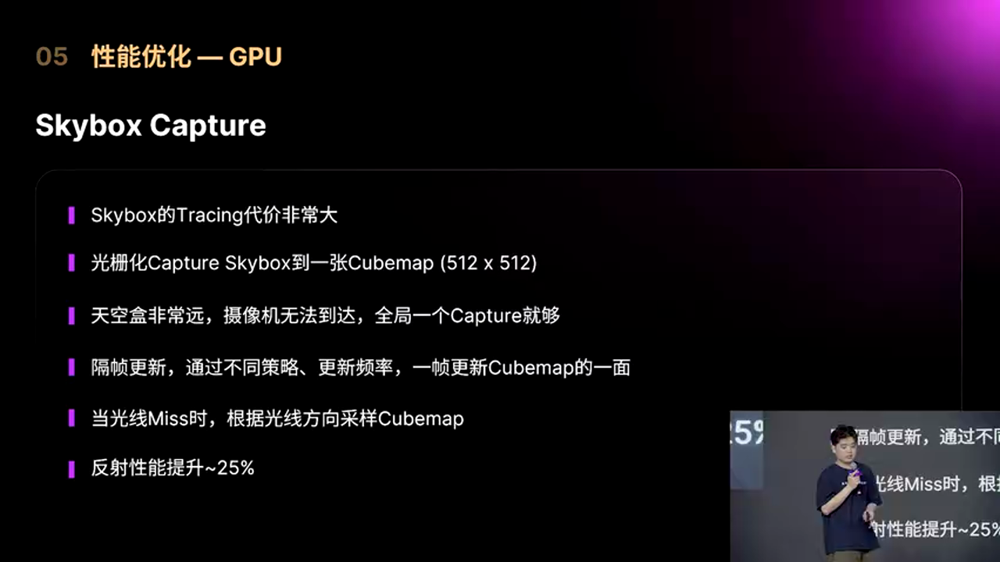

**优化思路**：

既然天空盒这么复杂，能不能把它烘焙起来？

**实现方案**：
1. 使用光栅化将天空盒烘焙到一张 CubeMap
2. 因为天空盒非常远，视差几乎为零，所以全局只需要一个 Capture 就够了
3. 可以根据策略分帧更新（如每隔几秒更新一次）
4. 当光线 Miss 时，根据光线方向采样这个 CubeMap

**性能提升**：

完成这个优化后，反射性能直接提升了 **25%**。

### 6.2 Payload 压缩优化

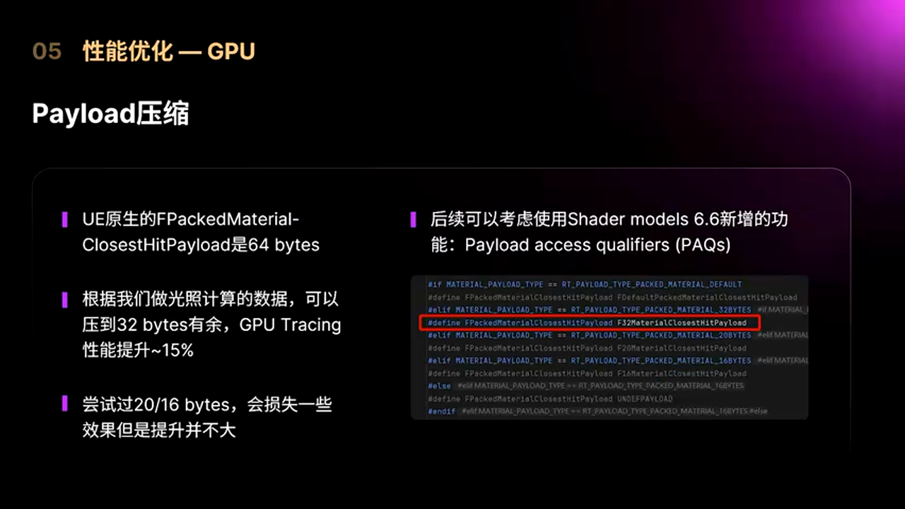

**原理说明**：

Payload 是光线携带的数据，类似于一个"信使"，可以在各个 Shader 之间传递信息。Payload 越小，追踪的代价越低。

**优化过程**：

- UE4 原生的 Payload：64 字节
- 分析光照计算实际需要的数据后压缩到：**32 字节**
- 画面质量无损失
- 尝试过压到 20 或 16 字节，但会损失效果且性能提升有限

**性能提升**：

压缩到 32 字节后，GPU 整体追踪性能直接提升了 **15%**。

```cpp
// [AI补充] Payload 结构示例
struct RayPayload_Optimized {
    float3 Color;           // 12 bytes - 颜色
    float HitT;             // 4 bytes - 命中距离
    float3 WorldNormal;     // 12 bytes - 世界空间法线
    uint PackedData;        // 4 bytes - 打包的材质 ID 等信息
    // 总计 32 bytes
};

// 原始 64 字节版本会包含更多冗余信息
struct RayPayload_Original {
    float3 Color;           // 12 bytes
    float HitT;             // 4 bytes
    float3 WorldNormal;     // 12 bytes
    float3 WorldPosition;   // 12 bytes
    float3 Tangent;         // 12 bytes
    float Roughness;        // 4 bytes
    float Metallic;         // 4 bytes
    uint MaterialID;        // 4 bytes
    // 总计 64 bytes
};
```

### 6.3 材质简化优化


**优化思路**：

光追中的 GI 和反射不需要做完整的光栅化材质计算，尤其是 GI 可以更加简化。

**实现方案**：

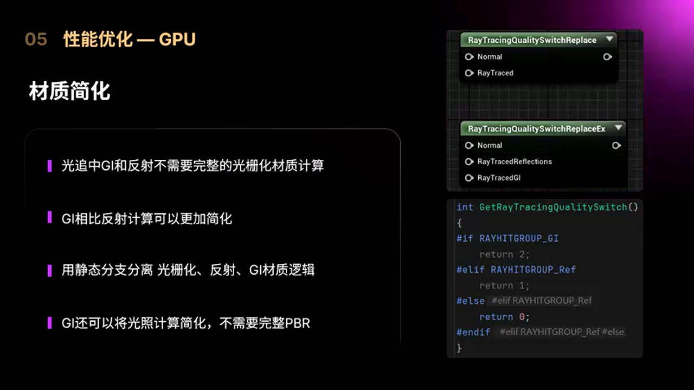

1. UE4 本来就有分离了光栅化和光追的材质节点
2. 在此基础上将 GI 和反射也分离出来计算
3. 为 GI 分支做更激进的简化
4. GI 甚至可以不走完整的 PBR，使用简化的光照模型

**收益**：

减少了 Shader 复杂度，降低了寄存器压力和带宽消耗。

### 6.4 NVIDIA 硬件特性（wlxklyh:可以借鉴）

团队还使用了两个 NVIDIA 独占的硬件特性：


**OMM（Opacity Micro-Map）**：

- 光追中做 Alpha Test 需要在 Any Hit Shader 中计算
- OMM 可以将三角形的可见性状态烘焙到 BLAS（Bottom-Level Acceleration Structure）中
- 只有黄色的三角形才需要走 Any Hit Shader
- 在树木很多的场景中可以大幅减少 Any Hit Shader 调用

**SER（Shader Execution Reordering）**：


- 在底层做一次 Shader 的执行重排序
- 解决 GPU 计算的 Divergence（分歧）问题
- 尤其对 GI 计算效果显著

这两个功能都已进入 DirectX 12.2 标准，希望其他厂商也能早日跟进。

---

## 七、性能优化：CPU 端

在完成 GPU 优化后，团队发现项目瓶颈转移到了 CPU。

### 7.1 CPU 性能分析

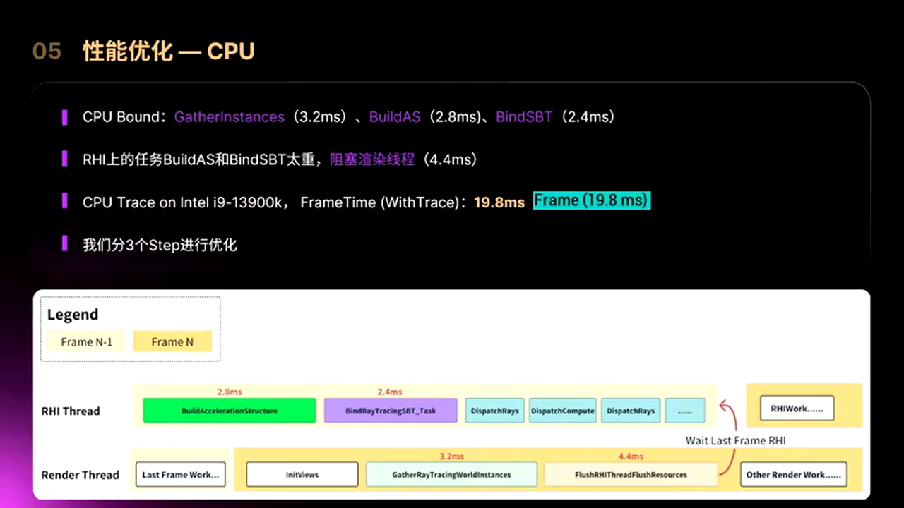

通过 NVIDIA Nsight 分析发现，几个任务非常重：
- **Galaxy Instance**：收集需要参与光追的实例
- **构建加速结构**
- **绑定 SBT（Shader Binding Table）**

光追的任务台还会阻塞渲染线程，导致帧时间来到 20ms 左右，不得不优化。

### 7.2 优化阶段一：Culling 和数据复用

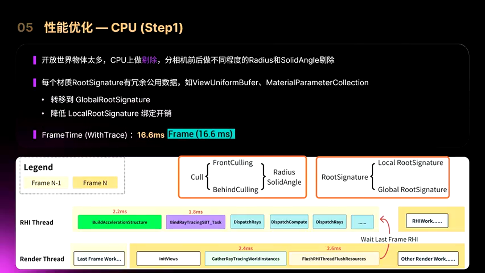

**问题分析**：

因为是开放世界游戏，需要加入光追实例的东西实在太多。

**解决方案**：

1. **CPU 端 Culling**：
   - 针对相机前后做不同程度的半径和立体角剔除
   - 大幅减少需要处理的实例数量

2. **Global 描述符表**：
   - 发现每个材质的 Root Descriptor 上有大量重复的公共数据（如 View Uniform Buffer）
   - 将这些数据放在一个 Global Root Descriptor 表里
   - 降低每个材质的绑定开销

**性能提升**：

完成后帧时间从 20ms 降到 **16.6ms（60 FPS）**。

### 7.3 优化阶段二：任务前移


**Galaxy Instance 优化**：

分析发现这个任务可以放到渲染 View 之前：
1. 依赖的任务完成后马上开始做
2. 分发到 Task 线程执行，不阻塞渲染线程

**加速结构构建优化**：


构建加速结构需要做两件事：
1. 填充底层加速结构（BLAS）
2. 构建动态物体的 BLAS 和整个场景的 TLAS（Top-Level Acceleration Structure）

优化方案：
- 静态物体的 BLAS 在加载时就已构建好
- 拆出一个 **Pre-Build AS** 任务
- 放到 Galaxy Instance 之后（已前移到渲染 View 前）
- 马上开始填充静态物体的所有数据和动态物体除 BLAS 之外的数据
- 原任务只需构建和填充动态物体的 BLAS 以及构建 TLAS

**性能提升**：

完成后帧时间降到 **14.5ms**。

### 7.4 优化阶段三：SBT 绑定优化

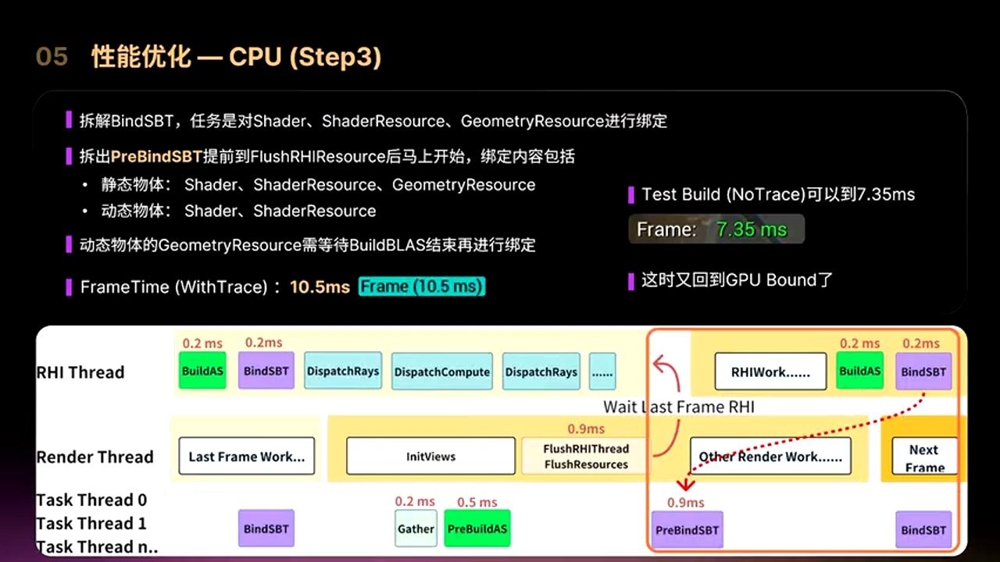

**SBT 绑定任务分析**：

需要绑定 Hit Group Shader 和 Geometry 描述符。

**优化方案**：

同样拆出一个 **Pre-Bind SBT** 任务：
1. 提前到 Flush Shared Resources 之后马上开始
2. 绑定静态物体的所有内容
3. 绑定动态物体除 Geometry 描述符之外的所有内容
4. 原任务只需绑定动态物体的 Geometry 描述符（需要等 BLAS 构建完成）

**性能提升**：

- 开启 DLSS：帧时间降到 **10.5ms**
- 关闭 DLSS 在 TestBed 下：帧时间 **7.35ms**

此时项目重新回到 **GPU Bound**。


---

## 八、总结与未来展望

### 8.1 项目成果总结


本项目成功实现了以下目标：

1. **快速验证**：评估了 ReSTIR 和 Lumen 两种方案
2. **技术选型**：选择了更适合开放世界动态场景的混合方案
3. **功能实现**：通过光追实现了反射、GI、阴影三个核心特性
4. **工程集成**：解决了集成到 UE4.26 和卡通渲染管线中遇到的各种问题
5. **性能优化**：在 GPU 和 CPU 上都做了深度优化
6. **目标达成**：在 RTX 4060 2K 设备上达到 60 FPS

### 8.2 未来工作计划

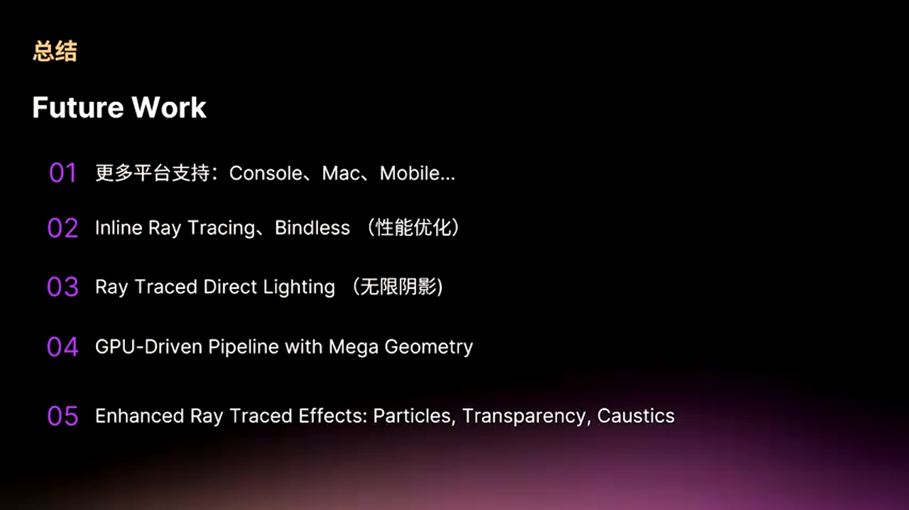

**平台扩展**：
- 在更多平台上支持光追（主机、Mac、移动端等）

**性能优化**：
- Inline Ray Tracing
- Bindless 资源管理

**新功能开发**：
- 光追直接光（实现无限阴影）
- GPU 驱动的 Pipeline（正在开发中）
- Mega Geometry 技术探索
- 更多光追效果（粒子、半透、焦散等）

---

## 九、实战避坑指南

基于整个项目的实践经验，总结以下关键经验：

> **技术选型建议**
>
> - 对于开放世界动态场景，基于 Spatial Cache 的方案（如 Lumen）优于 Per-pixel 方案（如 ReSTIR）
> - 路径追踪方案更适合静态场景或离线渲染
> - 混合渲染管线是当前最实用的选择

> **风格化渲染适配**
>
> - 不要直接套用 PBR 光追方案，需要针对美术风格做大量定制
> - 使用 Instance Mask 等机制实现精细的渲染分组控制
> - 法线、颜色空间转换是实现风格化的关键技术

> **性能优化要点**
>
> - Payload 大小对性能影响巨大，务必压缩
> - 天空盒等远景元素可以预烘焙
> - CPU 端任务调度优化空间很大，可以通过任务前移和并行化大幅提升
> - 善用硬件特性（OMM、SER 等）

> **工程实践建议**
>
> - 开放世界项目的 Instance 数量巨大，Culling 是必选项
> - 分离 GI 和反射的材质计算，避免过度计算
> - Billboard 和半透物体需要混合光栅化和光追阴影
> - 体积雾等依赖 CSM 的特性需要特殊处理

---

**致谢**：

感谢库洛游戏《鸣潮》项目组的全体同事，正是团队的协作才成就了这次技术突破。

如果您对虚幻引擎的光追技术感兴趣，或者正在开发类似的开放世界项目，欢迎加入文首的 **UE5 技术交流群**，与更多开发者交流实战经验。

---

*本文基于 UFSH2025 技术分享整理，由 AI 辅助生成。*

🤖 Generated with [Claude Code](https://claude.com/claude-code)
