# AI驱动的UE游戏原型开发全流程：从创意到可玩Demo的认知驱动型工作流

---

## 加入 UE5 技术交流群

如果您对虚幻引擎5的图形渲染技术感兴趣，欢迎加入我们的 **UE5 技术交流群**！

扫描上方二维码添加个人微信 **wlxklyh**，备注"UE5技术交流"，我会拉您进群。

在技术交流群中，您可以：
- 与其他UE开发者交流渲染技术经验
- 获取最新的GDC技术分享和解读
- 讨论图形编程、性能优化、构建工具流、动画系统等话题
- 分享引擎架构、基建工具等项目经验和技术难题

---

**源视频信息**：[UFSH2025]AI赋能UE游戏原型制作全流程 | 杨梦舟 虚幻社区
**视频链接**：https://www.bilibili.com/video/BV1eF2NBDEra
**说明**：本文由AI辅助生成，基于视频内容整理

---

> **核心观点**
> - AI时代真正稀缺的不是内容，而是独特的个人**品味**与清晰的**创作意图**
> - 开发者的角色正从"执行者"转变为"决策者"，AI成为了开发团队，我们成为了产品制作人
> - 认知驱动型工作流：通过AI扩展认知 → 形成精准意图 → 生成优质选项 → 品味筛选 → UE整合 → 螺旋式迭代上升
>
> **前置知识**：虚幻引擎基础操作、蓝图开发基础、对AIGC工具有基本了解

---

## 一、背景与痛点：AI崛起时代的开发者定位

我们正处在一个AI崛起的时代，技术的浪潮正以前所未有的方式冲击着游戏开发。这迫使我们思考一个根本性问题：**当AI能胜任越来越多的技术性工作时，作为开发者，不可替代的核心价值是什么？**

答案是两个词：**品味**与**意图**。

要建立以品味与意图为核心的创作模式，就需要一套清晰的行动框架：

1. **思想的转变**：重新定义人与AI的协作关系
2. **理想的平台**：选择合适的创作载体
3. **落地的实践**：认知驱动型工作流

---

## 二、核心理念：人与AI的协作关系重塑

### 2.1 角色定位的根本转变

需要重新梳理人与AI的关系：

> **AI是生成选项的工具，它缺乏灵魂。人类则凭借创作意图与审美品味作出决策，为作品注入灵魂。由此，我们从执行者转变为决策者。**

### 2.2 为什么选择UE作为创作平台

在这一新定位下，**虚幻引擎(UE)** 成为了理想的创作载体：

- **高品质实时渲染**：即时呈现视觉效果
- **灵活的蓝图系统**：能够快速验证玩法
- **强大的整合平台**：将经过筛选的创意元素完美融合，创造出体验统一的高品质作品

---

## 三、认知驱动型工作流：持续加速的创作闭环

### 3.1 工作流核心循环

这套工作流形成了持续加速的创作闭环：

1. **通过AI扩展认知**：形成精准的意图
2. **以此生成优质选项**：AI批量产出候选方案
3. **凭借品味筛选精华**：人类决策者进行选择
4. **在UE中快速整合**：形成可玩原型
5. **推动新一轮认知升级**：实现螺旋式迭代上升

### 3.2 实战验证

为验证这套方法的可行性，演讲者利用业余时间在**一个月内独立完成**了一个游戏原型——使用多种AI工具结合虚幻引擎生成的宣传片和可玩Demo。

---

## 四、策划阶段：AI作为策划助理

### 4.1 从创意到策划案

项目的第一步是策划。将AI当作策划助理，给它一个明确的提示：

> 构思一款**轨道光枪射击游戏**，设定在灾后的空间站，玩家扮演复苏的战斗系统，帮助主角范围防御。

通过激活大语言模型：
1. 生成初步的创意和大纲
2. 扩展成详细的策划案
3. 把核心体验聚焦在**连接感**和**幽闭探索感**上

### 4.2 策划案的验证技巧

文字方案还是有点冰冷。为了真正感受设计，可以直接让AI把方案变成一期**播客**：

> 带上耳机以第三方视角聆听自己的游戏设计。这种抽离感帮助能够捕捉到更多的亮点和潜在的问题，确保项目不偏离初衷。

### 4.3 策划案作为统一的创作文件

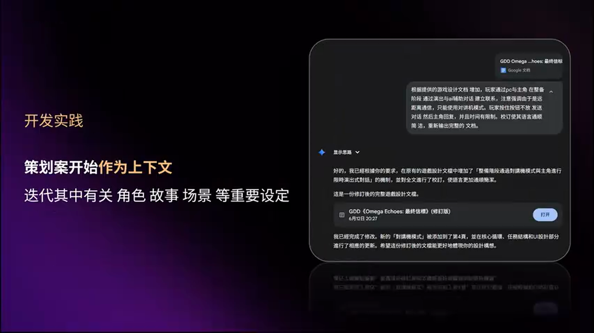

**关键实践**：建议将策划案作为统一的创作文件，之后每次调用大语言模型时，都把它和提示词一起提交。这样便于提取角色、故事场景等核心设定，为后续迭代奠定基础。

所有的设计都应该围绕策划案展开，确保：
- **项目统一**：始终保持风格
- **信息同步**：各模块协调一致

---

## 五、2D资产生成阶段

### 5.1 美术风格确立

通过**DeepSeek**撰写文生图提示词，高质量地生成多个方案，并进行选用，完成创意决策，确立美术风格，制作情绪版。

接着使用**Midjourney**与**ChatGPT**，以文生图和图生图的方式，生成大量**赛博朋克复古未来风格**的概念图，为后续资产制作提供明确的视觉依据。

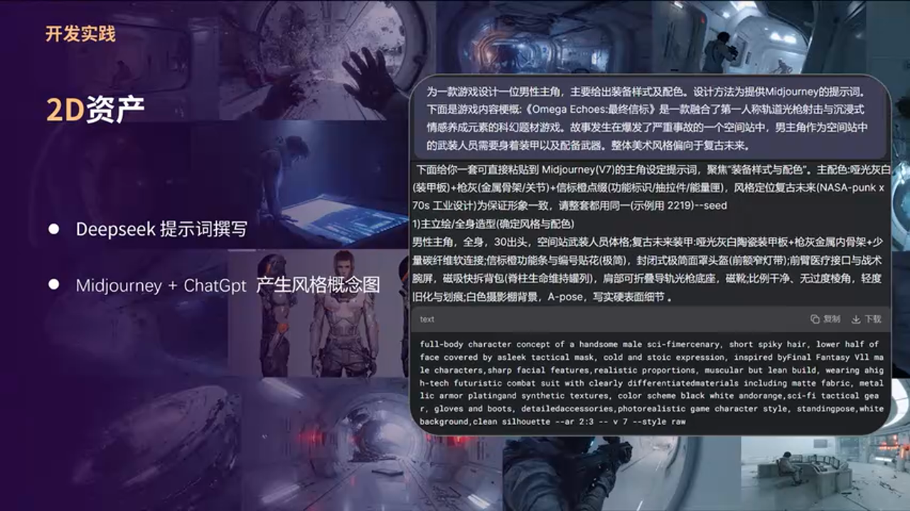

### 5.2 角色设定图生成

基于选定的提示词生成角色的设定图。由于AI的结果通常是无法直接使用的，需要接着使用ChatGPT与ComfyUI进行图生图的精细化调整。

最终输出涵盖角色和舆外的基础设定，确保视觉风格统一。

---

## 六、角色制作环节

### 6.1 3D角色制作流程

目标是设计一个贴合故事背景的角色。

具体步骤：
1. 先参考已有的2D概念图
2. 在**Character Creator (CC)** 中创作3D模型
3. 通过插件快速导入UE
4. 最后调整模型姿势，生成静态的分镜图

### 6.2 CC中的角色塑造

参考2D概念图在CC中接入体型资产，配合混合变形塑造基础体型。但面部与预期效果存在差距（这个软件的面部比较老），此时通过官方插件一键传递到**ZBrush**中进行调整，最后返回CC。

### 6.3 服装资产调整

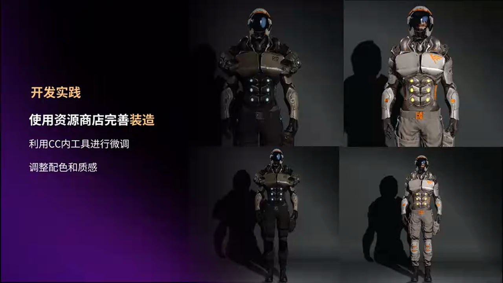

素体确定后，根据设定在资源商店挑选接近的服装资产：
- 左侧是原始的资产装备，与设定存在差异
- 右侧是经过调整材质以及造型后的效果，更接近设定

这些操作都是在CC中直接完成的，比较简单傻瓜化。

### 6.4 怪物和武器装备制作

同样的工作流也适用于怪物和武器装备。通过之前的2D流程生成所需的概念设计，最后使用**Tripo**（一款AI 3D模型生成工具）参考2D图像生成3D模型，再导入CC进行绑定。

### 6.5 AI 3D生成工具的应用

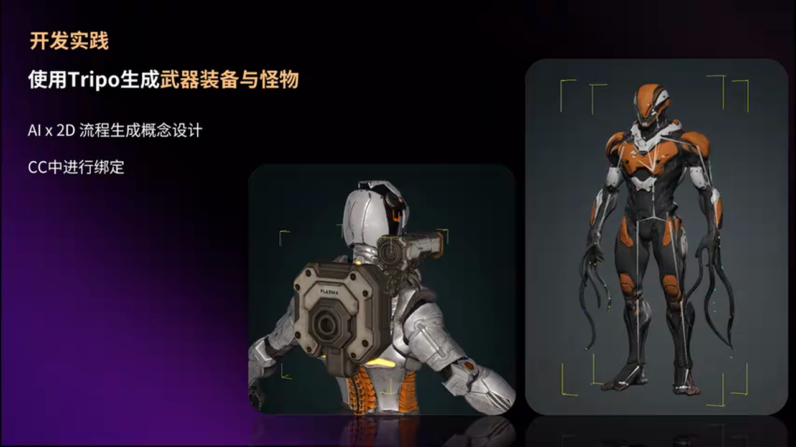

现在已经有不少AI 3D生成工具可以尝试，能极大地提升游戏原型的制作效率。展示的是已经完成绑定的装备和怪物模型——这些都是直接生成的，没有一刀未动。

### 6.6 Tripo工具使用技巧

Tripo内置了智能拆分、重拓扑、纹理生成、一键绑骨等功能。

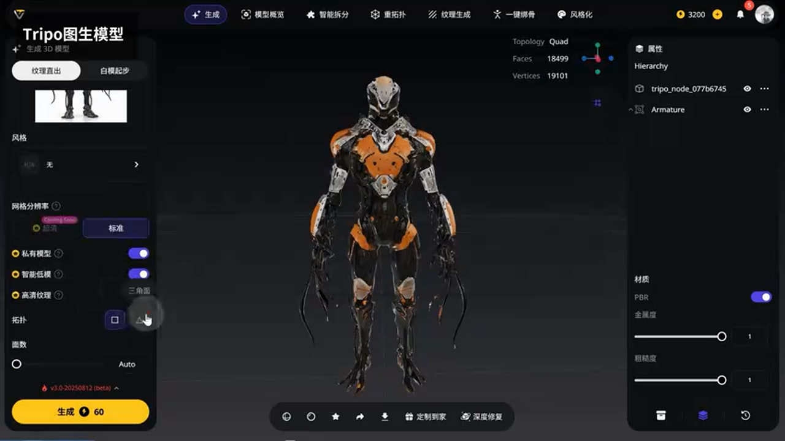

**实用技巧**：
- 在创建前建议开启设置"创建四边面"
- 输出后利用重拓扑功能重新拓扑，这样绑定后效果比较好
- 可以直接输出包含材质贴图的FBX格式模型

### 6.7 CC中的绑定流程

在CC中绑定角色的流程：
1. 先简单地对齐坐标
2. 参考体型调整尺寸
3. 根据关键点快速生成骨骼
4. 绑定后仍然可以灵活调整顶点造型和骨骼权重
5. 最后直接导出，它自带有内置的UE输出模板

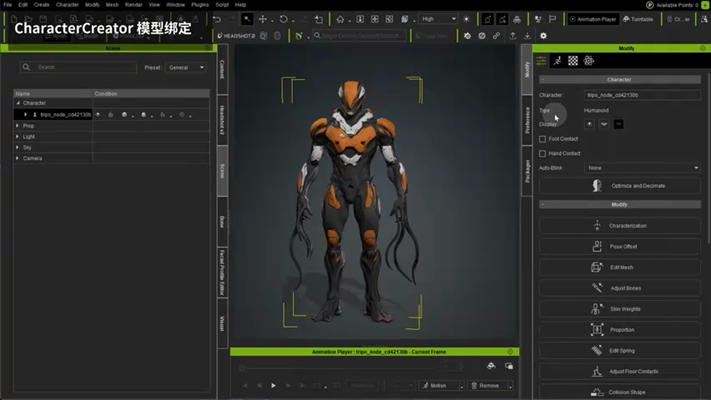

这也是为什么CC很好用的原因。

---

## 七、导入UE的推荐插件

### 7.1 必备插件推荐

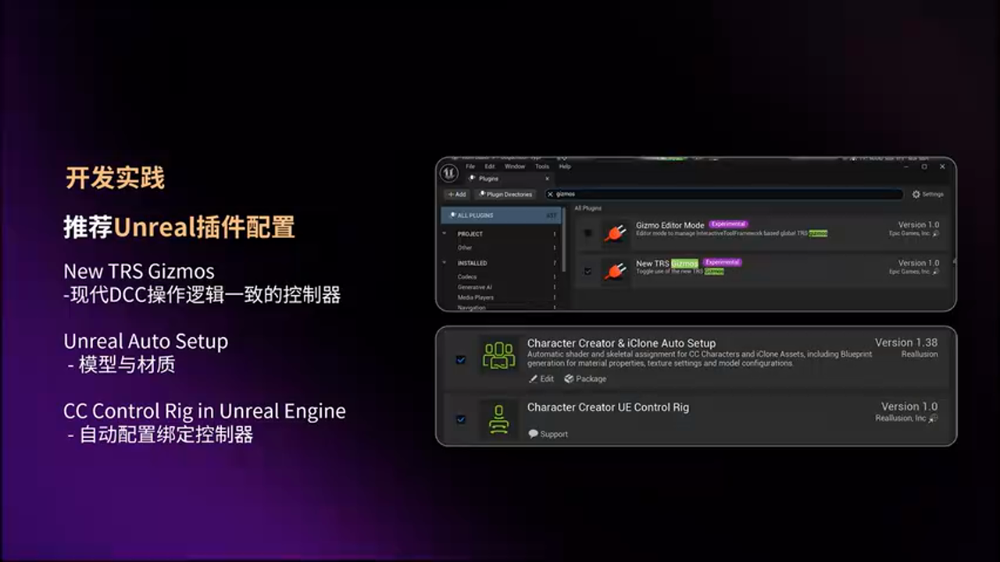

在将3D模型导入到UE前，推荐先安装几个实用的插件：

1. **新的控制冰组件**：提供了主流DCC软件一致的操作感，用起来更顺手（估计后期会变成UE默认）

2. **官方两款插件**：
   - 可以自动配置DCC导入的模型与材质
   - 能一键完成Control Rig的配置
   - 大幅提升制作效率

### 7.2 导入设置要点

导入时的要点：要把"地零征作为参考姿势"的选项开启，再一键配置好材质。

配置Control Rig之后，直接在引擎里可以征或者调整动作，然后输出静帧就可以。

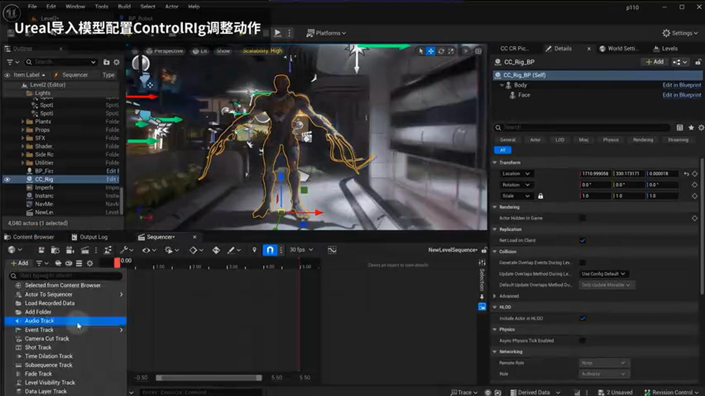

这个过程挺享受的。

---

## 八、场景氛围资产

对于场景氛围资产，主要利用了**FAB商店**，参考策划案和概念设计，找到所需风格的资产。

**推荐**：有一个后处理插件对还原这种先时代画面风格的效果很有帮助。

---

## 九、概念氛围视频制作

### 9.1 完整制作流程

概念氛围视频是原型阶段的重要展示。

完整的流程包括：
1. 先写文字分镜，确定镜头内容
2. 接着在UE中制作静态画面
3. 结合文字与静帧，再利用AI工具用图生视频的方式生成动态片段
4. 最后添加音效与音乐

### 9.2 文字分镜生成

通过**DeepSeek**生成的文字分镜，其中描述了每个镜头的场景、动作和大致时长。基于这个分镜内容，在UE中进行部分调整角色动作和镜头位置。

### 9.3 运镜术语库的重要性

为了能让AI精准理解意图，需要准备一份专业的**运镜术语库**和**表情提示库**。

**关键技巧**：避免文学化的描述。比如将"心如死灰的眼神"转化为视觉特征——"瞳孔收缩，下眼睛轻微抽动"，能让AI能够准确理解意图。

### 9.4 静态分镜图生成

参考上面的步骤，生成批量所需片段的所有静态画面。注意这里的画面都是静态的。

### 9.5 AI视频生成

有了分镜图后，使用**即梦**进行视频生成。传入画面和提示词，系统会基于分镜和语言描述自动生成表演动画。

该流程极大降低了制作门槛，即使不熟悉动画和运镜，也能够产出符合预期的片段。也就是说只需要调Pose就可以，不需要手K动画。

### 9.6 角色一致性挑战

当前AI视频生成仍面临**角色一致性**的挑战。同一个角色在不同镜头中容易出现形象波动。

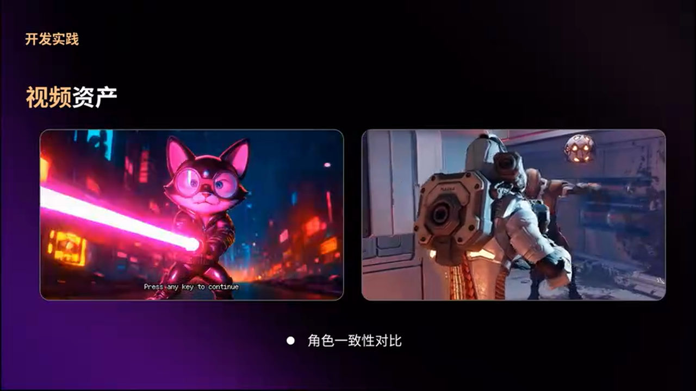

导致这一问题的根本原因是由于引导图中的角色形象本身就难以统一。

**解决方案**：使用UE渲染的高质量画面作为引导图，能有效确保角色与环境在多个镜头中保持高度统一。

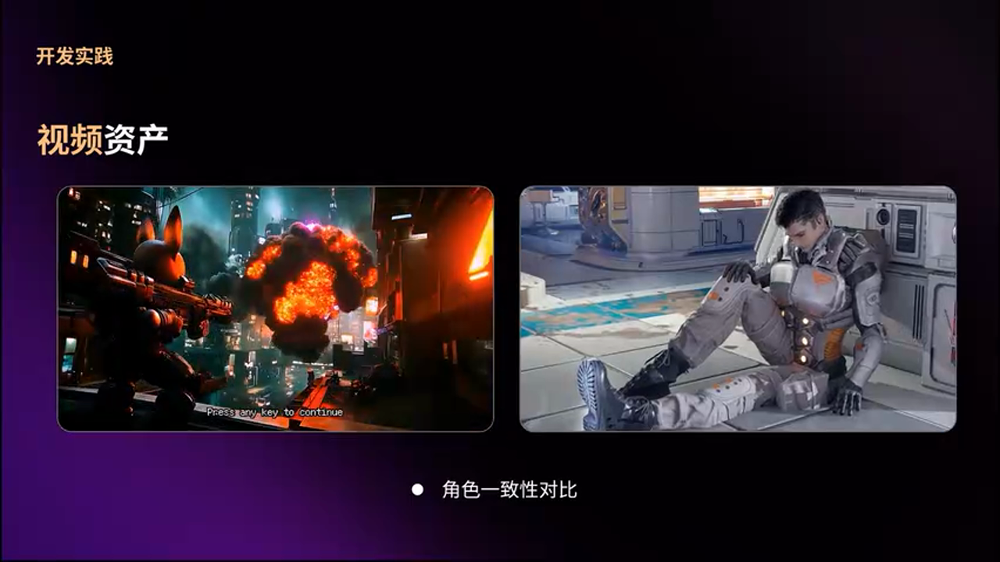

左侧是未能使用统一的引导图中角色形象生成的视频片段，可以看到他们的一致性是有很大问题的。

---

## 十、音频制作

### 10.1 BGM生成

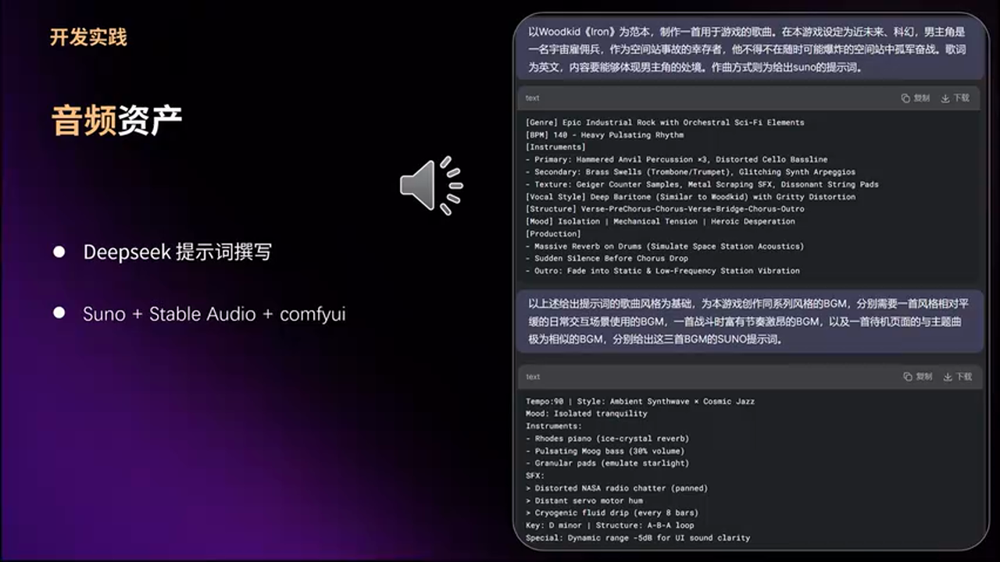

音频部分使用了**Suno**。流程上主要是：
1. 先挑选符合项目氛围的参考曲
2. 通过DeepSeek生成精准的提示词
3. 确定主题曲后，可以基于曲调批量生成系列BGM
4. 快速满足在各环节中的需求，实现高效统一的音频产出

通过这个流程也可以给项目定调、找感觉，而且质量还挺不错的。

### 10.2 Suno的进阶功能

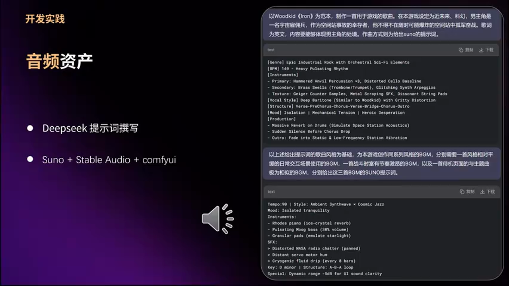

Suno最新的功能也支持把一首带人声的曲子分离为伴奏与人声，然后也可以直接使用伴奏的部分，这个也是挺方便的。

### 10.3 音效生成

音效方面，使用基于**ComfyUI**自带的音频相关工作流模板，可以通过提示词或者视频生成音效。直接使用就可以生成为游戏项目里要用到的音效。

### 10.4 最终剪辑

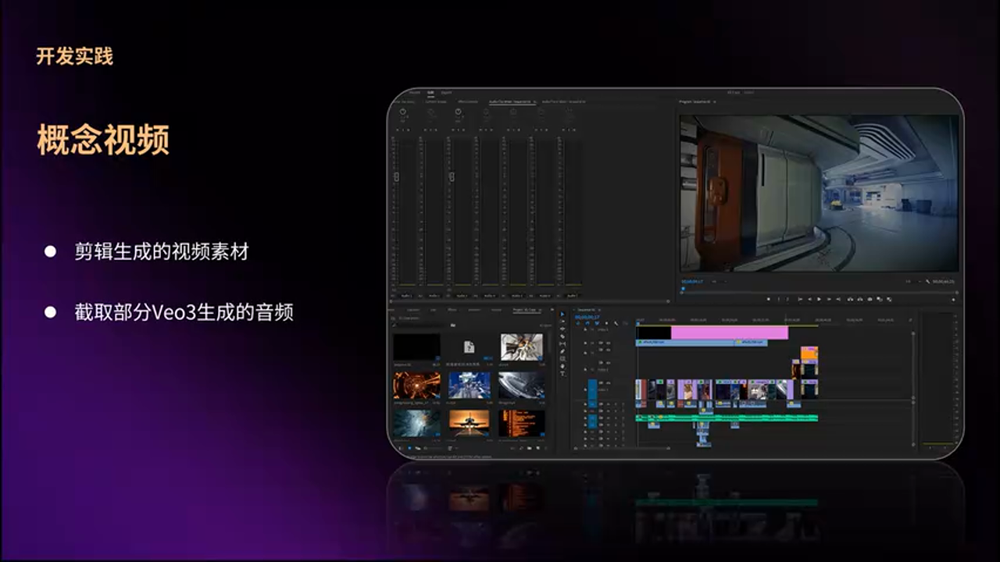

最后将所有AI生成的视频与音频素材结合，导入软件进行剪辑、调色和混音，就可以整合成一段完整的视频。

---

## 十一、游戏原型开发阶段

### 11.1 项目管理规范

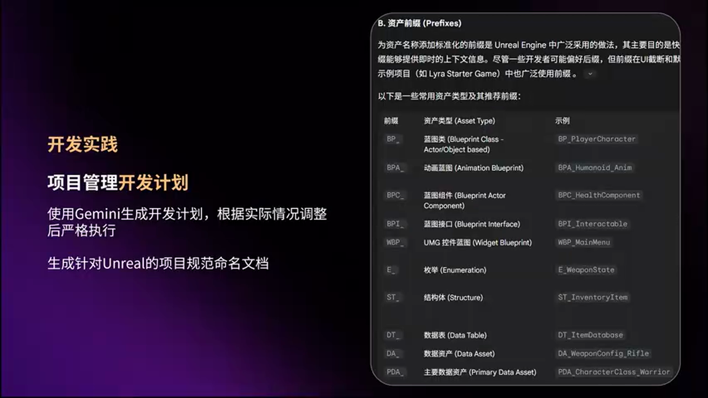

现在进入游戏原型的开发阶段，规范的项目管理非常非常重要。

使用**Gemini**生成初步的开发计划作为参考，还生成了一份UE项目的标准资产命名规范文档。推荐大家可以去感受一下，它生成的真的挺标准的。

### 11.2 版本控制的重要性

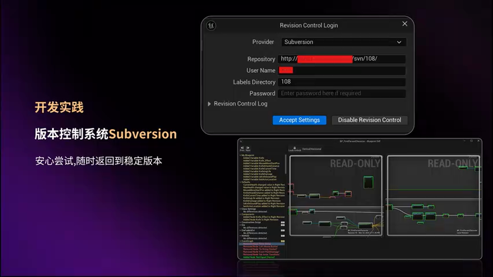

**开发中的强烈建议**：务必使用版本控制系统，例如**SVN**。无论是自建服务器还是选用云端服务，它都让你放心尝试各种想法，因为你知道随时可以退回到稳定的版本。这带来了充分的自由度和安全感。

---

## 十二、游戏原型演示

### 12.1 两个核心场景

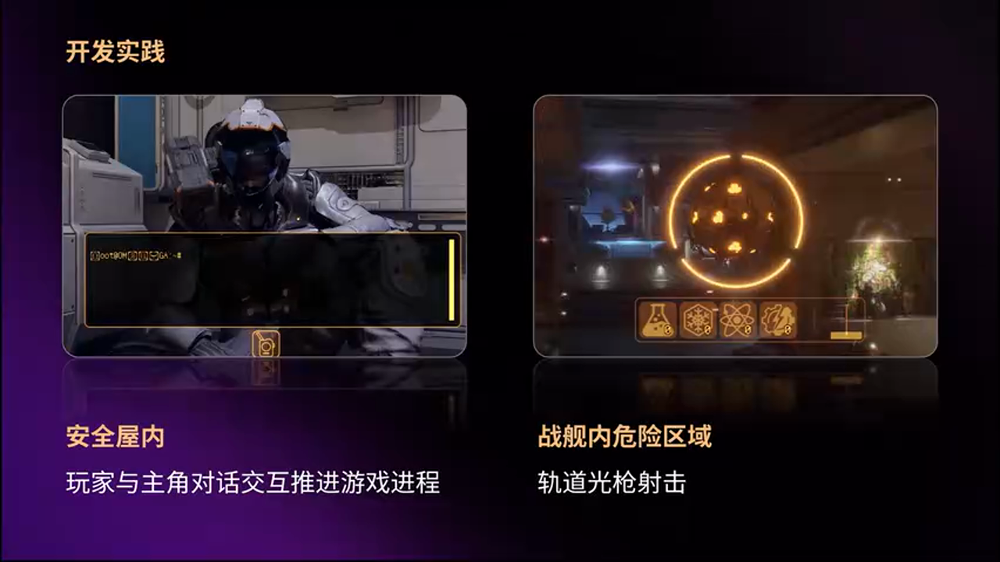

游戏主要分为两个核心场景：
1. **安全屋内**：玩家通过对话框与主角进行交互，推进核心剧情
2. **战舰的危险区内**：玩家进入轨道光枪射击的模式进行战斗

### 12.2 自由对话模式

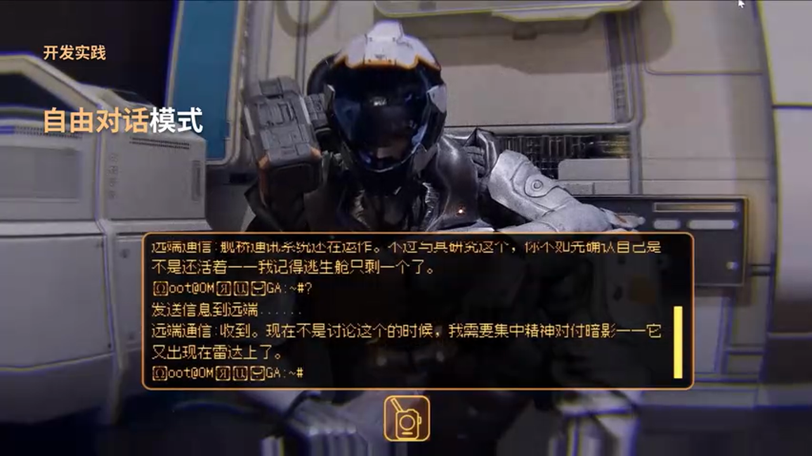

这是自由对话模式，可以通过语音或者文字与角色自由对话。整体是仿照对讲机的逻辑，背后也是用大语言模型驱动，生成符合角色设定的情景和回复。

这里的BGM也是由刚才Suno的流程来生成的。

### 12.3 引导式对话模式

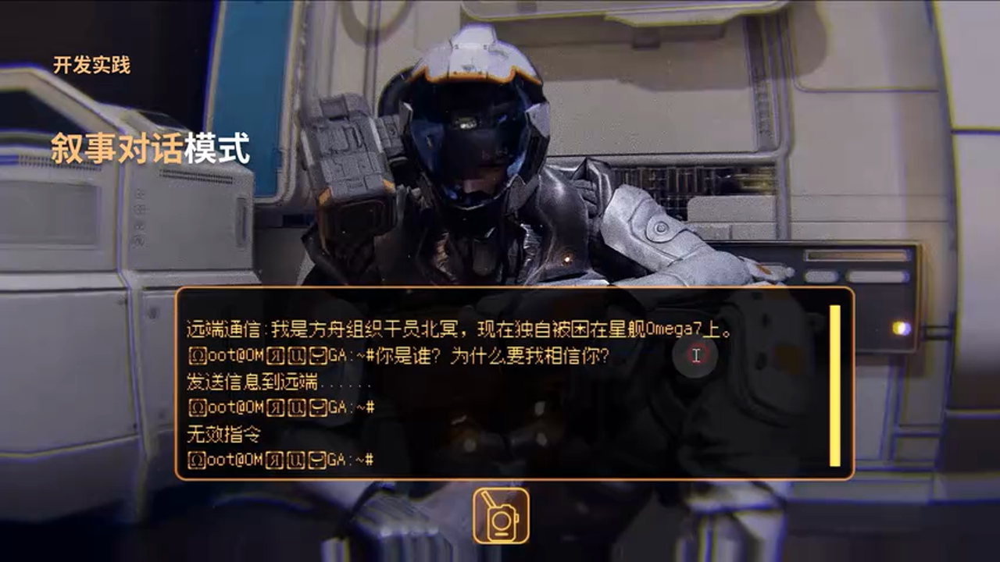

但自由对话模式会让有的时候玩家不知道该说什么，出现大聊的情况。所以增加了一个**引导式对话**的模式，它更专注于推动主线剧情。

大语言模型会基于预设的剧本进行对话走向的引导，确保关键信息的传递和情节推进。系统会自动生成玩家回复的选项（和传统的文字游戏类似），玩家可以直接发送或者随时修改内容再发送。

---

## 十三、引导式对话系统的技术实现

### 13.1 设计方案

为了能实现可控可引导的自由对话，使用Gemini生成了有关大语言模型结合文字游戏交互方案的报告，结合项目意图确定了需求。

设计了一种**大语言模型驱动的引导式对话模式**，以解决游戏中的经典矛盾：
- 完全自由的对话容易让玩家失去目标
- 传统选项对话又太过死板

### 13.2 运作方式

该模式的运作方式：
1. 系统先根据当前的剧情**预生成对话剧本**
2. 玩家发言时，会收到一句推荐的回复作为引导
3. 可以直接发送、修改或者完全自己写（自由度很高）
4. 回复提交后系统会判断玩家的意图与推荐是否一致
5. 若一致，按原剧本推进
6. 若不一致，大语言模型会在确保引导对话至设定目标的前提下**重新生成剧本**
7. 循环继续直到对话结束

这样的对话就**自由而不失引导的方向**。

### 13.3 技术架构

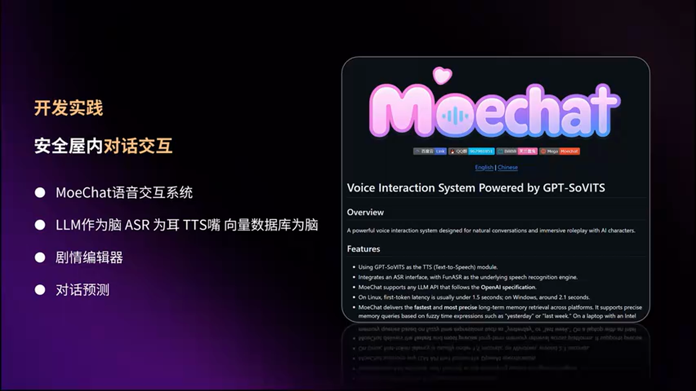

为了实现语音交互，借助基于开源的模型**Chat TTS**语音交互框架。该框架已经整合了多项关键技术：
- 使用**大语言模型**作为大脑
- 用**ASR**和**TTS**分别作为耳朵和嘴巴
- 用**向量数据库**构建了长期记忆

为了保障国内的访问顺畅性，这里的模型都是选用的通义千问系列。关于剧情控制以及剧情编辑器、对话预测都是自主开发的。

### 13.4 服务端核心职能

明确了服务端的两大核心职能：
1. 管理与语音交互的全流程
2. 作为中转与后端的大语言模型进行服务，进行高效稳定的通信

### 13.5 UE端插件开发

在UE端需要开发相应的插件配合，其职责是：
- 采集音频或输入信息并上传至服务器
- 接收处理返回的音频流
- 为其添加所需要的音频效果后播放（比如对讲机的那种声音，需要后处理一下）
- 还需要支持直接向各种AI服务发起请求

---

## 十四、开发环境与工具链

### 14.1 开发环境搭建

编码环境用到了**VS Code**和**PyCharm**进行辅助，高效地完成C++与Python的开发。环境搭建可以参考文档，还有B站视频。

### 14.2 Python开发要点

在进行Python相关开发时，有以下三个关键要点：

1. **环境隔离**：为服务端与UE编辑器扩展分别创建独立的Python虚拟环境
2. **开启开发者模式**：在UE中开启Python插件的开发者模式，这样就可以激活UE API的自动补全功能，提升开发效率
3. **安装调试插件**：推荐安装VS与UE联动的插件，方便进行调试

### 14.3 剧情编辑器开发

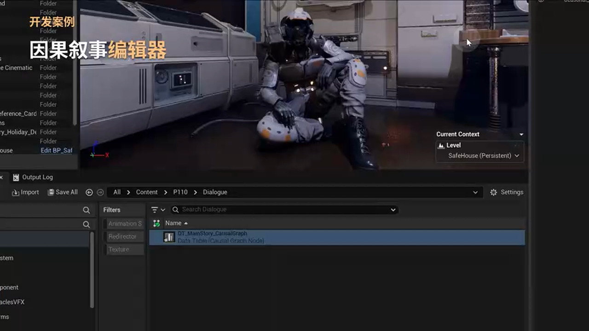

这是基于PySide开发集成到UE中的剧情编辑器。

它能够高效编辑复杂的多线叙事与分支对话，同时也是对UE的DataTable编辑器的一个功能拓展的案例。

值得一提的是，除了底层数据的连接部分外，代码几乎都是用AI辅助完成的。

界面中的每个节点都可以设置为对话节点，并配置相应的提示词。此外还支持直观的叙事事件的解锁与依赖关系，大大提升叙事设计的效率。

---

## 十五、C++与AI辅助编程

### 15.1 开发原则

C++主要用来开发UE端的插件及核心叙事模块。建议遵循一个原则：**需求规模尽量小**，把复杂的功能拆成明确的小需求点，这样更适合AI辅助编程。

以流式POST请求为例，这部分知识是短板，但通过ChatGPT和Gemini补足基础后，就能够写出更精准的提示词，引导AI辅助生成符合需求的代码。

**实际经验表明**：如果缺乏相关的知识，不仅提示词不专业，而且也容易生成错误的代码，很难判断生成的结果与质量。

### 15.2 高效开发流程

当需求拆解清楚后，开发就变得很高效。我们只需要在C++头文件中定义蓝图调用的函数和事件，构建清晰的接口，具体实现只要大量接触AI完成。

**注意事项**：Agent模式有时会过度实现需求。建议通过提问模式去理清思路，明确代码意图，再切换成Agent模式，或使用智能代码补全的半自动方式，这样生成的代码更精准可控。

### 15.3 Cursor + Claude 4实战演示

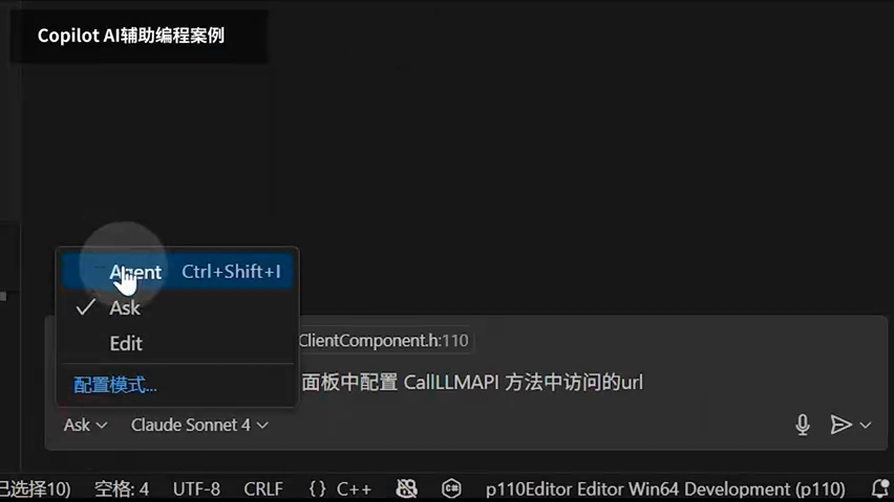

这里展示的就是用Cursor调用Claude 4的Agent模式进行的自动编码。

比如说提示"添加一个URL参数，支持在编辑器面板配置，并在大模型相关方法中调用"，Agent就会自动生成对应的C++代码。

完成编译后，就可以在引擎里直接使用。

对，就是这么快。

---

## 十六、提示工程的重要性

### 16.1 为什么提示词很关键

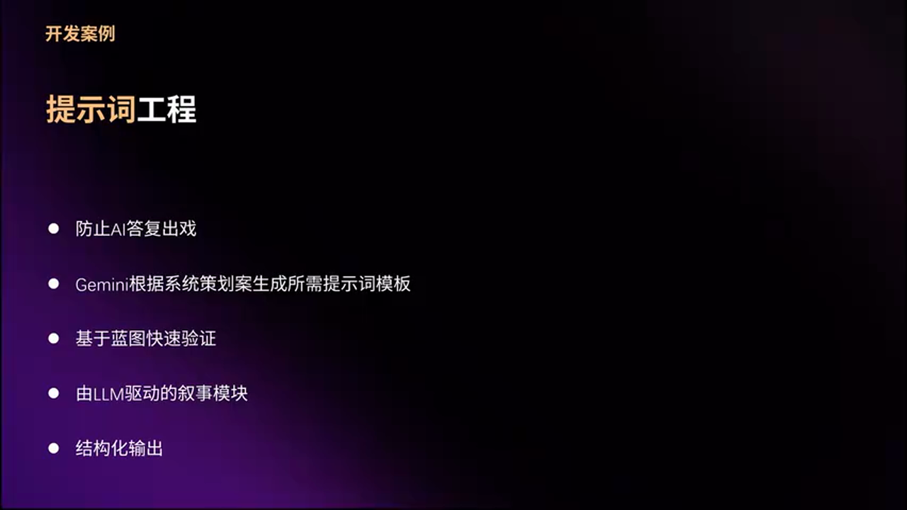

要让大语言模型与游戏完美结合，**提示工程**就非常关键。好的提示词能防止对话出戏，保持叙事一致。另一个重点是采用**结构化输出**，确保模型返回规范、准确的数据，方便程序解析。

### 16.2 提示词模板示例

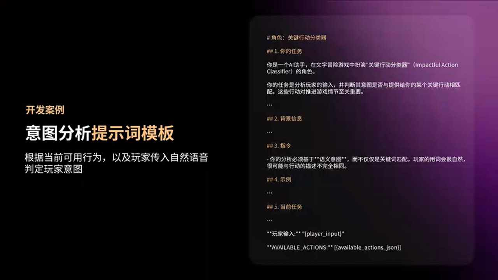

这里展示的是大语言模型辅助生成的提示词模板。例如**意图分析模板**，让AI充当关键行动分类体系，它能够根据**意图**而非关键词，识别玩家的行为目的，从而实现AI与程序协同控制游戏进程。

---

## 十七、蓝图开发中的AI辅助

### 17.1 AI作为技术顾问

即使在蓝图开发中，AI也能提供强大支持。我们可以直接将系统策划交给AI，让它输出清晰的实现步骤，相当于多了一位资深的技术顾问。

这不仅解决了命名难题，还能帮助先快速搭出功能框架，之后再验证优化，大大提升了开发效率。

### 17.2 实际案例：终端模拟交互

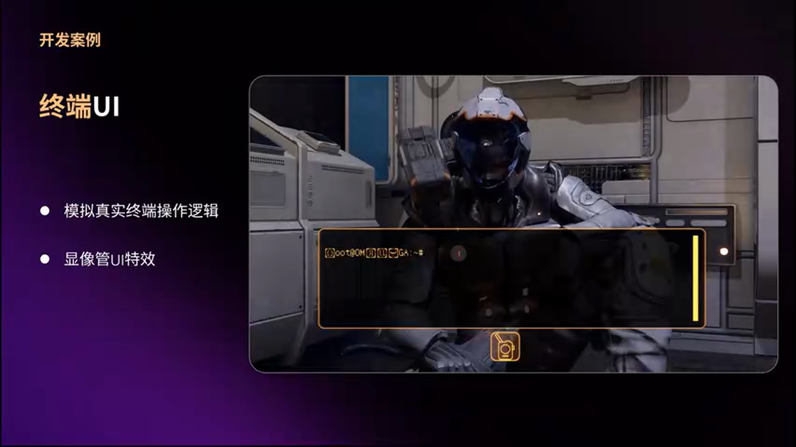

这是一个实际的需求案例。为了提升对话沉浸感，需要使用终端模拟操作。用大语言模型帮助给出了步骤，然后快速实现了终端交互的功能，并生成了这种显像管式的UI特效。

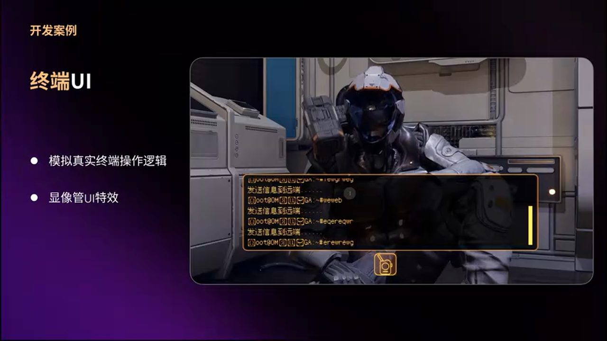

---

## 十八、轨道光枪战斗玩法

### 18.1 玩法概述

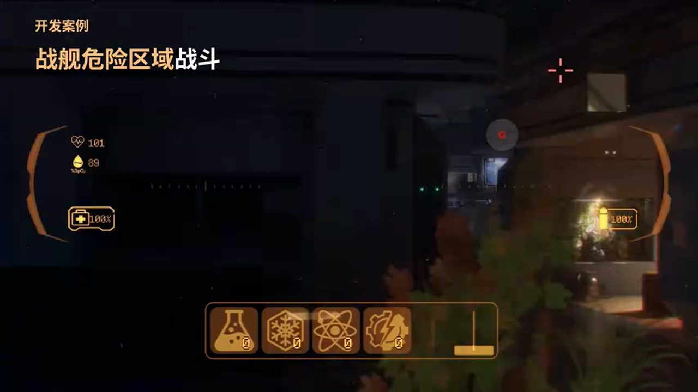

接下来介绍另一半玩法：**轨道光枪战斗**。该模式下玩家视角将沿预设轨道自动战斗，核心操作是瞄准敌人射击。

### 18.2 需求分解

这部分玩法基于之前的项目改造，主要需求包括：
- 实现基础射击
- 设计新的弹药装配玩法
- 使用AI生成怪物
- 在战斗中主角还会根据环境随机聊天，增加沉浸感

### 18.3 技术结构

这是整个光枪玩法的结构图。游戏的核心战斗循环，包括玩家射击、敌人出现移动、命中判定等，都是完全由蓝图实现的。

### 18.4 Sequencer作为调度工具

在项目中，**Sequencer**作为了核心的调度工具，负责生成和驱动游戏事件，调用蓝图扩展功能，实现能够统一管理和触发事件。

进一步地，可以在Sequencer的属性面板中灵活配置轨道参数，依托时间精准控制事件触发与运行逻辑，大幅提升关卡设计的效率与灵活性。

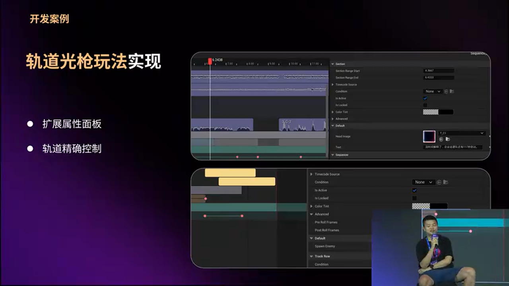

### 18.5 弹药装配系统设计

玩法开发也采用同样流程。以弹药装配系统为例，设计的目标是营造紧张而有策略性的体验。

基于这个目标：
1. 先通过AI生成了多种方案
2. 同时参考《生化危机》系列的设计
3. 随后在蓝图中快速迭代验证

这里只生成了一个最小的概念，后面也可以进行扩展。

---

## 十九、基于环境的动态对话

### 19.1 功能设计

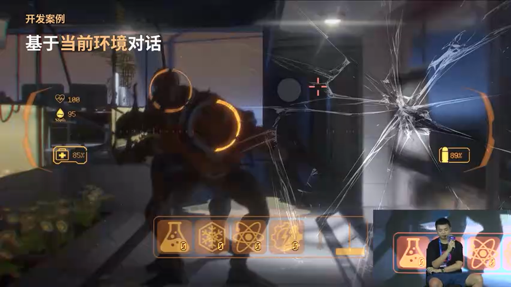

最后，为了让战斗体验更生动，实现了一个**基于当前环境对话**的功能。主角会根据战场的实际情况发表评论。

### 19.2 技术实现

具体实现是：
1. 首先实时抓取游戏画面
2. 送入千问视觉模型进行识别
3. 将图像转化为文字描述
4. 动态填入预设的对话提示词模板
5. 接着由大语言模型生成符合情境的角色台词
6. 最后通过TTS合成语音播放

在系统提示词中，让AI扮演专业的战场观察员，精准识别敌人的类型和环境状态，并结构化格式输出信息。用户提示词提供不同种类敌人的视觉特征，通过这种方式能够稳定获取场景中怪物与环境的描述。

---

## 二十、核心思考与总结

### 20.1 角色的重塑

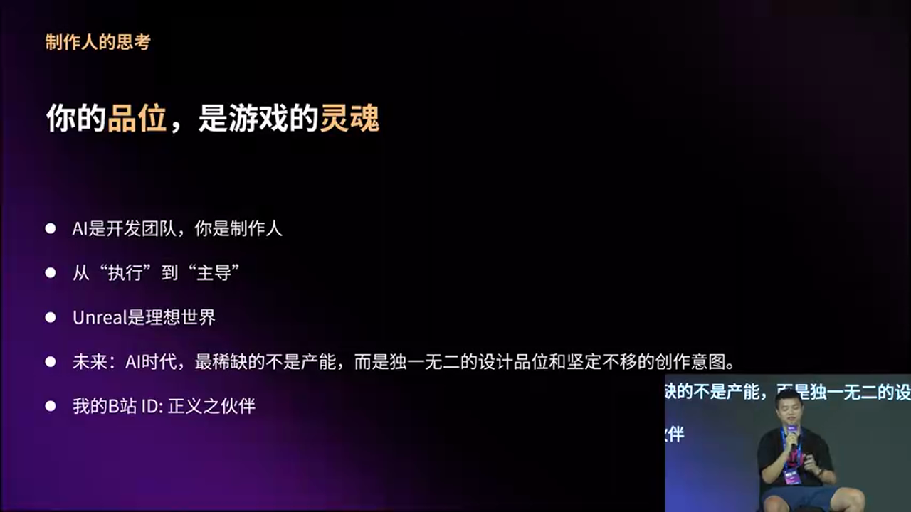

这套工作流的本质是一次**角色的重塑**：
- AI成为了开发团队
- 我们成为了产品制作人

### 20.2 未来的核心竞争力

> **AI时代真正稀缺的不是内容，而是独特的个人品位与清晰的创作意图。**

AI可以是强大的工具集，但没有灵魂。使用者的品位决定了它的上限。

因此，**未来的核心竞争力不再是掌握多少技术，而是拥有怎样的审美与思考。**

### 20.3 如何看待AI

请将AI视为一面镜子，用它映照更广阔的世界，反哺认知。它不应只是一台生产标准答案的机器，而应是你思想的延伸。

---

## 实战总结与建议

### 方案对比

> **方案 A：传统全手工开发**
> - 🟢 优势：完全可控，质量有保证
> - 🔴 劣势：周期长，人力成本高，个人难以完成
> - 🎯 适用场景：商业项目、团队开发
>
> **方案 B：AI辅助的认知驱动型工作流**
> - 🟢 优势：效率高，个人可独立完成原型，快速验证创意
> - 🔴 劣势：AI生成内容需要人工筛选和调整，部分细节难以精确控制
> - 🎯 适用场景：原型验证、创意探索、独立开发者

### 避坑指南

1. **策划案必须作为统一文件**：每次调用AI时都要附带，确保风格和信息一致性

2. **AI生成结果不能直接使用**：需要经过精细化调整，特别是2D转3D的资产

3. **运镜描述要避免文学化**：使用专业术语库，将抽象描述转化为视觉特征

4. **角色一致性问题**：使用UE渲染的高质量画面作为AI视频生成的引导图

5. **代码生成要拆分需求**：需求规模尽量小，先补足知识再写提示词

6. **Agent模式容易过度实现**：建议先用提问模式理清思路，再切换Agent或使用半自动补全

7. **务必使用版本控制**：让你放心尝试各种想法，随时可以退回稳定版本

---

**感谢阅读！** 如果对AI赋能游戏开发感兴趣，欢迎关注演讲者的B站账号：**蒸汽之伙伴**

