# 虚幻引擎调试工具深度剖析：从PrintString到专业调试体系

---


## 加入 UE5 技术交流群

如果您对虚幻引擎5的图形渲染技术感兴趣，欢迎加入我们的 **UE5 技术交流群**！

扫描上方二维码添加个人微信 **wlxklyh**，备注"UE5技术交流"，我会拉您进群。

在技术交流群中，您可以：
- 与其他UE开发者交流渲染技术经验
- 获取最新的GDC技术分享和解读
- 讨论图形编程、性能优化、构建工具流、动画系统等话题
- 分享引擎架构、基建工具等项目经验和技术难题

---

**源视频信息：**
- 标题：[UFSH2025]超越PrintString: 虚幻引擎调试工具 | Matt oztalay Epic Games 开发者关系高级 TA(官方字幕)
- 视频链接：https://www.bilibili.com/video/BV1st46z6ECv
- 时长：37分26秒

**AI生成说明：** 本文由AI根据视频内容自动生成，包含技术深度解析和最佳实践建议。

---

## 引言：为什么我们需要超越PrintString

在虚幻引擎开发过程中，当遇到问题时，大多数开发者的第一反应是使用PrintString节点输出调试信息。这种做法简单直接，但也暴露了一个核心问题：我们对引擎提供的强大调试工具体系了解不足。


Matt Oztalay是Epic Games开发者关系团队的高级技术美术，他在本次分享中系统性地介绍了虚幻引擎的完整调试工具链。从基础的日志系统到高级的Unreal Insights性能分析，从蓝图调试到构建管线诊断，这套工具体系覆盖了游戏开发的各个层面。

掌握这些专业调试工具不仅能提高开发效率，更重要的是能帮助我们深入理解引擎的运行机制，发现隐藏的性能瓶颈，最终交付更高质量的产品。本文将深入剖析这些工具的原理、使用方法和最佳实践。

## 第一部分：日志与控制台系统的深度应用

### PrintString的进阶技巧

虽然我们要"超越PrintString"，但首先需要了解如何正确使用它。PrintString节点提供了几个容易被忽视的高级特性。


**Print to Log选项**：当你不想让调试信息充斥整个屏幕时，可以启用"Print to Log"选项。这样信息只会输出到输出日志窗口，保持游戏视口的清洁。这在需要持续监控某些值但又不想干扰视觉调试时特别有用。

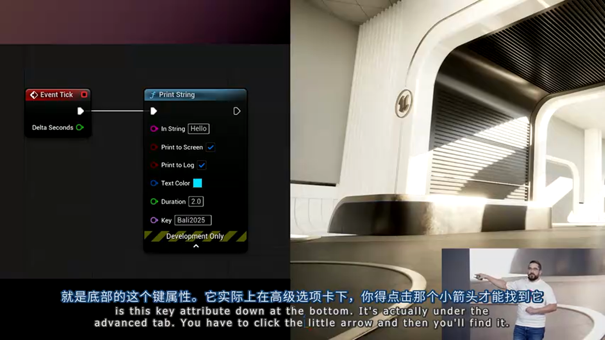

**Key属性的妙用**：在PrintString节点的高级选项中，有一个"Key"属性。当你为多个PrintString节点设置相同的Key值时，它们的输出会在屏幕上的同一位置更新，而不是不断向上滚动。这个特性对于创建简洁的调试HUD非常有价值。

配置示例：

```
PrintString节点设置：
- Print to Screen: true
- Print to Log: false  
- Text Color: (R=1.0, G=1.0, B=0.0)
- Duration: 0.0 (持续显示)
- Key: "PlayerStatus" (固定位置显示)
```

### Format Text：现代化的字符串格式化


在UE 5.0中引入的Format Text节点彻底改变了字符串拼接的方式。传统的Append String方法需要多个节点连接，而Format Text使用占位符语法，代码更加清晰：

```
传统方式：
Append("Player Health: ", ToString(Health))

Format Text方式：
"Player Health: {Health}"
```

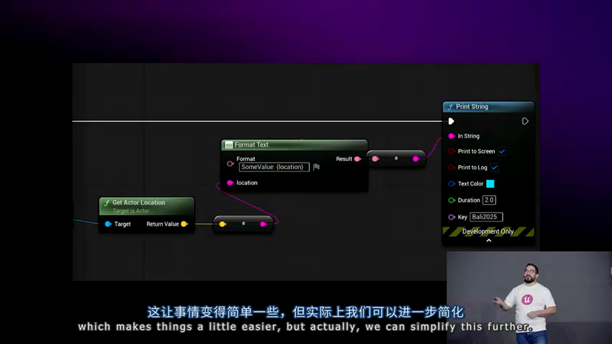

更进一步，UE 5.0还引入了Print Text节点，它直接接受Text类型输入，避免了Text到String的类型转换开销。在大量日志输出的场景下，这种优化能够减少不必要的性能损耗。

### 蓝图中的错误报告机制


UE 5.6带来了一个革命性的功能：Raise Script Error节点。以前，蓝图开发者只能通过红色的PrintString来表示错误，但这种方式既不规范也不易于追踪。


Raise Script Error节点会将错误信息直接输出到Message Log面板，与C++代码的错误报告机制保持一致。这意味着：

- 错误信息会被持久化记录
- 可以通过Message Log的过滤功能快速定位
- 支持点击跳转到错误发生的蓝图节点
- 与CI/CD系统集成时能够被自动化测试捕获

最佳实践建议：
- 使用Raise Script Error报告致命错误
- 使用Print String (红色) 报告警告
- 使用Print String (黄色) 报告一般信息
- 使用Print to Log记录详细的调试数据

### C++日志系统的高级技巧

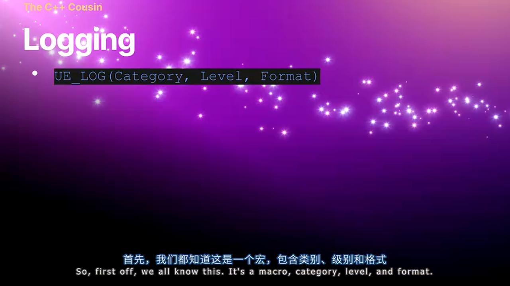

对于C++开发者，UE_LOG宏是日常开发的核心工具。但有几个技巧能让你的日志更加高效：

**使用LogTemp快速调试**：
```cpp
UE_LOG(LogTemp, Warning, TEXT("Quick debug message"));
```

LogTemp是引擎预定义的日志类别，无需声明即可使用。虽然在正式项目中应该定义自己的日志类别，但在快速原型开发或临时调试时，LogTemp能节省大量时间。

**条件日志宏**：
```cpp
// 传统方式
if (bShouldLog)
{
    UE_LOG(LogMyGame, Warning, TEXT("Conditional message"));
}

// 使用条件日志宏
UE_CLOG(bShouldLog, LogMyGame, Warning, TEXT("Conditional message"));
```

UE_CLOG宏在条件为false时完全不会执行任何操作，包括字符串格式化，这在性能敏感的代码路径中非常重要。


**文本宏格式化参数**：

在日志输出中使用函数返回值时，一个常见的错误是忘记添加解引用操作符：

```cpp
// 错误 - 会导致编译错误或崩溃
UE_LOG(LogTemp, Warning, TEXT("Name: %s"), GetObjectName());

// 正确 - 使用*操作符解引用FString
UE_LOG(LogTemp, Warning, TEXT("Name: %s"), *GetObjectName());
```

这个星号（*）操作符是TEXT宏的关键要求，它将FString转换为const TCHAR*指针。这是许多初学者容易遇到的陷阱。

常用格式化说明符：
- `%s` - FString (需要*操作符)
- `%d` - int32
- `%f` - float/double
- `%lld` - int64
- `%p` - 指针地址

### 控制台命令系统深度解析

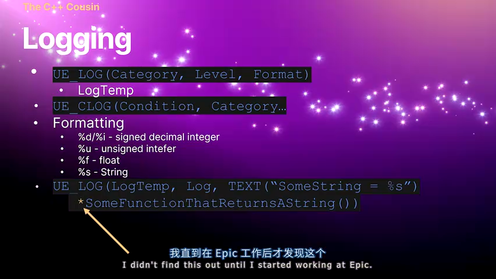

控制台命令（Console Commands）和控制台变量（Console Variables, CVars）是虚幻引擎运行时配置和调试的核心机制。

**Stat命令的自动补全**：


在较新的引擎版本中，输出日志窗口支持Stat命令的自动补全。你不再需要进入PIE（Play In Editor）模式才能看到可用的Stat命令列表。直接在输出日志的命令行中输入"stat "，系统会显示所有可用的统计命令。


**Stat None命令**：这是一个简单但实用的命令。当你开启了多个Stat显示（如stat fps, stat unit, stat gpu）后，使用`stat none`可以一次性关闭所有统计显示，而不需要逐个输入关闭命令。


**Stat Unit的增强信息**：

Stat Unit命令现在显示渲染分辨率和输出分辨率，这对于调试动态分辨率缩放（Dynamic Resolution）特别有用。你可以实时看到引擎为了维持目标帧率而调整的渲染分辨率。

```
Stat Unit显示信息：
- Frame: 总帧时间
- Game: 游戏线程时间
- Draw: 渲染线程时间  
- GPU: GPU时间
- Render Res: 实际渲染分辨率
- Output Res: 最终输出分辨率
```

**Help命令生成文档**：


输入`help`命令会自动生成一个HTML文档，列出所有可用的控制台命令及其说明。这个文档包括：
- 引擎内置命令
- 项目自定义命令
- 插件提供的命令
- 每个命令的详细说明和参数


**查询特定CVar的信息**：

对于任何控制台变量，你可以在其名称后加上问号来查看详细信息：

```
r.DynamicGlobalIlluminationMethod ?
```


这会显示：
- 变量的当前值
- 默认值
- 变量的说明文档
- 变量的设置历史（从哪个配置文件或命令设置的）

这个功能对于理解渲染管线配置和调试配置冲突非常有帮助。

**DumpConsoleVariables命令**：

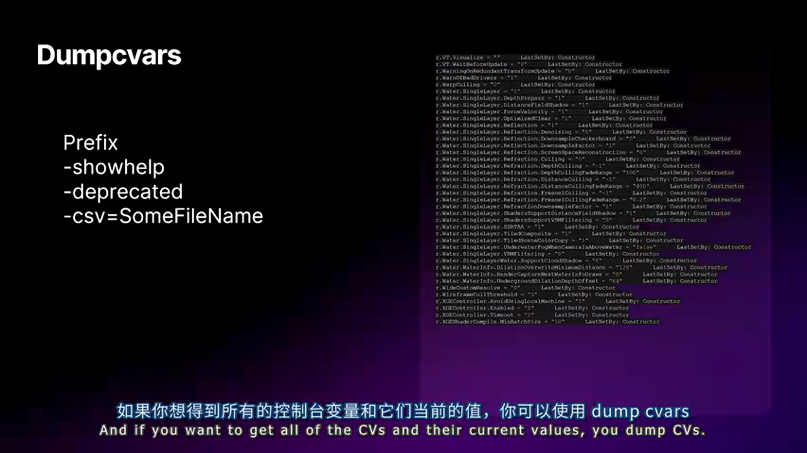

`DumpConsoleVariables`（或简写为`DumpCVars`）命令可以导出所有CVar的当前值：

```
// 导出所有CVars
DumpConsoleVariables

// 只导出渲染相关CVars
DumpConsoleVariables r.

// 导出到CSV文件
DumpConsoleVariables -CSV
```

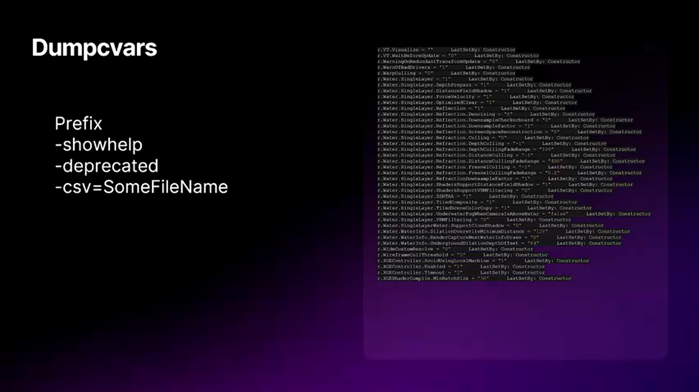

这个功能在以下场景特别有用：
- 对比不同设备配置文件的差异
- 记录性能测试时的引擎配置
- 调试配置文件优先级问题
- 生成配置文档

**ABTest命令：A/B测试工具**：


`ABTest`命令提供了一个内置的A/B测试机制，可以在两个CVar值之间快速切换：

```
ABTest r.DynamicGlobalIlluminationMethod 0 1
```

执行后，每次按下绑定的切换键，引擎会在两个值之间切换，并在屏幕上显示当前使用的值。这对于对比不同渲染设置的视觉效果非常有用，无需手动输入命令。

**SlowMo命令：时间缩放调试**：


`SlowMo`命令可以调整游戏的时间流速，这在调试动画、物理模拟和时序相关问题时非常有用：

```
SlowMo 0.1  // 10%速度，慢动作
SlowMo 1.0  // 正常速度
SlowMo 2.0  // 2倍速度
```

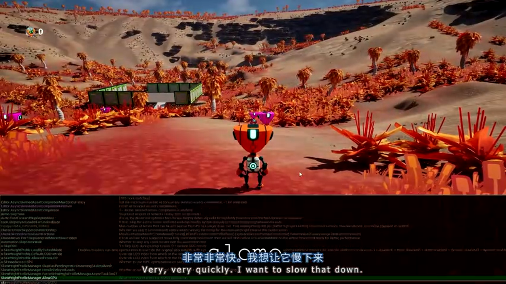

需要注意的是，SlowMo影响的是游戏逻辑时间，而不是真实时间。这意味着：
- 物理模拟会按缩放后的时间步进
- 动画播放速度会相应改变
- 定时器和延迟会受到影响
- 但渲染帧率不受影响

**BugIt/BugItGo：位置标记系统**：


`BugIt`命令是一个被严重低估的工具。它会输出当前相机的位置和旋转信息：

```
BugItGo 1234.56 7890.12 345.67 0.0 45.0 0.0
```


这个命令的强大之处在于团队协作：

1. QA测试人员发现问题时执行`BugIt`
2. 将输出的`BugItGo`命令复制到Bug报告中
3. 开发人员在编辑器中粘贴执行该命令
4. 相机立即传送到问题发生的确切位置和视角

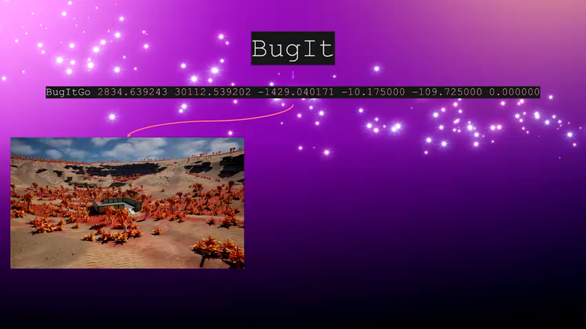

最佳实践：
- 在Bug报告模板中添加BugItGo字段
- 对于视觉相关的Bug，要求必须提供BugItGo坐标
- 在关卡设计文档中使用BugItGo标记重要位置
- 结合截图和BugItGo，可以精确重现问题

## 第二部分：Unreal Insights性能分析体系


Unreal Insights是虚幻引擎的下一代性能分析工具，它贯穿本文的多个章节。理解Insights的核心架构对于掌握现代虚幻引擎调试至关重要。

### Trace系统架构

Unreal Insights基于Trace系统构建，这是一个轻量级的事件记录框架。它的设计哲学是：
- 低开销：即使在发布构建中也可以启用
- 模块化：不同的分析模块可以独立启用
- 可扩展：开发者可以添加自定义Trace事件
- 跨平台：支持所有虚幻引擎支持的平台

### Trace工具栏


UE 5.2引入了Trace工具栏，它简化了Insights的使用流程。工具栏提供了几个关键功能：


**Trace Screenshot功能**：

在录制Insights Trace时，你可以点击"Trace Screenshot"按钮，系统会捕获当前帧的完整截图并嵌入到Trace文件中。


这个功能的价值在于：
- 在Insights时间线中可以看到对应时刻的画面
- 帮助关联性能峰值与视觉内容
- 在团队内分享性能问题时提供视觉参考
- 调试渲染相关性能问题时的关键工具


**Open Insights After Trace选项**：

启用这个选项后，每次停止Trace录制，Unreal Insights会自动打开并加载刚刚录制的Trace文件。这个小功能能显著提升工作流效率，避免手动在文件系统中查找Trace文件。

**Trace Regions：自定义时间区域**：

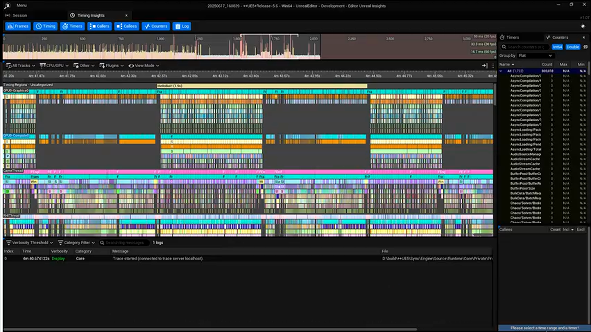

Trace Regions是UE 5.3引入的强大功能，允许你在Trace中标记任意时间段：

```cpp
// C++代码
TRACE_BEGIN_REGION(TEXT("BossFight"));
// ... 战斗逻辑 ...
TRACE_END_REGION(TEXT("BossFight"));
```


蓝图中也有对应的节点：
- Begin Trace Region
- End Trace Region

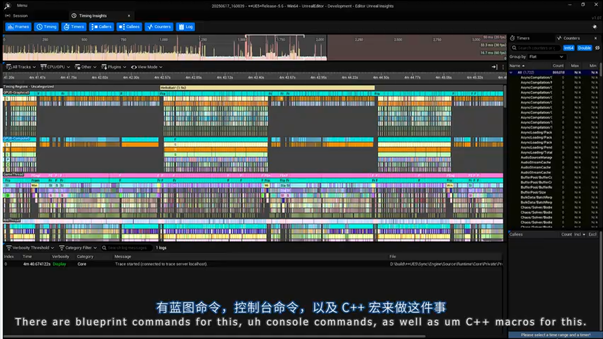

使用Trace Regions的优势：
- 在Insights时间线中清晰标记游戏的不同阶段
- 点击Region可以自动选择该时间段
- 计算特定游戏阶段的平均性能指标
- 对比不同游戏场景的性能表现


实际应用示例：
```
游戏阶段标记：
- "MainMenu" - 主菜单阶段
- "Loading" - 关卡加载
- "Gameplay_Exploration" - 探索阶段
- "Gameplay_Combat" - 战斗阶段
- "Cutscene" - 过场动画
```

### GPU Profiler 2.0：新一代GPU分析


传统的Profile GPU命令（Ctrl+Shift+,）已经被弃用，取而代之的是GPU Profiler 2.0。

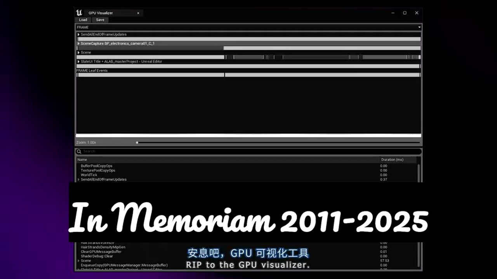

**为什么要替换旧的GPU Visualizer？**

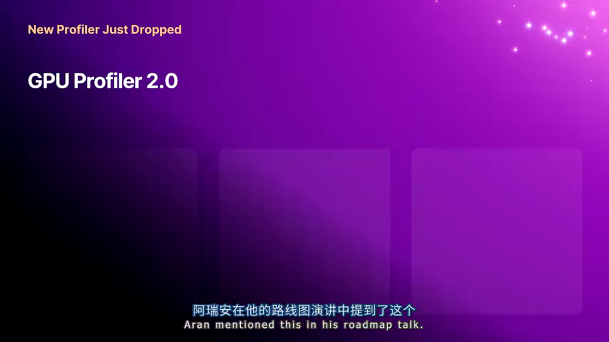

旧系统存在几个关键问题：
1. Stat GPU、GPU Visualizer和平台特定分析工具（如PIX、RenderDoc）显示的Pass名称不一致
2. 数值有时存在差异
3. 无法查看Compute管线的执行情况
4. 数据收集机制开销较大


GPU Profiler 2.0解决了这些问题：
- 统一的命名规范：所有工具显示相同的Pass名称
- 精确的时间测量：与平台GPU分析工具的数值一致
- Compute管线可视化：可以看到异步计算任务的执行
- 更低的开销：可以在更接近真实性能的情况下分析


**如何使用GPU Profiler 2.0**：


推荐的工作流程：
1. 启用"Open Insights After Trace"选项
2. 在需要分析的时刻执行`Trace.Snapshot`命令
3. Insights会自动打开，显示单帧的详细GPU时间线
4. 在GPU Track中可以看到：
   - Graphics Queue的所有渲染Pass
   - Compute Queue的异步计算任务
   - 每个Pass的精确耗时
   - Pass之间的依赖关系

这种方式比旧的Profile GPU更加灵活，因为你可以：
- 保存Trace文件供后续分析
- 在时间线上前后移动查看不同帧
- 导出数据进行统计分析
- 与团队成员分享分析结果

## 第三部分：音频调试工具链


音频系统的调试往往被开发者忽视，但虚幻引擎提供了一套完整的音频调试工具。

### 音频控制台命令

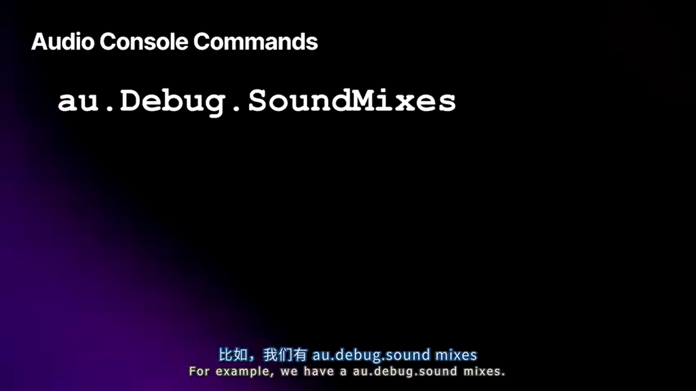

**AU.Debug.SoundMixes**：显示当前激活的所有Sound Mix及其状态。Sound Mix用于动态调整音频混合，例如在对话时降低背景音乐音量。

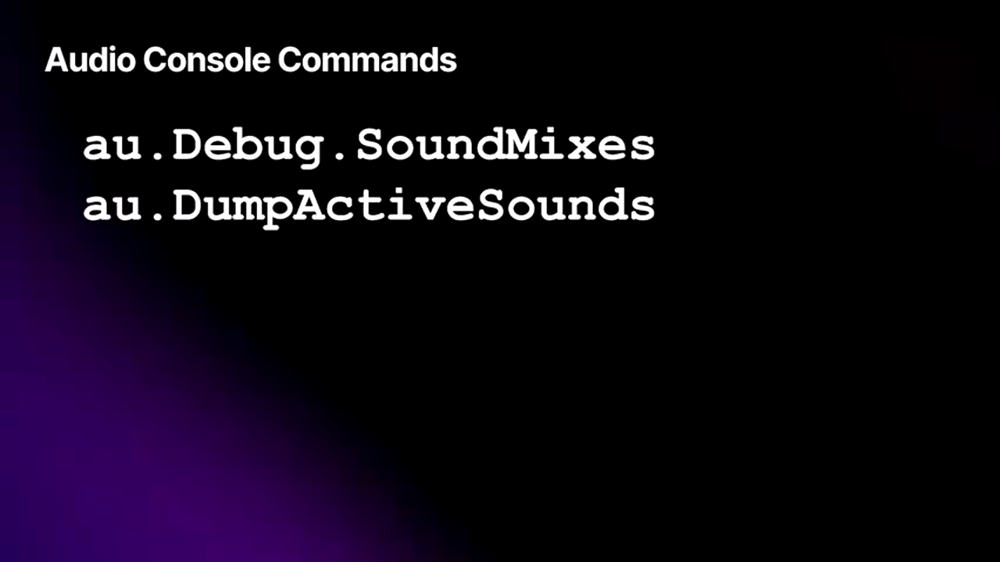

**AU.Debug.DumpActiveSounds**：列出当前正在播放的所有声音实例，包括：
- 声音资源名称
- 播放位置
- 音量和音高
- 所属的Sound Class

**AU.Debug.AudioMemoryReport**：生成详细的音频内存使用报告，包括：
- 加载的音频资源总大小
- 各个Sound Class的内存占用
- 流式音频缓冲区使用情况

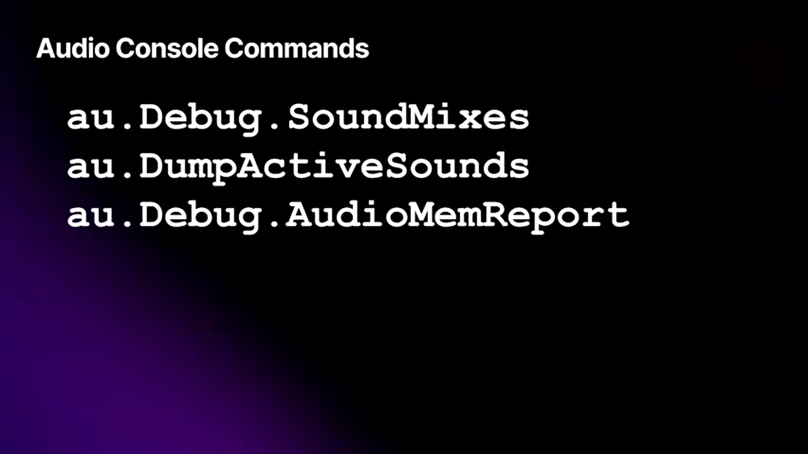

**AU.Solo系列命令**：

这是一个容易被误解的功能。如果你想隔离某个特定声音，应该搜索"Solo"而不是"Isolate"：

```
AU.Solo.MetaSounds  // 只播放MetaSounds
AU.Solo.SoundClass MyClass  // 只播放特定Sound Class
```

Solo模式会静音所有其他声音，只保留指定类型的声音播放。这在调试复杂音频场景时非常有用。

### Audio Insights

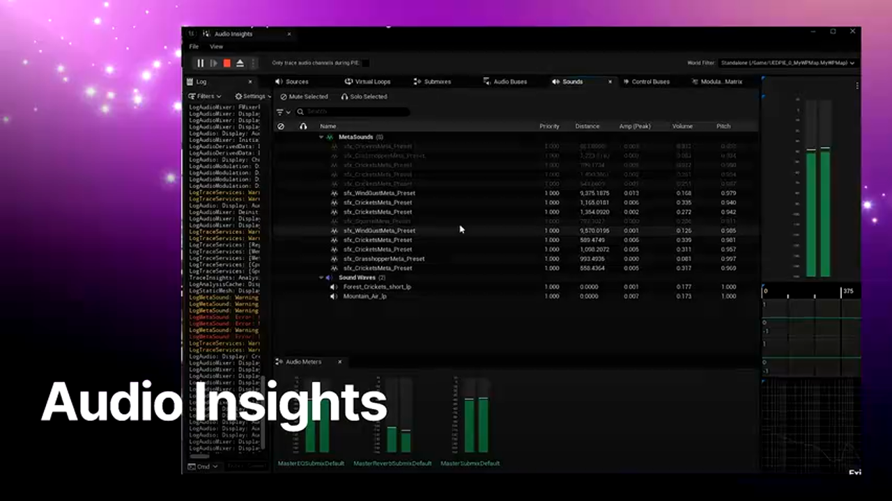

Audio Insights是基于Unreal Insights框架构建的专业音频分析工具。


**Sounds Tab**：

这个标签页显示所有声音实例的生命周期：
- 蓝色条：正在播放的声音
- 灰色条：已经停止但最近播放过的声音
- 可以点击查看声音的详细参数
- 支持按Sound Class、Attenuation等属性过滤

实际应用场景：
1. 调试声音未播放问题：检查声音是否被实例化
2. 分析声音重叠：查看是否有过多相同声音同时播放
3. 性能优化：识别播放频率过高的声音
4. 验证音频淡入淡出：观察音量变化曲线

Audio Insights的其他功能模块：
- **Buses Tab**：显示Audio Bus的信号流
- **Mixers Tab**：显示Submix的处理链
- **Virtual Loops Tab**：显示虚拟化的循环声音

## 第四部分：动画调试系统


动画系统的调试传统上依赖于慢动作播放和屏幕输出，但Animation Rewind Debugger提供了更强大的方案。

### Animation Rewind Debugger

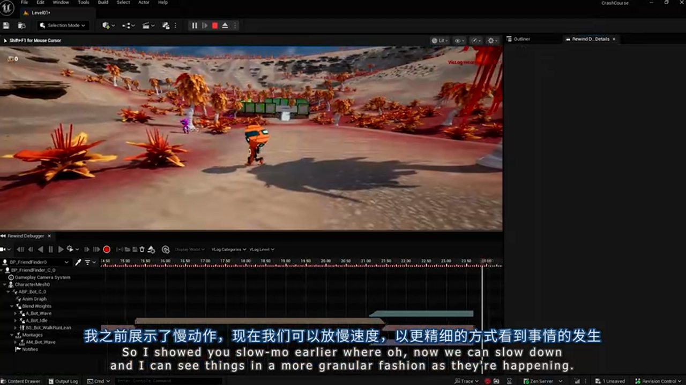

Rewind Debugger允许你"回放"动画执行过程：

1. 在编辑器中进入PIE模式
2. 打开Rewind Debugger窗口（Window > Animation > Rewind Debugger）
3. 确保点击了"Record"按钮
4. 执行你想要调试的动画行为
5. 退出PIE模式

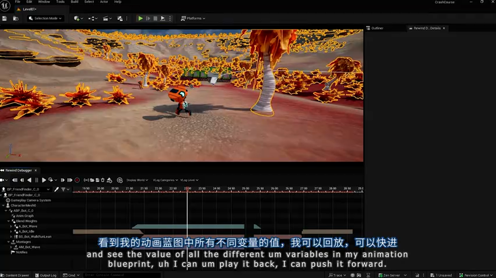

现在你可以：
- 在时间线上前后拖动，查看任意时刻的动画状态
- 查看Animation Blueprint中所有变量的值
- 看到状态机的状态转换历史
- 观察Blend Space的混合权重变化
- 检查IK（Inverse Kinematics）的求解结果

**技术实现细节**：

Rewind Debugger基于Unreal Insights的Trace API构建。这意味着：
- 录制的数据可以保存为Trace文件
- 支持在不同机器上回放分析
- 可以与其他Insights数据（如性能数据）关联分析
- 开销相对较低，可以录制较长时间

**最佳实践**：

```
调试动画问题的标准流程：
1. 识别问题：在游戏中发现动画异常
2. 录制Trace：使用Rewind Debugger录制问题重现过程
3. 回放分析：在时间线上定位问题发生的确切时刻
4. 检查变量：查看该时刻所有相关变量的值
5. 追踪源头：向前回溯，找到导致问题的根本原因
6. 验证修复：修改后再次录制，对比前后差异
```

## 第五部分：内存分析工具集


内存问题往往是最难调试的问题之一，虚幻引擎提供了多层次的内存分析工具。

### Statistics面板

Statistics面板是最基础但也最实用的内存监控工具。

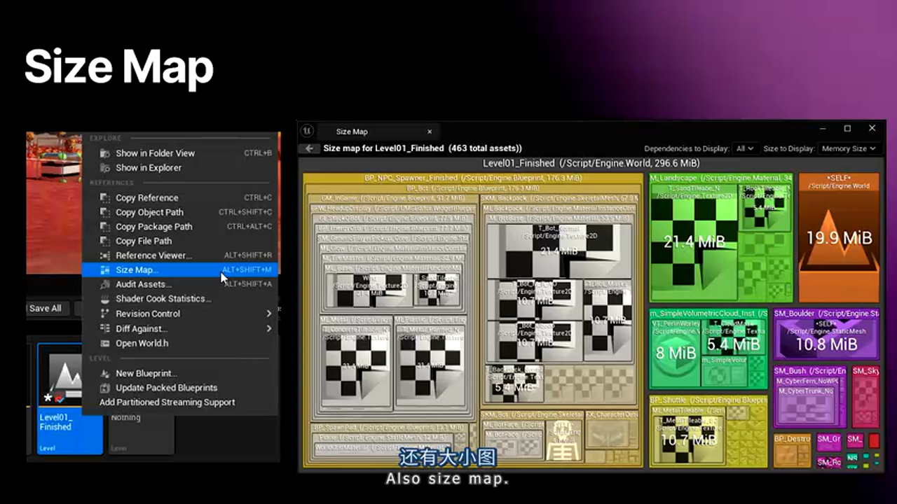

**Size Map**：

Size Map提供了资源内存占用的可视化视图。关键配置：

```
必须设置：Size to Display = Memory Size
```

为什么这很重要？因为默认设置是"Disk Size"，它会显示源文件的大小。例如，一个200MB的FBX文件可能在内存中只占用10MB（因为引擎会压缩和优化）。使用Disk Size会给你错误的优化方向。

Memory Size显示的是资源在运行时实际占用的内存，这才是我们需要优化的目标。

Size Map的使用技巧：
- 颜色深度代表内存占用大小
- 点击可以深入查看子资源
- 右键可以跳转到Content Browser
- 支持按资源类型过滤

### Render Resource Viewer

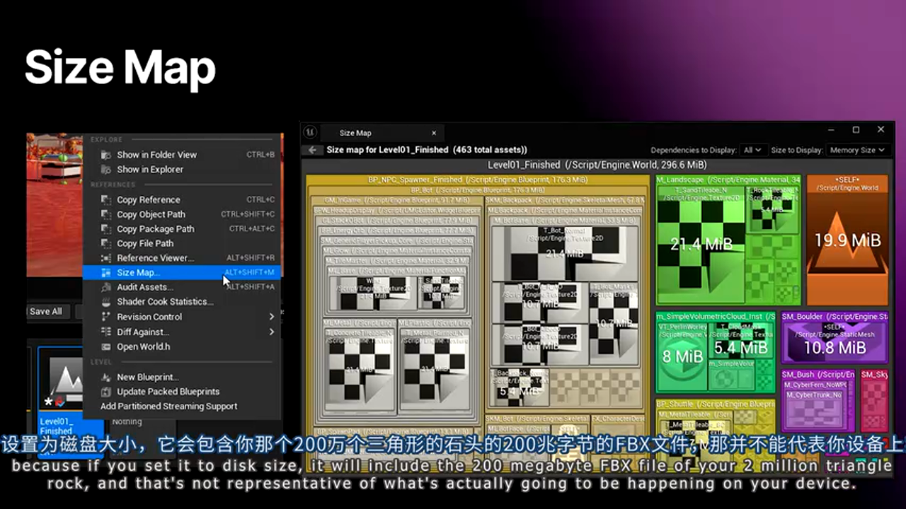

这是UE 5.6新增的GPU内存分析工具，提供了类似Size Map的可视化界面，但专注于GPU资源：

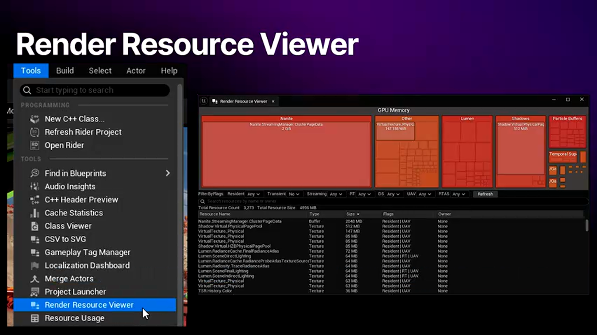

显示的资源类型：
- Textures（纹理）
- Render Targets（渲染目标）
- Vertex Buffers（顶点缓冲）
- Index Buffers（索引缓冲）
- Uniform Buffers（常量缓冲）

实际应用案例：
- 发现过大的纹理资源
- 识别未使用的Render Target
- 优化Nanite和Virtual Shadow Map的内存占用
- 分析不同LOD级别的内存差异

### Memory Insights


Memory Insights是最强大的内存分析工具，但需要特殊的启动参数：

```
-trace=default,memory
```


可选的额外参数：
```
-trace=default,memory,memalloc  // 包含分配器详细信息
-trace=default,memory,asset     // 包含资源元数据
```

注意：启用Memory Trace会显著影响性能，建议在专门的性能测试环境中使用。

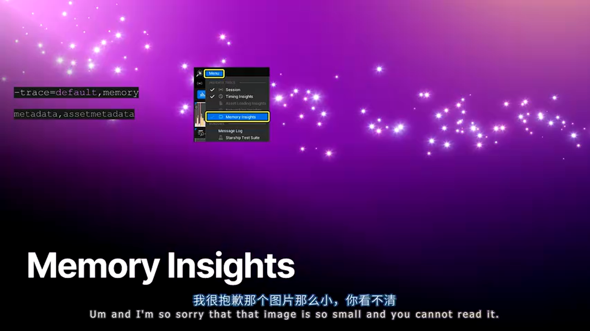

**打开Memory Insights**：

录制完Trace后，在Unreal Insights主窗口的菜单栏中选择"Memory"，会打开Memory Insights模块。


Memory Insights提供的视图：
- **Timeline View**：内存使用随时间的变化曲线
- **Allocation View**：所有内存分配的列表
- **Callstack View**：内存分配的调用栈
- **Tag View**：按内存标签分类的统计


高级分析技巧：
1. 使用Timeline View识别内存泄漏（持续增长的曲线）
2. 使用Callstack View找到分配热点
3. 对比不同游戏阶段的内存快照
4. 导出数据进行长期趋势分析

跨平台支持：
Memory Insights支持所有虚幻引擎平台，包括移动设备和游戏主机。这意味着你可以在目标平台上录制Trace，然后在PC上分析，这对于内存受限的平台特别有价值。

## 第六部分：物理系统调试


物理模拟的问题往往难以察觉，但影响深远。虚幻引擎提供了专门的物理调试工具。

### 碰撞可视化

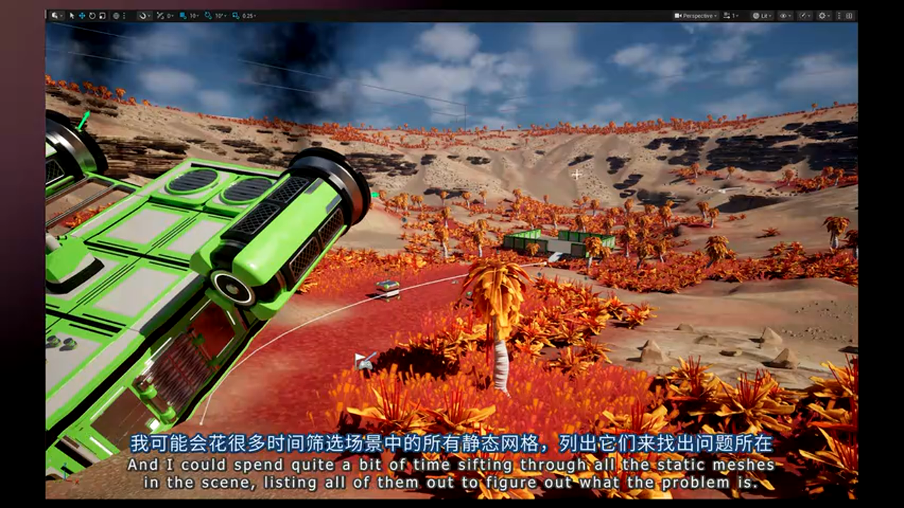

最简单但最有效的物理调试方法是可视化碰撞体：

```
快捷键：Alt + C
```

这会显示场景中所有物理碰撞体的线框。不同颜色代表不同的碰撞类型：
- 绿色：简单碰撞（Simple Collision）
- 紫色：复杂碰撞（Complex Collision）
- 蓝色：使用复杂碰撞作为简单碰撞（Use Complex As Simple）


**识别性能问题**：

在碰撞可视化模式下，如果你看到一个Static Mesh完全是蓝色的实心体，这意味着它启用了"Use Complex As Simple"选项。这是一个严重的性能问题，因为：
- 物理引擎需要对每个三角形进行碰撞检测
- 内存占用大幅增加
- 物理查询（Raycast、Sweep等）变慢


正确的做法是为Static Mesh创建简化的碰撞体（Box、Sphere、Capsule或简化的Convex Hull）。

### 水体物理调试

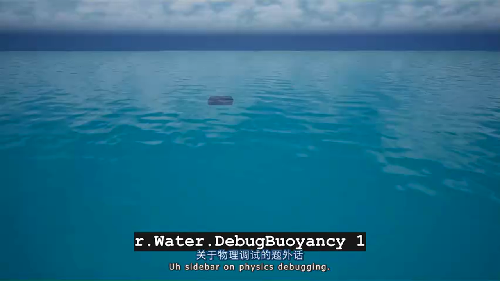

对于使用Water Plugin的项目，可以使用专门的浮力调试命令：

```
r.Water.DebugBuoyancy 1
```

这会显示：
- 浮力点（Pontoons）的位置
- 每个浮力点的水面高度
- 浮力点的受力方向和大小
- 水面网格的采样点

这对于调试船只、漂浮物等物理行为非常有用。

### Chaos Visual Debugger


Chaos是虚幻引擎的现代物理引擎，Chaos Visual Debugger（CVD）是其配套的专业调试工具。

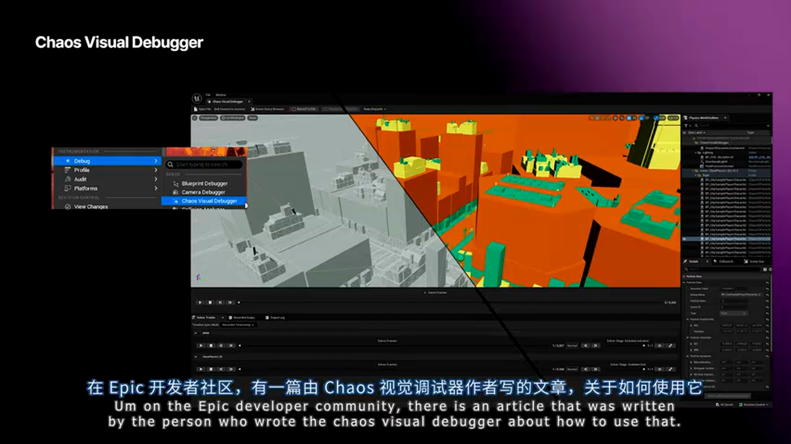

CVD基于Unreal Insights构建，提供了：
- 物理模拟的逐帧回放
- 碰撞事件的详细记录
- 约束（Constraints）的可视化
- 物理性能分析

在Epic Developer Community上有详细的CVD使用教程，强烈推荐阅读。

CVD的典型应用场景：
- 调试破碎系统（Destruction）
- 优化布娃娃（Ragdoll）性能
- 分析复杂的物理约束链
- 重现难以复现的物理Bug

## 第七部分：AI与游戏逻辑调试


AI系统的调试需要可视化大量的内部状态，虚幻引擎为此提供了专门的工具。

### 导航网格可视化

最基础的AI调试是查看导航网格：

```
快捷键：P
```

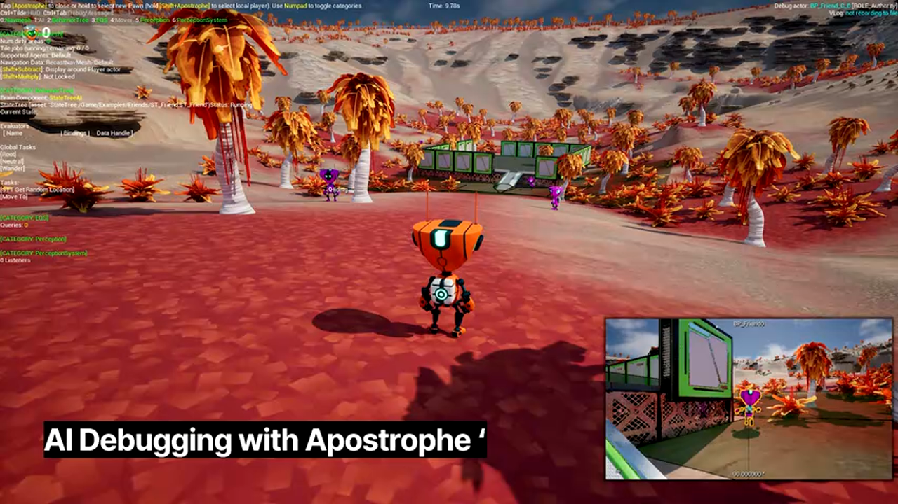

这会显示NavMesh的可行走区域。不同颜色代表不同的导航区域类型。

### Gameplay Debugger


Gameplay Debugger是AI调试的核心工具：

```
快捷键：'（单引号/撇号键）
```

Gameplay Debugger提供多个调试类别（Categories）：
- **NavMesh**：导航网格信息
- **EQS**：环境查询系统（Environment Query System）
- **Perception**：AI感知系统
- **Behavior Tree**：行为树状态
- **Abilities**：Gameplay Ability System

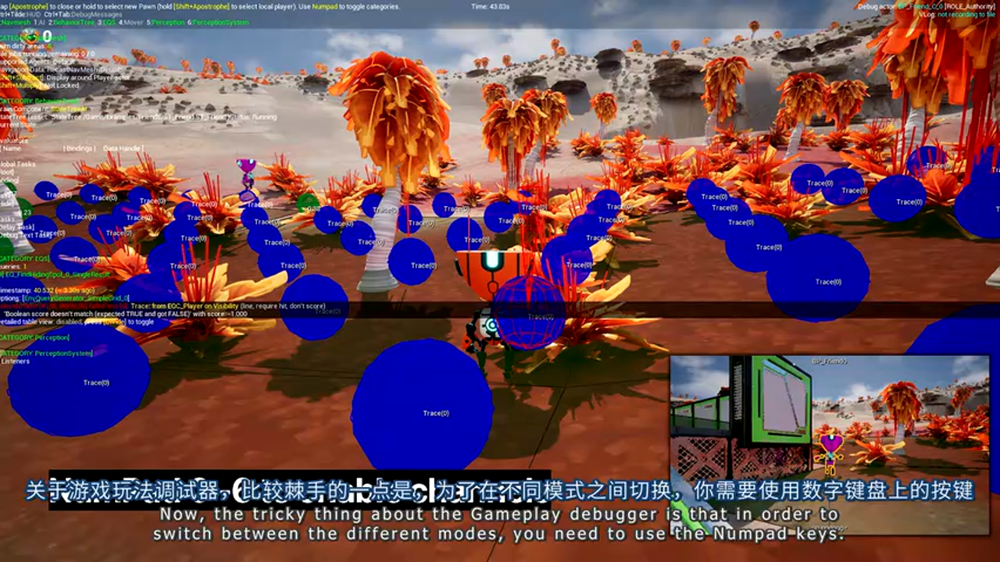

**重要提示：使用数字小键盘切换类别**


这是一个常见的困惑点：Gameplay Debugger的类别切换必须使用键盘右侧的数字小键盘（Numpad），主键盘区的数字键无效。


如果你使用的是没有小键盘的紧凑型键盘（如60%或TKL键盘），你需要：
1. 使用外接数字小键盘
2. 或者在项目设置中重新绑定Gameplay Debugger的快捷键
3. 或者使用虚拟小键盘软件

**EQS可视化**：

环境查询系统（EQS）是AI决策的重要工具，Gameplay Debugger可以实时显示EQS查询结果：
- 查询的采样点位置
- 每个采样点的得分
- 最终选择的位置
- 查询失败的原因

### State Tree Debugger

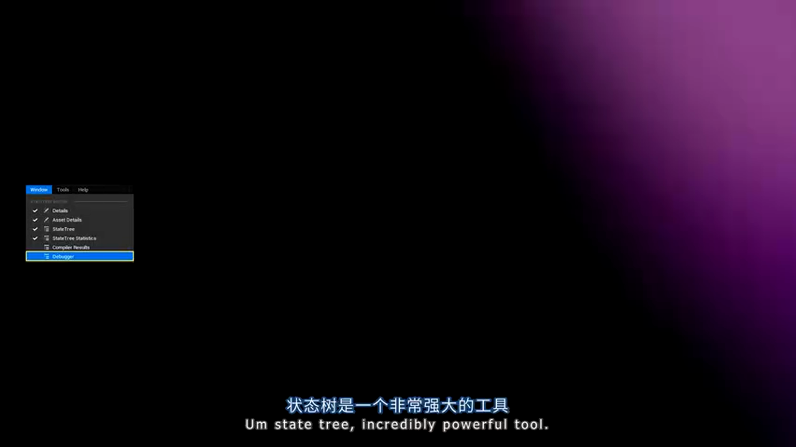

State Tree是UE 5引入的新一代AI状态机系统，比传统的Behavior Tree更加灵活高效。


**State Tree Debugger使用方法**：

1. 打开State Tree资源
2. 点击"Debugger"标签
3. **重要：点击Record按钮开始录制**
4. 进入PIE模式，执行AI行为
5. 退出PIE模式

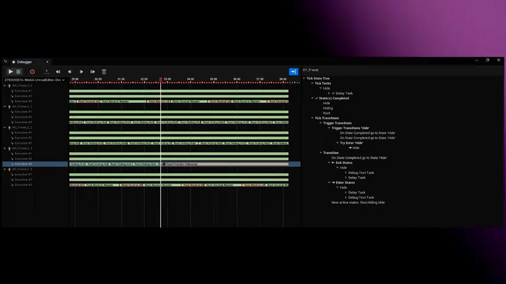

现在你可以：
- 在时间线上回放AI的状态转换
- 查看每个状态的进入和退出时间
- 检查状态转换的条件
- 查看任务（Tasks）的执行结果


State Tree Debugger同样基于Unreal Insights的Trace API，这意味着：
- 可以录制长时间的AI行为
- 支持多个AI实例的同时调试
- 可以导出数据进行统计分析

**常见错误：忘记点击Record按钮**

如果你发现Debugger没有显示任何数据，最可能的原因是忘记点击Record按钮。这是一个容易被忽视的步骤，但没有它，Debugger不会记录任何信息。

## 第八部分：UI调试工具链


用户界面的调试涉及布局、性能和交互三个方面，虚幻引擎提供了完整的UI调试工具集。

### Widget Reflector


Widget Reflector是UI调试的首选工具：

```
打开方式：Window > Developer Tools > Widget Reflector
```

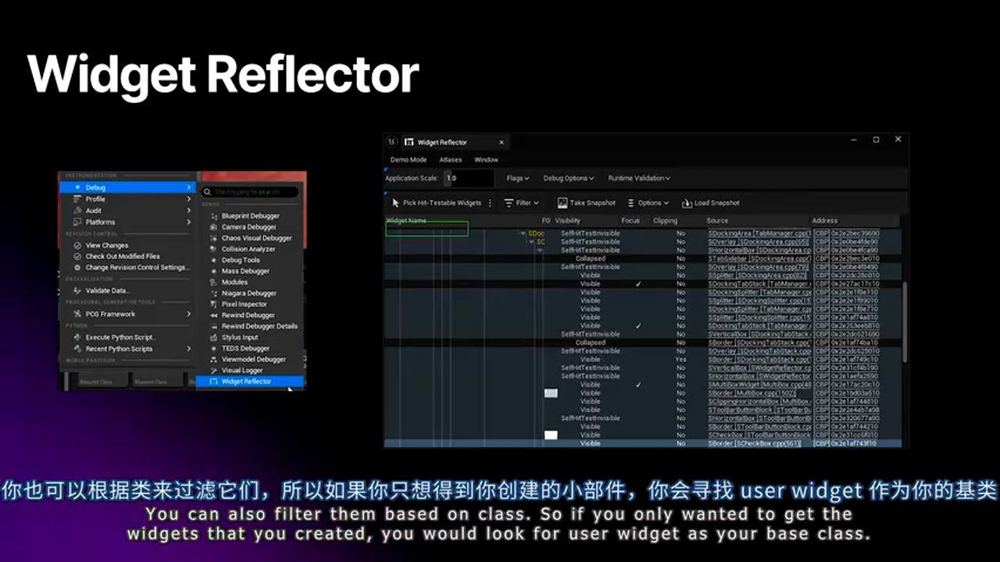

**核心功能**：

1. **Hit Testing**：点击"Pick Hit-Testable Widgets"按钮，然后将鼠标悬停在任何UI元素上，Reflector会显示：
   - Widget的类型和名称
   - Widget的层级结构
   - 可见性状态（Visible, Hidden, Collapsed）
   - 交互状态（Hit Test Visible, Not Hit Testable）
   - 几何信息（位置、大小）

2. **类过滤**：可以过滤只显示特定类型的Widget，例如只显示用户自定义的Widget（继承自UUserWidget的类）。


3. **鼠标高亮**：启用"Display Mouse Highlighter"会在鼠标周围显示一个高亮圈，这在录制教程视频时非常有用。


4. **按键显示**：启用"Display Current Key Strokes"会在屏幕上显示当前按下的键，这对于：
   - 录制教程视频
   - 复现用户报告的Bug（让用户录制操作过程）
   - 调试快捷键冲突


实际应用案例：

假设用户报告"点击按钮没有反应"，你可以：
1. 让用户启用Widget Reflector和按键显示
2. 录制屏幕操作
3. 从录制中你可以看到：
   - 用户确实点击了按钮（按键显示会显示鼠标点击）
   - Widget Reflector显示按钮的Hit Test状态
   - 可能发现按钮被另一个透明Widget遮挡

### Slate Debugger


Slate是虚幻引擎的底层UI框架，Slate Debugger提供了性能级别的UI分析。

启用方式：
```
Slate.EnableInvalidationDebugging 1
Slate.ShowInvalidationRoot 1
```


**Invalidation调试**：

Invalidation是Slate的核心优化机制。当Widget的内容改变时，它会被标记为"无效"（Invalidated），需要重新绘制。

Slate Debugger会高亮显示每帧被Invalidate的Widget：
- 红色闪烁：Widget被Invalidate
- 闪烁频率：Invalidate的频率

如果你看到某个Widget每帧都在闪烁，这意味着它每帧都在重绘，这是严重的性能问题。


**Paint Commands调试**：

显示每个Widget的绘制命令数量。绘制命令越多，渲染开销越大。


**Update Commands调试**：

显示Widget的更新（Tick）操作。如果某个Widget不需要每帧更新，应该禁用其Tick功能。

### Slate Insights

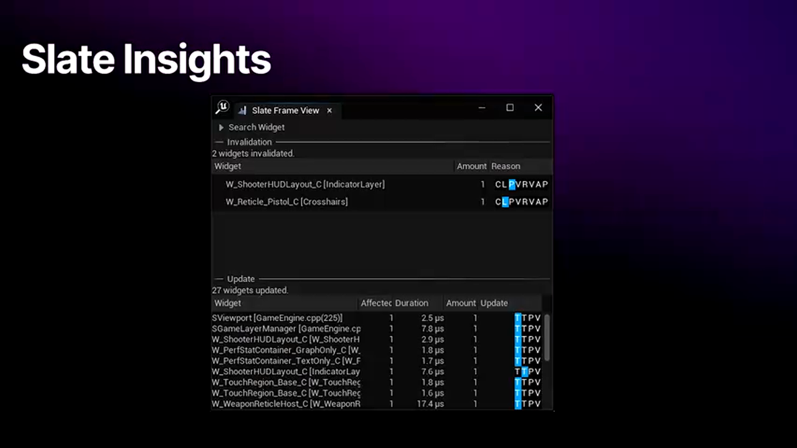

Slate Insights是基于Unreal Insights的UI性能分析工具。

**重要限制：只支持打包构建和Standalone模式**


Slate Insights不支持Play In Editor（PIE）模式，你必须：
- 使用Standalone模式运行编辑器
- 或者打包项目后运行


启用方式：
1. 在插件管理器中启用"Slate Insights"插件
2. 启动时添加Trace参数：`-trace=default,slate`
3. 在Insights中打开Slate分析模块

Slate Insights提供的数据：
- Widget的Invalidation历史
- Paint和Update的时间线
- Widget层级的性能热图
- 帧间对比分析

### MVVM与Widget Previewer

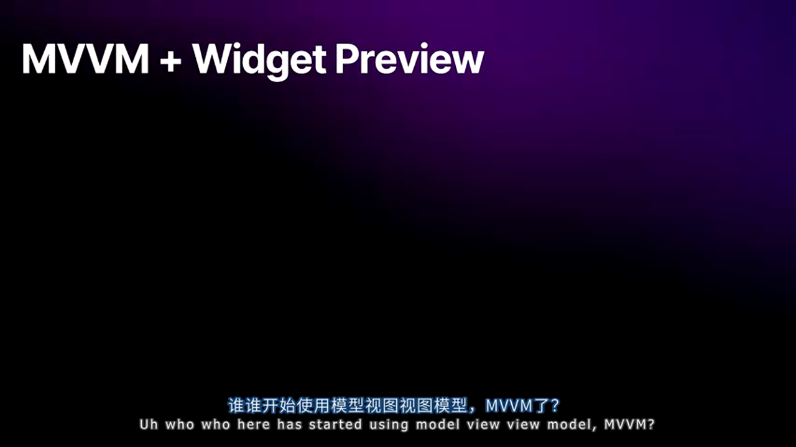

Model-View-ViewModel（MVVM）是UE 5引入的UI架构模式，它将UI逻辑与显示分离。

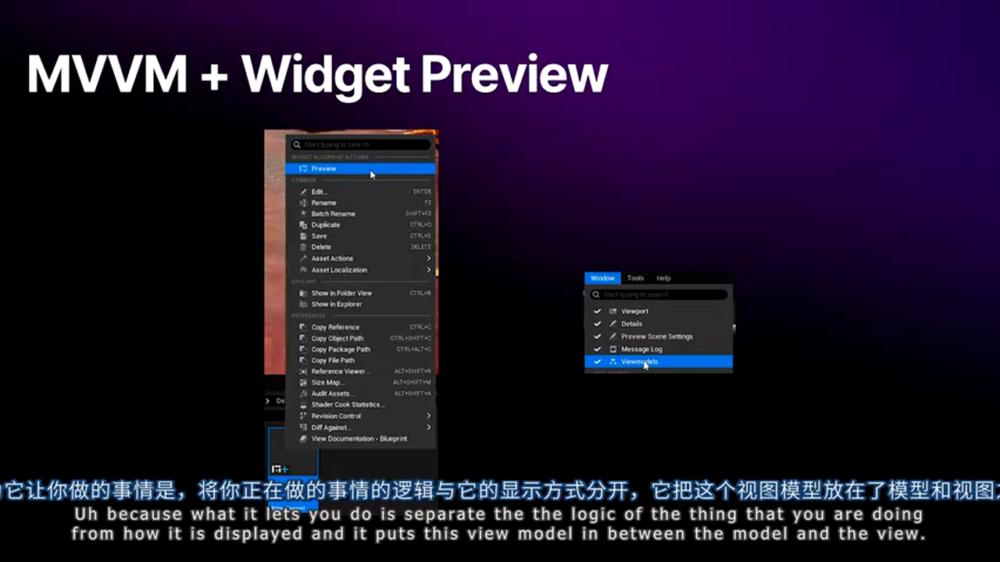

**传统UI调试流程的问题**：

传统上，测试UI需要：
1. 在Level Blueprint中创建Widget
2. 添加到Viewport
3. 进入PIE模式
4. 手动触发UI状态变化
5. 观察结果

这个流程繁琐且低效。


**MVVM + Widget Previewer的优势**：

使用MVVM架构后，你可以：
1. 在Widget Designer中直接预览UI
2. 通过Widget Previewer修改ViewModel的值
3. 实时看到UI的变化
4. 无需进入PIE模式

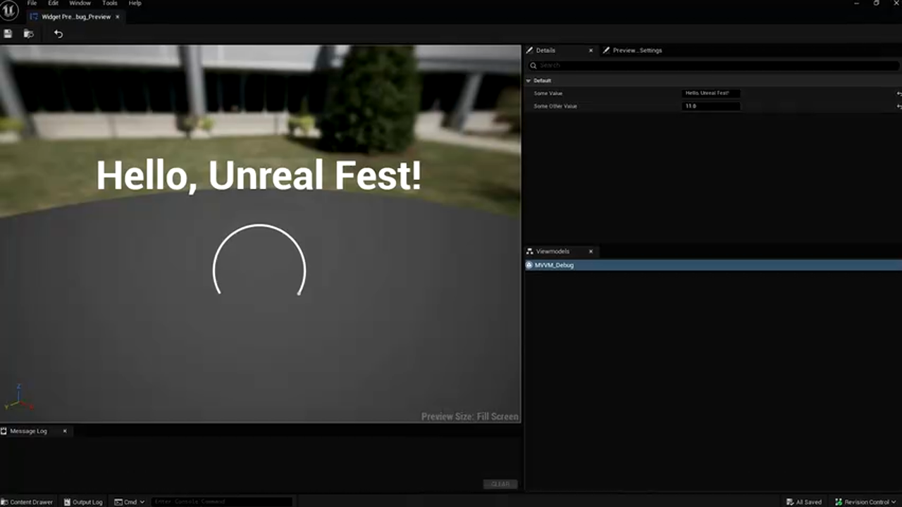

这极大地提高了UI迭代速度，特别是在调试复杂的UI状态机时。

**启用Widget Designer内置预览**：

有一个控制台命令可以在Widget Designer中直接启用预览功能，无需打开单独的Widget Previewer窗口。虽然演讲者没有展示具体命令，但可以在控制台命令列表中搜索"Widget Preview"找到。

### 本地化调试


本地化问题往往在项目后期才被发现，但虚幻引擎提供了早期测试的方法。

**Leet Speak模式**：

```
启动参数：-CULTURE=LEET
```


这会将所有正确设置了本地化的文本转换为"Leet Speak"（一种使用数字和符号替代字母的网络语言）。

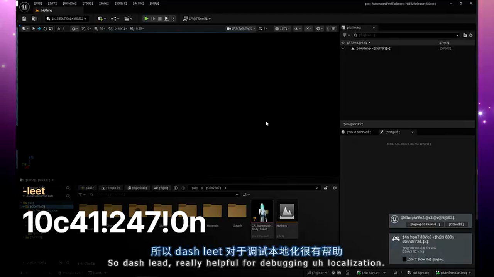

**为什么这有用？**

1. **识别未本地化的文本**：如果某些文本没有变成Leet Speak，说明它们没有正确设置本地化。
2. **保持可读性**：对于英语使用者，Leet Speak仍然可读（如"Hello"变成"H3ll0"），所以你可以正常游玩游戏进行测试。
3. **早期发现问题**：不需要等到实际翻译完成就能发现本地化配置问题。

最佳实践：
- 在开发过程中定期使用-CULTURE=LEET测试
- 将Leet Speak测试加入CI/CD流程
- 对于支持多语言的项目，这应该是必须的测试步骤

## 第九部分：图形与材质调试


图形渲染的调试是技术美术（TA）的核心工作，虚幻引擎提供了丰富的材质调试工具。

### 材质中的数值显示

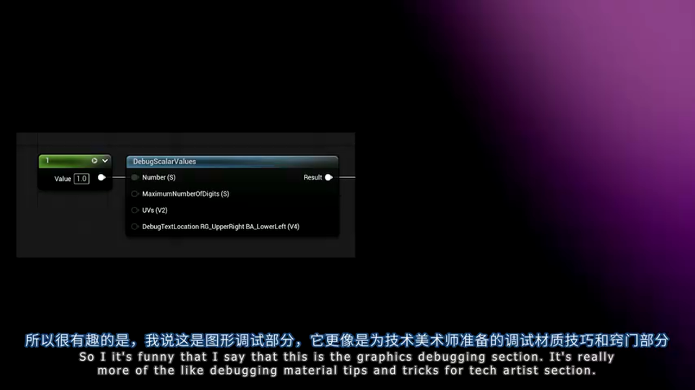

在材质编辑器中，你可以使用Debug Scalar/Vector节点将数值直接渲染到屏幕上：

- `DebugScalarValues`：显示单个浮点数
- `DebugFloat3Values`：显示三维向量
- `DebugFloat4Values`：显示四维向量


这些节点会在材质表面显示数字，类似于PrintString，但是在材质空间中。

**组合多个Debug节点**：

你可以通过调整UV坐标来堆叠多个Debug显示：

```
材质节点设置：
DebugScalarValues (UV偏移: 0, 0) - 显示值A
DebugScalarValues (UV偏移: 0, 0.1) - 显示值B  
DebugScalarValues (UV偏移: 0, 0.2) - 显示值C
```

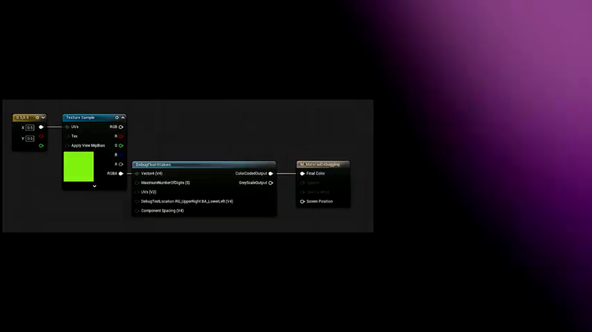

**采样特定位置的纹理值**：

如果你想查看纹理在特定UV坐标的值，可以：
1. 创建一个Constant2Vector节点，设置固定的UV坐标
2. 将其连接到Texture Sample节点
3. 使用DebugFloat3Values显示采样结果

这样整个材质表面会显示该特定点的纹理值，而不是每个像素显示自己的值。

### Plot Function On Graph


调试数学函数的可视化工具。

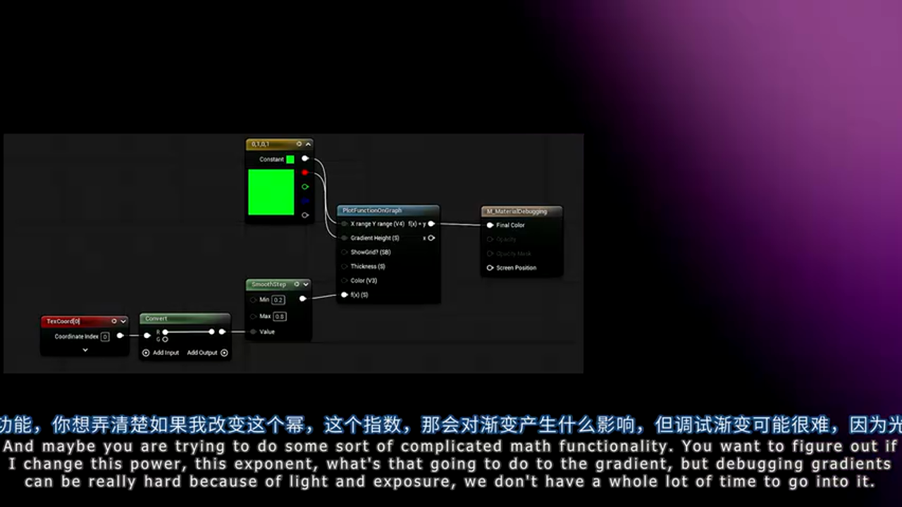

`PlotFunctionOnGraph`材质函数可以将一维函数绘制成图表：

```
输入参数：
- Function Input：函数表达式
- Graph Min/Max：图表的显示范围
- UV：用于定位图表的UV坐标
```


**重要配置：调整显示范围**

默认的显示范围是(-1, -1)到(1, 1)，但大多数渐变函数的值域是(0, 0)到(1, 1)。你需要创建一个Float4常量(0, 1, 0, 1)连接到Graph Min/Max输入。


应用场景：
- 调试自定义的衰减曲线
- 可视化复杂的数学函数
- 对比不同参数下的函数形状
- 验证插值算法

### 材质节点预览

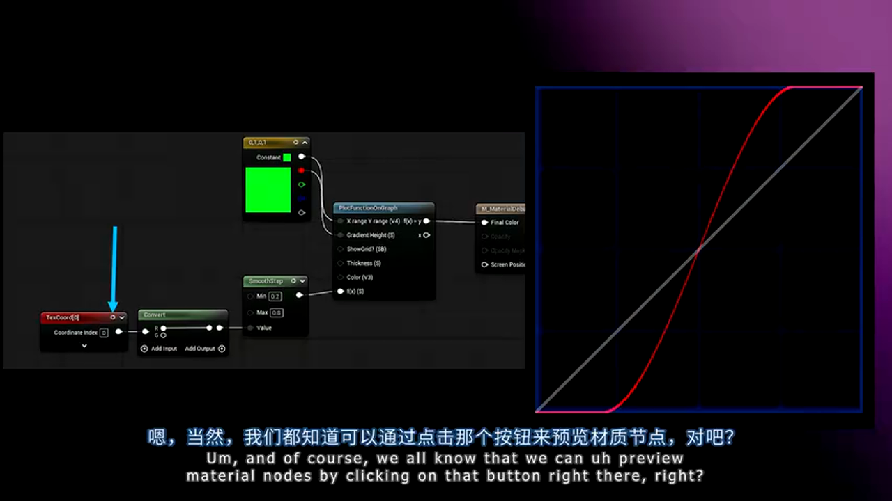

UE 5.6新增功能：材质节点输出预览。

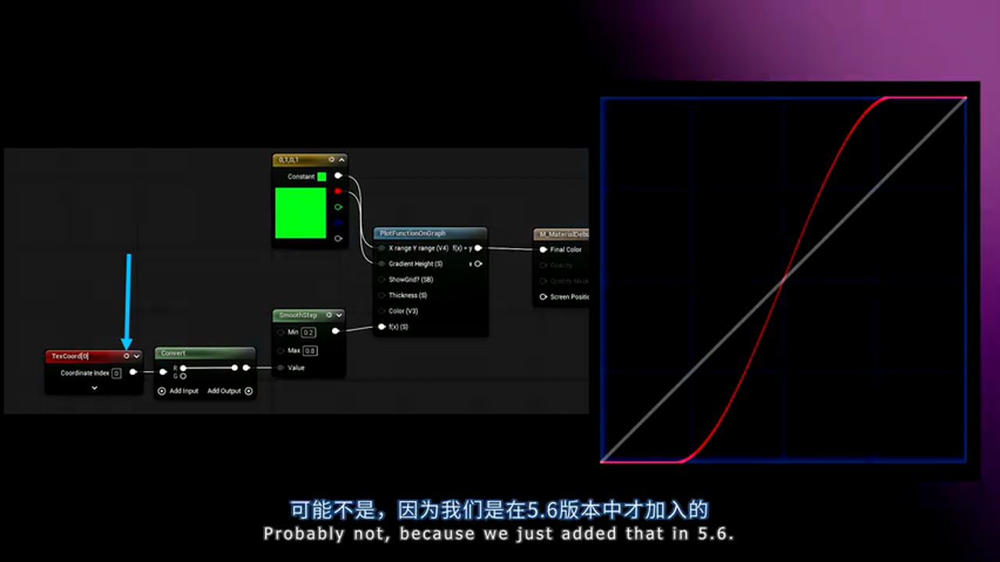

在任何材质节点的输出引脚上，现在有一个"眼睛"图标。点击它可以：
- 在材质预览窗口中直接显示该节点的输出
- 无需将节点连接到最终输出
- 快速对比不同节点的结果

这个功能极大地简化了材质调试流程，特别是在调试复杂的节点网络时。


**Convert节点**：

同样在UE 5.6中新增，类似于Niagara中的Convert节点：

```
功能：自动转换不同维度的向量
- Float → Float3：复制到所有通道
- Float3 → Float：取第一个通道或平均值
- Float3 → Float4：添加Alpha通道
```

这消除了手动使用Append、Break、Make Float等节点的需要。

### View Modes与Buffer Visualization

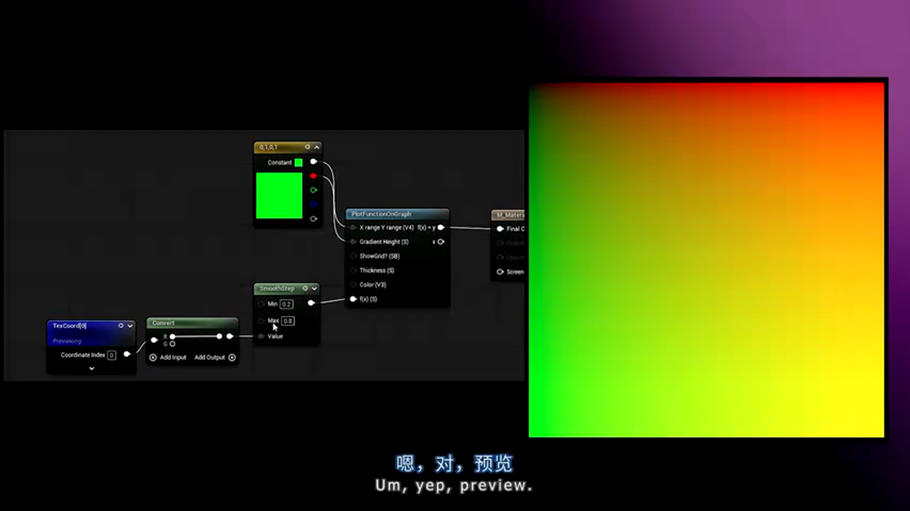

虚幻引擎提供了大量的视图模式（View Modes）用于调试渲染。


**在打包构建中启用View Modes**：

默认情况下，打包构建不包含View Modes功能。要启用它：

1. 打开项目设置（Project Settings）
2. 搜索"View Modes"
3. 启用"Enable Debug View Modes in Shipping Builds"

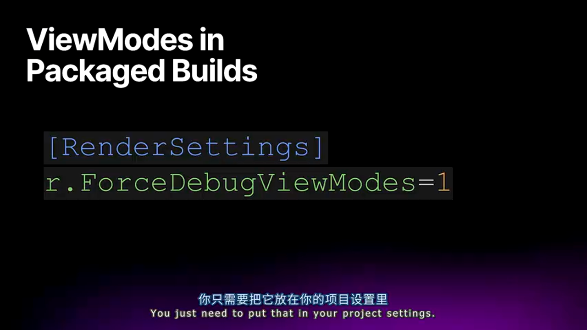

这允许你在最终构建中使用：
- Buffer Visualizations（如Albedo, Roughness, Normal）
- Lighting Only模式
- Nanite Overdraw
- Lumen可视化
- 等等

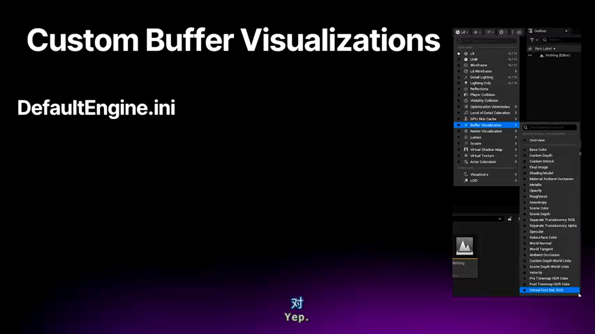

**自定义Buffer Visualizations**：

你可以添加自己的Buffer可视化模式！在`DefaultEngine.ini`中添加：

```ini
[/Script/Engine.BufferVisualizationData]
+Material=(Name="MyCustomBuffer", MaterialPath="/Game/Materials/M_CustomBuffer")
```


这个自定义材质可以访问所有GBuffer数据，你可以创建自定义的可视化逻辑，例如：
- 高亮显示特定Roughness范围的对象
- 可视化自定义的材质属性
- 创建复合的调试视图

### Pixel Inspector


Pixel Inspector是查询特定像素渲染信息的工具。


打开方式：
```
Window > Developer Tools > Pixel Inspector
```

功能：
- 显示鼠标悬停像素的所有GBuffer值
- 包括Albedo、Metallic、Roughness、Normal等
- 显示最终颜色和HDR值
- 显示深度和模板值

这消除了手动创建Debug材质来查询这些值的需要。Pixel Inspector直接从渲染管线中提取数据，确保准确性。

## 第十部分：Niagara粒子系统调试


Niagara是虚幻引擎的现代粒子系统，它的复杂性需要专门的调试工具。

### Niagara Debugger


Niagara Debugger提供了粒子系统的实时监控：

打开方式：
```
Window > Niagara > Niagara Debugger
```

功能：
- 显示所有活跃的Niagara系统实例
- 显示每个系统的粒子数量
- 显示性能统计（CPU和GPU时间）
- 可视化粒子属性
- 单步执行粒子模拟

Niagara Debugger的强大之处在于它可以：
1. 暂停特定的Niagara系统
2. 单步执行模拟
3. 查看每个粒子的属性值
4. 可视化粒子的生命周期

最佳实践：
- 使用Debugger识别粒子数量爆炸的问题
- 调试自定义模块的逻辑错误
- 优化粒子系统性能
- 验证粒子属性的计算结果

## 第十一部分：World Partition调试


World Partition是UE 5的开放世界流式加载系统，它的调试需要专门的工具。

### 编辑器中的Grid Preview

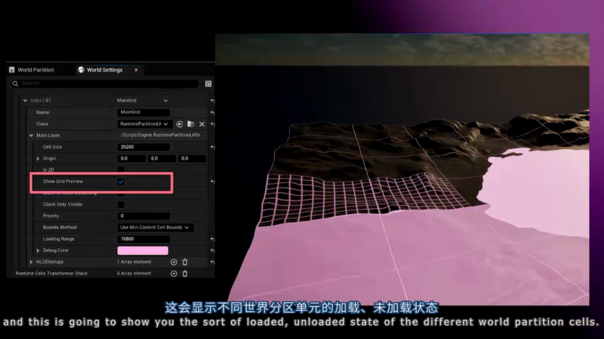

在World Settings中启用"Show Grid Preview"：


这会在视口中显示：
- World Partition的网格划分
- 每个Cell的加载状态（已加载/未加载）
- Cell的边界


最近的更新还添加了"即将加载"状态的显示，帮助你预测流式加载行为。

### 运行时调试


在游戏运行时，使用以下命令：

**2D可视化**：
```
wp.Runtime.Toggle.Runtime2D
```


这会在屏幕上显示一个2D小地图，显示：
- 玩家位置和朝向
- 加载半径
- 已加载的Cells（绿色）
- 未加载的Cells（灰色）
- 正在加载的Cells（黄色）

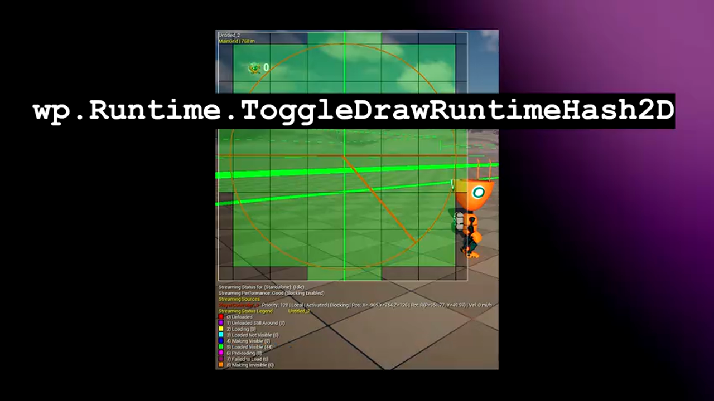

**3D可视化**：
```
wp.Runtime.Toggle.Runtime3D
```

这会在3D空间中显示World Partition的网格和加载状态，对于使用Spatial Hash（3D空间划分）的项目特别有用。

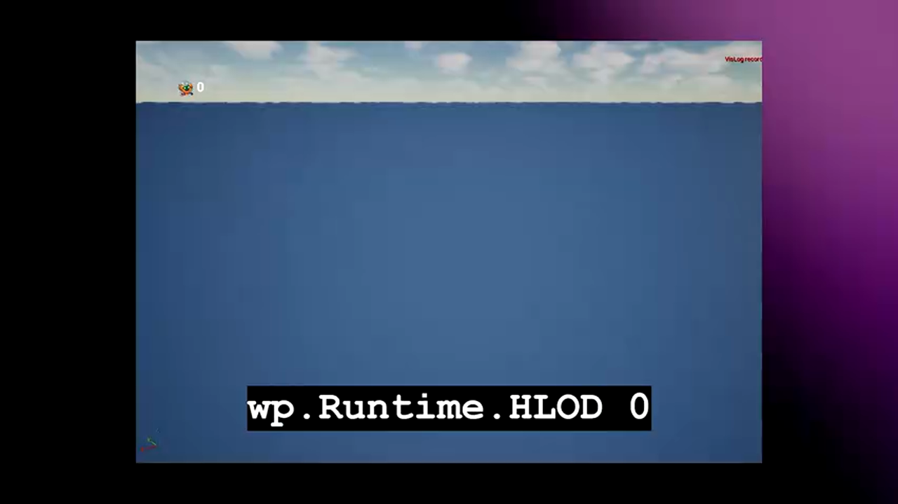

**禁用HLOD显示**：
```
wp.Runtime.HLOD 0
```


这会隐藏所有HLOD（Hierarchical Level of Detail）代理，只显示实际加载的几何体。这对于调试流式加载逻辑非常有用，可以清楚地看到哪些内容真正被加载了。

## 第十二部分：蓝图调试高级技巧

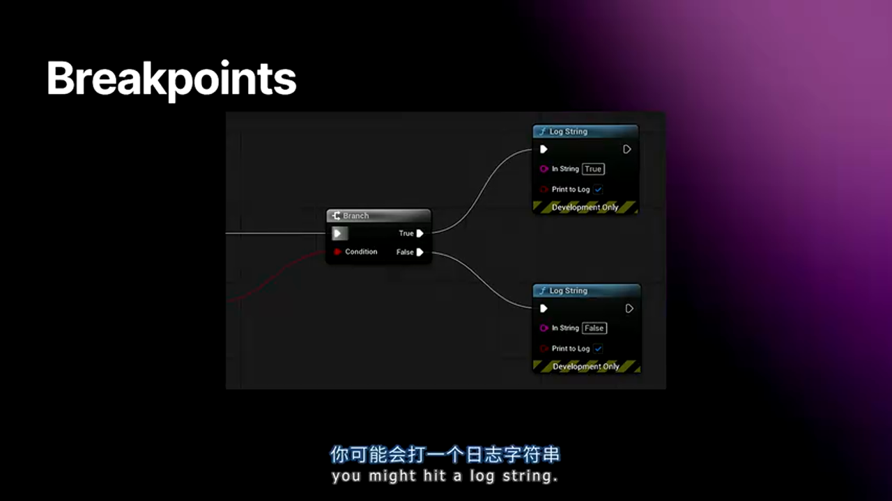

蓝图调试不应该依赖PrintString，虚幻引擎提供了更专业的工具。

### 断点系统


断点（Breakpoints）是最基础但最强大的调试工具：

```
设置断点：选中节点，按F9
或：右键节点 > Add Breakpoint
```


当执行到断点时：
- 游戏暂停
- 蓝图编辑器自动打开并聚焦到断点位置
- 可以查看所有变量的当前值
- 可以单步执行后续节点

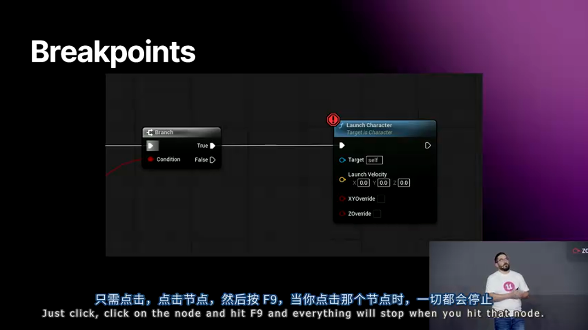

**Editor Utility Blueprints中的断点**：

一个重要的更新是，断点现在也支持Editor Utility Blueprints（编辑器工具蓝图）。


这意味着你可以调试：
- 编辑器工具的执行流程
- 资源批处理脚本
- 自定义的编辑器面板逻辑

这极大地提高了开发编辑器工具的效率。

### 调试组件


使用组件创建可视化调试信息：

**Text Render Component**：
- 在3D空间中显示文本
- 可以显示变量值
- 自动面向相机
- 支持颜色和大小调整


**Arrow Component**：
- 可视化方向向量
- 调试向量数学
- 显示物体的Forward/Right/Up向量
- 可以动态调整长度和颜色

实际应用：
```
使用Arrow Component调试向量数学：
1. 添加Arrow Component到Actor
2. 在Tick中更新Arrow的方向：
   SetWorldRotation(VectorToRotator(MyDirection))
3. 调整Arrow的长度表示向量的大小
```

### Draw Debug系列函数

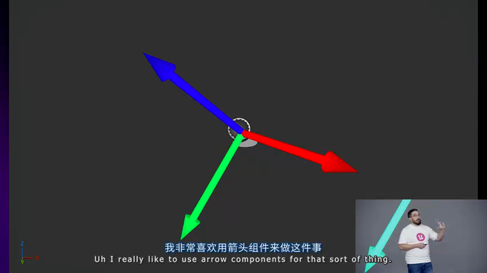

蓝图提供了一系列Draw Debug函数，无需创建组件：

- `DrawDebugSphere`：绘制球体
- `DrawDebugBox`：绘制盒体
- `DrawDebugLine`：绘制线段
- `DrawDebugArrow`：绘制箭头
- `DrawDebugString`：绘制3D文本
- `DrawDebugCapsule`：绘制胶囊体
- `DrawDebugCone`：绘制锥体


这些函数的优势：
- 只在开发构建中执行（Shipping构建中自动移除）
- 性能开销低
- 不会在Outliner中创建额外对象
- 支持持续时间和颜色自定义


最佳实践：
- 使用DrawDebugLine可视化射线检测
- 使用DrawDebugSphere标记重要位置
- 使用DrawDebugArrow显示力的方向
- 使用DrawDebugString显示动态信息

### Visual Logger


Visual Logger是C++的调试工具，但理解它对蓝图开发者也有价值。


Visual Logger宏：
```cpp
// 基础日志
UE_VLOG(LogCategory, Log, TEXT("Message"));

// 条件日志
UE_CVLOG(Condition, LogCategory, Log, TEXT("Message"));

// 几何可视化
UE_VLOG_SEGMENT(Owner, Category, Log, Start, End, Color, TEXT("Label"));
UE_VLOG_LOCATION(Owner, Category, Log, Location, Radius, Color, TEXT("Label"));
UE_VLOG_BOX(Owner, Category, Log, Box, Color, TEXT("Label"));
```


Visual Logger的特点：
- 将日志和3D可视化结合
- 支持时间线回放
- 可以记录AI的决策过程
- 导出数据进行分析

虽然Visual Logger主要用于C++，但了解它的存在有助于理解引擎的调试哲学：将文本日志与空间可视化结合，提供更直观的调试体验。

## 第十三部分：编辑器自定义与工作流优化


除了调试工具，虚幻引擎还允许你自定义编辑器以提高效率。

### 自定义蓝图节点快捷键

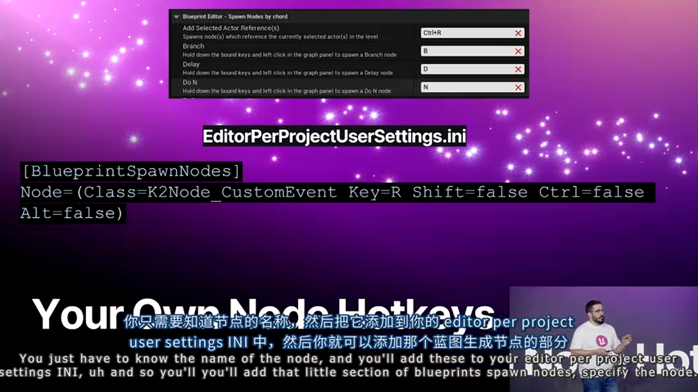

你可以为常用的蓝图节点创建快捷键！

配置文件位置：
```
[ProjectDir]/Config/DefaultEditorPerProjectUserSettings.ini
```


添加配置：
```ini
[BlueprintSpawnNodes]
+Node=(Class=K2Node_CallFunction, Title="Print String", Key=P)
+Node=(Class=K2Node_VariableGet, Title="Get Player Controller", Key=Ctrl+P)
+Node=(Class=K2Node_MacroInstance, Title="ForEachLoop", Key=F)
```


关键点：
- 必须使用节点的实际类名（如`K2Node_CallFunction`）
- 可以指定修饰键（Ctrl, Shift, Alt）
- 对于函数调用节点，使用Title匹配函数名

这个功能对于经常使用特定节点的开发者来说是巨大的效率提升。

材质编辑器也支持类似的自定义快捷键配置。

## 第十四部分：Build Graph调试

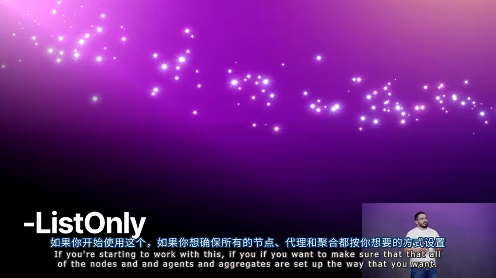

Build Graph是虚幻引擎的构建自动化系统，调试构建脚本需要专门的技巧。

### ListOnly模式


在执行Build Graph之前，使用`-ListOnly`参数预览构建结构：

```bash
RunUAT BuildGraph -Script=MyScript.xml -ListOnly
```

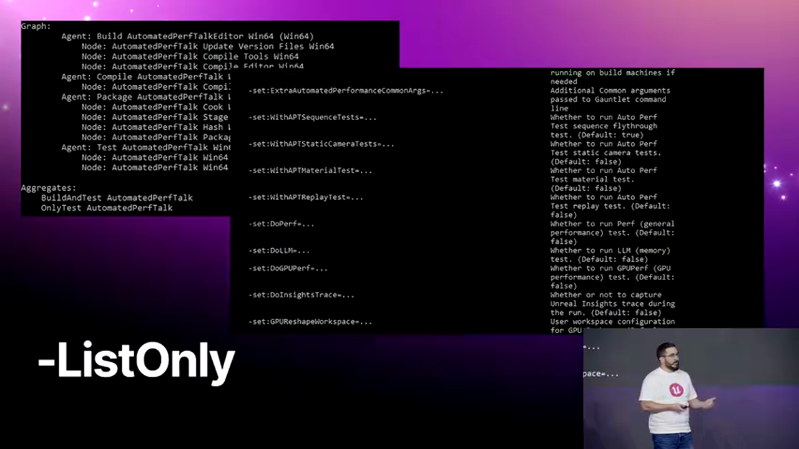

这会输出：
- 所有定义的Nodes（构建步骤）
- Agents（执行环境）
- Aggregates（节点组）
- 每个Node的依赖关系
- 所有可用的Options及其默认值和说明

这相当于Build Graph的"Help"命令，在编写复杂构建脚本时非常有用。

### Preprocess模式

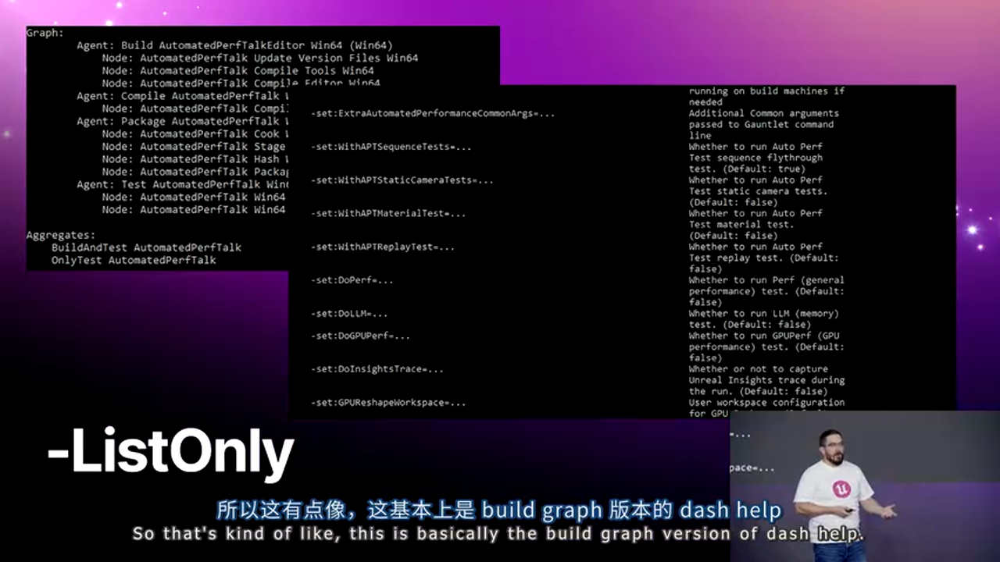

`-Preprocess`参数会展开Build Graph脚本，显示实际执行的命令：

```bash
RunUAT BuildGraph -Script=MyScript.xml -Preprocess -PreprocessedOutput=Output.xml
```

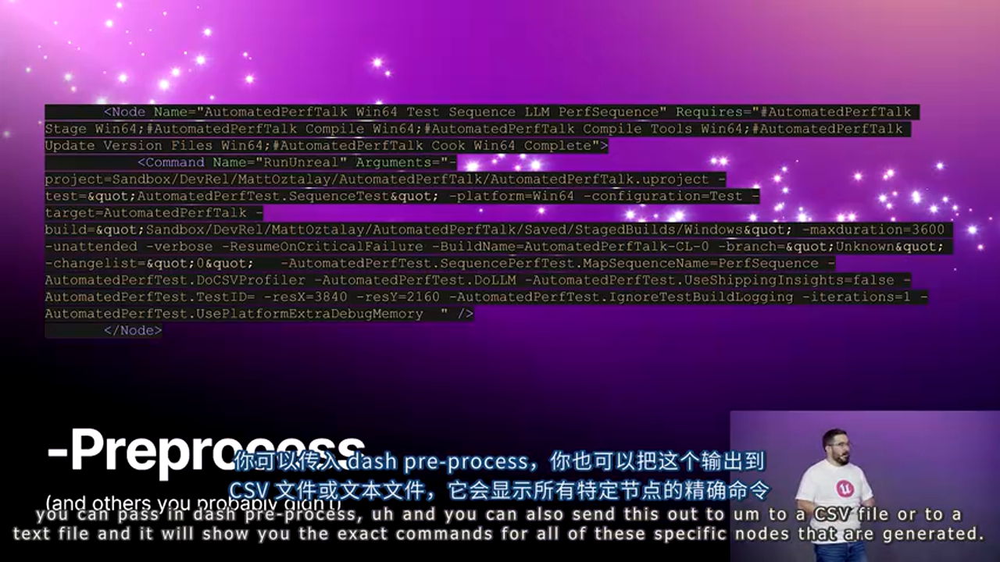

这会生成一个展开后的XML文件，包含：
- 所有变量替换后的实际值
- 展开的循环和条件
- 每个Node的完整命令行
- 解析后的依赖关系


使用场景：
- 调试变量替换问题
- 验证条件逻辑
- 理解复杂的Build Graph脚本
- 生成构建文档

## 总结与最佳实践

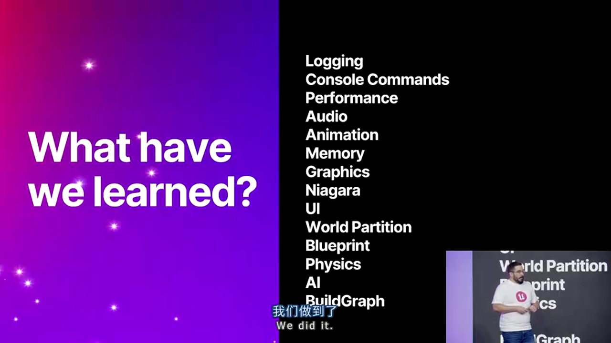

我们已经深入探讨了虚幻引擎的完整调试工具链，从基础的PrintString到高级的Unreal Insights。


**核心要点回顾**：

1. **日志系统**：
   - 使用Print Text而不是Print String
   - 利用Key属性固定显示位置
   - 使用Raise Script Error报告错误
   - C++中使用UE_CLOG进行条件日志

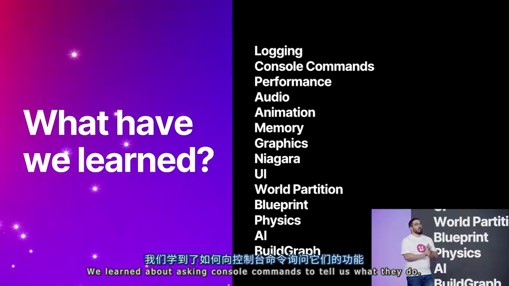

2. **Unreal Insights**：
   - 贯穿所有调试领域的核心工具
   - 使用Trace Regions标记游戏阶段
   - GPU Profiler 2.0统一了性能分析
   - Memory Insights提供深度内存分析

3. **专业工具**：
   - Audio Insights：音频系统分析
   - Animation Rewind Debugger：动画回放调试
   - Chaos Visual Debugger：物理系统分析
   - Gameplay Debugger：AI和游戏逻辑可视化
   - Widget Reflector：UI层级和交互调试
   - Niagara Debugger：粒子系统监控


4. **工作流优化**：
   - 使用断点而不是PrintString
   - 利用BugIt/BugItGo进行位置标记
   - 自定义蓝图节点快捷键
   - 使用MVVM简化UI调试

**调试思维的转变**：

传统思维：遇到问题 → 添加PrintString → 运行游戏 → 查看输出 → 修改代码 → 重复

专业思维：遇到问题 → 选择合适的调试工具 → 使用Insights录制 → 深度分析 → 理解根本原因 → 一次性修复

**建立调试工具箱**：

根据问题类型选择工具：
- 性能问题：Unreal Insights + GPU Profiler 2.0
- 内存问题：Memory Insights + Render Resource Viewer
- 渲染问题：Pixel Inspector + Buffer Visualizations
- 动画问题：Rewind Debugger
- AI问题：Gameplay Debugger + State Tree Debugger
- UI问题：Widget Reflector + Slate Insights
- 物理问题：Chaos Visual Debugger + 碰撞可视化

**持续学习**：

虚幻引擎的调试工具在不断进化：
- UE 5.6引入了Raise Script Error和材质节点预览
- 每个版本都在增强Insights的功能
- 关注Epic Developer Community的更新
- 参与社区讨论，分享调试经验


**结语**：

掌握这些调试工具不仅能提高开发效率，更重要的是能帮助你深入理解虚幻引擎的内部运作机制。当你能够熟练使用Unreal Insights分析性能瓶颈，使用Gameplay Debugger追踪AI决策，使用Rewind Debugger回放动画执行，你就真正超越了PrintString，成为了专业的虚幻引擎开发者。

记住：最好的调试工具是你已经掌握的那个。从今天开始，逐步将这些工具整合到你的日常开发流程中，你会发现调试不再是痛苦的过程，而是理解和优化系统的有力手段。

---

**参考资源**：

- Epic Developer Community：https://dev.epicgames.com/
- Unreal Engine Documentation：https://docs.unrealengine.com/
- Unreal Insights文档：https://docs.unrealengine.com/5.3/en-US/unreal-insights-in-unreal-engine/
- Chaos Visual Debugger教程：在Epic Developer Community搜索"Chaos Visual Debugger"

**致谢**：

感谢Matt Oztalay的精彩分享，以及Epic Games开发者关系团队为社区提供的持续支持。

---

*本文由AI根据视频内容生成，如有技术细节需要进一步确认，请参考官方文档或在UE5技术交流群中讨论。*


