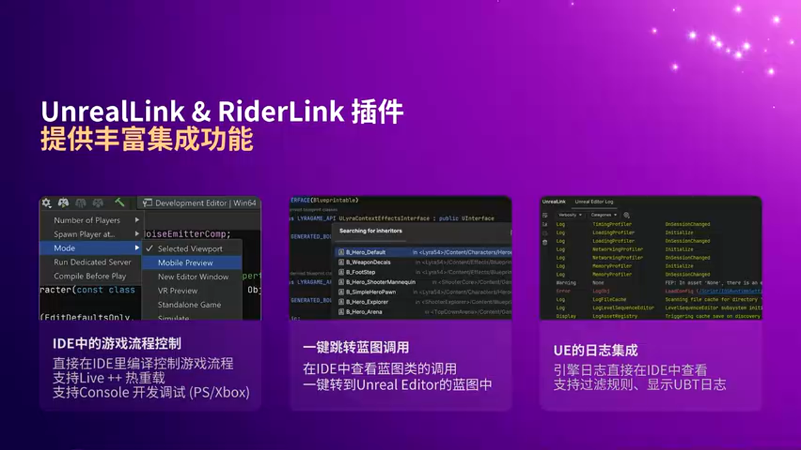
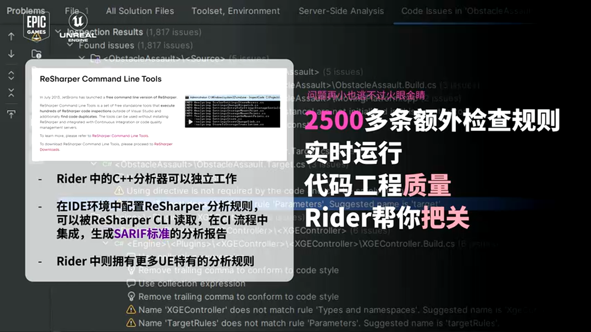
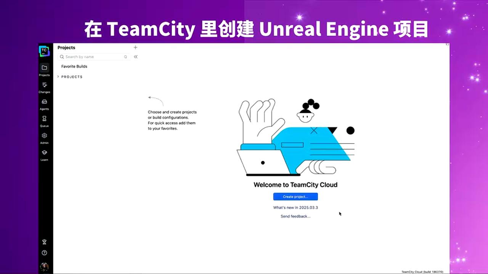
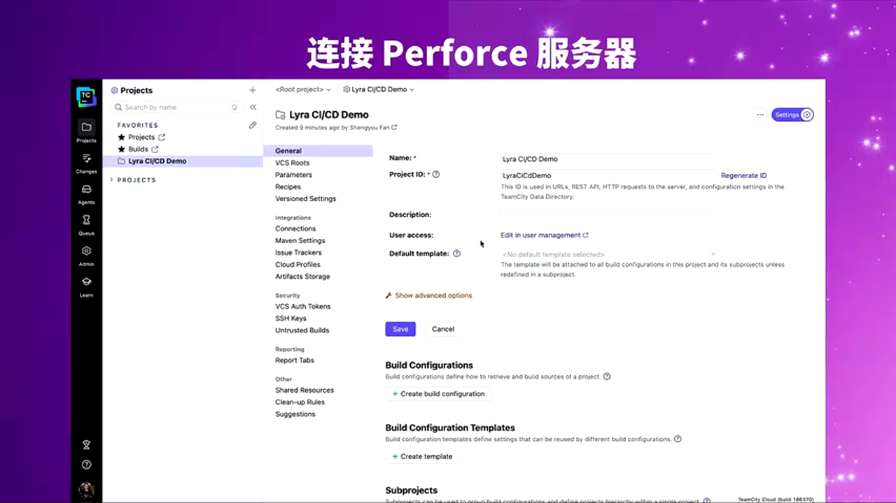
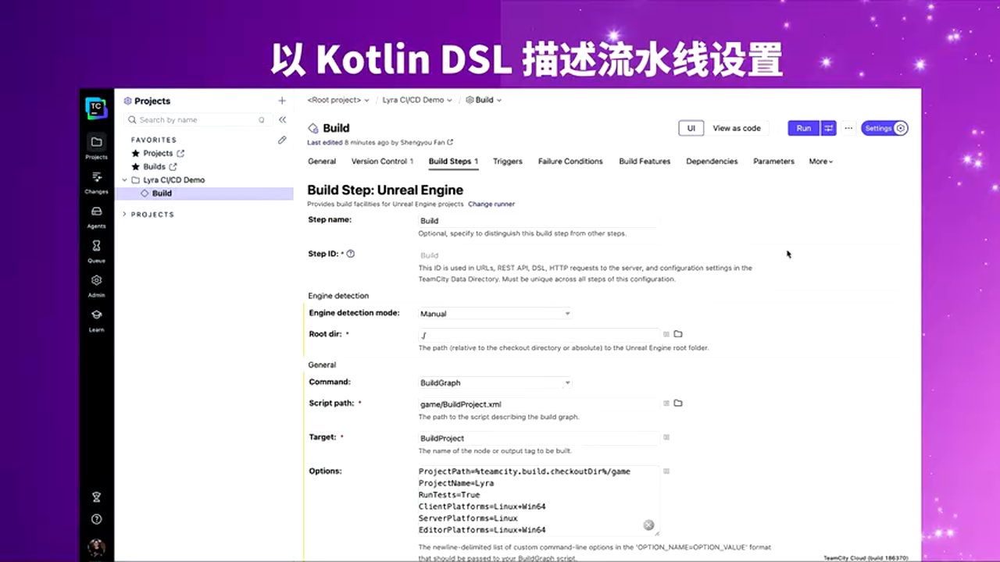
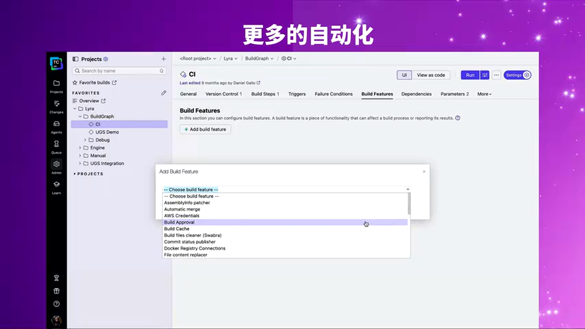
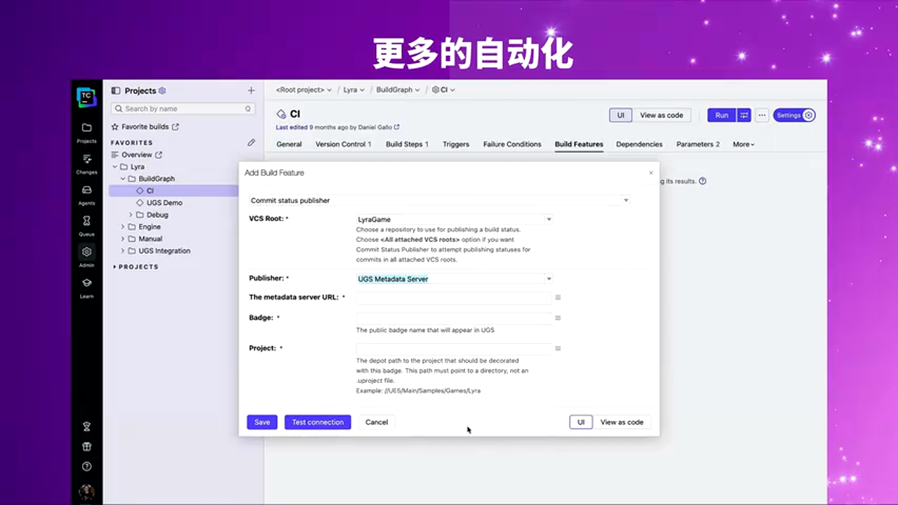
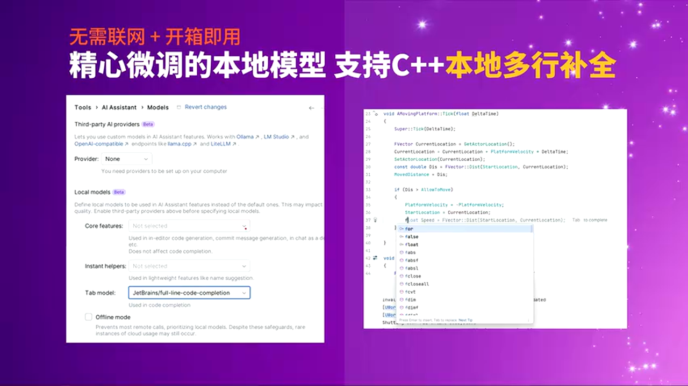
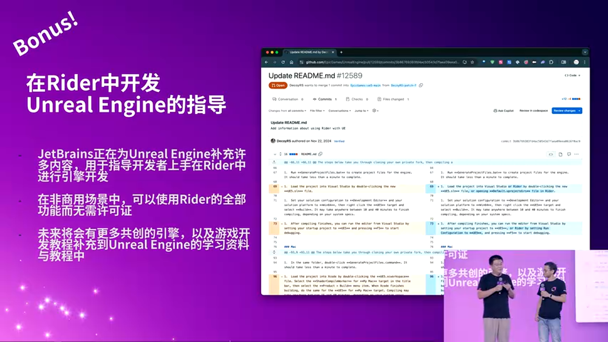

# AI 时代的虚幻引擎开发效率革命：深度解析 Rider 与 TeamCity 的协同开发实践

---


## 加入 UE5 技术交流群

如果您对虚幻引擎5的图形渲染技术感兴趣,欢迎加入我们的 **UE5 技术交流群**!

扫描上方二维码添加个人微信 **wlxklyh**,备注"UE5技术交流",我会拉您进群。

在技术交流群中,您可以:
- 与其他UE开发者交流渲染技术经验
- 获取最新的GDC技术分享和解读
- 讨论图形编程、性能优化、构建工具流、动画系统等话题
- 分享引擎架构、基建工具等项目经验和技术难题

---

> **本文基于视频内容生成**
> 视频来源: https://www.bilibili.com/video/BV1Nq2PBqEm6
> 演讲者: 孙涛、范圣佑 (JetBrains)
> 视频时长: 38分43秒
> 生成时间: 2026-01-11

---

## 导读

> 在 AI Coding 时代,如何构建高效的虚幻引擎开发工作流?本文深度解析 JetBrains Rider IDE 与 TeamCity CI/CD 平台的协同实践,涵盖从代码编写、调试、质量分析到自动化构建发布的完整流程。
>
> 核心观点:
> - Rider 为 Unreal Engine 提供了原生级的 C++ 和蓝图深度集成支持
> - TeamCity 通过可视化配置和弹性构建池实现游戏项目的高效 CI/CD
> - AI 编码助手 (JetBrains AI、Junie) 与 IDE 的无缝集成正在重塑开发体验
>
> **前置知识**: Unreal Engine 基础、C++ 编程、CI/CD 概念

---

## 一、背景与痛点:为什么游戏开发需要专业化 IDE?

### 1.1 游戏开发的复杂性挑战

Unreal Engine 作为业界领先的游戏引擎,其开发工作流涉及多个维度的复杂性:


**代码层面的挑战**:
- **C++ 与蓝图混合开发**: 需要在原生代码和可视化脚本之间频繁切换
- **宏系统的特殊性**: UE 使用大量反射宏 (如 `UCLASS`、`UPROPERTY`),传统 IDE 难以准确解析
- **内存布局敏感性**: 游戏对象的内存对齐、Pack 策略直接影响性能,需要实时可视化
- **调试复杂度**: 调用栈同时包含 C++、蓝图、引擎底层代码,传统调试器难以过滤

**团队协作的痛点**:
- **构建时间长**: UE 项目动辄数 GB 代码,编译耗时以小时计
- **版本管理特殊**: 游戏行业常用 Perforce 而非 Git,需要工具链原生支持
- **CI/CD 门槛高**: 传统 CI 工具对 UE 的 Build Tool、Cook、Package 流程支持不足

### 1.2 为什么选择 Rider + TeamCity?


**Rider 的核心价值**:
- 基于 IntelliJ Platform,继承了 JetBrains 全家桶的统一体验
- 为 Unreal Engine 定制了专门的语言服务、调试器和蓝图集成
- 原生 C++ 支持 + .NET ReSharper 技术加持

**TeamCity 的优势**:
- 原生支持 Perforce、Git、GitLab 等多种版本控制系统
- 可视化 Pipeline 配置,同时支持 Kotlin DSL 实现 Configuration as Code
- 云端弹性构建池 (Cloud Build Pool),按需扩容节省成本

---

## 二、Rider 核心特性:为 Unreal Engine 量身定制的开发体验

### 2.1 UE 宏注解的智能识别与补全


Rider 针对 Unreal Engine 的反射宏系统提供了**原生级代码理解能力**:

**UCLASS 宏补全**:
```cpp
// 当你输入 UCLASS 时,Rider 会自动提示可用的 Specifier
UCLASS(Blueprintable, BlueprintType)
class MYGAME_API AMyCharacter : public ACharacter
{
    GENERATED_BODY()
};
```

**UPROPERTY 宏智能提示**:
```cpp
// Rider 能识别 UPROPERTY 的所有有效参数,并提供实时校验
UPROPERTY(EditAnywhere, BlueprintReadWrite, Category = "Movement")
float WalkSpeed = 600.0f;

// 错误示例会被标红:无效的 Specifier 组合
UPROPERTY(BlueprintReadOnly, BlueprintReadWrite) // 冲突!
float Health;
```

**设计优势**:
- **Anti-Hallucination**: 代码补全基于引擎源码的静态分析,而非 AI 猜测
- **实时校验**: 在编写阶段就能发现宏参数冲突,避免编译失败
- **跨文件引用**: 宏展开后的类型信息能被准确追踪,支持跨模块跳转

### 2.2 内存布局可视化:解决性能优化的"最后一公里"


Unreal Engine 的对象内存布局直接影响缓存命中率和加载性能。Rider 提供了**实时内存布局视图**:

**功能演示**:
1. 将光标移动到任意 `USTRUCT` 或 `UCLASS` 声明处
2. Rider 自动计算并显示:
   - 每个字段的内存偏移量 (Offset)
   - 结构体总大小 (Total Size)
   - 内存对齐填充 (Padding)

**典型应用场景**:
```cpp
USTRUCT()
struct FPlayerData
{
    UPROPERTY()
    bool bIsAlive;        // 1 byte
                          // [Padding: 3 bytes]
    UPROPERTY()
    float Health;         // 4 bytes
    UPROPERTY()
    int32 Level;          // 4 bytes
    UPROPERTY()
    FVector Location;     // 12 bytes
};
// Total Size: 24 bytes (包含隐式填充)
```

**优化建议**:
> **最佳实践**: 将小字段 (bool、uint8) 聚合放置,减少 Padding 浪费。
> **性能影响**: 在拥有百万级实例的关卡中,优化后的内存布局可减少 5-10% 的内存占用。

### 2.3 混合调试:C++ 与蓝图的调用栈过滤


Rider 的调试器支持**按来源过滤调用栈**:

**问题场景**:
- 在开发 Gameplay 逻辑时,调用栈同时包含:
  - 引擎底层的 C++ 代码 (如 Tick、Render 线程)
  - 你的游戏 C++ 代码
  - 蓝图虚拟机的执行帧

**Rider 的解决方案**:
1. **蓝图调用栈视图**: 只显示蓝图节点的执行路径
2. **C++ 调用栈视图**: 过滤掉蓝图 VM 的干扰帧
3. **混合视图**: 完整展示跨层调用关系

**进阶调试功能**:
- **条件断点 (Conditional Breakpoint)**: `if (PlayerHealth < 10) { break; }`
- **数据断点 (Data Breakpoint)**: 监控特定变量的写操作
- **命中次数断点**: 循环中第 N 次执行时才中断

### 2.4 Rider Link:无缝集成 Unreal Editor



**Rider Link** 是连接 IDE 与 Unreal Editor 的桥梁,实现了**双向通信**:

**核心功能**:

> **功能 1: IDE 内游戏流程控制**
> - 直接在 Rider 中启动/暂停/停止游戏
> - 控制玩家数量 (多人游戏测试)
> - 支持主机开发 (PlayStation、Xbox)

> **功能 2: 蓝图双向跳转**
> - C++ 类的 `UFUNCTION` 右键 → "Find Usages in Blueprints"
> - 蓝图事件节点 Ctrl+Click → 跳转到 C++ 实现

> **功能 3: 日志增强**
> - 支持正则表达式过滤日志
> - 按类别 (LogTemp、LogAI) 分组显示
> - 比 Unreal Editor 自带的 Output Log 更高效

**无需重启的快速迭代**:
```cpp
// 在 Rider 中创建新的 UE C++ 类
右键项目 → New → Unreal Class → 填写类名
// Rider Link 自动:
// 1. 生成 .h 和 .cpp 模板代码
// 2. 更新 Build.cs 模块依赖
// 3. 触发 Hot Reload (无需重启 Editor)
```

---

## 三、代码质量保障:2500+ 检查规则的实时守护

### 3.1 实时代码分析的价值



Rider 内置了 **2500+ 代码检查规则**,其中包含专门针对 Unreal Engine 的检查项:

**UE 特定检查示例**:
1. **宏使用错误检测**:
   ```cpp
   // ❌ 错误:UPROPERTY 不能用于静态成员
   UPROPERTY()
   static int32 GlobalCounter;

   // ✅ 正确
   static int32 GlobalCounter;
   ```

2. **生命周期函数命名检查**:
   ```cpp
   // ❌ 拼写错误会导致函数不被调用
   void BeginPaly() override;  // Rider 会标红提示

   // ✅ 正确
   void BeginPlay() override;
   ```

3. **蓝图可调用函数规范**:
   ```cpp
   // ❌ BlueprintCallable 函数必须有返回值或标记为 BlueprintPure
   UFUNCTION(BlueprintCallable)
   void GetPlayerName(FString& OutName);  // 警告:应该返回值

   // ✅ 更好的设计
   UFUNCTION(BlueprintCallable)
   FString GetPlayerName() const;
   ```

### 3.2 ReSharper Command Line Tool:CI 中的质量门禁


**免费工具**用于将 Rider 的检查规则集成到 CI 流程:

**典型 CI 集成脚本**:
```bash
# 1. 安装 ReSharper CLI
dotnet tool install -g JetBrains.ReSharper.GlobalTools

# 2. 运行代码检查
jb inspectcode MyGame.sln \
  --output=inspection-results.sarif \
  --severity=WARNING \
  --exclude=**/*.generated.cpp

# 3. 检查是否有严重问题
if grep -q "ERROR" inspection-results.sarif; then
  echo "❌ 代码质量检查失败,阻止合并!"
  exit 1
fi
```

**SARIF 格式的价值**:
- **标准化**: SARIF 是 OASIS 标准,可被 GitHub、GitLab、SonarQube 解析
- **可视化**: 在 PR 页面直接展示代码问题的行号和建议修复
- **可追溯**: 历史记录每次提交的代码质量趋势

**方案对比:ReSharper CLI vs 传统静态分析工具**

> **方案 A: ReSharper Command Line Tool**
> - 🟢 优势: 与开发者本地 IDE 使用相同规则,无感知差异
> - 🟢 优势: 支持 UE 宏展开后的语义分析
> - 🔴 劣势: 需要 .NET SDK 环境,首次运行较慢
> - 🎯 适用场景: 追求 IDE 与 CI 一致性体验的团队

> **方案 B: Clang-Tidy + PVS-Studio**
> - 🟢 优势: 纯 C++ 工具,集成简单
> - 🔴 劣势: 无法理解 UE 宏语义,误报率高
> - 🔴 劣势: 需要单独维护检查规则配置文件
> - 🎯 适用场景: 已有 Clang 工具链的团队

---

## 四、TeamCity CI/CD 实战:从代码提交到游戏发布的自动化流程

### 4.1 项目初始化与版本控制集成



**第一步:连接代码仓库**

TeamCity 支持多种 VCS (Version Control System):


**Git 仓库配置示例**:
```yaml
# VCS Root 配置 (Kotlin DSL)
object GitVcsRoot : GitVcsRoot({
    name = "MyUEProject"
    url = "https://github.com/mycompany/ue-project.git"
    branch = "refs/heads/main"
    authMethod = password {
        userName = "ci-bot"
        password = "%github.token%"
    }
})
```

**Perforce 支持的特殊性**:



游戏行业常用 Perforce (P4) 管理大型资产 (模型、纹理、音频)。TeamCity 提供原生支持:

```kotlin
object P4VcsRoot : VcsRoot({
    name = "Perforce Main Depot"
    type = "perforce"
    param("port", "ssl:perforce.company.com:1666")
    param("user", "teamcity-agent")
    param("secure:password", "%p4.password%")
    param("stream", "//MyGame/main")
    param("label-pattern", "Release-*")
})
```

**关键参数说明**:
- `stream`: P4 的 Stream 工作流模式,类似 Git 的分支
- `label-pattern`: 只触发特定标签的构建 (如发布版本)

### 4.2 构建配置:可视化 Pipeline vs Kotlin DSL


TeamCity 提供**两种配置方式**,适应不同团队习惯:

**方式 1: Web UI 可视化配置**

1. **创建 Build Step**:
   - 类型: Command Line
   - 脚本内容:
     ```bash
     # 使用 UE 的 RunUAT 工具构建项目
     "%UE_ROOT%\Engine\Build\BatchFiles\RunUAT.bat" BuildCookRun \
       -project="%WORKSPACE%\MyGame.uproject" \
       -platform=Win64 \
       -clientconfig=Development \
       -cook -stage -pak -archive \
       -archivedirectory="%ARTIFACTS_DIR%"
     ```

2. **添加测试步骤**:
   ```bash
   # 运行自动化测试
   "%UE_ROOT%\Engine\Binaries\Win64\UnrealEditor-Cmd.exe" \
     "%WORKSPACE%\MyGame.uproject" \
     -ExecCmds="Automation RunTests System.Core" \
     -TestExit="Automation Test Queue Empty" \
     -ReportOutputPath="%ARTIFACTS_DIR%\TestReport.json"
   ```

**方式 2: Kotlin DSL (Configuration as Code)**


```kotlin
object BuildAndTest : BuildType({
    name = "Build & Test - Win64"

    vcs {
        root(GitVcsRoot)
    }

    steps {
        // Step 1: 编译 C++ 代码
        script {
            name = "Compile UE Project"
            scriptContent = """
                "%UE_ROOT%\Engine\Build\BatchFiles\Build.bat" \
                  MyGameEditor Win64 Development \
                  "%WORKSPACE%\MyGame.uproject"
            """.trimIndent()
        }

        // Step 2: Cook 资源
        script {
            name = "Cook Content"
            scriptContent = """
                "%UE_ROOT%\Engine\Binaries\Win64\UnrealEditor-Cmd.exe" \
                  "%WORKSPACE%\MyGame.uproject" \
                  -run=cook -targetplatform=Win64
            """.trimIndent()
        }

        // Step 3: 打包
        script {
            name = "Package Game"
            scriptContent = """
                "%UE_ROOT%\Engine\Build\BatchFiles\RunUAT.bat" BuildCookRun \
                  -project="%WORKSPACE%\MyGame.uproject" \
                  -archivedirectory="%system.artifacts.dir%"
            """.trimIndent()
        }
    }

    // 构建触发器:每次 Push 自动构建
    triggers {
        vcs {
            branchFilter = "+:refs/heads/*"
            triggerRules = "-:comment=^(?i).*\\[skip ci\\].*:**"
        }
    }

    // 构建特性:自动上传元数据到 UGS
    features {
        commitStatusPublisher {
            vcsRootExtId = GitVcsRoot.id
            publisher = ugs {
                serverUrl = "http://ugs-metadata.company.com"
            }
        }
    }
})
```

**Kotlin DSL 的优势**:
- **版本控制**: Pipeline 配置本身也是代码,可以 PR Review
- **模板化**: 通过 Kotlin 继承和泛型复用配置
- **类型安全**: IDE 提供自动补全,避免拼写错误

### 4.3 弹性构建池:云端按需扩容



**问题场景**:
- UE 项目全量构建耗时 2-3 小时
- 本地构建服务器数量有限,高峰期排队严重

**TeamCity Cloud Build Pool 的解决方案**:


```kotlin
// Cloud Agent 配置
cloudProfile {
    id = "aws-spot-instances"
    name = "AWS Spot Instances for UE Build"

    params {
        param("cloud-code", "amazon")
        param("region", "us-west-2")
        param("instance-type", "c5.9xlarge") // 36 核心,72GB 内存
        param("subnet-id", "subnet-abc123")
        param("image-id", "ami-ue5-build-v1.0")
    }

    // 按需启动策略
    agentPushPreset {
        profileId = "aws-spot-instances"
        agentPool = "UE-Build-Pool"
        startPolicy {
            // 当队列中有超过 2 个任务等待时,启动新实例
            queuedBuildCount = 2
            // 最多同时运行 10 个 Agent
            maxInstances = 10
        }
        terminatePolicy {
            // 空闲 30 分钟后自动关闭实例
            idleTime = 30
        }
    }
}
```

**成本优化**:
- **Spot Instance**: 比按需实例便宜 70%
- **自动关闭**: 避免忘记关机导致的费用浪费
- **实际案例**: 某游戏团队从本地 5 台服务器迁移到云端池,高峰期构建时间从 4 小时降至 45 分钟

### 4.4 Build Features:自动化的"最后一公里"



**Feature 1: Commit Status Publisher**

将构建状态同步到 Perforce 的 UGS (Unreal Game Sync) 元数据服务器:



```kotlin
features {
    commitStatusPublisher {
        vcsRootExtId = P4VcsRoot.id
        publisher = ugs {
            serverUrl = "http://ugs-metadata.internal.company.com"
            // 构建成功后自动标记 CL (Changelist) 为 "Good"
            markAsGoodOnSuccess = true
        }
    }
}
```

**效果**: 团队成员在 UGS 客户端可以看到每个 CL 的构建状态,避免同步到坏版本。

**Feature 2: 自动打 Tag/Label**

```kotlin
features {
    vcsLabeling {
        vcsRootId = GitVcsRoot.id
        labelingPattern = "build-%build.number%"
        successfulOnly = true
    }
}
```

**Feature 3: 构建缓存**

```kotlin
features {
    cacheS3 {
        bucketName = "teamcity-build-cache"
        cacheKeyPattern = "%system.build.vcs.number%"
        cachePaths = """
            %UE_ROOT%\Engine\Intermediate\Build\Win64
            %UE_ROOT%\Engine\Saved\BuildGraph
        """.trimIndent()
    }
}
```

**缓存策略**:
- 首次构建:2 小时
- 增量构建 (有缓存):15 分钟

---

## 五、Rider 与 TeamCity 的无缝集成

### 5.1 从 IDE 直接触发 CI 构建


**TeamCity Integration Plugin**:
1. 在 Rider 中安装插件:Settings → Plugins → 搜索 "TeamCity"
2. 连接服务器:Settings → TeamCity → 填写 URL 和 Token
3. 在编辑器底部 "TeamCity" Tab 查看构建状态

**典型工作流**:
```
1. 开发者在 Rider 中修改代码
2. 提交到功能分支:git push origin feature/new-weapon
3. Rider 底部自动显示:🔄 Build #123 正在运行...
4. 10 分钟后:✅ Build #123 成功,可以合并到 main
```

### 5.2 构建失败时的快速定位


**场景**: CI 构建失败,错误信息:
```
Error: Undefined symbol 'AMyCharacter::FireWeapon()'
```

**在 Rider 中定位**:
1. TeamCity 插件自动高亮失败步骤
2. 点击错误行 → 跳转到对应的 `.cpp` 文件
3. Rider 提示:该函数在 `.h` 中声明但未实现

**修复代码后**:
- 右键 TeamCity Tab → "Run Custom Build"
- 选择分支:feature/new-weapon
- 无需等待自动触发,立即验证修复结果

---

## 六、AI 时代的开发辅助:JetBrains AI 与 Junie

### 6.1 AI 辅助编码的三种模式



**模式 1: 云端智能补全 (Cloud Full-Line Completion)**

```cpp
// 场景:在 Character 类中添加新功能
class AMyCharacter : public ACharacter
{
    // 输入注释后,AI 自动生成完整代码
    // 开火武器
    UFUNCTION(BlueprintCallable)
    void FireWeapon()  // ← AI 自动补全函数体
    {
        if (CurrentWeapon == nullptr) return;

        FVector MuzzleLocation = GetMesh()->GetSocketLocation("MuzzleSocket");
        FRotator MuzzleRotation = GetControlRotation();

        FActorSpawnParameters SpawnParams;
        SpawnParams.Owner = this;
        GetWorld()->SpawnActor<AProjectile>(
            ProjectileClass,
            MuzzleLocation,
            MuzzleRotation,
            SpawnParams
        );
    }
};
```

**设计理念**:
- **上下文感知**: 分析当前项目的代码风格和 UE API 使用习惯
- **多行生成**: 不仅是单行补全,可以生成整个函数实现

**模式 2: 本地多行补全 (Local Multi-Line Completion)**


**适用场景**:
- 受限网络环境 (内网开发)
- 数据安全要求 (不允许代码上传到云端)

**技术实现**:
- 基于本地小型语言模型 (约 1GB)
- 仅分析项目内代码,无需联网
- 速度更快 (< 100ms 延迟)

**对比云端模型**:
- 🔴 劣势:生成质量略低 (无法利用全球代码知识库)
- 🟢 优势:零网络依赖,响应速度更快

**模式 3: Coding Agent - Junie**


**Junie** 是 JetBrains 推出的**智能编码助手**,从 Rider 2025.2 版本开始支持:

**核心能力**:
1. **自然语言需求 → 代码实现**:
   ```
   用户: "创建一个可以发射激光的武器类,继承自 AWeapon,支持蓄力射击"

   Junie: [生成以下代码]
   ```

   ```cpp
   UCLASS()
   class ALaserWeapon : public AWeapon
   {
       GENERATED_BODY()

   public:
       UPROPERTY(EditAnywhere, BlueprintReadWrite)
       float ChargeTime = 2.0f;  // 蓄力时长

       UPROPERTY(EditAnywhere, BlueprintReadWrite)
       float MaxDamage = 100.0f; // 满蓄力伤害

   private:
       float CurrentCharge = 0.0f;
       FTimerHandle ChargeTimerHandle;

   public:
       void StartCharging();
       void StopCharging();
       void FireLaser(float ChargePercent);
   };

   // [Junie 自动生成] 实现文件
   void ALaserWeapon::StartCharging()
   {
       GetWorld()->GetTimerManager().SetTimer(
           ChargeTimerHandle,
           [this]() { CurrentCharge = FMath::Min(CurrentCharge + 0.1f, 1.0f); },
           0.1f,
           true
       );
   }
   ```

2. **重构与优化建议**:
   ```
   用户: 选中一段代码 → 右键 → "Junie: Optimize This"

   Junie: "检测到该函数在 Tick 中调用,建议改为事件驱动..."
   ```

3. **解释现有代码**:
   ```
   用户: 选中引擎源码中的 FSceneView 结构体 → "Junie: Explain"

   Junie: "FSceneView 表示相机的一次渲染视图,包含投影矩阵、
          视锥体剔除参数、后处理设置等。它在渲染线程中使用..."
   ```

### 6.2 未来展望:Agent Platform 的统一生态


JetBrains 正在构建 **Agent Platform**,目标是:
- 统一各种 AI Coding 工具的交互界面
- 允许第三方 Agent (如 GitHub Copilot、Cursor) 接入 JetBrains IDE
- 提供标准化的 IDE Action API (如"重命名变量"、"运行测试")

**设计理念**:
> "让开发者在一个界面中选择最适合当前任务的 AI 模型,而不是被锁定在单一工具上。"

---

## 七、实战总结与避坑指南

### 7.1 Rider 使用最佳实践

> **实践 1: 合理配置代码检查严格度**
> - 团队新项目:建议开启所有 UE 检查规则
> - 迁移已有项目:先关闭严格规则,逐步修复警告

> **实践 2: 善用 Live Templates 提高效率**
> ```cpp
> // 输入 uclass + Tab,自动展开为:
> UCLASS(Blueprintable)
> class MYGAME_API AMyActor : public AActor
> {
>     GENERATED_BODY()
> public:
>     AMyActor();
> protected:
>     virtual void BeginPlay() override;
> public:
>     virtual void Tick(float DeltaTime) override;
> };
> ```

> **实践 3: 调试时启用"Show External Sources"**
> 在引擎源码中设置断点,深入理解底层机制。

### 7.2 TeamCity 配置避坑指南

**坑 1: 构建 Agent 的 UE 环境不一致**

- **问题**: 本地构建成功,CI 失败:"UE5.3 not found"
- **原因**: Agent 机器的 UE 安装路径不统一
- **解决方案**:
  ```kotlin
  // 在项目配置中统一 UE_ROOT
  params {
      param("env.UE_ROOT", "C:\\UnrealEngine\\5.3")
  }
  ```

**坑 2: Perforce 权限问题**

- **问题**: Agent 无法同步某些文件夹
- **检查**: 确保 CI 账号有 `//depot/...` 的读取权限
- **命令**:
  ```bash
  p4 protect  # 查看权限表
  p4 user -o teamcity-agent  # 检查用户配置
  ```

**坑 3: 构建缓存失效导致每次全量编译**

- **问题**: 缓存配置后,仍然每次都重新编译
- **排查**: 检查 `Intermediate` 目录是否包含时间戳文件
- **解决方案**:
  ```kotlin
  // 排除会变化的文件
  features {
      cacheS3 {
          cachePaths = """
              %UE_ROOT%\Engine\Intermediate\Build\**\*.txt
              -%UE_ROOT%\Engine\Intermediate\Build\**\Timestamp.txt
          """.trimIndent()
      }
  }
  ```

### 7.3 方案对比:何时选择 Rider + TeamCity?

> **Rider + TeamCity 方案**
> - 🟢 优势: 统一 JetBrains 生态,学习成本低
> - 🟢 优势: Perforce 原生支持,适合传统游戏团队
> - 🔴 劣势: TeamCity 商业授权成本较高 (100 Agent 约 $15,000/年)
> - 🎯 适用场景: 中大型游戏工作室,已使用 JetBrains 全家桶

> **VS Code + GitHub Actions 方案**
> - 🟢 优势: 完全免费 (公开仓库)
> - 🔴 劣势: C++ 支持较弱,UE 宏解析能力差
> - 🔴 劣势: GitHub Actions 没有 Perforce 原生支持
> - 🎯 适用场景: 独立开发者,小型团队

> **Unreal Engine 自带 BuildGraph 方案**
> - 🟢 优势: 官方方案,与引擎深度整合
> - 🔴 劣势: 需要自己搭建 Jenkins/GitLab CI 环境
> - 🔴 劣势: 可视化能力弱,调试困难
> - 🎯 适用场景: 定制化需求强,有专职 DevOps 团队

---

## 八、JetBrains 与 Unreal 官方的生态共建


**最新进展** (2025 年):
- JetBrains 向 Unreal 官方文档提交 PR,添加 Rider 使用指南
- 计划在 Unreal Marketplace 提供官方推荐的 Rider 配置模板
- 与 Epic Games 合作优化 Live Coding 兼容性

**非商用免费策略**:



> Rider 针对非商业用途提供**完全免费的许可证**:
> - 个人学习项目
> - 开源游戏开发
> - 教育机构教学
>
> 无需购买商业许可证即可使用全部功能。

---

## 总结

本文深度解析了 **Rider IDE 与 TeamCity CI/CD 平台**在虚幻引擎开发中的协同应用,核心要点回顾:

**技术架构层面**:
1. Rider 通过 UE 宏注解智能识别、内存布局可视化、混合调试等功能,解决了传统 IDE 难以应对的游戏开发复杂性
2. TeamCity 的 Perforce 原生支持、弹性云构建池、可视化 Pipeline 配置,显著降低了 CI/CD 的搭建门槛
3. ReSharper CLI 实现了开发环境与 CI 环境的质量规则统一,消除了"本地能过 CI 挂"的问题

**AI 辅助层面**:
- 云端模型适合追求最高生成质量的场景
- 本地模型解决了内网和数据安全敏感环境的需求
- Junie Agent 通过自然语言交互,将 AI 能力提升到"理解需求 → 生成架构"的层次

**工程实践层面**:
- 构建缓存策略可将增量构建时间从小时级降至分钟级
- UGS 元数据集成让团队成员实时了解版本状态,避免同步到坏 CL
- Kotlin DSL 实现 Configuration as Code,让 Pipeline 配置可版本控制、可 Code Review

**局限性与权衡**:
- TeamCity 的商业授权成本较高,小团队可考虑免费的 GitHub Actions
- Rider 的 C++ 解析依赖 Clang,对非标准宏扩展的支持需要额外配置
- AI 补全的准确性依赖项目代码库质量,混乱的代码风格会降低生成效果

最后,随着 **Agent Platform** 的推出和 Unreal 官方生态的深度合作,JetBrains 工具链正在成为游戏开发者的标配选择之一。无论是追求极致开发效率的商业项目,还是注重学习体验的独立开发者,都能在这套工具链中找到适合自己的工作流。

---

## 相关资源

- Rider 官方文档: https://www.jetbrains.com/rider/
- TeamCity 官方文档: https://www.jetbrains.com/teamcity/
- Rider for Unreal Engine: https://www.jetbrains.com/lp/rider-unreal/
- JetBrains AI: https://www.jetbrains.com/ai/
- Unreal Engine 官方文档 (Rider 集成): https://docs.unrealengine.com/

---

**关于作者**: 本文根据 JetBrains 解决方案工程师孙涛和技术布道师范圣佑在 UFSH 2025 大会上的演讲内容整理而成,结合了笔者在虚幻引擎开发中的实践经验。

**生成说明**: 本文由 AI 辅助生成,基于演讲视频的完整字幕和截图,经过深度技术分析和架构设计讲解,旨在为 UE 开发者提供可落地的工具链实践指南。