# 虚幻引擎5开发者进阶之路：从零构建完整游戏系统的实战指南

---

## 加入 UE5 技术交流群
如果您对虚幻引擎5的图形渲染技术感兴趣,欢迎加入我们的 **UE5 技术交流群**!
扫描上方二维码添加个人微信 **wlxklyh**,备注"UE5技术交流",我会拉您进群。
在技术交流群中,您可以:
- 与其他UE开发者交流渲染技术经验
- 获取最新的GDC技术分享和解读
- 讨论图形编程、性能优化、构建工具流、动画系统等话题
- 分享引擎架构、基建工具等项目经验和技术难题
---

**源视频信息**
- 标题: [UFSH2025]为虚幻引擎新开发者准备的速成要点 | Matt Oztalay Epic Games 开发者关系资深 TA
- 时长: 42分57秒
- 视频链接: https://www.bilibili.com/video/BV1KdU7BUEer

本文由 AI 自动从视频内容生成,包含详细的技术解析和实战案例。

---

> **核心观点**
> - 虚幻引擎的所有工具对任何技能背景的开发者都是开放的,无论你是程序员、美术还是设计师
> - 通过引擎内置工具可以完成从动画、关卡设计、AI、音效到UI的完整游戏开发流程
> - 本文将通过一个实际项目展示如何使用UE5的核心系统快速构建可玩原型

**前置知识**: 具备基本的虚幻引擎使用经验,了解编辑器基础操作

---

## 一、背景与痛点:为什么需要这个速成指南?

虚幻引擎从最初的 UT3 编辑器发展到今天的 UE5,已经演变成一个功能极其丰富的综合性游戏引擎。对于新入门的开发者来说,面对如此庞大的功能体系往往会感到迷茫和压力。

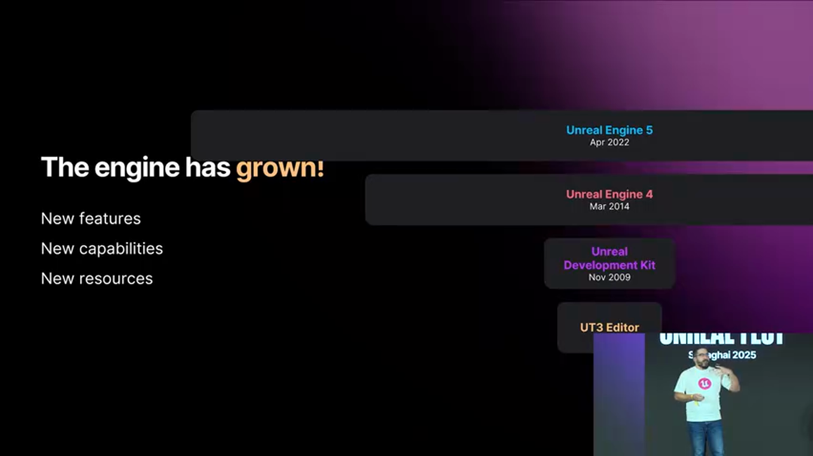
*图1: 虚幻引擎功能的持续增长*

从 2009 年的 Unreal Development Kit (UDK),到 2014 年的 UE4 引入 Blueprint 蓝图系统,再到 2022 年 UE5 添加 Nanite、Lumen 等次世代技术,引擎的能力在不断扩展。对于那些从早期版本就开始使用的开发者,他们可以随着引擎一起成长;但对于新开发者来说,这就像是直接跳入一个已经运营多年的"早期访问游戏"的完整版本。

**本文要解决的核心问题:**
- 如何快速建立对 UE5 核心系统的信心
- 如何用最小的学习成本实现可玩的游戏原型
- 如何理解各个子系统的协作方式

---

## 二、虚幻引擎基础:你必须知道的四件事

### 2.1 核心架构:Object、Actor 与 Component

虚幻引擎基于一个清晰的面向对象框架:


*图2: UE5 的核心架构体系*

**Object (对象)**: 引擎中所有事物的基类
- **Actor (场景物体)**: 可以放置在世界中的对象
- **Component (组件)**: 附加到 Actor 上的功能模块

**游戏框架的三个关键概念:**
1. **Game Mode (游戏模式)**: 贯穿整个游戏会话的规则系统
2. **Player Controller (玩家控制器)**: 用户输入与游戏世界的接口
3. **Pawn (玩家化身)**: 玩家在游戏世界中的实际化身

> **设计意图**: 这种分层架构使得逻辑、控制和表现分离,便于团队协作和功能扩展。例如,你可以在不修改 Pawn 逻辑的情况下切换不同的控制器(键鼠、手柄、VR)。

### 2.2 源代码开放:C++ 的易用性

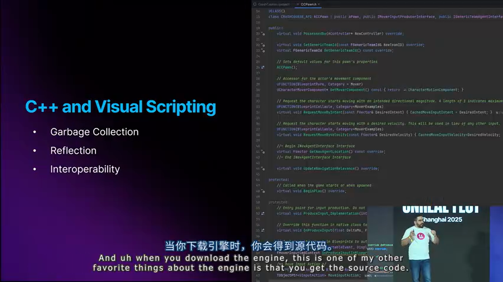
*图3: UE5 提供完整的引擎源代码*

虚幻引擎最强大的特性之一是**完全开放源代码**。这意味着:

**优势:**
- 可以查看任何引擎功能的实现细节
- 可以根据项目需求修改引擎源码
- 学习业界顶尖的 C++ 工程实践

**UE C++ 的特殊性 (降低门槛的设计):**
- **自动内存管理**: 通过垃圾回收系统,开发者无需手动管理内存
- **蓝图反射**: C++ 类可以自动暴露给蓝图系统
- **与蓝图的互操作性**: 可以混合使用 C++ 和蓝图,根据需求选择合适的工具

> **实战建议**: 即使是技术美术 (TA) 也可以使用 C++ 编写插件,因为 UE 的 C++ 框架已经处理了大部分底层细节。正如演讲者所说:"我是一个高级技术美术,但我开玩笑说自己是初级工程师,因为我可以用 UE 的 C++ 写插件,但别问我如何从零开始写 Hello World。"

### 2.3 次世代图形技术栈


*图4: UE5 的图形技术栈*

UE5 提供的生产级图形技术:

**Nanite (虚拟微多边形几何系统)**
- 无需关心 LOD (细节层级) 管理
- 可以直接导入影视级高精度模型

**Lumen (动态全局光照)**
- 实时计算全局光照和反射
- 无需烘焙光照贴图

**Virtual Shadow Maps (虚拟阴影贴图)**
- 高质量动态阴影
- 无需预烘焙阴影

**TSR (时序超分辨率)**
- 以较低分辨率渲染后智能提升到 4K
- 保持高画质的同时提升性能

> **适用场景**: 这些技术特别适合需要动态光照变化的开放世界游戏,或需要快速迭代的项目,因为它们消除了传统的烘焙流程。

### 2.4 资源引用与源代码管理的最佳实践


*图5: 重定向器与源代码管理*

**Redirector (重定向器) 的重要性:**

在虚幻引擎中,资源之间的引用是通过**文件路径**实现的。如果你在 Windows 资源管理器中直接重命名或移动文件,引擎无法感知这个变化,会导致引用丢失。

**正确做法:**
1. 在内容浏览器 (Content Browser) 中进行重命名或移动操作
2. 引擎会自动创建 Redirector (一个指向新位置的"路标")
3. 其他资源通过 Redirector 仍然能找到被移动的资源

**源代码管理集成:**
- UE5 内置了 Perforce、Git 等源代码管理工具的界面
- 强烈建议使用引擎内的版本控制面板,而不是外部工具
- 引擎会自动处理相关资源的依赖关系

> **避坑指南**:
> - 永远不要在文件系统层面直接操作 UE 项目的资源文件
> - 使用源代码管理时,确保提交 Redirector 文件,否则团队成员会遇到引用丢失问题
> - 定期清理过时的 Redirector (右键菜单中的 "Fix Up Redirectors")

### 2.5 坐标系统

一个看似简单但必须知道的事实:**虚幻引擎使用左手坐标系,Z 轴朝上**。

这对于从其他引擎(如 Unity 使用左手 Y 轴朝上,或某些 DCC 工具使用右手坐标系)迁移的开发者很重要。

---

## 三、从模板到实战:快速启动项目

### 3.1 模板项目与示例项目的区别

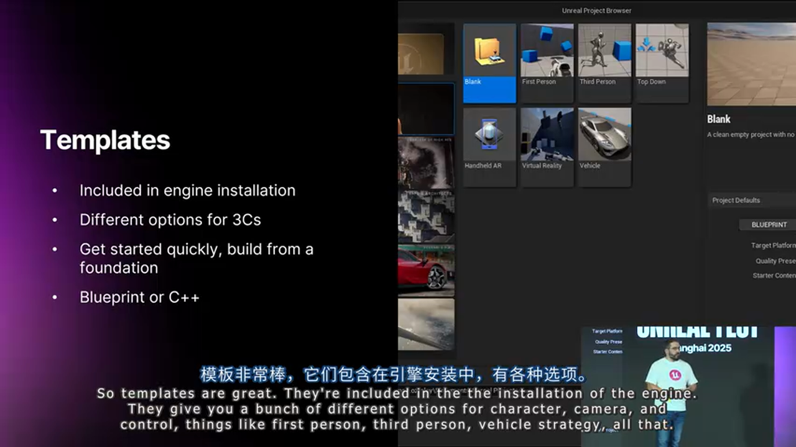
*图6: 虚幻引擎的项目模板选择*

**Templates (模板项目):**
- **特点**: 随引擎安装自带,无需额外下载
- **内容**: 提供基础的角色控制、相机和输入系统
- **类型**: 第一人称、第三人称、载具、策略等
- **可选**: 蓝图或 C++ 起始(后续可随时添加 C++)

**适用场景**: 需要快速验证游戏玩法原型,或学习特定控制模式的实现方式

**Sample Projects (示例项目):**
- **获取方式**: 从 fab.com 下载
- **复杂度**: 包含更复杂的系统交互和生产级实践
- **代表作品**:
  - **Lyra**: 多人第一人称射击游戏,展示网络同步、弹道系统等
  - **City Sample**: 城市建设与实时策略
  - **Valley of the Ancient**: 开放世界 RPG
  - **Stackobot**: 本文使用的示例项目,基于蓝图,适合非程序员

### 3.2 Stackobot 2.0:最佳的学习起点


*图7: Stackobot 示例项目*

**Stackobot 2.0 的优势:**
- **发布时间**: 2023 年最新更新
- **核心特性**:
  - 完整的角色控制器 (跑、跳、悬停等机制)
  - 可扩展的交互系统
  - 多个即用型游戏模块
  - **100% 蓝图实现** (无需 C++ 知识)

**为什么选择 Stackobot 作为学习项目?**
1. 提供了完整的游戏框架,但不会像 Lyra 那样复杂到难以理解
2. 所有系统都用蓝图实现,方便查看和修改逻辑
3. 模块化设计,可以单独学习每个系统

---

## 四、引擎内动画工具:一分钟创建角色动画


*图8: UE5 的引擎内动画工具*

### 4.1 传统动画流程的痛点

在传统的游戏开发流程中,如果一个设计师或技术美术想要实现一个简单的动画交互(比如角色挥手),通常需要:
1. 向动画师提出需求
2. 等待动画师在 DCC 软件 (Maya/Blender) 中制作动画
3. 导入引擎并进行调试
4. 如果需要修改,重复上述流程

这个流程对于快速原型验证来说太慢了。

### 4.2 Modular Control Rig:一键生成骨骼绑定

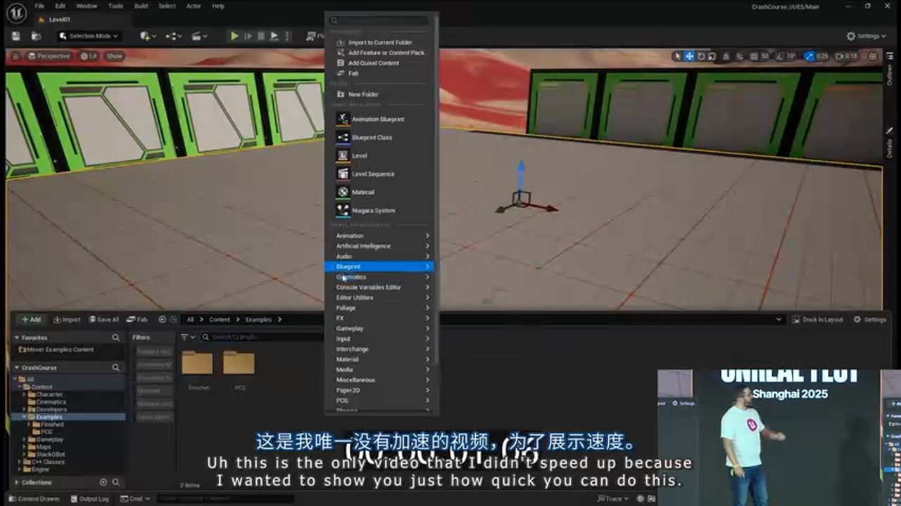
*图9: 使用 Modular Control Rig 创建角色绑定*

**Modular Control Rig** 是 UE5 提供的模块化骨骼控制系统,可以通过拖拽的方式快速为角色创建 IK/FK 绑定。

**实战步骤 (总耗时约 1 分 20 秒):**

1. **创建资源**
   - 创建 Modular Control Rig 资源
   - 指定目标骨骼网格体 (Skeletal Mesh)

2. **添加模块** (通过拖拽到对应骨骼)
   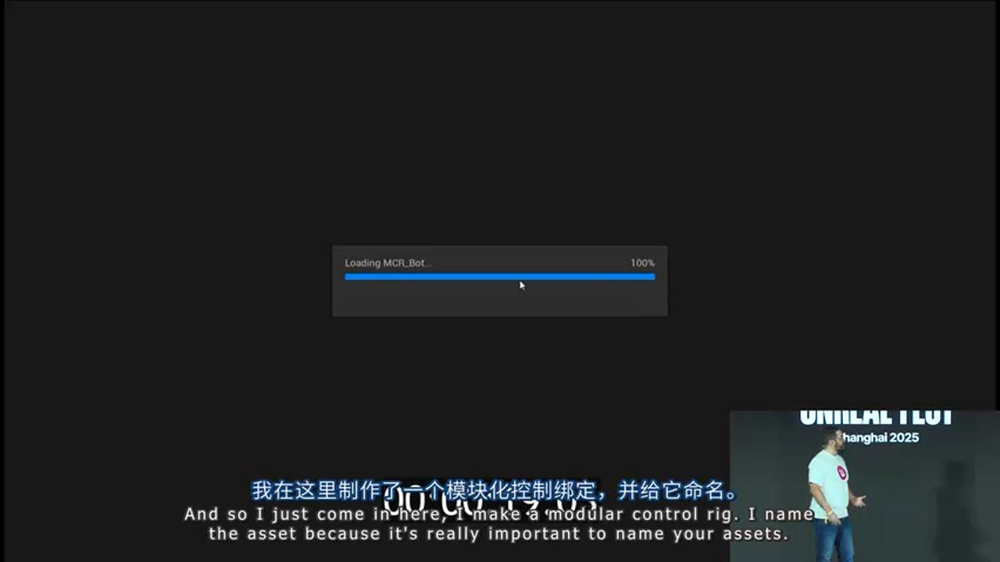
   *图10: 拖拽模块到骨骼上*

   - **Spine Module** → Hip Joint (髋关节)
   - **Shoulder Module** → Clavicle Joints (锁骨)
   - **Arm Module** → Wrist Joints (手腕) - 提供 IK/FK 切换
   - **Neck Module** → Neck Joint (颈部)
   - **Finger Module** → 所有手指关节 (自动处理所有手指)
   - **Leg Module** → Thigh Joints (大腿) - 提供 IK/FK 腿部控制

3. **完成**
   
   *图11: 完成的角色绑定*

   只需这三步,你就得到了一个具有完整 IK/FK 控制的人形角色绑定。

> **技术原理**: Modular Control Rig 基于 Control Rig 系统,它是一个程序化的骨骼控制框架。通过预定义的模块 (Module),系统自动计算 IK 链、约束关系和控制器层级,无需手动设置。

### 4.3 引擎内动画制作

有了绑定之后,可以直接在编辑器中制作动画:

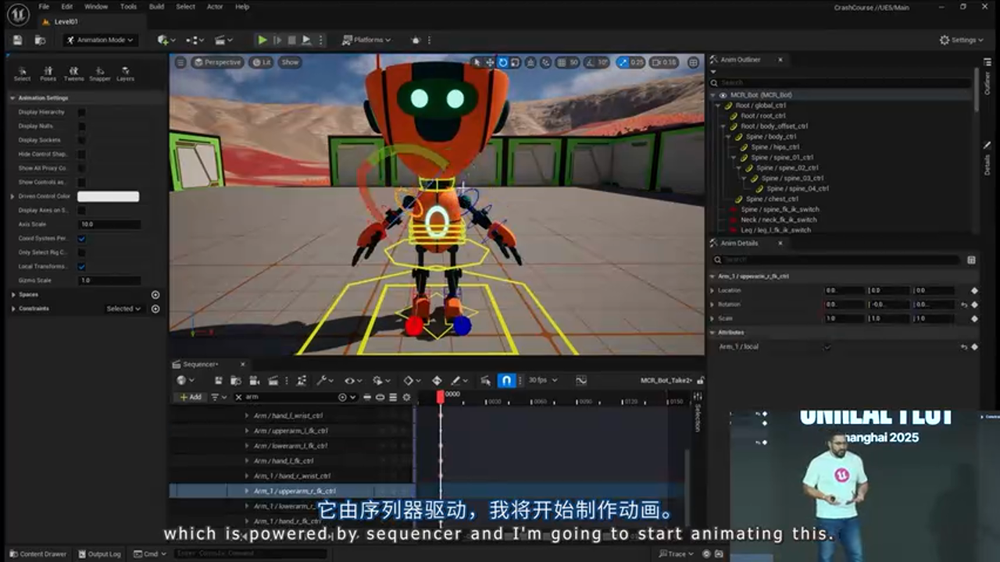
*图12: 在 Sequencer 中制作动画*

**工作流程:**
1. **将 Control Rig 拖入关卡**
   - 引擎自动切换到动画模式 (基于 Sequencer)

2. **设置关键帧**
   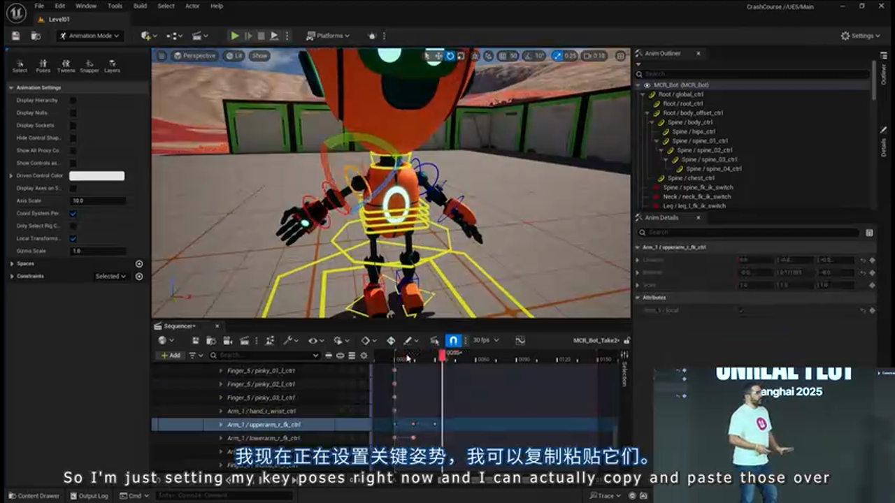
   *图13: 设置关键姿势*

   - 调整控制器位置
   - 设置关键帧 (K 键)
   - 复制粘贴姿势以加快流程

3. **动画原则应用**
   
   *图14: 添加动画细节*

   - 添加次要动作 (髋部位移)
   - 错开关键帧时间避免"孪生效果"
   - 添加 Overlap 和 Follow Through

4. **导出动画序列**
   
   *图15: 创建链接的动画序列*

   - 创建 **Linked Animation Sequence** (链接动画序列)
   - 好处:当你修改 Control Rig 的动画时,动画序列会自动更新
   - 创建 **Animation Montage** 用于游戏中播放

> **最佳实践**:
> - 对于需要频繁迭代的动画(如游戏机制相关),使用 Linked Animation Sequence 保持编辑灵活性
> - 动画完成后可以烘焙为独立的 Animation Sequence 以提升运行时性能
> - 使用 Animation Montage 控制动画的播放速度、循环、通知事件等

**与传统流程对比:**

> **传统流程**:
> - 在 Maya/Blender 中绑定 (30-60 分钟)
> - 制作动画 (根据复杂度 1-4 小时)
> - 导出并导入引擎 (5-10 分钟)
> - 调试和修改 (重复上述流程)
>
> **UE5 引擎内流程**:
> - 使用 Modular Control Rig 绑定 (1-2 分钟)
> - 在 Sequencer 中制作动画 (10-30 分钟)
> - 实时预览,即改即见
> - 修改成本极低

---

## 五、蓝图可视化脚本与增强输入系统

### 5.1 Blueprint Visual Scripting:面向对象的可视化编程

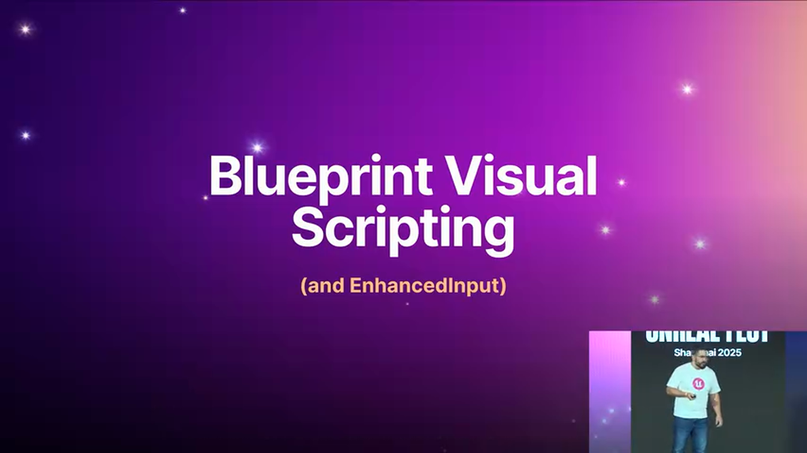
*图16: Blueprint 可视化脚本系统*

**Blueprint (蓝图) 的核心特性:**
- **节点式**: 通过连接节点而非编写代码实现逻辑
- **面向对象**: 支持继承、多态等 OOP 概念
- **与 C++ 完全反射**: 所有 C++ 功能都可以在蓝图中调用
- **实时调试**: 可以在运行时查看变量值和执行流程

### 5.2 Enhanced Input:数据驱动的输入系统

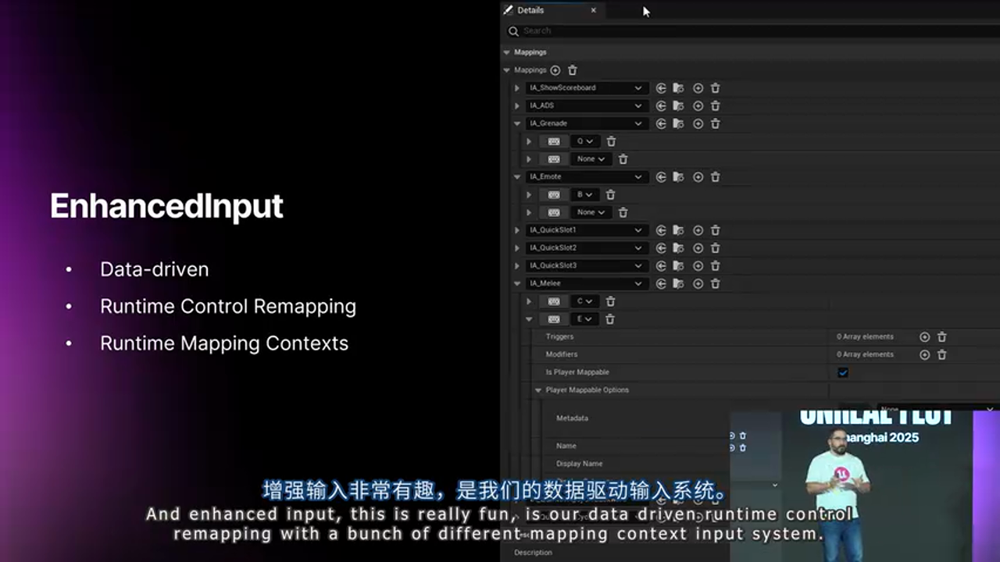
*图17: Enhanced Input 系统架构*

**传统输入系统的问题:**

假设你有一个 WASD 控制角色移动的系统,后来你添加了载具系统,希望 WASD 控制油门和转向。传统做法需要在输入事件中添加大量 if-else 判断当前状态。

**Enhanced Input 的解决方案:Mapping Context (映射上下文)**

**核心概念:**
- **Input Action** (输入动作): 抽象的游戏行为,如 "Move"、"Jump"、"Fire"
- **Mapping Context** (映射上下文): 将物理按键映射到 Input Action 的配置
- **动态切换**: 根据游戏状态动态添加/移除映射上下文

**实际应用示例:**

```
映射上下文: OnFoot (步行)
- WASD → Move Action
- Space → Jump Action

映射上下文: InVehicle (载具)
- WASD → Throttle/Steering Action
- Space → Handbrake Action
```

当玩家进入载具时,代码只需:
1. 移除 "OnFoot" 映射上下文
2. 添加 "InVehicle" 映射上下文

输入逻辑本身无需修改,所有按键自动映射到新的行为。

### 5.3 实战:实现角色挥手机制

**目标:** 玩家按下某个键时,角色播放挥手动画

**实现步骤:**

**步骤 1: 创建游戏模式并设置 Pawn**
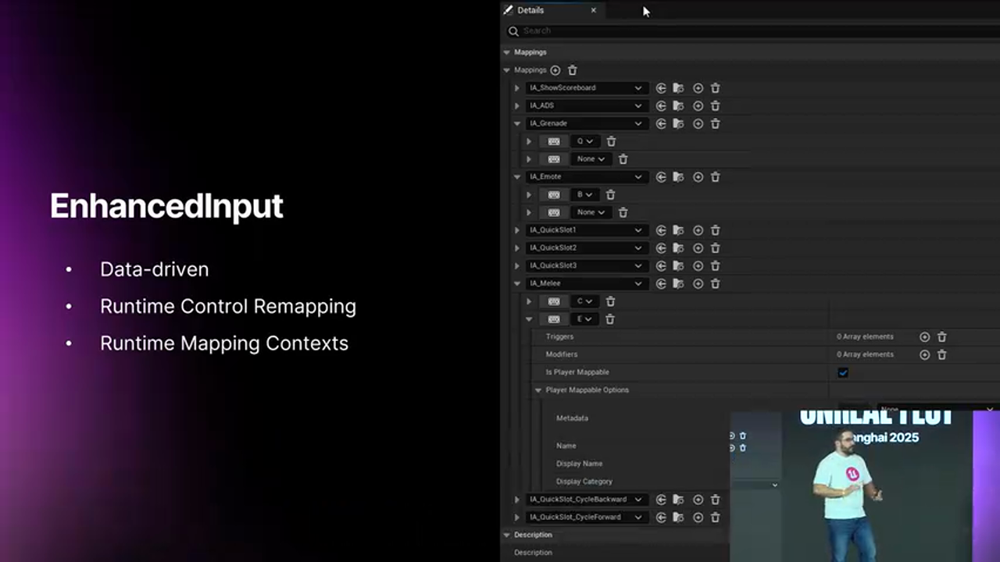
*图18: 创建自定义游戏模式*

- 创建继承自基础游戏模式的蓝图
- 在游戏模式中指定玩家 Pawn 类
- 在世界设置中应用该游戏模式

**步骤 2: 创建角色蓝图**
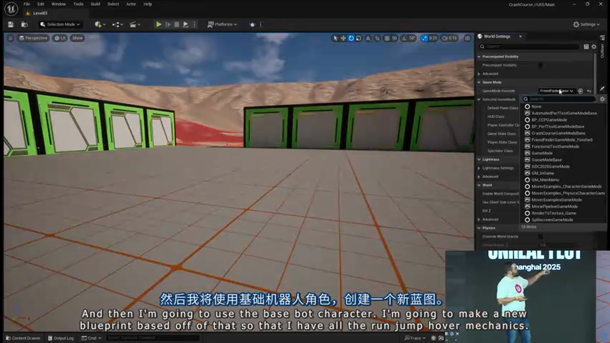
*图19: 基于 Stackobot 基础角色创建蓝图*

- 继承 Stackobot 的 BaseBot 角色类
- 保留所有基础移动功能 (跑、跳、悬停)

**步骤 3: 创建输入资源**
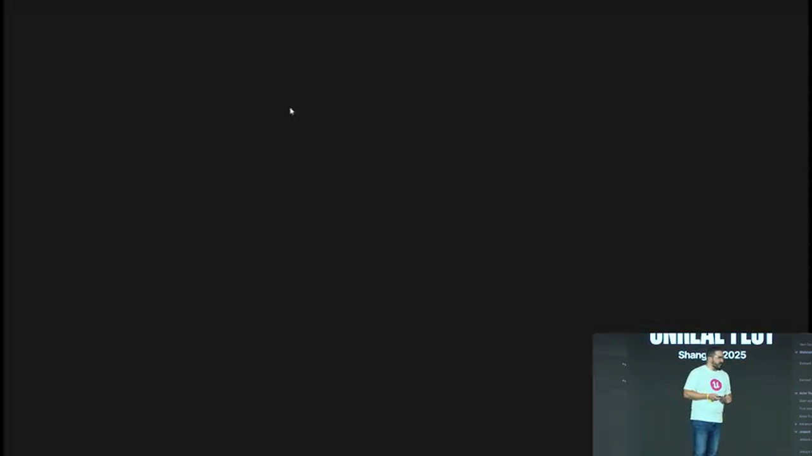
*图20: 创建 Input Action 和 Mapping Context*

- 创建 **Input Action** 资源,命名为 "IA_Wave"
- 创建 **Mapping Context** 资源,命名为 "IMC_Wave"
- 在 Mapping Context 中将某个键 (如 E 键) 映射到 IA_Wave

**步骤 4: 在角色蓝图中实现逻辑**
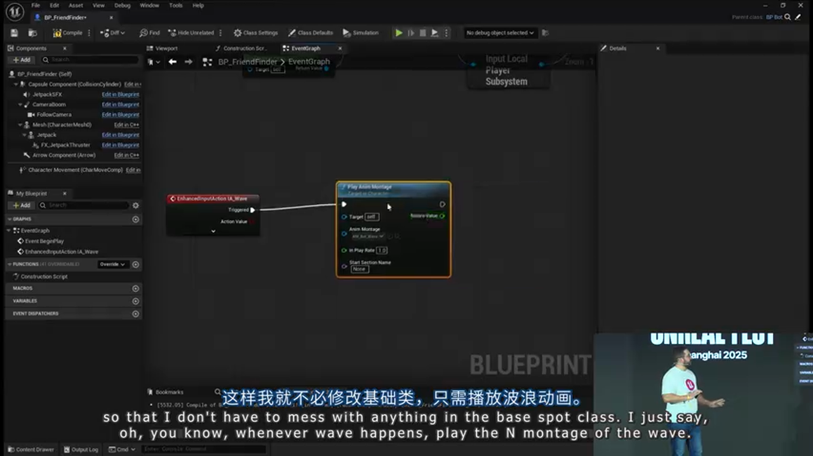
*图21: 蓝图逻辑实现*

核心蓝图节点流程:

```
Event BeginPlay
  └─> Add Mapping Context (添加 IMC_Wave 映射上下文)

IA_Wave (Started)
  └─> Branch (判断动画是否正在播放)
       └─> False → Play Anim Montage (播放挥手动画)
```

**避免重复触发的逻辑:**
- 使用 `Is Montage Playing` 节点检查动画是否在播放
- 只有当动画未播放时才允许触发新的挥手动作

**最终效果:**

*图22: 角色挥手效果*

> **设计意图解析**:
> - **为什么要创建新的角色蓝图而不是直接修改 BaseBot?**
>   保持示例项目的原始类干净,所有自定义功能通过继承添加,便于后续维护和理解哪些是新增功能。
>
> - **为什么使用 Mapping Context 而不是直接绑定按键?**
>   未来如果需要添加更多交互(如对话模式、建造模式),只需切换 Mapping Context,无需修改输入逻辑。

---

## 六、PCG 程序化内容生成:懒人的关卡设计工具


*图23: PCG 程序化内容生成框架*

### 6.1 为什么需要 PCG?

手动放置场景物体 (树木、石头、草地) 是一个费时费力的工作。PCG (Procedural Content Generation) 框架允许你定义规则,让引擎自动生成内容。

**PCG 的核心概念:**
- **基于节点的图表**: 类似蓝图,但专门用于生成场景内容
- **点-属性系统**: 在空间中生成点,每个点携带属性 (如地形材质权重、法线等)
- **可扩展**: 可以用蓝图编写自定义 PCG 节点

### 6.2 实战:自动生成地形植被

**目标:** 根据地形的绘制层自动生成树木、灌木和石头

**步骤 1: 创建 PCG 图表**
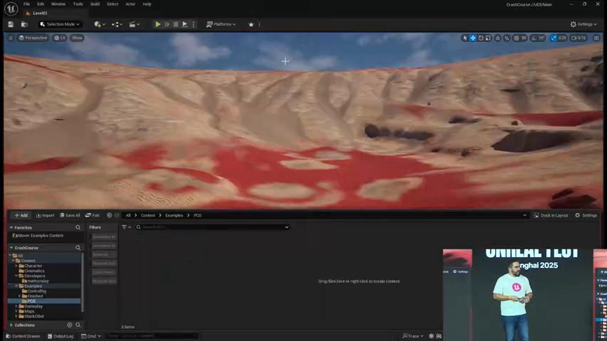
*图24: 创建 PCG 组件*

- 创建 PCG Graph 资源,命名为 "Landscape_Foliage"
- 将 PCG 组件拖入关卡,调整包围盒大小覆盖整个地形

**步骤 2: 采样地形并过滤点**
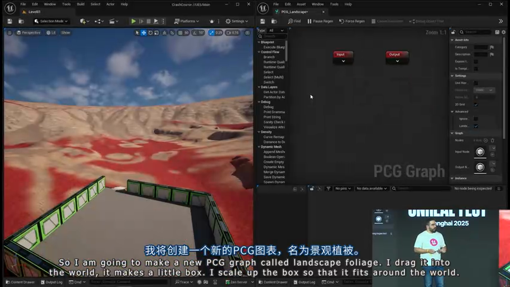
*图25: PCG 图表的基础节点*

核心节点流程:

```
Surface Sampler (地形采样器)
  └─> 在地形上生成密集的采样点
  └─> 每个点包含地形绘制层权重信息

Filter by Attribute (按属性过滤)
  └─> 只保留 "Grass" 绘制层权重 > 0.5 的点

Spawn Static Mesh (生成静态网格体)
  └─> 在过滤后的点上放置树木模型
```

**关键技术点:**
- **地形绘制层权重**: 当你在地形上绘制不同材质(草地、泥土、岩石)时,每个位置都存储了各材质的权重值
- **PCG 自动读取这些权重**: 可以据此决定在哪里生成什么物体

**步骤 3: 添加更多植被类型**

*图26: 多种植被类型的生成*

- 复制采样节点,创建灌木的生成逻辑
- 使用 **Point Filter** 排除已生成树木的区域,避免重叠

**步骤 4: 添加石头和悬崖**

*图27: 添加石头和悬崖装饰*

- 再次采样地形,过滤出适合放置石头的区域
- 使用 **Jitter** 节点随机偏移点位置,打破网格感
- 使用 **Transform** 节点旋转石头,使其看起来是分层的

### 6.3 进阶技巧:排除手动放置的物体

**问题:** PCG 生成的物体可能与手动放置的建筑物重叠

**解决方案:使用包围盒排除**
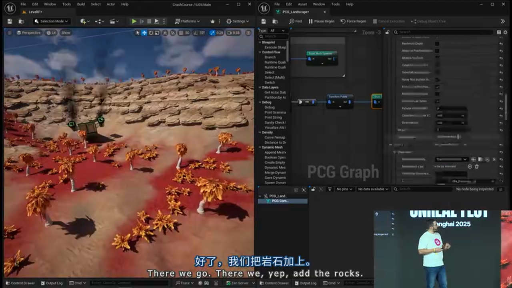
*图28: 排除手动放置物体的区域*

节点流程:

```
Get Actor Data (获取场景中所有静态网格体)
  └─> Get Bounds (获取包围盒)
  └─> Points Inside Bounds (找出在包围盒内的 PCG 点)
  └─> Negate (反转选择,排除这些点)
```

**特殊情况处理:**
- 天空球 (Sky Sphere) 也是静态网格体,其包围盒覆盖整个场景
- 需要添加 **Tag Filter** 排除天空球

### 6.4 动态路径雕刻

**目标:** 使用样条线 (Spline) 定义玩家路径,自动清除路径上的植被

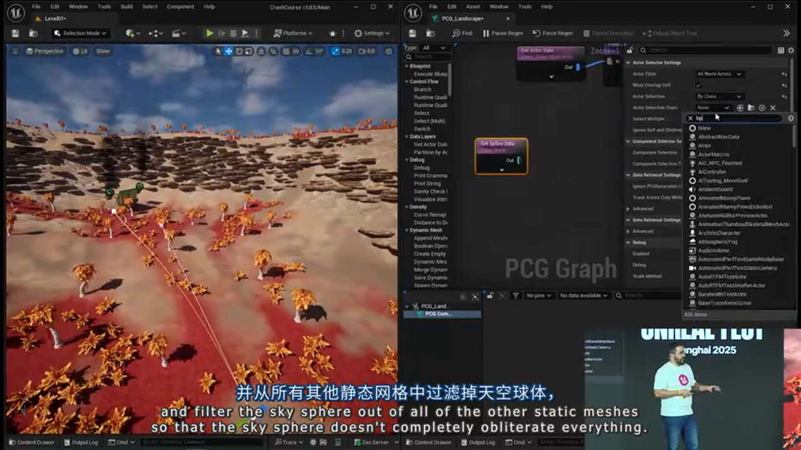
*图29: 样条线路径的 PCG 处理*

**实现方式:**
1. 创建包含 Spline 组件的蓝图 Actor
2. 在 PCG 图表中使用 `Get Actor Data` 获取该 Spline
3. 使用 `Point Inside Spline` 过滤掉样条线附近的点
4. 可选:沿样条线生成路面网格体

> **批判性思维:PCG 的适用边界**
>
> **适用场景:**
> - 开放世界游戏的大范围植被分布
> - 需要频繁调整的场景布局
> - 程序化生成的关卡 (Roguelike)
>
> **不适用场景:**
> - 需要精确艺术控制的核心场景
> - 性能敏感的移动平台 (PCG 会增加编辑器加载时间)
>
> **潜在副作用:**
> - PCG 生成的物体在编辑器中可能导致性能下降
> - 需要仔细调整采样密度,避免生成过多实例

---

## 七、Chaos 物理与 Niagara 粒子特效

### 7.1 Chaos 物理系统:轻量级破坏系统


*图30: Chaos 物理系统*

**Chaos** 是 UE5 的统一物理模拟框架,支持:
- **破坏系统** (Destruction)
- **刚体动力学** (Rigid Body)
- **布料模拟** (Cloth)
- **载具物理** (Vehicles)
- **流体、毛发、肌肉** 等高级特性

### 7.2 实战:创建可破坏箱子

**步骤 1: 制作几何体集合 (Geometry Collection)**
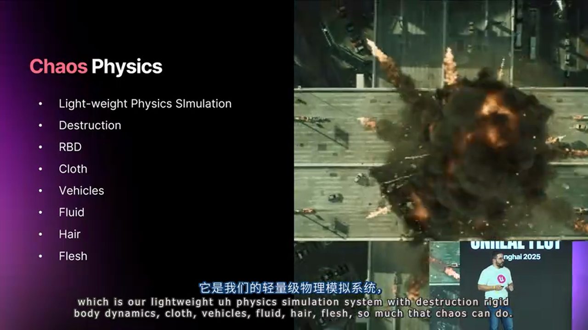
*图31: 使用 Fracture Mode 破碎静态网格体*

- 将静态网格体 (箱子) 拖入关卡
- 创建 **Geometry Collection** 资产
- 进入 **Fracture Mode** (破碎模式)
- 调整破碎参数 (碎片数量、破碎模式等)
- 点击 **Fracture** 按钮生成碎片

**步骤 2: 测试破坏效果**
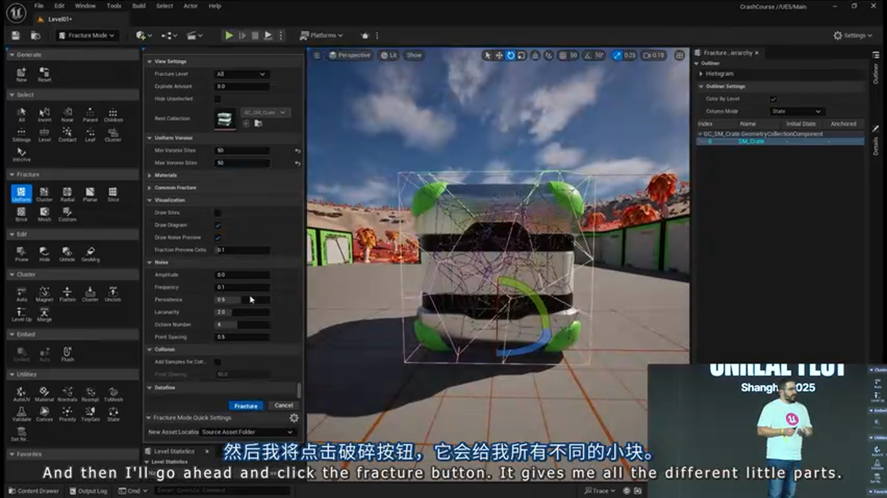
*图32: 破坏效果预览*

直接将 Geometry Collection 拖入关卡并运行,箱子会受重力影响碎裂。

**步骤 3: 创建交互蓝图**
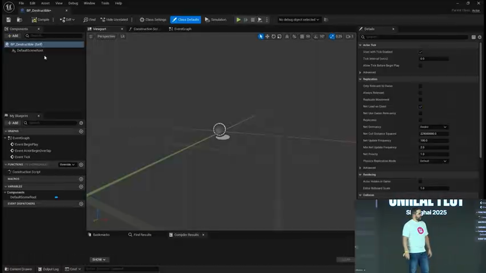
*图33: 可破坏箱子的蓝图*

蓝图结构:
```
Components:
  └─ Geometry Collection Component (几何体集合)
  └─ Box Collision (盒体碰撞,自动匹配 GC 大小)

Event On Component Begin Overlap
  └─ Cast to Character (转换为角色类)
  └─ Is Falling? (检查是否正在下落)
       └─ True → Apply Field (触发破坏场)
       └─ Add Radial Impulse (添加径向冲量)
```

**技术细节:**
- **Field System (场系统)**: 用于触发 Geometry Collection 的破坏
- **Radial Impulse (径向冲量)**: 让碎片向外飞散,而不是简单下落

**最终效果:**

*图34: 玩家跳到箱子上触发破坏*

### 7.3 Niagara VFX:为破坏添加粒子特效

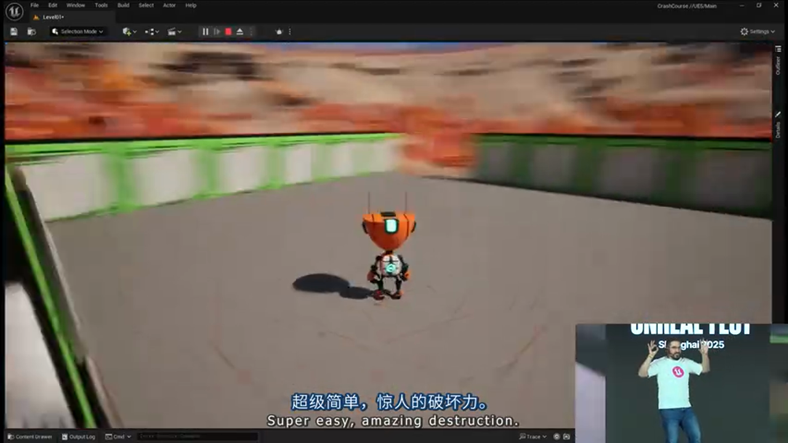
*图35: Niagara VFX 系统*

**Niagara** 不仅仅是粒子系统,而是一个**完整的 VFX 系统**:
- **模块化**: 每个功能 (发射、更新、渲染) 都是独立模块
- **可扩展**: 可以用蓝图或 C++ 编写自定义模块
- **参数化**: 所有参数可以从外部控制 (如蓝图、C++)

**目标:** 为箱子破坏添加火花和爆炸烟雾效果

**步骤 1: 创建火花效果**
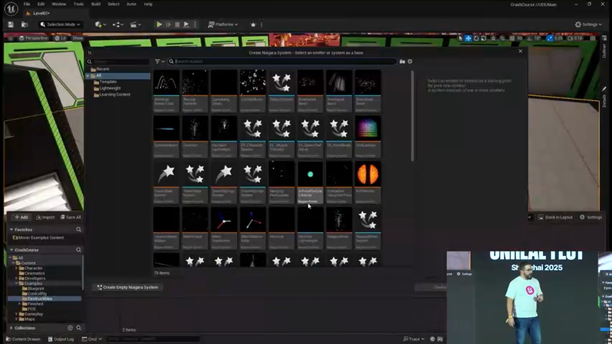
*图36: 基于模板创建火花*

- 使用内置的 **Simple Sprite Burst** 模板
- 启用 **Orient Mesh to Velocity** (粒子朝向速度方向)
- 设置颜色梯度:绿色 → 红色

**步骤 2: 创建烟雾材质**
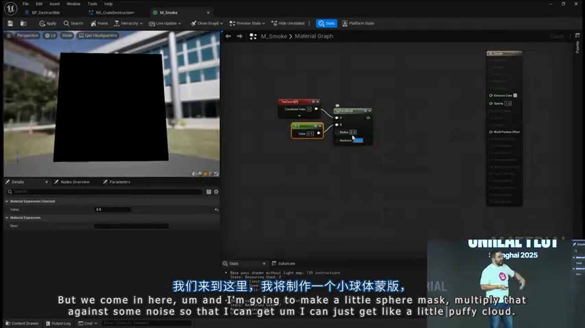
*图37: 在材质编辑器中创建火焰烟雾材质*

材质节点逻辑:

```
Sphere Mask (球形遮罩)
  └─ Multiply ×
Noise (噪声纹理)
  └─ → Opacity (不透明度)

Particle Color (粒子颜色)
  └─ Multiply ×
Black Body (黑体辐射节点)
  └─ → Emissive Color (自发光颜色)
```

**Black Body 节点的妙用:**
- 输入高温值 (如 6000K) 输出白炽光 (火焰色)
- 随着温度降低,颜色变为橙红色,最终变黑
- 完美模拟火焰冷却过程

**步骤 3: 配置粒子生命周期**

*图38: 调整粒子参数*

- **Scale by Life (按生命周期缩放)**: 粒子从小变大再消失
- **Color by Life (按生命周期着色)**: 从高温 (白色) 到低温 (黑色)

**步骤 4: 整合到蓝图**

*图39: 在破坏蓝图中激活特效*

在触发破坏的同时激活 Niagara 系统:

```
Apply Field (触发破坏)
  └─ Activate Niagara Component (激活特效)
```

**最终效果:**

*图40: 完整的破坏特效*

> **实战总结:**
> - Chaos 提供物理模拟的"真实性"
> - Niagara 提供视觉上的"戏剧性"
> - 两者结合创造出令人信服的游戏反馈

---

## 八、MetaSounds:音频的程序化革命

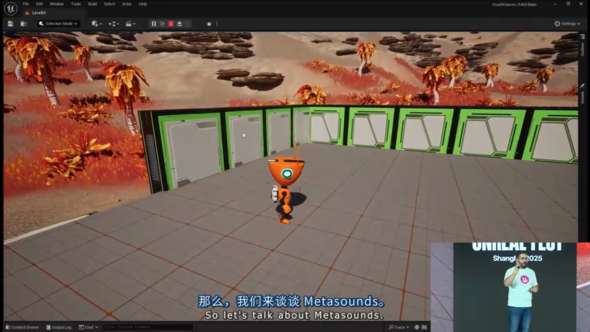
*图41: MetaSounds 系统*

### 8.1 MetaSounds 是什么?

**MetaSounds** 是 UE5 的**全程序化音频系统**,可以理解为"音频的材质编辑器"。

**核心特性:**
- **数字信号处理图 (DSP Graph)**: 像材质编辑器一样连接节点
- **采样级精度定时**: 可以精确到 1/48000 秒调度音频事件
- **完全程序化**: 无需预录制音频文件,实时生成声音

### 8.2 实战:从零创建鼓组

**目标:** 用纯程序化的方式生成军鼓 (Snare)、踩镲 (Hi-Hat) 和底鼓 (Kick)

**步骤 1: 创建军鼓 (Snare Drum)**
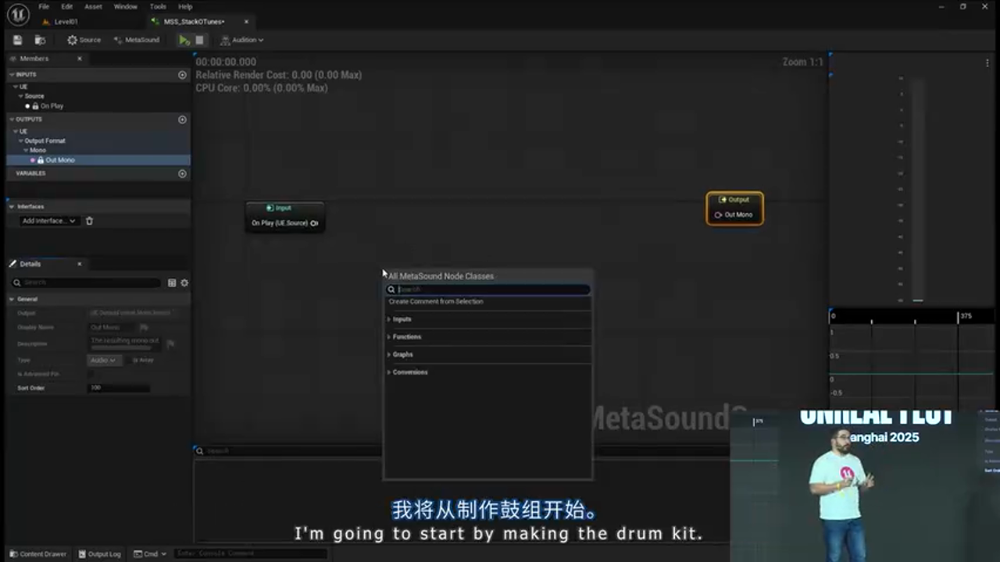
*图42: 军鼓的 MetaSound 图表*

**声学原理:**
- 军鼓的声音主要来自鼓底的金属响丝
- 可以用**白噪声 (White Noise)** 模拟

**节点流程:**

```
BPM to Seconds (节拍到秒数转换)
  └─ Trigger Repeat (每四分音符触发一次)
       └─ ADSR Envelope (攻击-衰减包络)
            └─ Multiply ×
White Noise Generator (白噪声生成器)
  └─ → Audio Output
```

**关键节点解析:**
- **ADSR Envelope**: 控制声音的音量随时间变化
  - Attack (攻击): 快速达到峰值 (模拟鼓槌击打)
  - Decay (衰减): 快速衰减 (模拟鼓皮震动停止)
- **Multiply**: 将包络应用到白噪声上

**步骤 2: 添加踩镲 (Hi-Hat)**
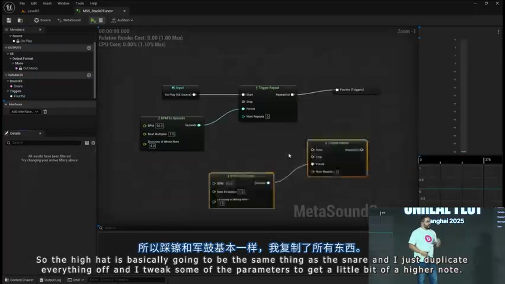
*图43: 踩镲使用更短的衰减时间*

- 复制军鼓的节点
- 缩短 Decay 时间,使声音更尖锐
- 调整触发频率为八分音符 (更密集的节奏)

**步骤 3: 创建底鼓 (Kick Drum)**

*图44: 底鼓使用三角波*

**声学原理:**
- 底鼓是低频打击乐器
- 使用**三角波 (Triangle Wave)** 模拟低频轰鸣

**节点流程:**

```
Triangle Wave Generator (三角波生成器)
  └─ Frequency: 60-80 Hz (低频)
  └─ ADSR Envelope (快速攻击,中等衰减)
       └─ → Audio Output
```

**步骤 4: 混合所有鼓组**

*图45: 混音节点*

```
Kick Output ─┐
Hi-Hat Output─┤→ Stereo Mixer → Master Output
Snare Output ─┘
```

**实时调试:**
- MetaSound 编辑器中的所有旋钮都是**可交互的**
- 可以在编辑器中实时调整参数并听到效果

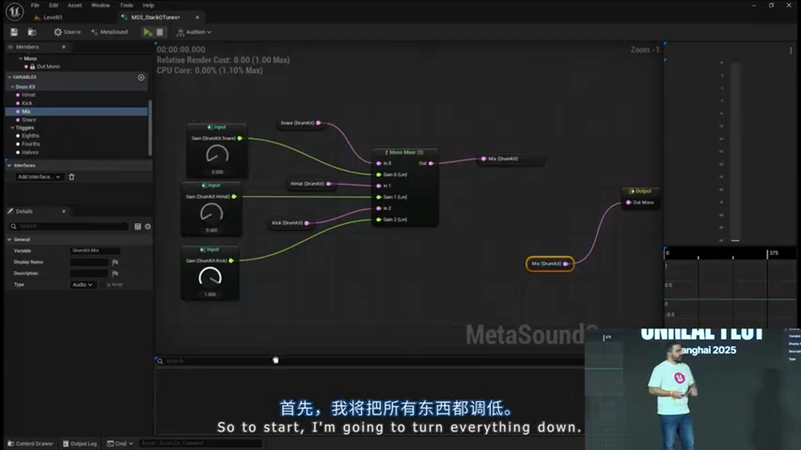
*图46: 实时调整混音参数*

### 8.3 进阶:程序化旋律生成

**目标:** 创建一个随机但符合乐理的旋律系统

**步骤 1: 生成主音 (Whole Note)**

*图47: 主音生成逻辑*

```
Trigger Repeat (每全音符触发)
  └─ Random Integer (60 到 72 之间的随机 MIDI 音符号)
       └─ MIDI to Frequency (转换为频率值)
            └─ Square Wave Generator (方波生成器)
                 └─ ADSR Envelope
```

**为什么选择 60-72?**
- MIDI 音符 60 = 中央 C (C4)
- 这个范围覆盖一个八度,适合旋律

**步骤 2: 生成旋律音符 (Quarter Notes)**

*图48: 基于主音的旋律生成*

```
Trigger Repeat (每四分音符触发)
  └─ Random Integer (3 到 8 之间的音程偏移)
       └─ Add (主音 + 偏移)
            └─ MIDI to Frequency
                 └─ Square Wave
```

**音乐理论应用:**
- 通过将旋律音符限制在主音的 3-8 个半音内
- 确保旋律"和谐"(符合调性)

**最终效果混音:**

*图49: 完整的程序化音乐系统*

### 8.4 与游戏交互:动态 BPM 系统

**目标:** 根据玩家移动速度动态调整音乐速度

**步骤 1: 创建 MetaSound Patch (音频函数)**
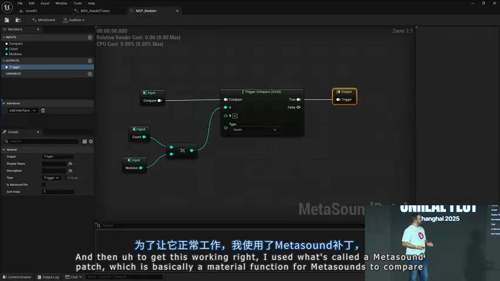
*图50: 使用 Patch 模块化节点*

MetaSound Patch 类似于蓝图的函数或材质的函数:
- 封装可重用的逻辑
- 这里用于创建"节拍判定器"

**Patch 逻辑:**

```
Counter (每 16 分音符计数)
  └─ Modulo (取模运算)
       └─ Compare (是否等于 0)
            └─ Output Bool (触发信号)
```

**如何判断不同音符:**
- `Counter % 16 == 0` → 全音符
- `Counter % 8 == 0` → 二分音符
- `Counter % 4 == 0` → 四分音符
- `Counter % 2 == 0` → 八分音符

**步骤 2: 在蓝图中控制 BPM**

*图51: 蓝图每帧更新 BPM 参数*

```
Event Tick
  └─ Get Velocity (获取角色速度)
       └─ Vector Length (计算速度大小)
            └─ Map Range (映射速度到 BPM 范围,如 60-120 BPM)
                 └─ Set Float Parameter (传递给 MetaSound)
```

**关键技术点:**
- BPM 更新**只在每个小节的开头**应用
- 避免节奏中途变化导致不同步

**最终效果:**

*图52: 玩家移动速度影响音乐节奏*

> **深度思考:MetaSounds 的设计哲学**
>
> MetaSounds 的设计灵感来自**模块化合成器**:
> - **振荡器 (Oscillator)** = 波形生成器节点
> - **包络 (Envelope)** = ADSR 节点
> - **滤波器 (Filter)** = 各种音频处理节点
>
> 这使得游戏音频设计师可以像电子音乐制作人一样工作,而无需购买昂贵的插件或合成器。

---

## 九、State Tree:行为树与状态机的完美融合

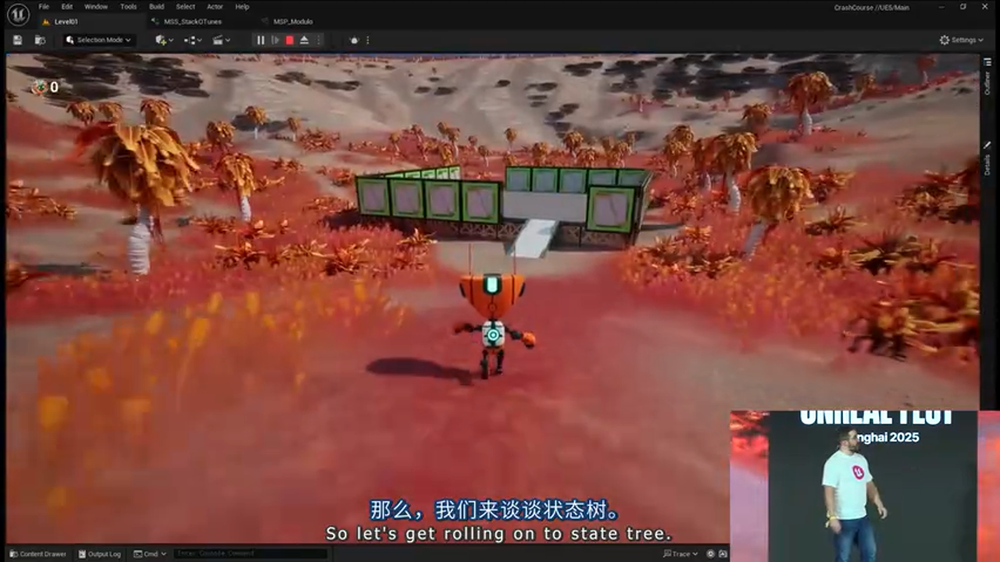
*图53: State Tree 系统架构*

### 9.1 什么是 State Tree?

**State Tree** 是 UE5 的**通用层级化状态系统**,融合了两种经典 AI 架构:
- **行为树 (Behavior Tree)** 的选择器逻辑
- **状态机 (State Machine)** 的状态与转换

**适用场景:**
- NPC AI 行为
- UI 流程控制
- 游戏机制状态管理
- 任何需要复杂状态切换的系统

### 9.2 实战:创建 NPC 行为系统

**目标:** 实现以下 AI 逻辑:
1. **中立状态**: NPC 随机游荡
2. **躲藏状态**: 发现玩家后逃跑并躲藏
3. **友好状态**: 玩家挥手后跟随玩家

**步骤 1: 创建中立状态 (Neutral)**

*图54: 中立状态的子状态*

State Tree 结构:

```
Neutral (中立状态)
  ├─ Idle (待机)
  └─ Wander (游荡)
       └─ Transition: 每 1-3 秒随机切换
```

**步骤 2: 实现游荡逻辑**
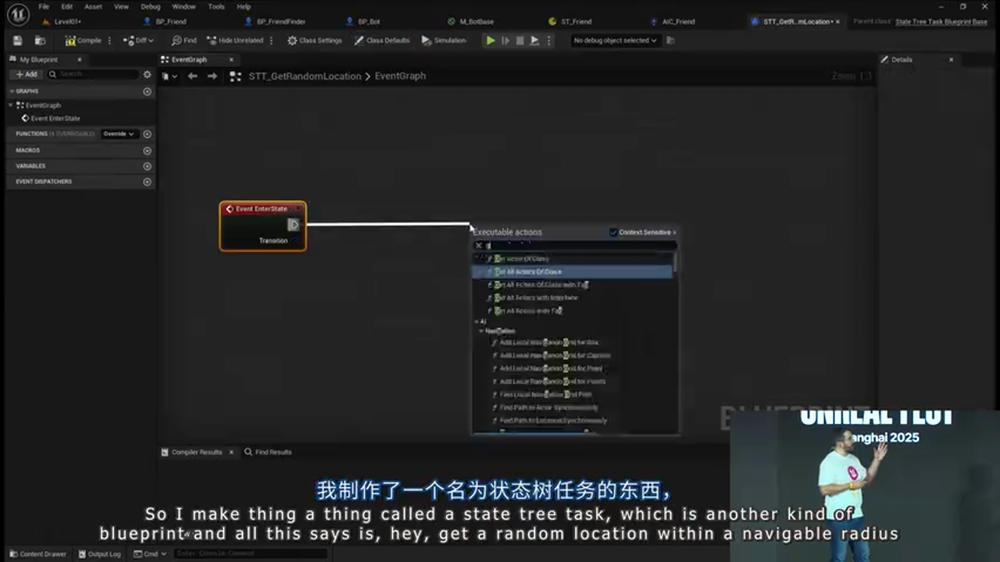
*图55: 自定义 State Tree Task*

创建 **State Tree Task** (蓝图类):

```
Task: Get Random Wander Location
  └─ Get Random Reachable Point in Radius
       └─ Output: Target Location (Vector)
```

在 Wander 状态中使用该 Task:

```
Wander State
  └─ Get Random Wander Location → Destination
  └─ Move To Task (移动到 Destination)
```

**步骤 3: 添加感知系统**

*图56: 简易的视线检测*

在 NPC 蓝图中:

```
Event Tick
  └─ Get Player Actor
       └─ Line Trace to Player
            └─ Success? → Send State Tree Event ("PlayerDetected")
```

**步骤 4: 创建躲藏状态 (Hiding)**

*图57: 躲藏状态流程*

```
Neutral State
  └─ Transition on Event "PlayerDetected" → Hiding State

Hiding State
  ├─ Find Hiding Spot (子状态)
  ├─ Move to Hiding Spot (子状态)
  └─ Stay Hidden (子状态)
```

### 9.3 环境查询系统 (EQS):寻找躲藏点

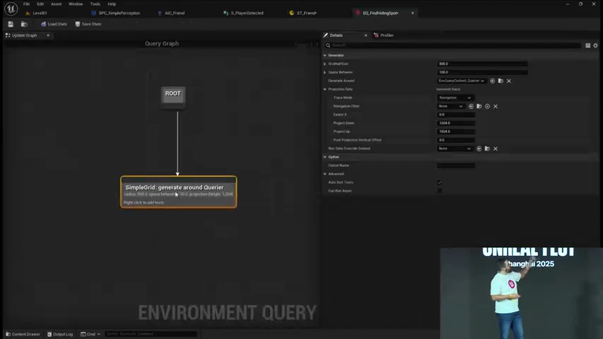
*图58: EQS 的工作流程*

**Environmental Query System (EQS)** 用于 AI 做空间推理:

**EQS 节点流程:**

```
Points Grid (生成网格点)
  └─ Trace to Context (射线检测到玩家)
       └─ Visibility Test (可见性测试)
            └─ Filter: 丢弃能看到玩家的点
                 └─ Path Test (路径测试)
                      └─ Filter: 丢弃无法导航的点
                           └─ Distance to Player (距离测试)
                                └─ Score: 按距离排序,选择最远的点
```

**可视化调试:**

*图59: Gameplay Debugger 显示 EQS 结果*

- 红点:能看到玩家 (被过滤掉)
- 绿点:躲藏候选点
- 最亮的绿点:最终选择的躲藏位置

**效果演示:**
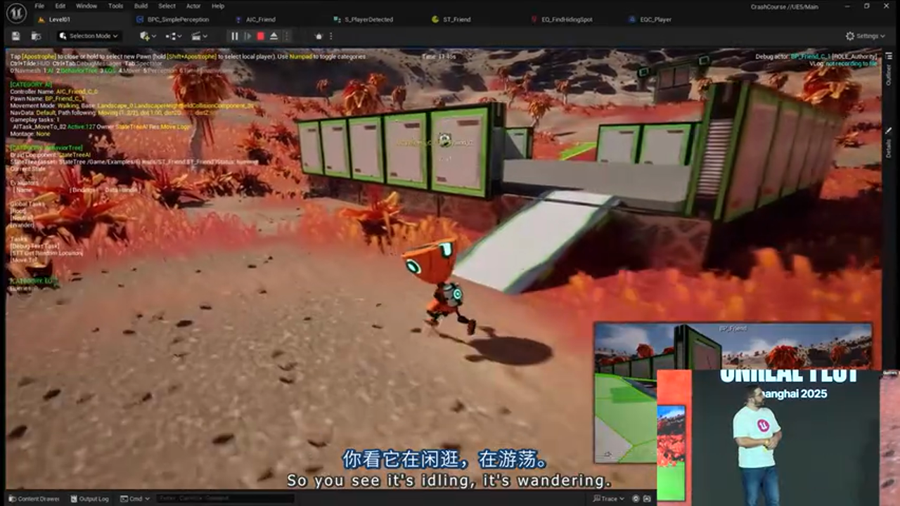
*图60: NPC 自动寻找并跑到躲藏点*

### 9.4 友好状态:跟随玩家

**步骤 1: 玩家挥手时发送事件**
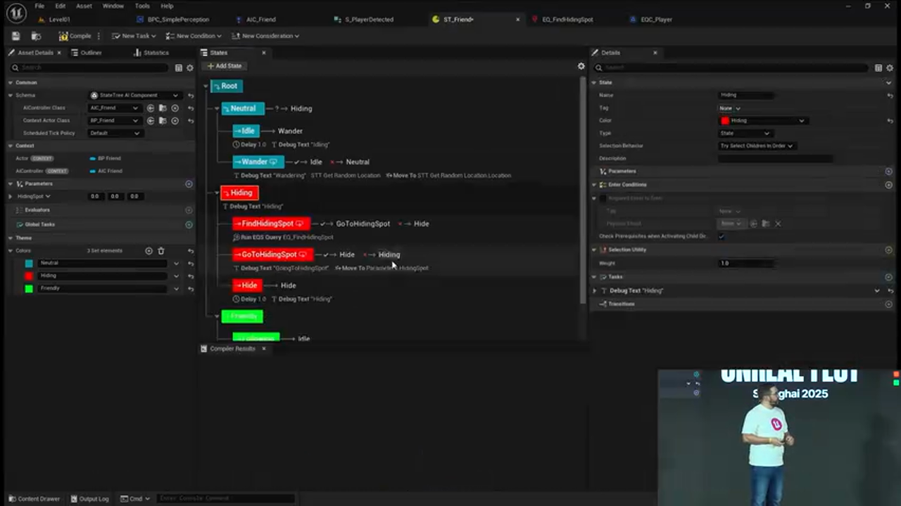
*图61: 玩家蓝图中的射线检测*

```
IA_Wave (挥手输入)
  └─ Sphere Trace (球形检测)
       └─ Hit NPC? → Send State Tree Event ("PlayerWaved")
```

**步骤 2: NPC 切换到友好状态**
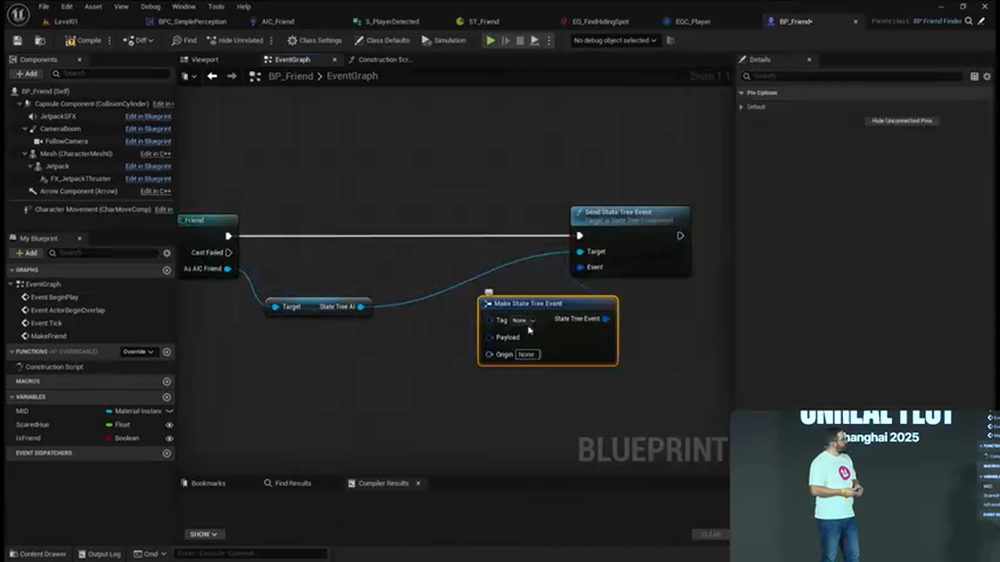
*图62: 友好状态逻辑*

```
Hiding State
  └─ Transition on Event "PlayerWaved" → Friendly State

Friendly State
  └─ Move To Task (目标: Player Actor)
       └─ Acceptance Radius: 200 (保持一定距离)
```

**最终效果:**
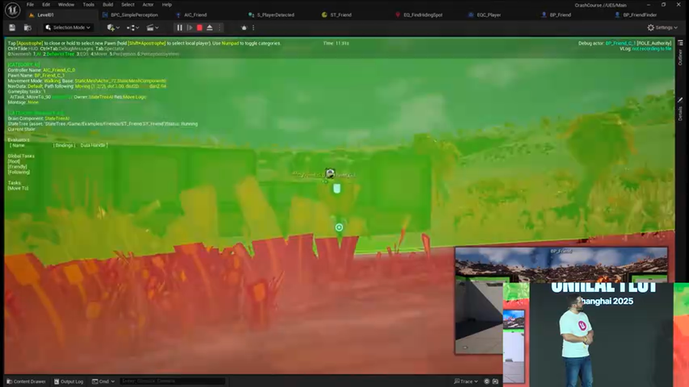
*图63: NPC 颜色变化并跟随玩家*

> **State Tree vs Behavior Tree vs State Machine**
>
> **传统行为树的问题:**
> - 难以实现"状态记忆"(如从躲藏回到游荡)
> - 复杂状态切换需要大量黑板变量
>
> **传统状态机的问题:**
> - 无法表达层级化决策
> - 状态爆炸问题 (需要为每个组合创建状态)
>
> **State Tree 的优势:**
> - 支持层级化状态 (状态内嵌套子状态)
> - 支持选择器逻辑 (类似行为树)
> - 事件驱动的转换 (更灵活的触发条件)

---

## 十、UMG 用户界面:记录玩家进度


*图64: UMG (Unreal Motion Graphics)*

### 10.1 UMG 的特点

**UMG** 是 UE5 的 UI 系统:
- **蓝图驱动**: UI 逻辑用蓝图编写
- **组件化**: 可以创建可重用的 Widget 组件
- **材质支持**: 可以在 UI 上使用材质 (如动态效果)

### 10.2 实战:创建好友计数器

**步骤 1: 在游戏模式中管理计数**
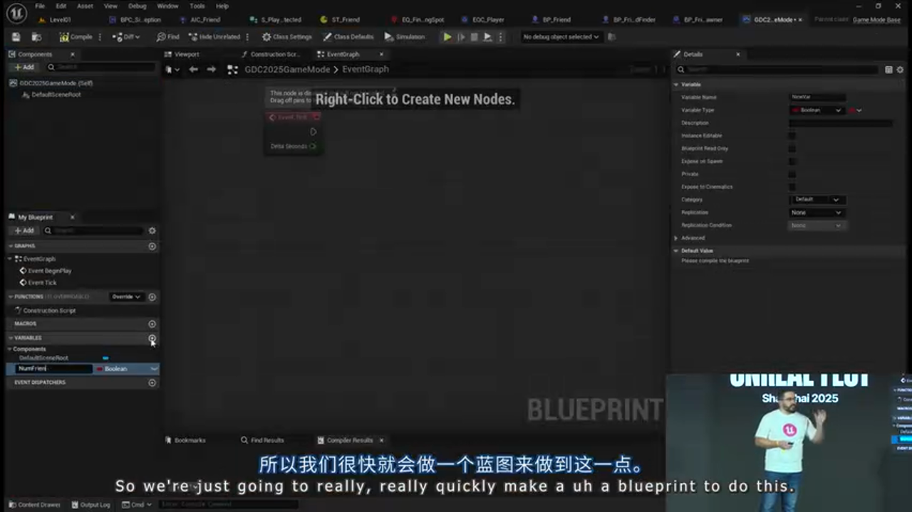
*图65: 游戏模式蓝图*

```
Game Mode Blueprint
  └─ Variable: FriendsFound (Integer)
  └─ Function: Increment Friends Count
       └─ Increment FriendsFound
       └─ Broadcast Event "OnFriendsCountChanged"
```

**步骤 2: 创建 Widget 蓝图**

*图66: Widget 设计器*

Widget 组件结构:

```
Canvas Panel
  └─ Horizontal Box
       ├─ Image (机器人图标)
       └─ Text Block (绑定到 FriendsFound 变量)
```

**步骤 3: 绑定数据更新**

*图67: Widget 蓝图中的更新逻辑*

```
Event: Update Friends Count
  └─ Set Text (Text Block)
       └─ Format: "{0} / 10" (当前数量 / 总数)
```

**步骤 4: 在玩家蓝图中创建并更新 Widget**
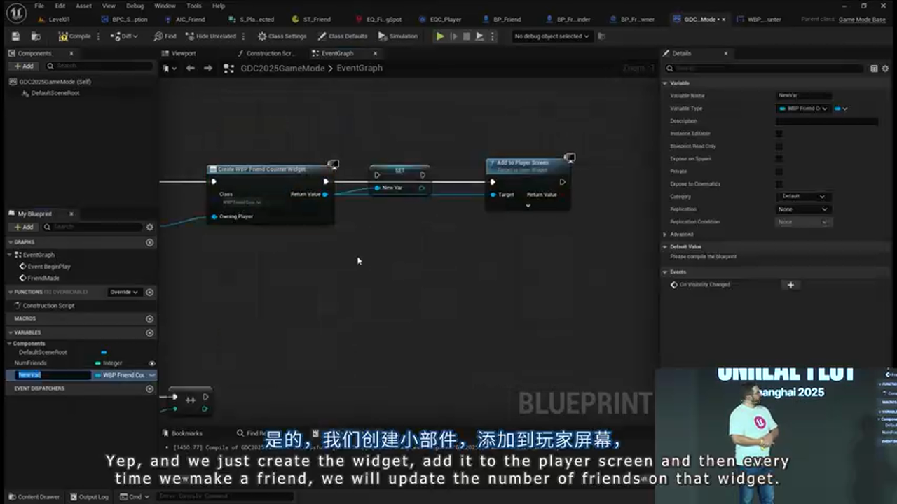
*图68: 创建并添加 Widget 到视口*

```
Event Begin Play
  └─ Create Widget (Friend Counter Widget)
       └─ Add to Viewport

Event On Friend Found
  └─ Call: Update Friends Count on Widget
```

**最终效果:**

*图69: 屏幕左上角显示好友计数*

---

## 十一、移动平台部署:让游戏运行在手机上

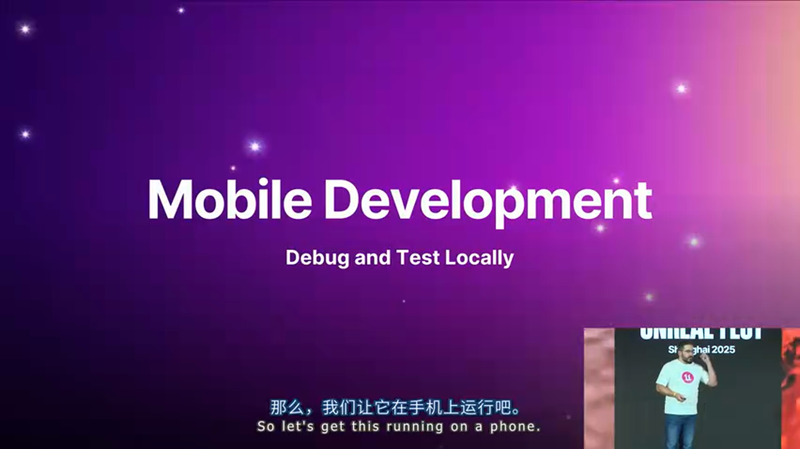
*图70: UE5 的移动开发工具*

### 11.1 UE5 的移动开发能力

**支持平台:**
- Android
- iOS

**内置工具:**
- **移动预览器**: 在编辑器中模拟移动设备的渲染效果
- **可扩展性设置**: 根据设备性能自动调整画质
- **虚拟摇杆**: 自动生成的触摸控制界面

### 11.2 实战:打包 Android 版本

**步骤 1: 配置项目设置**

*图71: 项目设置中的 Android 配置*

关键设置:
- 设置包名 (Package Name)
- 配置签名密钥
- 选择目标 SDK 版本

**步骤 2: 打包项目**
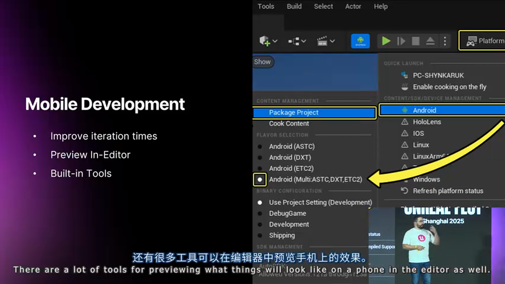
*图72: 打包为 Android APK*

- 文件 → Package Project → Android
- 选择输出目录
- 等待打包完成

**步骤 3: 快速安装到设备**

*图73: 使用批处理文件安装*

UE5 的新功能:打包输出目录中包含 `Install_[ProjectName].bat` 批处理文件
- 连接 Android 设备到电脑
- 双击批处理文件
- 自动安装到设备 (无需手动使用 ADB 命令)

**步骤 4: 优化移动性能**

*图74: 在 Galaxy S10 上运行*

在蓝图中动态调整画质:

```
Event Begin Play
  └─ Get Platform Name
       └─ Is Mobile? → Set Scalability Quality (Low)
```

**虚拟摇杆:**
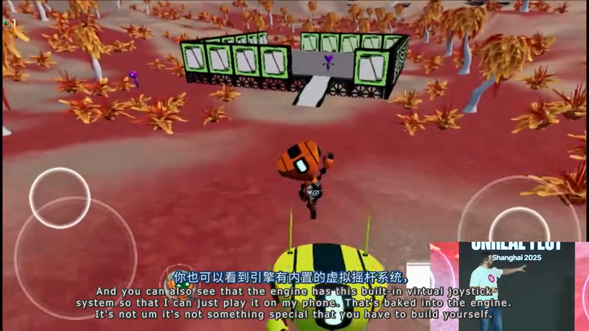
*图75: 引擎内置的虚拟摇杆*

虚拟摇杆是引擎自动生成的,无需额外配置。

### 11.3 远程查看器 (Remote Viewer)

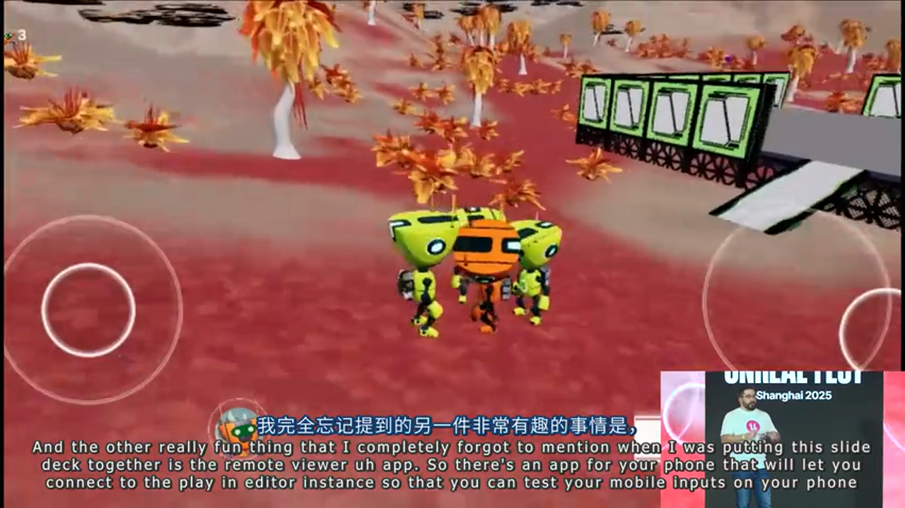
*图76: Remote Viewer App*

**Remote Viewer** 是一个移动应用,允许你:
- 连接到编辑器的 Play-In-Editor (PIE) 会话
- 在手机上测试触摸输入
- 无需每次都打包部署

**使用场景:**
- 快速测试触摸控制
- 验证 UI 在移动设备上的显示效果

---

## 十二、总结与进阶方向

### 12.1 我们学到了什么


*图77: 项目涵盖的所有系统*

通过这个实战项目,我们使用了以下 UE5 系统:

**基础系统:**
- **引擎架构**: Object/Actor/Component 框架
- **C++ 与蓝图**: 混合使用的策略

**内容创作工具:**
- **Modular Control Rig**: 1 分钟创建角色绑定
- **Sequencer 动画**: 引擎内动画制作
- **PCG**: 程序化关卡填充

**交互与逻辑:**
- **Blueprint + Enhanced Input**: 可视化脚本与输入系统
- **State Tree**: AI 行为状态管理

**视觉与音频:**
- **Chaos**: 物理破坏系统
- **Niagara**: VFX 粒子特效
- **MetaSounds**: 程序化音频

**界面与跨平台:**
- **UMG**: UI 系统
- **移动部署**: Android/iOS 打包

### 12.2 还有更多值得探索

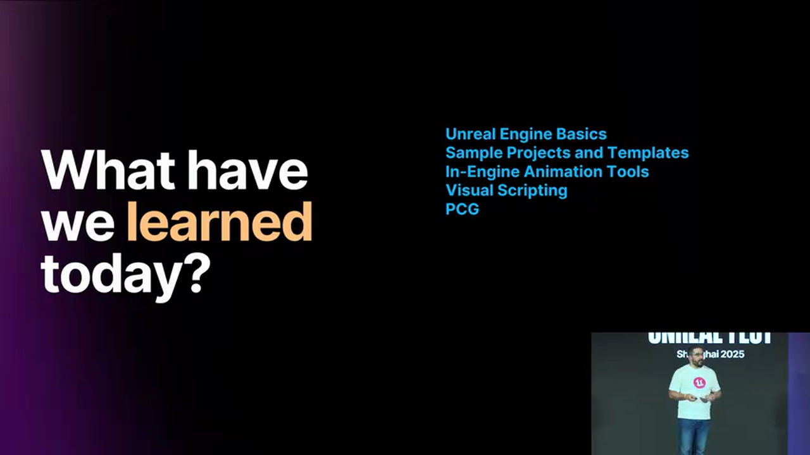
*图78: 未涉及的高级系统*

**高级系统 (本文未涵盖):**

**架构与工具:**
- **Subsystems**: 引擎级单例管理
- **Game Instance**: 跨关卡数据持久化
- **Interchange**: 新一代资源导入框架

**动画与角色:**
- **Contextual Animation**: 上下文动画系统
- **Motion Matching**: 动作匹配技术
- **IK Rig**: 程序化 IK 系统

**UI 高级特性:**
- **MVVM Plugin**: 模型-视图-视图模型架构
- **Common UI**: 跨平台 UI 框架

**渲染与性能:**
- **Lumen First Person Rendering**: 第一人称特殊优化
- **Scalability System**: 可扩展性系统
- **World Partition**: 大世界流式加载

**编辑器扩展:**
- **Editor Scripting**: 用蓝图自动化编辑器任务
- **Modeling Tools**: 引擎内建模工具
- **Geometry Script**: 程序化几何生成

### 12.3 推荐学习资源


*图79: 官方学习资源*

**Epic Games 官方资源:**

1. **Begin Play 系列**
   - 针对新开发者的系统化教程
   - 涵盖所有核心系统的基础用法

2. **设置 UE 工作室的 Epic 方式**
   - 演讲者: Ari Arnbjörnsson
   - 涵盖项目结构、版本控制最佳实践

3. **虚幻引擎最佳实践的神话破解**
   - 演讲者: Ari Arnbjörnsson
   - 纠正常见误区,提供性能优化建议

4. **游戏动画示例项目**
   - 深入学习动画工具的完整项目
   - 包含高级动画技术的实战案例

**Epic Developer Community:**
- 本次演讲的所有步骤都已发布为详细教程
- 可以按照教程自己实现完整项目

---

## 十三、避坑指南与最佳实践

### 13.1 项目结构最佳实践

**文件夹组织:**
```
Content/
  ├─ Core/           (核心游戏逻辑)
  ├─ Characters/     (角色相关)
  ├─ Environments/   (环境资源)
  ├─ UI/             (界面资源)
  ├─ Audio/          (音频资源)
  └─ VFX/            (特效资源)
```

**命名规范:**
- 蓝图: `BP_PlayerCharacter`
- 材质: `M_Grass`
- 纹理: `T_Grass_BaseColor`
- 静态网格体: `SM_Rock_01`

### 13.2 性能优化建议

**蓝图性能:**
- 避免在 Tick 中进行复杂计算
- 使用 Timer 代替高频 Tick
- 考虑将性能关键逻辑用 C++ 实现

**渲染性能:**
- 合理使用 Nanite (并非所有资源都需要)
- 移动平台关闭 Lumen,使用传统光照
- 使用 Stat GPU 和 Stat Unit 命令分析瓶颈

**PCG 注意事项:**
- 限制生成的实例数量
- 使用 Hierarchical Instanced Static Mesh (HISM)
- 在编辑器中可以暂时禁用 PCG 以提升编辑性能

### 13.3 协作开发建议

**版本控制:**
- 使用 Perforce 或 Git LFS 管理大型二进制资源
- 定期提交,避免长时间独占文件
- 使用引擎内的源代码管理界面

**蓝图与 C++ 的分工:**
- 核心系统、性能敏感部分用 C++
- 游戏逻辑、快速迭代部分用蓝图
- 通过 BlueprintCallable 暴露 C++ 功能给蓝图

---

## 结语

虚幻引擎 5 是一个功能强大但学习曲线陡峭的工具。本文通过一个完整的实战项目,展示了如何使用引擎的核心系统快速构建可玩原型。

**核心理念回顾:**
- **工具是开放的**: 无论你的技能背景如何,UE5 的所有工具都对你开放
- **从简单开始**: 先实现基础功能,再逐步优化和扩展
- **实践出真知**: 跟随教程动手实现,而不是只看不做

**下一步行动:**
1. 下载 Stackobot 示例项目
2. 跟随 Epic Developer Community 的教程复现本文的项目
3. 尝试添加自己的创意(如新的 NPC 行为、不同的音乐规则)
4. 加入 UE5 技术交流群,与其他开发者交流经验

记住:**You can do it with Unreal Engine!** 引擎的能力没有上限,唯一的限制是你的创造力。

---

**参考资源:**
- 本文源视频: https://www.bilibili.com/video/BV1KdU7BUEer
- Epic Developer Community: https://dev.epicgames.com/community/
- Stackobot 示例项目: fab.com
- UE5 官方文档: docs.unrealengine.com

---

*本文由 AI 从视频内容生成,所有技术细节基于 UE5.3 版本。部分高级特性可能在后续版本中有所变化,请以官方文档为准。*