# 虚幻引擎5世界构建效率革命：81个实战技巧全解析

---


## 加入 UE5 技术交流群

如果您对虚幻引擎5的图形渲染技术感兴趣，欢迎加入我们的 **UE5 技术交流群**！

扫描上方二维码添加个人微信 **wlxklyh**，备注"UE5技术交流"，我会拉您进群。

在技术交流群中，您可以：
- 与其他UE开发者交流渲染技术经验
- 获取最新的GDC技术分享和解读
- 讨论图形编程、性能优化、构建工具流、动画系统等话题
- 分享引擎架构、基建工具等项目经验和技术难题

---

> **视频来源**：[UFSH2025]世界构建技巧与窍门 | Chris Murphy Epic Games 开发者关系首席 TA
>
> **视频链接**：https://www.bilibili.com/video/BV1Pz2PBKEQD
>
> **生成说明**：本文由 AI 基于视频内容生成，结合截图与字幕进行深度技术解析

---

## 导读

> **核心观点**：Epic Games 开发者关系团队首席技术美术 Chris Murphy 在 45 分钟内密集分享了 81 个世界构建技巧，涵盖编辑器操作、材质优化、PCG 系统、Nanite 性能调优等多个维度。
>
> **技术价值**：这些技巧大多源自生产环境实战，能够显著提升开发效率并避免常见的性能陷阱。
>
> **前置知识**：建议读者具备 UE5 基础使用经验，了解材质编辑器、蓝图系统和基本的渲染管线概念。

---

## 第一部分：编辑器操作效率提升

### 1. 基础视口导航优化

很多开发者在使用虚幻引擎时，会遇到一个尴尬的问题：明明想快速调整视角高度，却要通过仰头或低头的方式来移动摄像机。实际上，**Q 和 E 键**可以直接控制摄像机上下移动，配合右键 + WASD 的平面移动，能够实现真正的三维自由导航。


这个看似简单的快捷键，却是 Chris Murphy 在演讲开头特别强调的。原因很简单：高效的视口操作是一切工作的基础，当你需要在复杂场景中快速定位问题时，流畅的导航能力会成为你的核心竞争力。

### 2. 顶点吸附（Vertex Snapping）的正确用法

**按住 V 键**可以激活顶点吸附功能，让网格体的顶点精确对齐到其他物体的顶点。这在 UE3 时代就是标准操作，但在 Nanite 时代需要重新审视其适用场景。


> **关键洞察**：Nanite 网格体由于顶点密度极高，顶点吸附的实用性会下降。对于高精度的 Nanite 资产，建议优先使用网格对齐或栅格吸附。

**实战建议**：
- 对于模块化建筑组件（如墙体、地板），使用传统网格体 + 顶点吸附
- 对于 Nanite 资产，优先使用栅格吸附（Grid Snapping）或表面对齐

### 3. 摄像机锁定拖拽（Shift + 拖拽）

在移动物体时按住 **Shift 键**，摄像机会自动跟随物体移动，避免频繁切换"拖拽-移动视角-再拖拽"的低效操作。


这个技巧在布置大型场景时尤其有用，比如在开放世界中摆放建筑物、树木等资产时，可以一次性完成长距离的精确移动。

### 4. 正交视图快速切换

按住 **Ctrl + 中键 + 拖拽**可以快速切换到正交视图：
- 向上拖拽：顶视图（Top View）
- 向左拖拽：左视图（Left View）
- 向右拖拽：右视图（Right View）
- 向左下拖拽：返回透视视图（Perspective View）

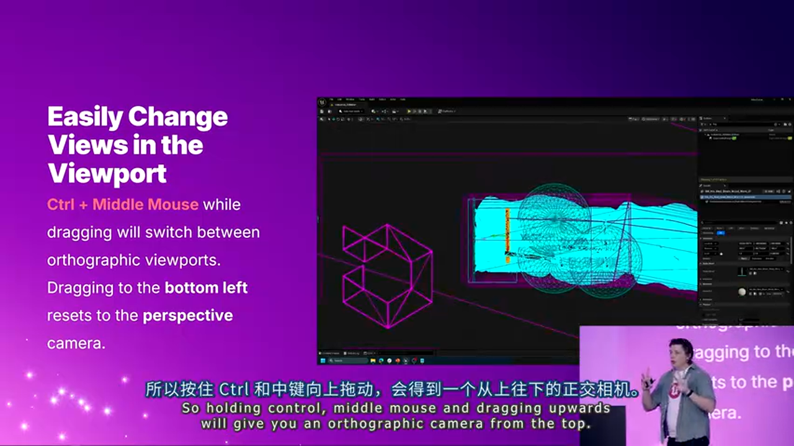

**进阶技巧**：在正交视图下按住中键可以显示测量尺，实时显示两点之间的距离，这在精确布局场景时非常实用。

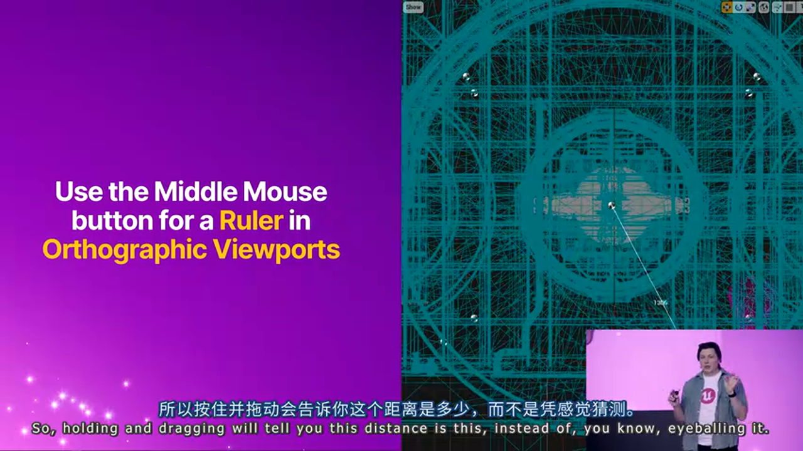

### 5. 快速编辑资产（Ctrl + E）

选中场景中的任何物体后按 **Ctrl + E**，会自动打开对应的编辑器：
- 静态网格体 → 网格编辑器
- 材质 → 材质编辑器
- Niagara 粒子 → Niagara 编辑器
- **地形（Landscape）→ 地形材质编辑器**

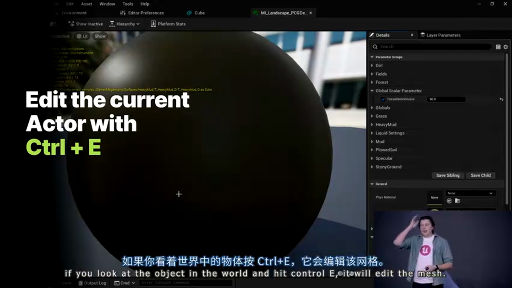

> **效率提升**：这个快捷键消除了"在内容浏览器中查找资产 → 双击打开"的中间步骤，在快速迭代时能节省大量时间。

配合 **Ctrl + B**（在内容浏览器中定位资产），可以实现"场景物体 ↔ 资产文件"的无缝跳转。

### 6. 轴向移动的无 Gizmo 操作

不需要点击 Gizmo 的轴向箭头，直接通过快捷键即可实现精确的轴向移动：
- **Ctrl + 左键拖拽**：沿 X 轴移动
- **Ctrl + 右键拖拽**：沿 Y 轴移动
- **Ctrl + 左键 + 右键同时拖拽**：沿 Z 轴移动

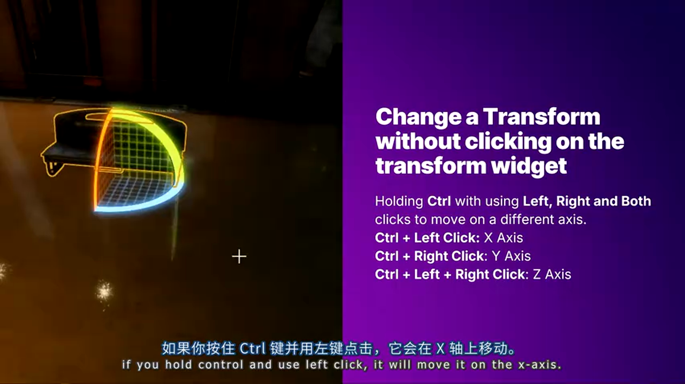

这种操作方式在视角受限或 Gizmo 被遮挡时特别有用。

### 7. 物体快速落地（End 键）

选中物体后按 **End 键**，物体会自动根据其包围盒底部对齐到下方最近的表面。

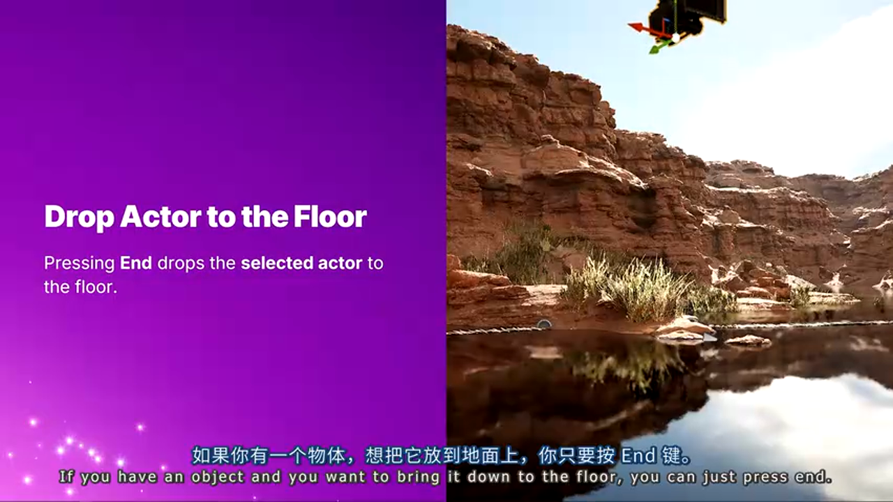

**典型应用场景**：
- 调整地形高度后，批量修正地表物体位置
- 在多层建筑中快速放置家具
- 修复因坐标偏移导致的"漂浮"物体

---

## 第二部分：材质系统高级技巧

### 8. 天空光环境贴图采样（Skylight Environment Map Sample）

这是一个相对新的材质节点，可以直接访问当前天空光的球形环境贴图。

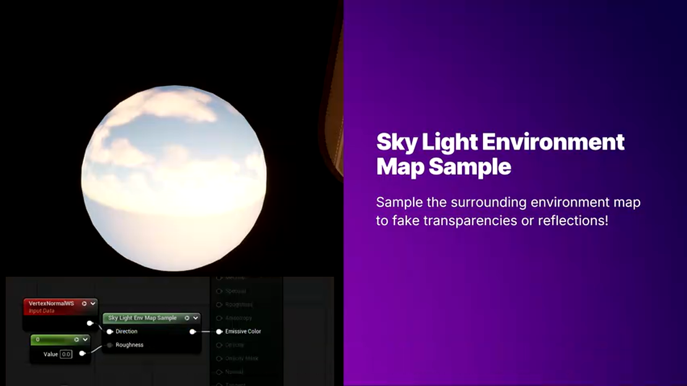

**实战应用**：
- **伪反射效果**：在不使用半透明材质的情况下，为不透明物体添加环境反射
- **性能优化**：避免昂贵的实时反射探针（Reflection Capture）计算
- **艺术风格化**：通过采样和修改天空光数据，实现特殊的光照风格

> **技术细节**：该节点直接读取天空光的预卷积环境贴图（Preconvolved Environment Map），性能开销极低，适合在移动平台或性能受限的场景中使用。

### 9. 阴影通道开关（Shadow Pass Switch）

通过 **Shadow Pass Switch** 节点，可以在阴影渲染阶段使用不同的材质逻辑。

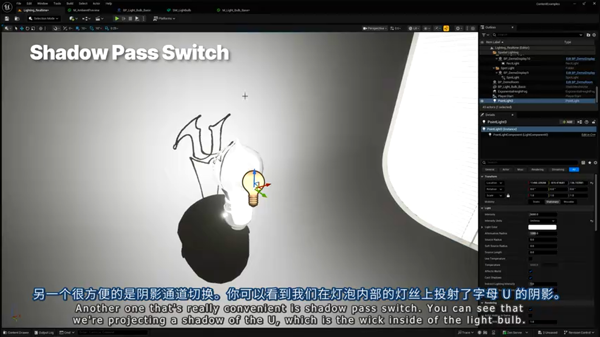

**案例分析**：在灯泡材质中，内部的灯丝（Wick）网格会在阴影中投射出不必要的细节。通过 Shadow Pass Switch，可以在阴影通道中屏蔽这些细节，只保留外轮廓。

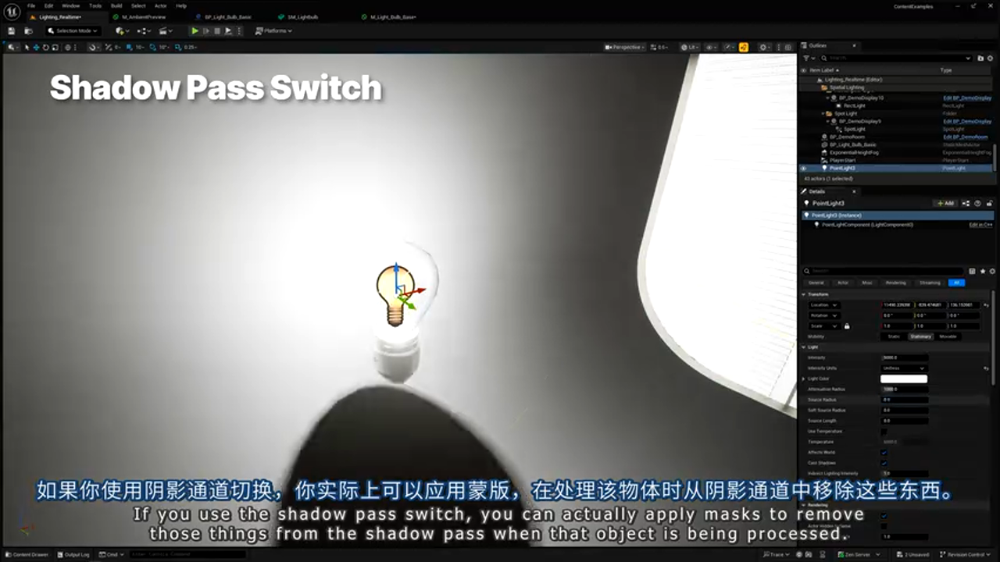

**实现方式**：
```
// 材质逻辑示意（非实际代码）
ShadowPassSwitch {
    Default: 正常材质逻辑（包含灯丝细节）
    ShadowPass: OpacityMask = 0（屏蔽灯丝）
}
```

**适用场景**：
- 镂空装饰物（避免投射复杂阴影）
- 半透明物体（优化阴影质量）
- 性能优化（减少阴影渲染复杂度）

### 10. 逆向曝光补偿（Eye Adaptation Inverse）

当你希望材质的颜色在世界中显示为编辑器中设置的精确值时，可以使用 **Eye Adaptation Inverse** 节点抵消自动曝光的影响。

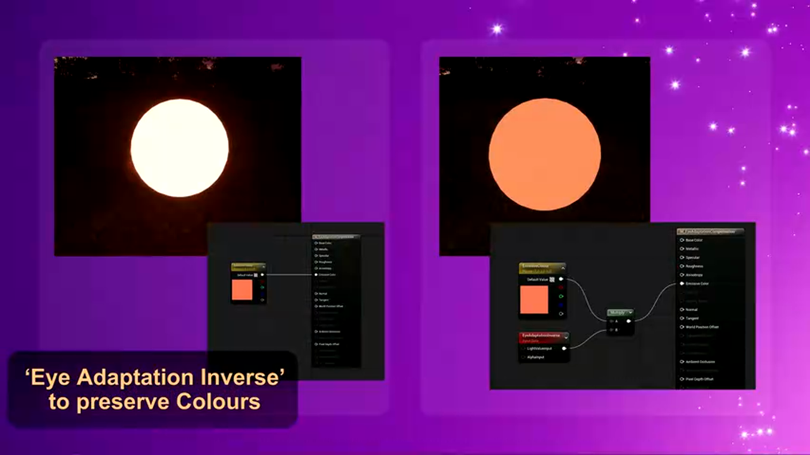

**技术原理**：
后处理的自动曝光（Eye Adaptation）会根据场景亮度动态调整最终画面，导致材质颜色偏离设计值。通过乘以曝光逆值，可以"撤销"这个自动调整。

**典型应用**：
- **世界空间 UI**：确保 UI 颜色在任何光照条件下都保持一致
- **发光标识**：霓虹灯、指示灯等需要保持固定亮度的物体
- **艺术色彩控制**：在风格化渲染中精确控制色彩表现

### 11. 自定义云材质

虚幻引擎的体积云（Volumetric Cloud）材质是可以完全自定义的，默认材质可以在引擎内容中找到并作为修改起点。


**风格化案例**：通过修改云的密度采样和色带映射，可以实现油画风格的云层效果。

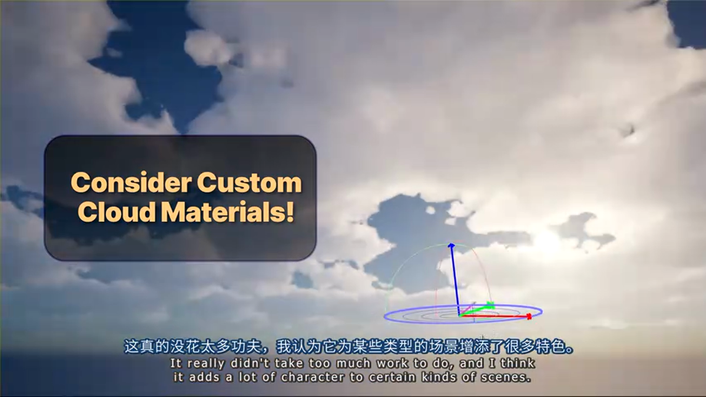

> **设计原则**：天空占据视野的约 50%，其视觉质量直接影响整体美术风格。投入时间优化天空系统是高回报的工作。

**可放置云样本（Placeable Clouds Sample）**：
在体积插件（Volumetric Plugin）中提供了可放置的云蓝图 Actor，允许直接在关卡中移动和编辑单个云朵。


虽然这是 UE4 时代的示例，但它提供了优秀的参考架构，适合学习如何构建自定义云系统。

### 12. Decal 材质深度控制

传统 Decal（贴花）总是叠加在表面顶层，但通过 **Decal Blend Mode** 高级设置，可以将 Decal 注入到材质处理的任意阶段。


**实战案例**：将 Decal 投影到高度偏移（Height Offset）之前，使其看起来像是在污渍之下的基础油漆层。

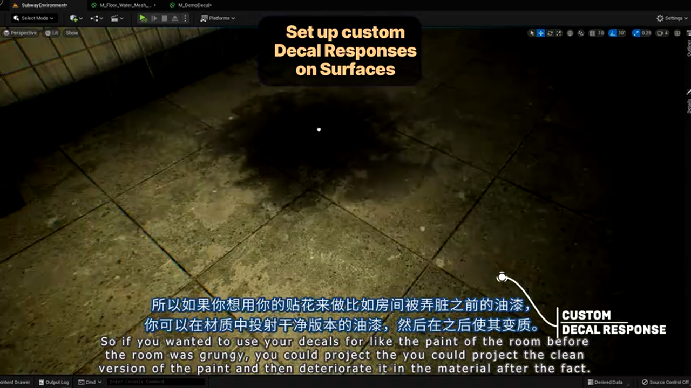

**应用场景**：
- **分层风化效果**：先投影干净的油漆（Decal），再叠加污渍（材质层）
- **历史叠加**：模拟墙面多次粉刷、磨损、再粉刷的真实效果
- **艺术控制**：通过 Decal 快速调整大面积的基础色彩

### 13. 纹理变化节点（Texture Variation Node）

**Texture Variation** 节点通过 UV 扰动打破纹理的重复感，且**不增加额外的纹理采样**。


上图中，上半部分是常规平铺纹理，下半部分使用了 Texture Variation 节点，明显减少了重复感。

> **性能优势**：相比 Texture Bombing（多次采样混合），Texture Variation 只修改 UV 坐标，保持单次采样，对性能影响极小。

**重要注意事项**：
使用该节点后，必须手动设置 **DDX 和 DDY**（导数）以确保 Mipmap 计算正确，否则会出现纹理模糊或闪烁。

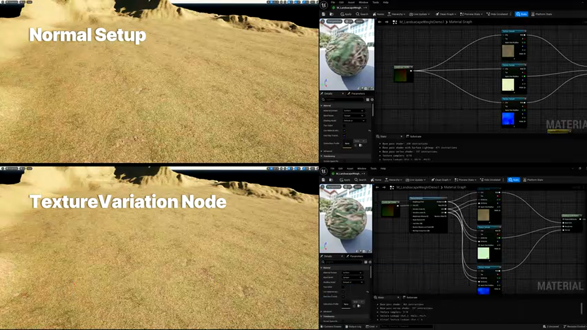

### 14. 地形物理材质分层（Landscape Physical Materials）

在地形材质中，可以通过 **Physical Material Output** 节点为不同区域指定不同的物理材质。

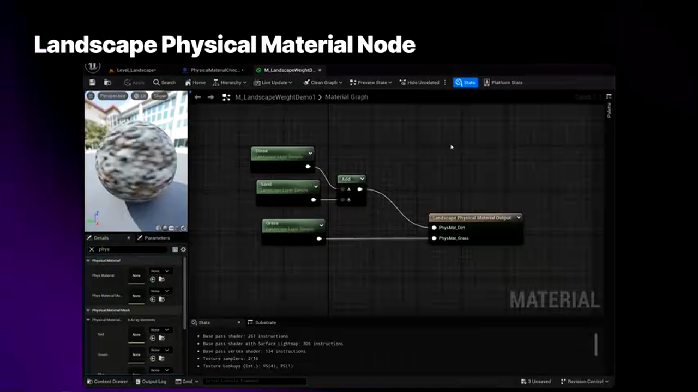

**实现示例**：
```
// 材质逻辑示意
if (石头纹理权重 > 0.5)
    PhysicalMaterial = PM_Stone (产生火花)
else if (泥土纹理权重 > 0.5)
    PhysicalMaterial = PM_Dirt (产生尘土)
else
    PhysicalMaterial = PM_Grass (产生草屑)
```

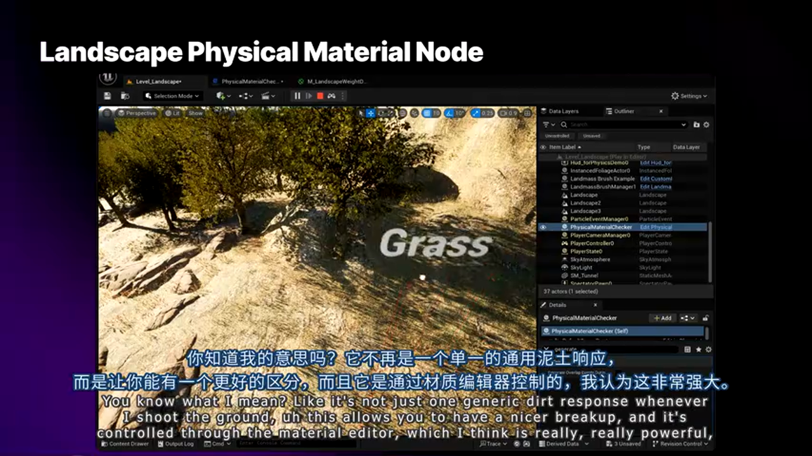

**游戏体验提升**：
- **音效系统**：根据物理材质播放不同的脚步声
- **粒子效果**：射击、行走时产生对应材质的特效
- **交互反馈**：车辆在不同地表上的摩擦力、扬尘效果

---

## 第三部分：场景管理与工作流优化

### 15. 开发者文件夹（Developer Folders）

启用项目设置中的 **Developer Folders** 后，每个用户都会拥有独立的文件夹进行原型开发，且默认隐藏其他用户的开发文件夹。

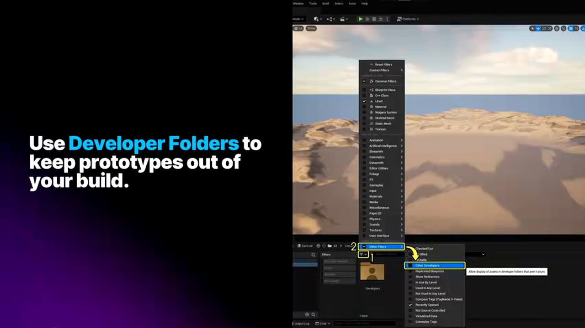

**配合资产引用限制插件（Asset Referencing Restrictions Plugin）**：
可以强制禁止将开发者文件夹中的资产引用到正式游戏内容中，避免未经审核的原型内容意外进入生产环境。

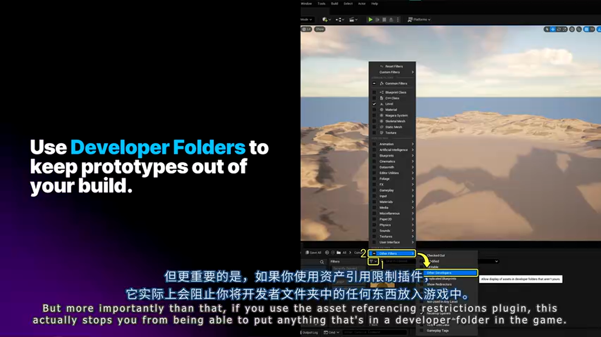

> **团队协作最佳实践**：开发者文件夹解决了"原型污染"问题，让实验性内容与生产内容完全隔离。

### 16. 临时旋转轴心（Alt + 中键）

按住 **Alt + 中键**点击任意位置，可以创建临时的旋转轴心点。

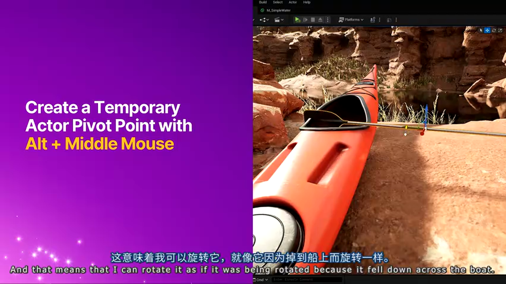

**应用案例**：
- 模拟物体翻倒：点击物体底部边缘作为轴心，旋转模拟物体从桌边掉落
- 门窗开合：在铰链位置设置轴心，精确控制开合角度
- 艺术布局：围绕场景焦点旋转物体，快速尝试不同的构图

### 17. 快速附加工具（Alt + A）

选中物体后按 **Alt + A**，可以快速将其附加到另一个物体上，形成父子层级关系。

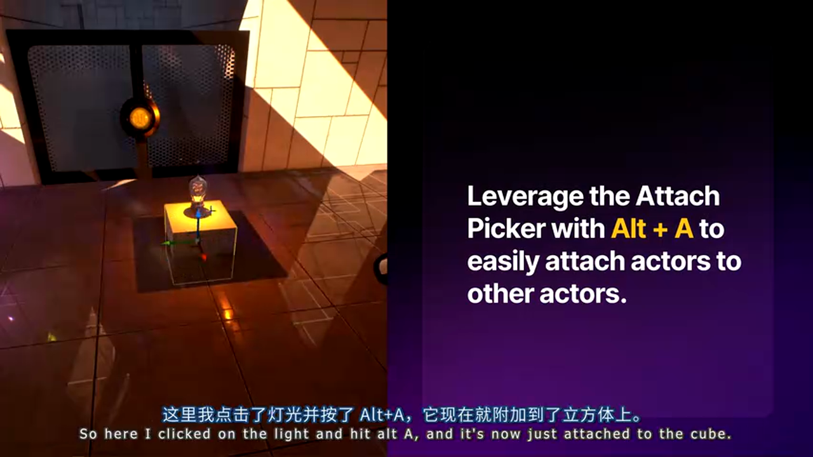

**批量操作流程**：
1. 选中灯光 → Alt + A → 点击桌子（灯光附加到桌子）
2. 选中杯子 → Alt + A → 点击桌子（杯子附加到桌子）
3. 移动桌子，所有子物体跟随移动

虽然现代工作流更倾向于使用 Level Instance 或 Blueprint，但在快速原型阶段，物体附加仍然是高效的临时组织方式。

### 18. 视角书签系统（Ctrl + 数字键）

按 **Ctrl + 数字键**保存当前视角为书签，按对应数字键即可快速跳转。

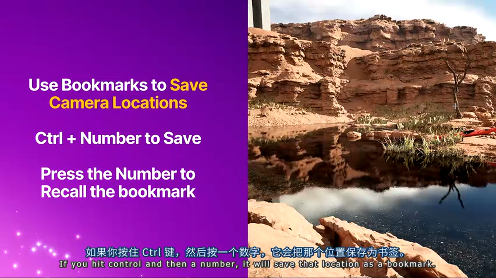

**Chris Murphy 的秘密技巧**：
当他第一次打开别人的项目时，会按遍所有数字键，查看原作者保存了哪些重要视角，以此快速了解地图的关键区域。

> **注意事项**：书签保存在地图文件中，如果基于他人的模板项目创建新地图，记得清理或覆盖旧的书签。

### 19. 数学表达式直接输入

任何数值输入框都支持直接输入数学表达式，按下 Enter 后自动计算结果。


**实用场景**：
- 单位转换：`100 / 2.54`（厘米转英寸）
- 比例缩放：`原始值 * 1.5`
- 精确调整：`(100 + 50) / 2`

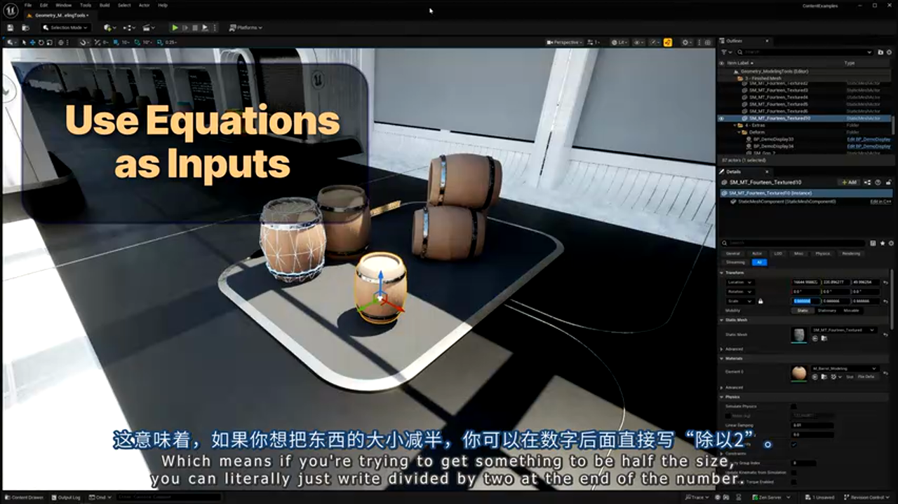

这个功能在处理需要精确数学关系的场景时（如建筑比例、物理参数）能显著提升效率。

### 20. 模拟物理保持位置（K 键）

在 PIE（Play In Editor）模式下模拟物理后，选中想要保留的物体，按 **K 键**，退出 PIE 后这些物体的位置会被保存。


**创意应用**：
- **混乱场景生成**：创建一个带重力枪的游戏模式，在儿童房间中"随意破坏"，然后保存所有物体的混乱状态
- **自然堆叠**：通过物理模拟生成真实的石头堆、木箱堆等
- **破坏效果预览**：测试爆炸、碰撞后的物体分布

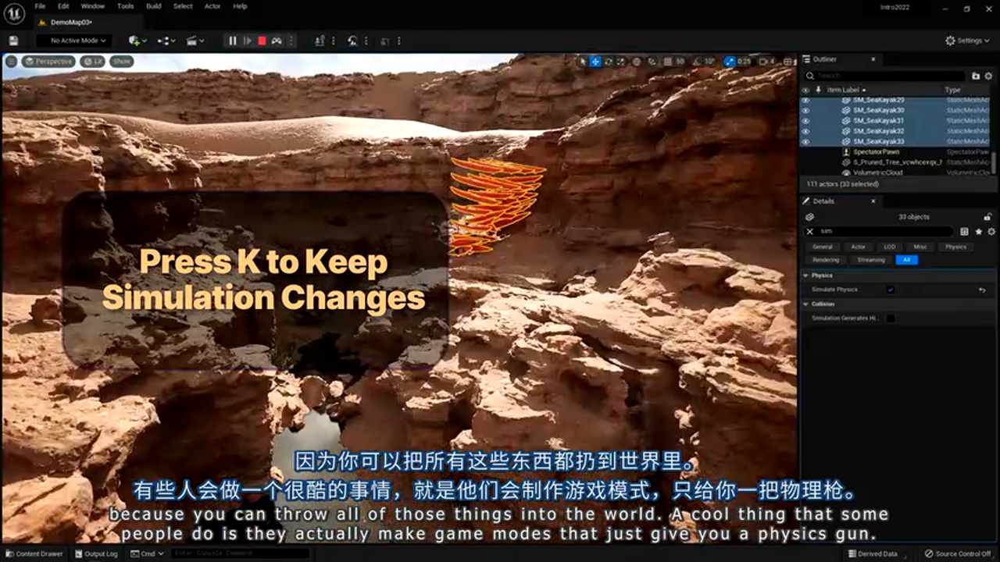

> **设计洞察**：手动摆放"混乱"场景往往显得过于规整，物理模拟能带来更真实的随机性。

### 21. 资产重载（Asset Reload）

误修改资产后，无需重启编辑器，右键选择 **Asset Actions → Reload** 即可恢复到磁盘上的保存版本。

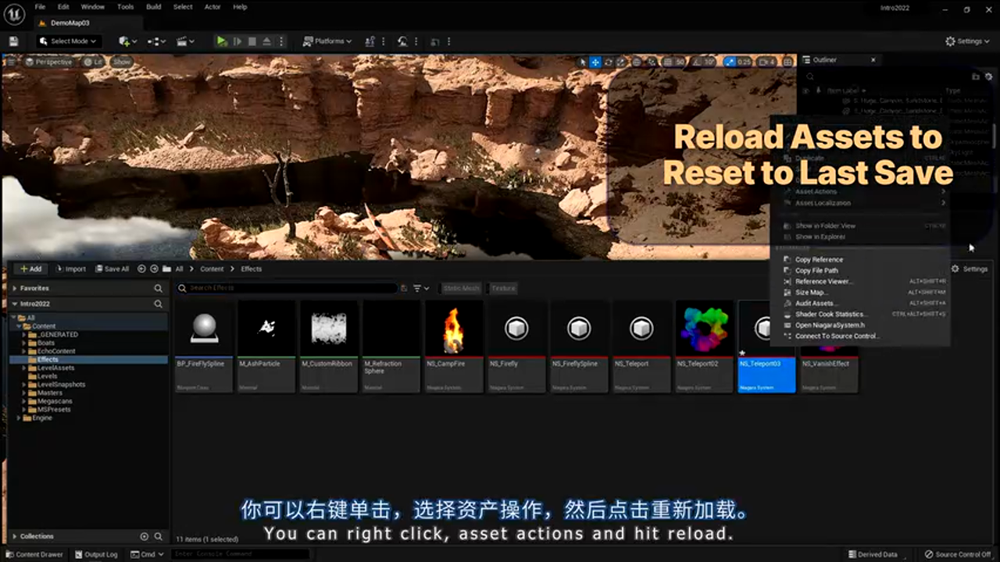

**效率对比**：
- 传统方式：关闭编辑器 → 选择"不保存" → 重启编辑器（耗时 1-3 分钟）
- Reload 方式：右键 → Reload（耗时 1 秒）

**适用范围**：地图、材质、蓝图、Niagara 系统等所有资产类型。

---

## 第四部分：光照与渲染优化

### 22. 光源半径（Light Source Radius）调整

很多独立游戏开发者会忽略 **Light Source Radius** 参数，导致光照过于生硬。


**物理意义**：
- 半径 = 0：点光源（硬阴影，类似激光）
- 半径 > 0：面光源（柔和阴影，更真实）

**调整建议**：
- 台灯：5-10 cm
- 吸顶灯：20-30 cm
- 窗外太阳光：通过天空光系统控制

### 23. 光照通道（Lighting Channels）

通过 **Lighting Channels**，可以让特定光源只影响特定物体。


**典型应用**：
- **过场动画补光**：为主角单独添加轮廓光，不影响环境
- **性能分层**：重要角色使用高质量光照，背景使用低成本光照
- **艺术控制**：在复杂场景中精确控制每个元素的光照

### 24. 环境光混合器（Environment Light Mixer）

**Environment Light Mixer** 是一个一站式的环境光照管理工具（注意：不要与 Light Mixer 混淆，这是两个不同的功能）。


**一键添加的组件**：
- 方向光（Directional Light）
- 天空光（Sky Light）
- 体积云（Volumetric Clouds）
- 指数级高度雾（Exponential Height Fog）
- 大气层（Sky Atmosphere）

所有参数集中在单一面板中，避免在多个 Actor 间跳转调整。

### 25. 局部曝光（Local Exposure）

**Local Exposure** 是 UE5 引入的双通道曝光系统，可以同时保留亮区和暗区的细节。


**技术原理**：
1. 第一遍渲染：针对暗区优化曝光
2. 第二遍渲染：针对亮区优化曝光
3. 生成混合遮罩，融合两个结果

**应用场景**：
- 从黑暗室内看向明亮室外
- 洞穴入口的内外亮度对比
- HDR 场景的动态范围控制

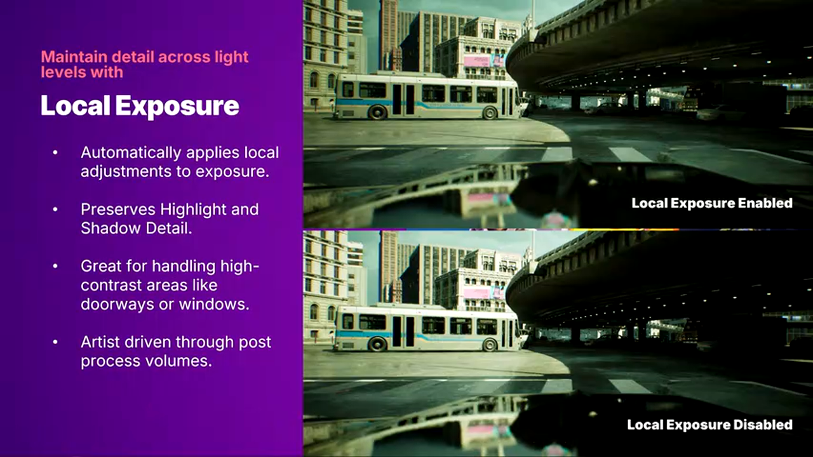

> **性能开销**：局部曝光会增加约 10-15% 的后处理成本，建议在高端平台或重要场景中使用。

---

## 第五部分：PCG（程序化内容生成）系统

### 26. PCG 与 Nanite 的黄金组合

PCG 系统对 **Nanite 实例化（Nanite Instancing）**有深度优化，两者结合可以实现海量资产的高效渲染。


> **性能关键**：启用 Nanite 后，PCG 生成的数百万个实例可以合并为单一 Draw Call，GPU 成本接近零增长。

### 27. 非材质地形图层（Non-Material Landscape Layers）

从 UE 5.4 开始，地形图层可以不绑定到材质，专门为 PCG 系统提供数据。

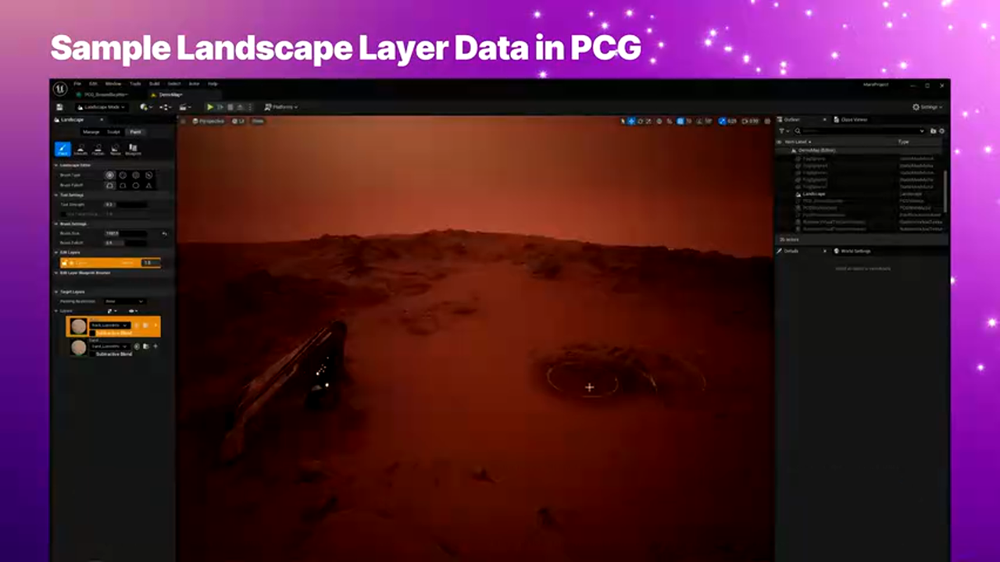

**应用案例**：
- **人类活动密度图层**：PCG 根据该图层生成道路、建筑
- **植被覆盖图层**：控制草地、森林的分布
- **湿度图层**：影响苔藓、水生植物的生成


**优势**：
- 不增加材质复杂度
- 专用于 PCG 逻辑
- 可以独立编辑和优化

### 28. PCG 核心快捷键

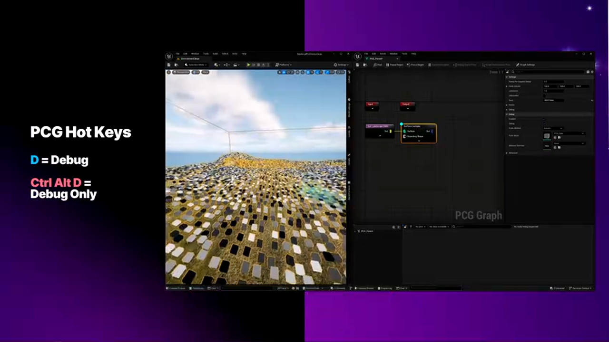

- **D**：调试当前选中的节点
- **Ctrl + Alt + D**：仅调试单个节点（不影响上下游）
- **A**：显示属性面板
- **E**：启用/禁用节点

> **效率提示**：这些快捷键都集中在键盘左侧，方便单手操作，另一只手控制鼠标。

### 29. Level Instance 作为 PCG 数据资产

**Level Instance** 可以转换为 PCG 数据资产，实现"放置整个小场景"而非单个网格体。

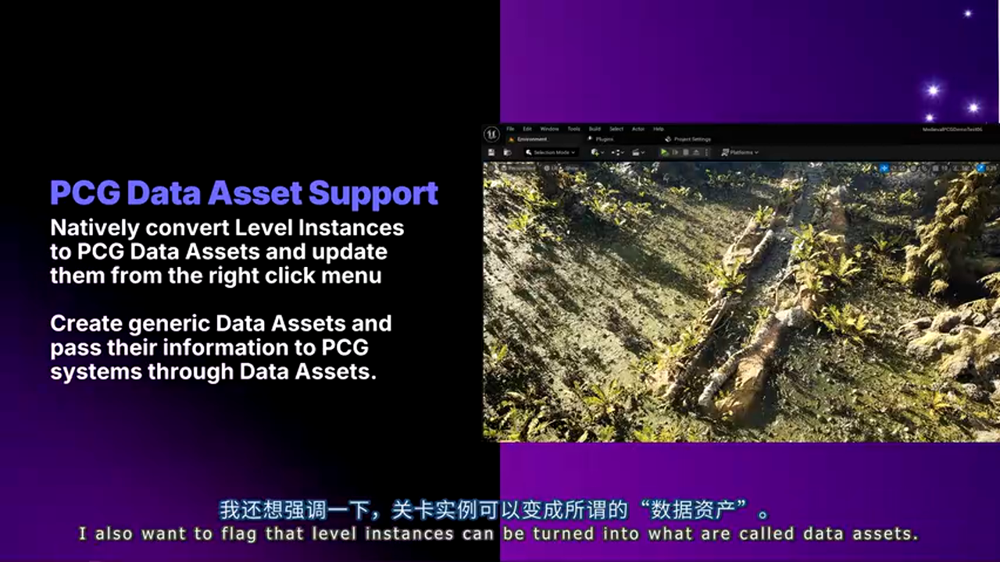

**应用场景**：
- **地下城生成**：每个房间是一个 Level Instance，PCG 负责拼接
- **城市街区**：每个建筑集群是一个 Level Instance
- **营地系统**：帐篷 + 篝火 + 物资箱 = 一个 Level Instance

这种方法结合了艺术家的精细布局能力和程序化的大规模生成能力。

### 30. 水体数据访问（Water Data Access）

PCG 现在可以直接访问 **Water Plugin** 的数据，包括水深、流速等信息。


**实战案例**：
- 在急流区域生成漂流木
- 在深水区域生成水生植物
- 根据流速调整石头的朝向和大小

### 31. 分层生成（Hierarchical Generation）

**Hierarchical Generation** 将世界划分为网格单元，在运行时动态生成 PCG 内容。


**最佳实践**：
- **草地和灌木**：使用运行时生成，避免保存数百万个实例
- **大型建筑**：使用预生成，确保布局稳定
- **混合策略**：关键区域预生成，外围区域运行时生成

### 32. Biome Core 插件

对于 AAA 级开放世界，**Biome Core Plugin** 提供了"PCG 调用 PCG"的嵌套架构。

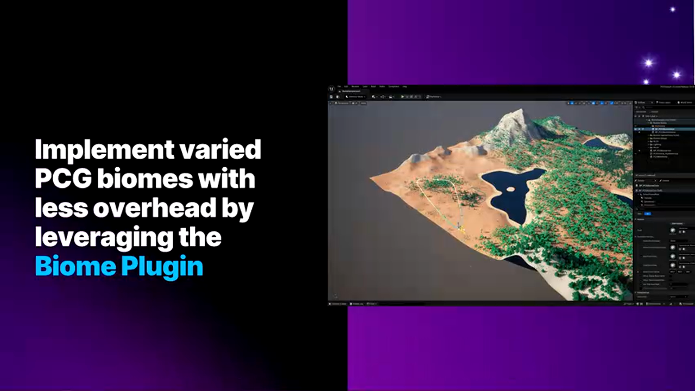

**架构层级**：
1. 顶层 PCG：定义森林、沙漠、草原等生物群系边界
2. 中层 PCG：每个生物群系的具体规则（树木密度、石头分布）
3. 底层 PCG：单个资产的细节变化（树木姿态、石头朝向）

**过渡区域处理**：
生物群系之间不是硬边界，而是通过权重混合实现自然过渡，比如森林逐渐稀疏为草原。

### 33. Grammar 系统

**Grammar** 是 PCG 的规则引擎，专门用于建筑生成。

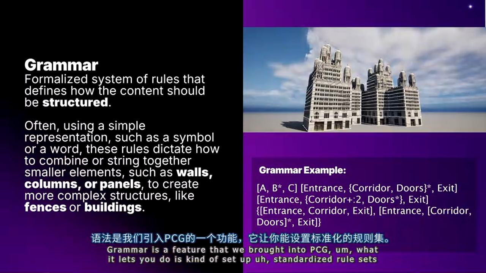

**规则示例**：
```
Corridor {
    StartRule: 放置入口门
    MiddleRule: 每 5 米放置一个侧门
    EndRule: 放置出口门
}
```

这种声明式的规则系统让非程序员也能设计复杂的建筑逻辑。

### 34. GPU 生成（GPU Spawning）

PCG 的 **GPU Spawning** 模式可以在运行时生成数千万个实例，且几乎没有 CPU 开销。

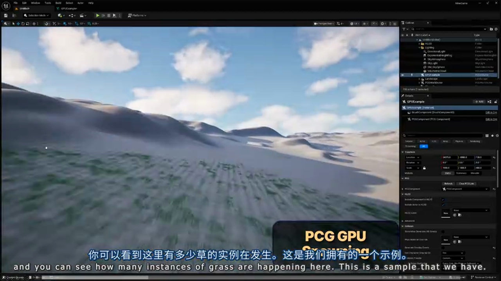

**性能数据**：
- 传统 CPU 生成：10 万实例 = 约 50ms
- GPU 生成：1000 万实例 = 约 5ms

**示例项目**：在 PCG 插件的 Content 文件夹中有完整示例。

---

## 第六部分：Nanite 性能调优

### 35. Nanite 植被的 Preserve Area

使用 Nanite 植被时，必须启用 **Preserve Area** 设置，否则远处的植被会消失。

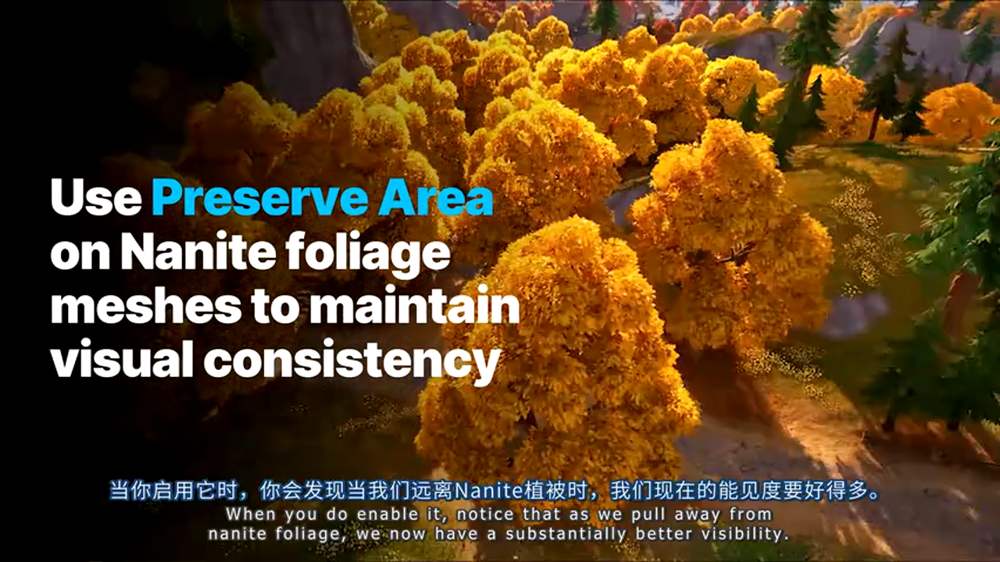

**技术原理**：
Nanite 的 LOD 系统基于屏幕空间像素大小，细小的叶片在远处会被优化掉。Preserve Area 强制保留最小可见面积，确保植被不会完全消失。

### 36. 世界位置偏移（WPO）距离控制

**World Position Offset** 在 Nanite 网格上是性能杀手，必须设置距离衰减。


**优化策略**：
- 近距离（0-50m）：启用 WPO，实现草叶摆动
- 中距离（50-100m）：逐渐减弱 WPO 强度
- 远距离（>100m）：完全禁用 WPO

### 37. Nanite 可编程光栅化可视化

**Programmable Rasterizer Visualizer** 显示所有非标准 Nanite 路径的物体（使用 Masked 或 WPO 的网格）。

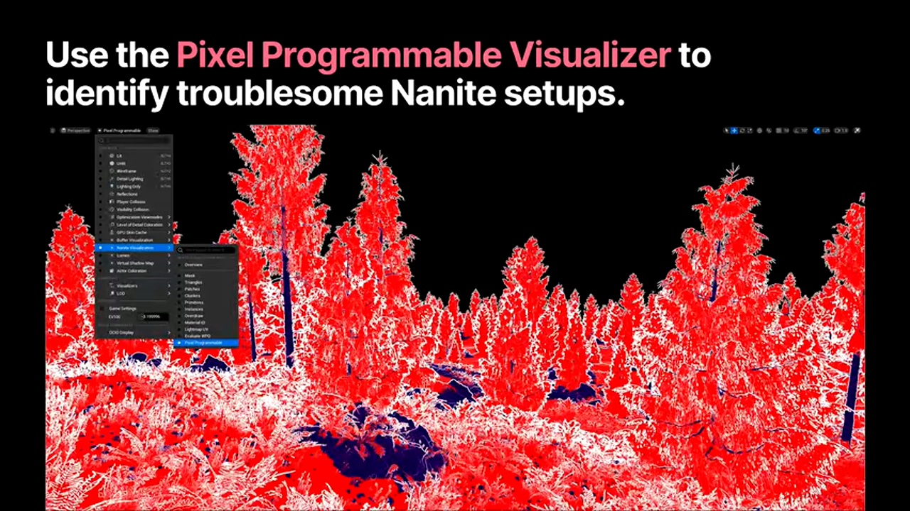

> **性能警告**：如果场景中大部分物体都显示为彩色（非标准 Nanite），说明没有充分利用 Nanite 的性能优势。

### 38. Nanite 过度绘制（Overdraw）优化

Nanite 的过度绘制问题分为两个维度：
1. 摄像机视角的过度绘制
2. 方向光阴影视角的过度绘制


**优化建议**：
- 避免多层重叠的复杂几何（如密集的树叶）
- 使用 Impostor 系统替代远处的 Nanite 植被
- 调整阴影距离，减少不必要的阴影计算

### 39. Nanite 平台特定覆盖

Nanite 提供了丰富的 **Per-Platform Override** 选项，可以针对不同平台调整策略。


**实战案例**：
- PC/Console：全面启用 Nanite
- Mobile：仅对大型资产启用 Nanite，小物件使用传统 LOD
- VR：根据目标帧率动态调整 Nanite 预算

> **避免极端化**：不要因为某个平台不适合 Nanite 就在所有平台禁用，应该建立分平台配置体系。

---

## 第七部分：Level Instance 与数据层

### 40. Level Instance 支持数据层

在项目设置中启用 **Level Instance Support Data Layers** 后，可以在 Level Instance 内部使用数据层作为"可视层"。


**应用案例**：
创建一个建筑的 Level Instance，包含两个数据层：
- **Original Layer**：原始干净状态
- **Man-made Changes Layer**：人类活动痕迹（涂鸦、损坏）

通过切换数据层，同一个 Level Instance 可以表现不同的故事阶段。

### 41. Level Instance 打散（Break）

任何 Level Instance 都可以随时打散（Break），将内容释放到当前关卡中。


**工作流程**：
1. 使用 Level Instance 快速放置标准建筑
2. 打散 Level Instance
3. 对单个实例进行个性化修改

这种"模板 → 定制"的流程兼顾了效率和灵活性。

### 42. Level Instance 动物园（Zoo）

创建一个专门的 **Level Instance Zoo** 关卡，集中展示所有可用的 Level Instance 变体。

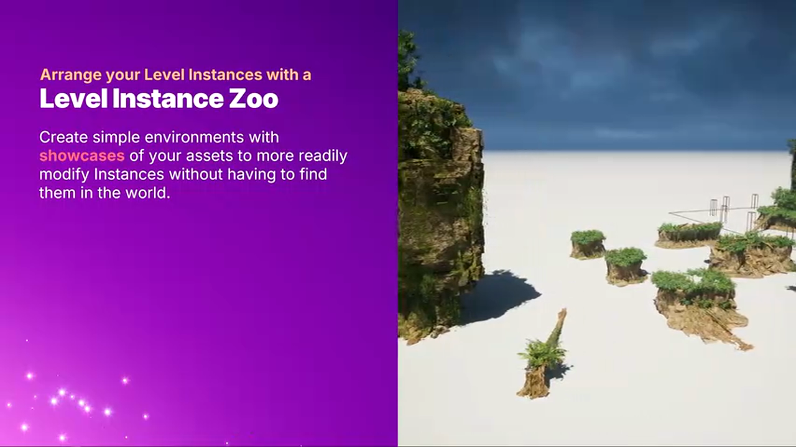

**团队协作价值**：
- 新成员可以快速浏览可用资产
- 避免重复创建相似的 Level Instance
- 统一的资产质量标准参考

---

## 第八部分：Niagara 粒子系统

### 43. Niagara 调试器（Niagara Debugger）

**Niagara Debugger** 是被严重低估的调试工具，支持冻结、慢动作和属性检查。


**核心功能**：
1. **系统级调试**：实时监控系统生命周期、粒子数量
2. **粒子级调试**：查看每个粒子的位置、速度、颜色等属性
3. **冻结功能**：暂停粒子系统，逐帧分析问题


**调试流程示例**：
```
1. 在 Niagara Debugger 中输入系统名称"FollowTheLeader"
2. 启用粒子位置属性显示
3. 冻结系统
4. 逐个检查粒子，找到行为异常的粒子
5. 回溯该粒子的生成逻辑
```

### 44. Niagara 数据通道（Data Channels）

**Data Channels** 将多个零散的粒子系统合并为单一系统，大幅降低 CPU 开销。

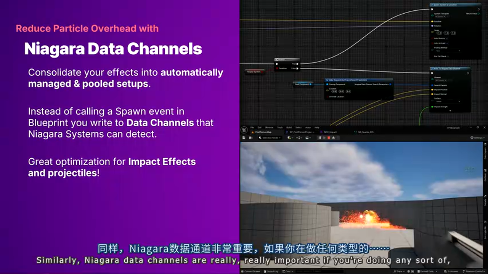

**应用场景**：
多人射击游戏中，10 个玩家同时射击墙壁：
- **传统方式**：触发 10 个独立的火花特效系统
- **Data Channels 方式**：所有玩家的碰撞点汇总到同一个系统中批处理

**性能对比**：
- 传统方式：10 个系统 × 每系统 2ms = 20ms
- Data Channels：1 个系统 × 5ms = 5ms

### 45. 模拟阶段（Simulation Stages）

**Simulation Stages** 将 Niagara 从粒子系统转变为通用计算平台。


**非粒子应用**：
- **风场系统**：计算全局风力矢量场
- **流体模拟**：基于 SPH 算法的简化流体
- **AI 感知**：计算大量 AI 的视线检测

> **进阶标志**：如果你觉得 Niagara 和旧的 Cascade 系统差不多，说明你还没接触 Simulation Stages——这才是 Niagara 的真正威力。

---

## 第九部分：工具与工作流

### 46. 内容浏览器快捷键（Ctrl + Space）

按 **Ctrl + Space** 从底部弹出内容浏览器，再按一次隐藏。

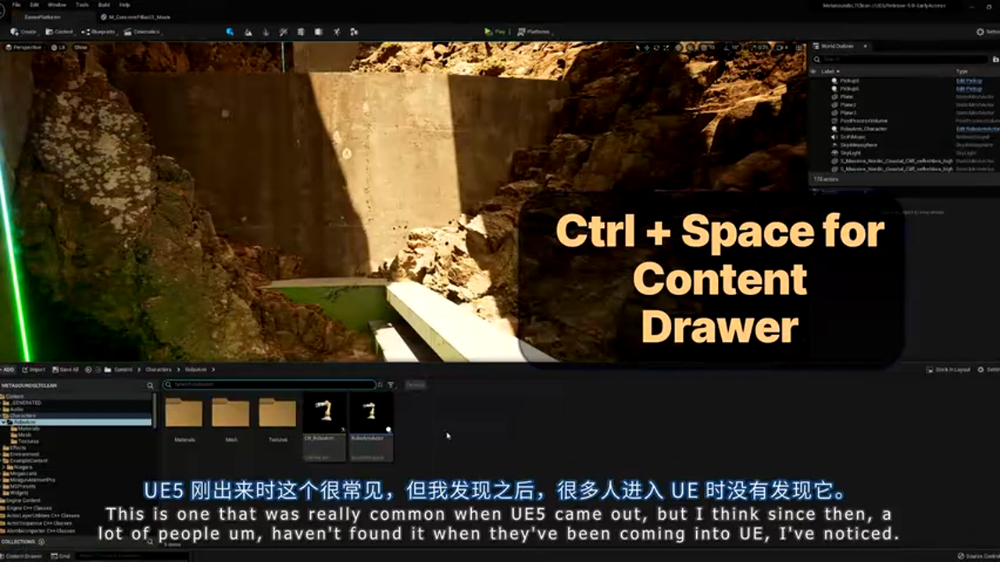

> **效率细节**：相比点击底部标签栏，快捷键操作节省约 0.5 秒，在一天的工作中累计可节省数十分钟。

### 47. F10：窗口停靠切换

按 **F10** 可以将所有停靠窗口弹出为独立窗口，再按一次恢复停靠。


**应用场景**：
- 多显示器工作流：将材质编辑器、蓝图编辑器放到副屏
- 演示模式：清空主窗口，只保留视口
- 专注模式：隐藏所有面板，全屏查看场景

### 48. 属性激活着色（Property Activation Coloration）

**Ctrl + 点击**任意属性，所有具有相同值的物体会高亮显示为红色。


**调试案例**：
- 找到一个启用了"Cast Inset Shadow"的网格体
- Ctrl + 点击该属性
- 场景中所有启用了该属性的物体变红
- 一次性批量修改或定位问题物体


### 49. 自定义过滤器（Custom Filters）

在内容浏览器中创建 **Custom Filter**，保存复杂的资产筛选条件。

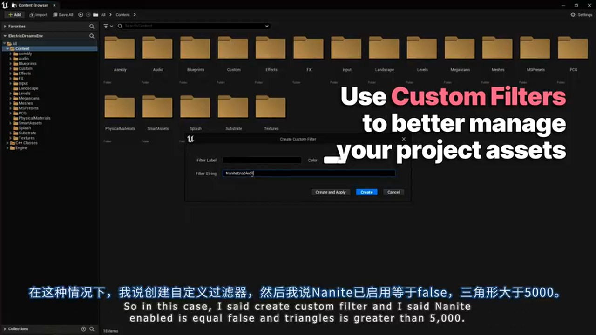

**示例过滤器**：
```
名称：SusMeshes（可疑网格体）
条件：
  - Nanite Enabled = False
  - Triangle Count > 5000
```


这个过滤器会找出所有"明明应该启用 Nanite 却没启用"的高精度网格体。

**团队共享**：
自定义过滤器可以导出为 .ini 文件，在团队成员间共享，统一资产审核标准。

### 50. 未受控变更列表（Uncontrolled Change Lists）

在版本控制中使用 **Uncontrolled Change Lists** 将单次提交拆分为多个逻辑组。

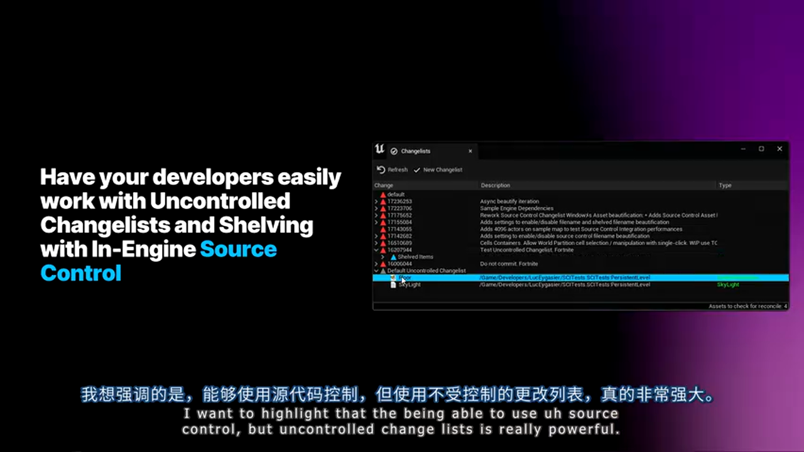

**应用案例**：
美术师完成了一次大型关卡改动，包括：
- 光照调整（Change List A）
- 物体摆放优化（Change List B）
- 材质优化（Change List C）

如果后续发现光照有问题，只需回滚 Change List A，不影响其他改动。

### 51. 审查工具（Review Tool）

**Review Tool** 提供可视化的变更对比界面，支持材质、网格体、关卡等所有资产类型。


**优势对比**：
- Perforce 原生界面：只能看到文件名列表
- Review Tool：并排显示修改前后的截图、参数对比

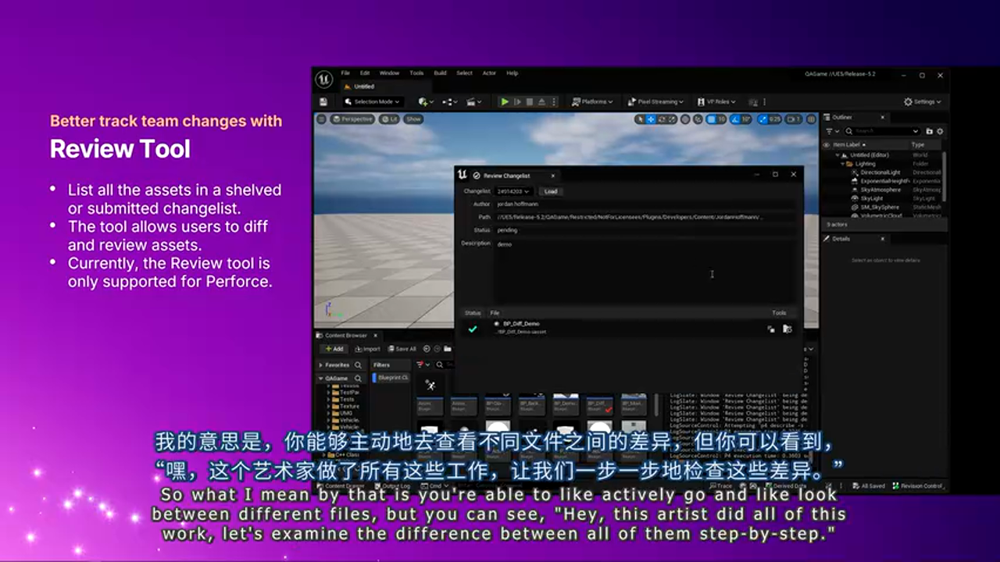

---

## 第十部分：高级材质与渲染

### 52. 体积材质雾（Volumetric Material Fog）

创建一个简单的体积材质（Shading Model: Volume, Blend Mode: Additive），附加到球体网格上，即可生成可控的局部雾效。


**效果展示**：

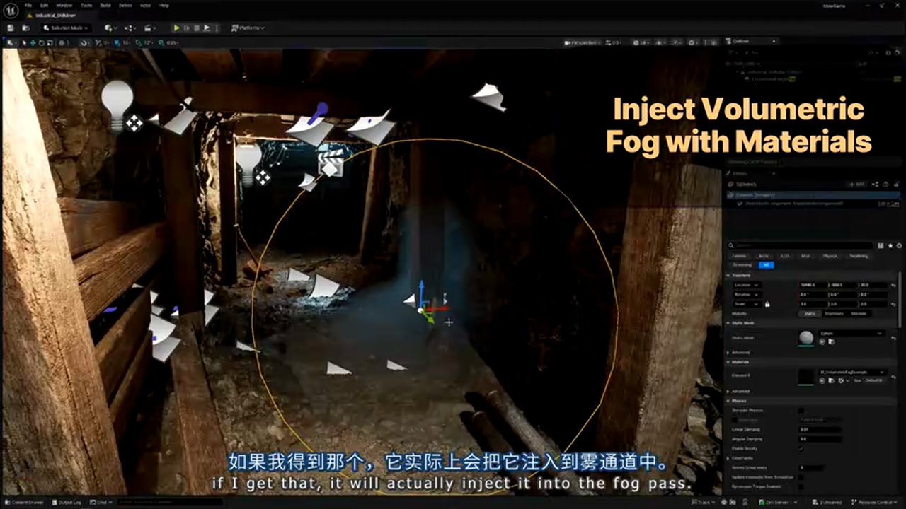

**优势**：
- 完全体积化，不依赖 2D 卡片
- 可以使用距离场查询，实现"雾贴地"效果
- 材质驱动，艺术控制力强


### 53. 运行时虚拟纹理（Runtime Virtual Texture, RVT）

RVT 从上方正交投影采样地形信息，其他物体可以读取这些信息进行材质混合。


**应用案例**：
石头网格体读取地形的 RVT 数据（颜色、法线），在接触边缘自动混合草地纹理，实现无缝融合。

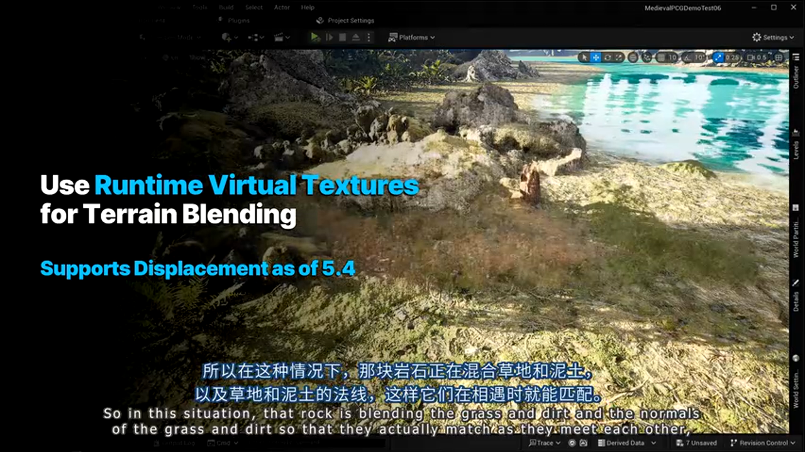

**技术优势**：
- 无需手动绘制混合区域
- 支持动态物体（如可破坏地形）
- 性能开销低（预计算 + 采样）

### 54. 活动调色板（Active Palette）

**Active Palette** 插件允许打开其他关卡，并直接拖拽其中的物体到当前关卡。


**工作流程**：
1. 在 Active Palette 中打开参考关卡
2. 看中某个灯光布局
3. 直接拖拽到当前关卡中


这对于原型开发和资产重用非常高效。

### 55. 立方体网格建模（Cube Grid）

**Cube Grid** 工具可以快速雕刻体素风格的关卡原型。


**操作方式**：
- **Ctrl + 拖拽**：添加或移除立方体
- **Shift + A/Q**：上下移动网格层级

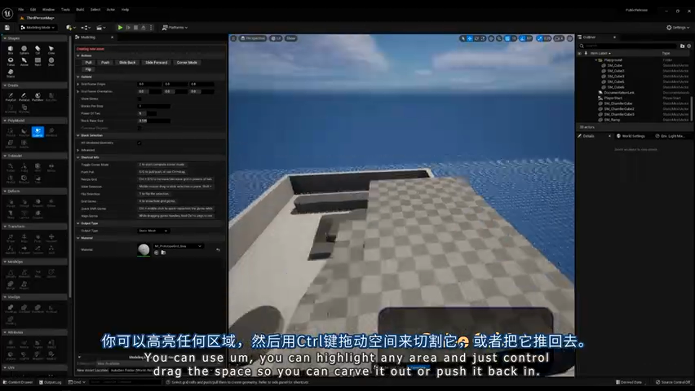

**现代优势**：
由于动态网格（Dynamic Mesh）现在支持 Lumen，Cube Grid 生成的原型可以直接参与全局光照计算，无需转换为静态网格体。

### 56. 样条绘制工具（Draw Spline Tool）

建模模式中的 **Draw Spline Tool** 可以将任何包含样条组件的蓝图转换为绘制工具。


**应用场景**：
- 管道系统蓝图 → 绘制工具
- 电线蓝图 → 绘制工具
- 栅栏蓝图 → 绘制工具

**与传统方式对比**：
- 传统方式：手动放置蓝图 → 调整样条点 → 微调
- Draw Spline Tool：像画笔一样直接绘制路径

### 57. 样条网格 Actor（Spline Mesh Actor）

很多人仍在创建蓝图来弯曲单个网格体，实际上引擎已经提供了 **Spline Mesh Actor**。

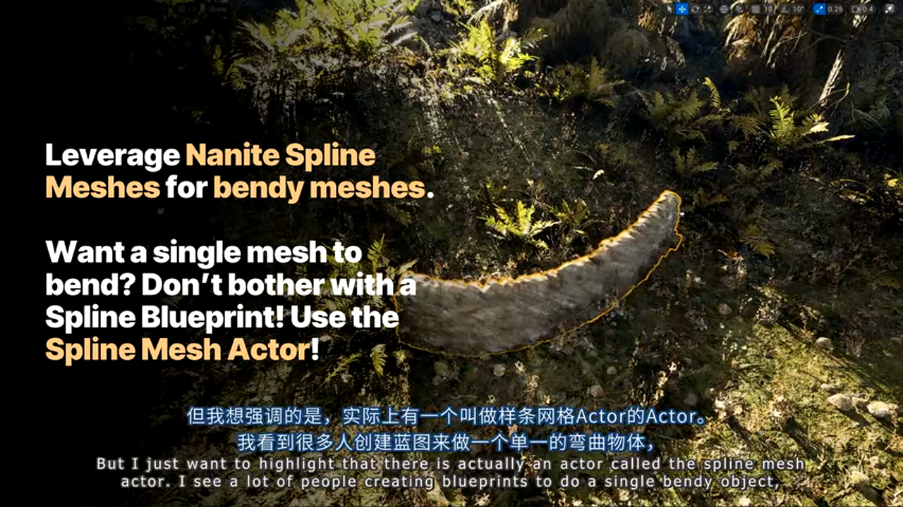

**适用场景**：
- 弯曲墙体
- 弯曲管道
- 任何需要单个网格体沿路径变形的情况

**Nanite 支持**：
样条网格现在完全支持 Nanite，可以使用高精度模型而不用担心性能。

### 58. 样条网格边缘长度因子（Max Edge Length Factor）

使用 Nanite 样条网格时遇到奇怪的包围盒问题？罪魁祸首通常是 **Max Edge Length Factor**。

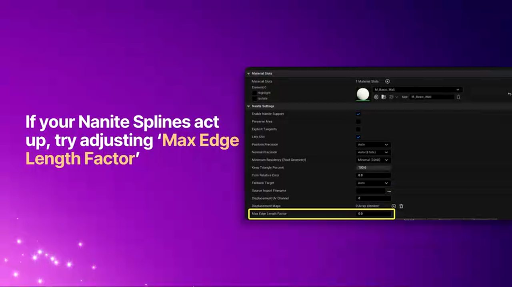

**问题表现**：
- 样条网格弯曲后包围盒异常扩大
- 剔除失效，性能下降
- 阴影闪烁

**解决方案**：
降低 Max Edge Length Factor 的值（默认值通常过大）。

---

## 第十一部分：顶点烘焙与优化

### 59. Nanite 顶点数据烘焙

Nanite 网格体拥有海量顶点，可以利用引擎内置烘焙工具将曲率、AO 等数据烘焙到顶点颜色中。


**应用案例**：
- 烘焙曲率信息，驱动霉菌生长效果
- 烘焙 AO，减少实时 AO 计算
- 烘焙风化信息，控制材质老化

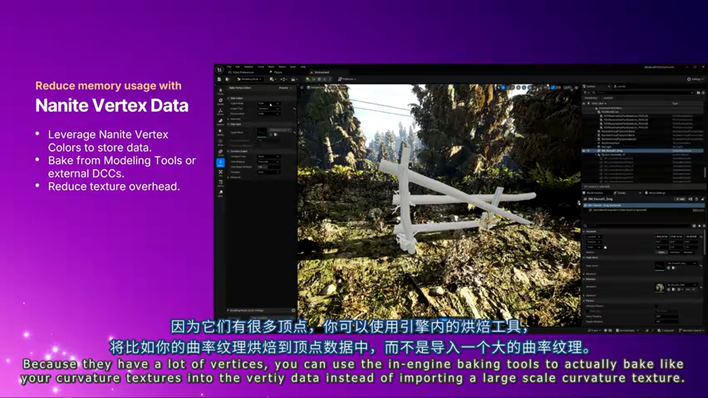

**性能优势**：
- 避免高分辨率纹理
- 利用 Nanite 的顶点密度，不增加额外成本
- 可以实现 Per-Vertex 级别的细节控制

---

## 第十二部分：蓝图与编辑器扩展

### 60. 蓝图编辑器调用（Call In Editor）

在自定义事件上启用 **Call In Editor**，会在 Details 面板中生成可点击的按钮。

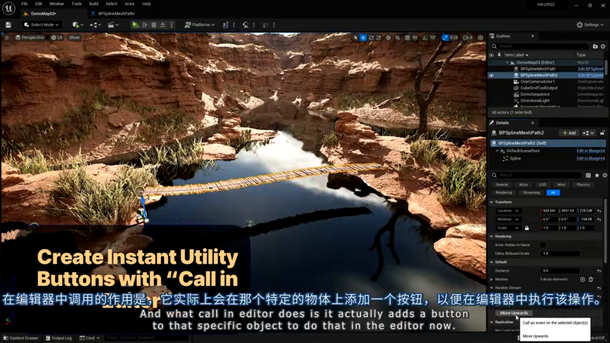

**应用案例**：
- **AI 调试**：添加"吸附到最近掩体"按钮
- **门窗系统**：添加"打开/关闭"按钮
- **生成工具**：添加"重新生成装饰物"按钮

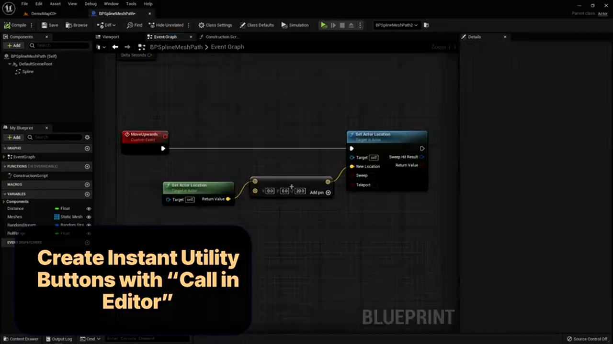

**配合 Scriptable Utilities**：
这个功能是构建编辑器工具链的基础，Chris Murphy 强烈推荐深入研究。

### 61. 位置体积（Location Volumes）

**Actor Location Volumes** 为世界划分的区域命名，方便流送（Streaming）和团队协作。

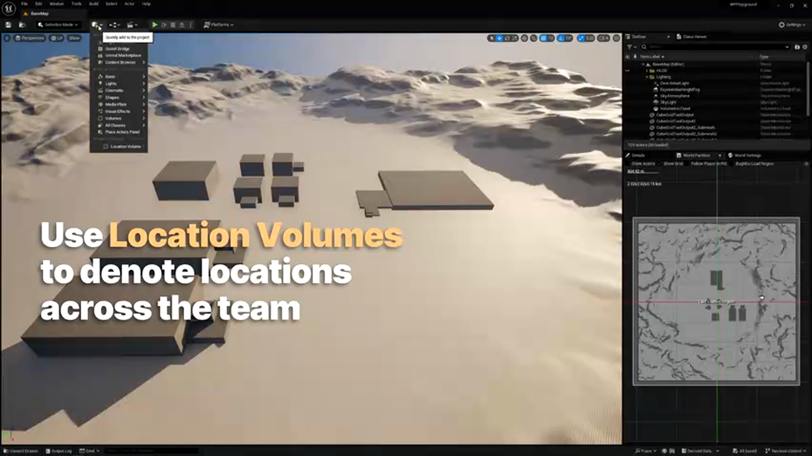

**命名示例**：

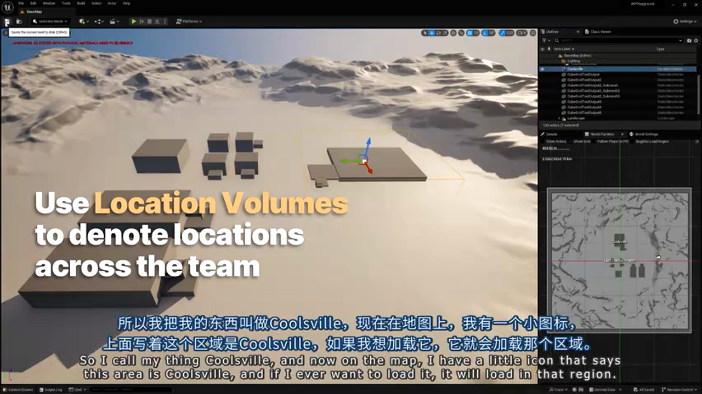

**团队协作价值**：
- 明确的区域归属：美术 A 负责"商业区"，美术 B 负责"住宅区"
- 流送管理：玩家进入"Coolsville"区域时加载对应资产
- 小地图标注：自动生成区域名称标签

### 62. 固定对象（Pinning）

在流送系统中，可以 **Pin** 特定物体，强制其始终保持加载状态。


**应用场景**：
- 远景地标建筑（即使玩家离开该区域也保持可见）
- 任务目标物体（避免被意外卸载）
- 性能测试标记物（用于性能分析）

---

## 第十三部分：后处理与特效

### 63. 后处理材质链（Post Process Material Chain Plugin）

**Post Process Material Chain** 插件允许后处理材质将结果输出为纹理，传递给下一个后处理材质。

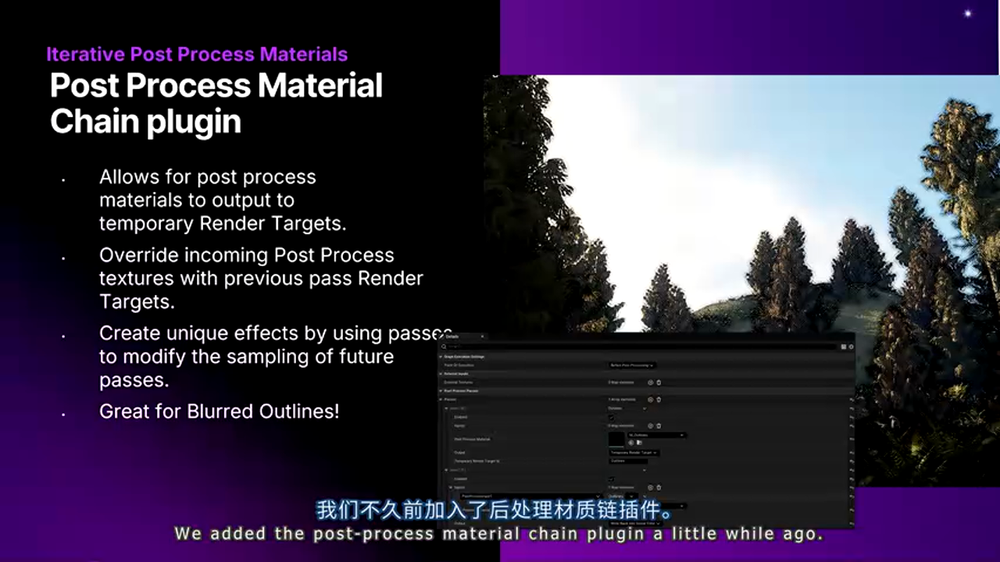

**技术价值**：
- **多步骤着色器**：第一步生成边缘检测遮罩，第二步基于遮罩应用描边
- **性能优化**：避免在单个材质中重复计算
- **模块化设计**：每个后处理阶段可以独立调试和优化

**应用案例**：
- 漫画着色（Kuwahara Filter 多步骤处理）
- 复杂的景深效果
- 自定义抗锯齿算法

### 64. Slate 后缓冲（Slate Post Buffer）

**Slate Post Buffer** 允许 UMG 渲染到纹理，然后作为后处理的一部分进行处理。


**应用案例**：
- 相机取景器效果：UI 先渲染为纹理，再应用模糊、色差等效果
- 全息屏幕：UI 参与 3D 空间的光照计算
- 电视屏幕：UI 内容可以被反射、折射

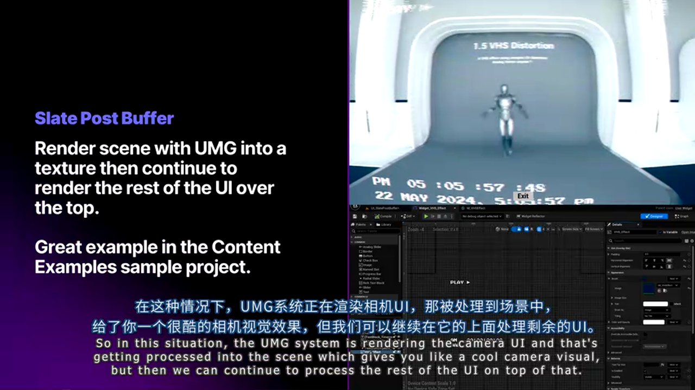

### 65. 覆盖材质系统（Overlay Material System）

**Overlay Material** 在物体表面叠加一层半透明材质，可以访问光照信息并进行修改。

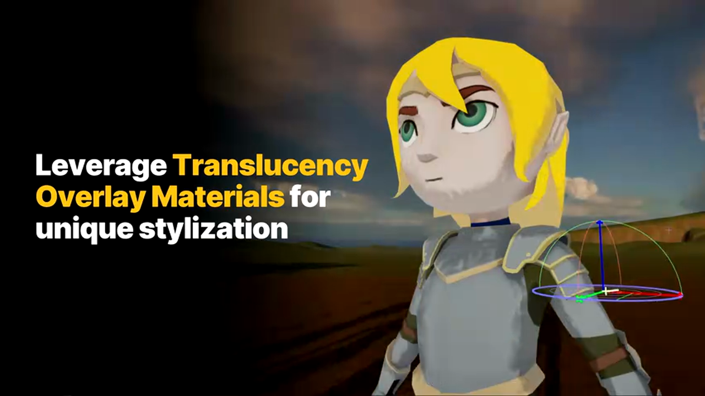

**创意应用**：
在角色的阴影区域添加笔触纹理，模拟手绘风格的阴影。


**技术权衡**：
- 优点：无需修改引擎渲染管线
- 缺点：增加一次半透明绘制，性能开销较高
- 适用场景：风格化渲染、特殊视觉效果

---

## 第十四部分：调试与性能分析

### 66. 控制台变量工具（Console Variables Tool）

**Console Variables Tool** 提供可视化的控制台变量管理界面。


**核心功能**：
- 搜索和过滤控制台变量
- 查看当前值和默认值
- 追踪哪些配置文件修改了该变量

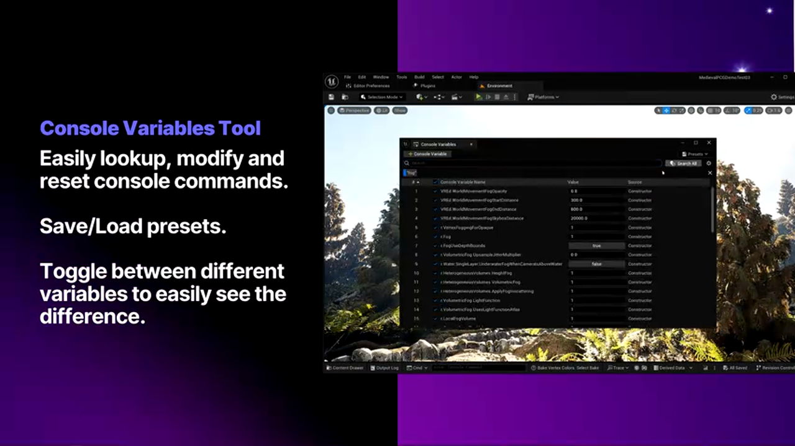

**调试价值**：
当性能或视觉效果异常时，可以快速查看是哪个配置文件或命令行参数修改了关键变量。

### 67. AB Test 命令

**AB Test** 命令自动切换两个状态并比较性能差异。

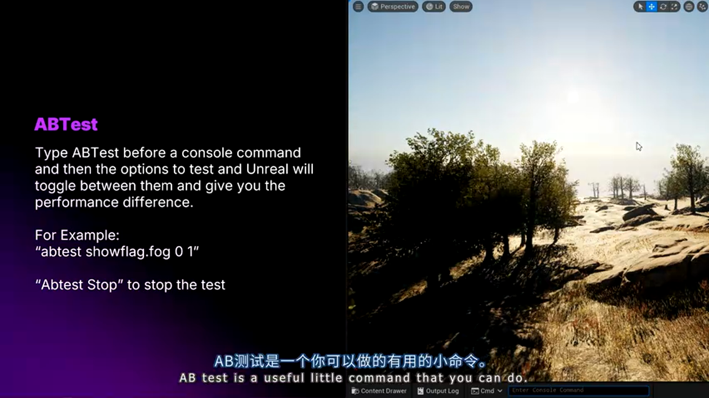

**使用方式**：
```
abtest r.fog 0 1
```

系统会自动：
1. 关闭雾（r.fog 0）→ 采样性能
2. 开启雾（r.fog 1）→ 采样性能
3. 重复 N 次
4. 计算平均值、标准差、置信度

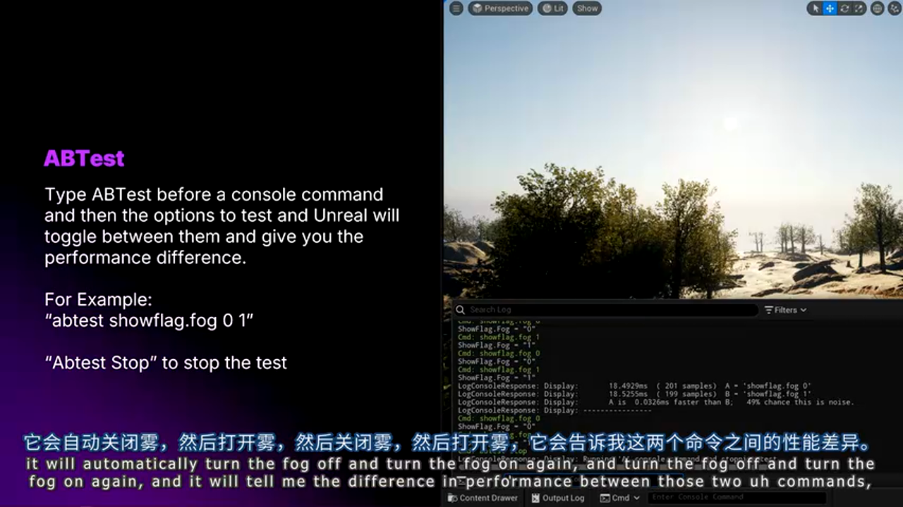

**输出信息**：
- 性能差异（ms）
- 统计置信度（排除随机波动）
- 推荐结论

---

## 第十五部分：色彩管理与团队协作

### 68. 颜色主题系统（Color Themes）

虚幻引擎的颜色选择器支持保存 **颜色主题**，可以在材质、蓝图、VFX 中共享。


**团队协作流程**：
1. 美术总监定义"红队红"、"蓝队蓝"等标准颜色
2. 保存为颜色主题
3. 程序员在制作特效时，从主题中选择颜色
4. 避免"这个红色不对"的返工

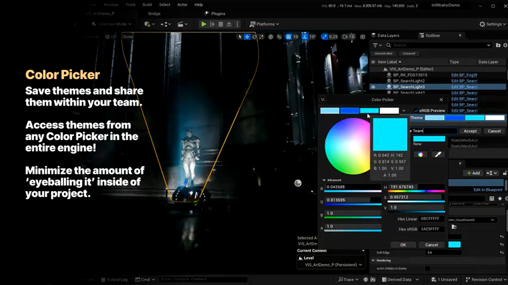

**一致性保证**：
所有团队成员使用相同的颜色定义，确保视觉风格统一。

---

## 实战总结与最佳实践

### 核心技巧分类

**效率类**（立即见效）：
- Ctrl + E：快速编辑资产
- Ctrl + Space：内容浏览器快捷键
- End：物体快速落地
- K：物理模拟结果保持

**性能类**（避坑指南）：
- Nanite WPO 距离控制
- Nanite Overdraw 可视化
- PCG 与 Nanite 配合使用
- AB Test 性能对比

**艺术类**（质量提升）：
- 光源半径调整
- 自定义云材质
- 体积材质雾
- RVT 材质混合

**工作流类**（团队协作）：
- 开发者文件夹
- 位置体积命名
- 颜色主题系统
- 审查工具

### 学习路径建议

> **初级开发者**（0-1 年经验）：
> 优先掌握编辑器操作效率技巧（第一部分），这些是日常工作的基础。

> **中级开发者**（1-3 年经验）：
> 深入学习材质系统和 PCG（第二、五部分），这是提升项目规模的关键。

> **高级开发者**（3+ 年经验）：
> 研究 Nanite 性能调优和 Niagara 高级功能（第六、八部分），构建技术壁垒。

### 常见误区与解决方案

**误区 1**：Nanite 适用于所有资产
> **解决方案**：
> - 小型道具（<1000 三角面）：传统网格体 + LOD 更高效
> - 植被：需要启用 Preserve Area
> - 半透明物体：Nanite 不支持，使用传统渲染

**误区 2**：PCG 只能用于自然场景
> **解决方案**：
> - Grammar 系统专为建筑设计
> - Level Instance 支持城市生成
> - 水体数据访问适用于港口、河流城市

**误区 3**：调试只能靠日志和断点
> **解决方案**：
> - Property Activation Coloration：可视化查找问题物体
> - Niagara Debugger：粒子级调试
> - Console Variables Tool：追踪配置变更

### 进阶学习资源

**官方示例项目**：
- **Content Examples**：涵盖所有引擎功能的示例场景
- **PCG Plugin Content**：PCG 系统的完整示例
- **Biome Core Plugin**：AAA 级开放世界 PCG 架构

**社区资源**：
- Epic Developer Relations 团队的技术博客
- Unreal Slackers Discord 社区
- 各大 GDC/SIGGRAPH 技术分享

---

## 结语

Chris Murphy 在 45 分钟内分享的 81 个技巧，涵盖了从基础操作到高级渲染的完整知识图谱。这些技巧的共同特点是：**源自生产环境实战，能立即应用到项目中**。

> **最后的建议**：不要试图一次性掌握所有技巧。选择 3-5 个与当前项目相关的技巧，深入实践，形成肌肉记忆。然后逐步扩展技能树，最终构建起完整的虚幻引擎工作流体系。

技术的进步来自于对细节的持续优化。每一个快捷键、每一个渲染技巧，都是通往高效开发的基石。希望这篇文章能成为你的实战手册，在遇到具体问题时快速查阅，找到解决方案。

---

**相关资源**：
- 视频完整回放：https://www.bilibili.com/video/BV1Pz2PBKEQD
- Epic Games 开发者社区：https://dev.epicgames.com
- Unreal Engine 官方文档：https://docs.unrealengine.com

---

**技术交流**：
如果您在实践中遇到问题，或有独特的解决方案想要分享，欢迎加入文章开头提到的 **UE5 技术交流群**。让我们一起推动虚幻引擎技术的边界！
